# Technisch Ontwerp - Blikjesregistratie TVB

**Auteur:** Youri Rodenburg
**Versie:** 3.6
**Datum:** 9 oktober 2026
**Status:** frontend-demo met productieschema voor PostgreSQL

Dit document is het enige ontwerpdocument van het project. Het bevat zowel de functionele kant (aanleiding, gebruikersrollen, eisen, use cases, wireframes en acceptatiecriteria) als de technische uitwerking (architectuur, database, interfaces, beveiliging en tests). Het eerdere functioneel ontwerp is hierin opgenomen.

### Versiegeschiedenis

De versies hieronder komen uit de git-historie van dit bestand (`git log --follow -- docs/TO-BLIKJESREGISTRATIE.md`) en uit de regel "Versie" bovenaan het bestand in iedere commit. Wijzigingen zonder nieuw versienummer staan bij de versie waaronder ze zijn gedaan. Een versie 3.2 is nooit vastgelegd: na 3.1 kwam direct 3.3.

| Versie | Datum | Wijziging |
|---|---|---|
| 1.0 | 4 september 2026 | Eerste versie in de repository (commit 388e3b4), samen met een apart functioneel ontwerp (FO). Het TO beschreef de OOP-opbouw met `DataStore`, `RegistrationModel`, `RegistrationView` en `RegistrationApp`, de HTML en CSS, het datamodel, de foutafhandeling, de Excel-export, de beveiliging voor productie en een test- en acceptatieplan. |
| 2.0 | 7 september 2026 | TO herschreven (commit 76a0d82): architectuur in de browser, databasemodel, beheerschermen, export, beveiligingseisen en testscenario's. Daarna zonder nieuw versienummer bijgewerkt: registreren van meerdere producten en uitgebreider beheer (8 september). Verplaatst naar de map `Documenten/` en daarna naar `docs/`, groeperen en filteren per bedrijf en het PostgreSQL-schema (10 september). CSV-export met loonmaand in plaats van de Excel-export, en bedrijvenbeheer, consumptiepunten en voorraadbeheer (28 september). |
| 3.0 | 29 september 2026 | Licht en donker thema, objectgeoriënteerde opbouw van de JavaScript en het project opgeruimd. Daarna zonder nieuw versienummer: betere bediening en styling op de tablet (29 september) en SVG-iconen, betere foutmeldingen en lege toestanden (1 oktober). |
| 3.1 | 1 oktober 2026 | Persoonlijke begroeting, demo gezichtsherkenning en wireframes toegevoegd. Documentatie bijgewerkt. |
| 3.3 | 2 oktober 2026 | Bugs opgelost, beveiliging verbeterd, correctiedatum en werkgevernummer per registratie toegevoegd. |
| 3.4 | 6 oktober 2026 (commit 259176e) | TO volledig nagelopen: alle eisen gecontroleerd tegen de code en het databaseschema, tegenstrijdigheden opgelost (correcties, voorraad, export), FR-57 t/m FR-64 toegevoegd, MoSCoW-prioriteiten en meetbare NFR's met ID, stakeholders, scope, aannames en begrippen, ontwerpkeuzes, volledig logisch datamodel met ERD, diagrammen (context, architectuur, klassen, ERD, use cases), een traceerbaarheidsmatrix en een testverslag voor de acceptatietests. Tegelijk is de code aangepast op de punten uit deze controle, onder andere: wissen in een ander tabblad wordt overgenomen en "1 medewerker" en "1 product" staan in enkelvoud (zie `tests/to-controle.test.js`). |
| 3.5 | 9 oktober 2026 | Testplan voor de herkenningsnauwkeurigheid van de demo gezichtsherkenning (hoofdstuk 15) met acceptatiecriterium AC-83: hoe vaak iemand als een ander wordt herkend, een onbekende toch wordt herkend of een medewerker niet wordt herkend. |
| 3.6 | 9 oktober 2026 | AFAS-koppeling (ontwerp) en herkennen met de pas. Ontwerp van de koppeling met AFAS Profit voor de medewerkergegevens (hoofdstuk 11) met FR-67 en AC-87 t/m AC-89. Herkennen met een USB-NFC-pasjeslezer in de demo (class `BadgeReader`) en een pas koppelen in het beheer, met FR-65, FR-66, UC-20 en AC-84 t/m AC-86. |

## Inhoudsopgave

- [1. Inleiding](#1-inleiding)
- [2. Huidige en gewenste situatie](#2-huidige-en-gewenste-situatie)
- [3. Gebruikersrollen en autorisatie](#3-gebruikersrollen-en-autorisatie)
- [4. Functionele eisen (FR)](#4-functionele-eisen-fr)
- [5. Niet-functionele eisen (NFR)](#5-niet-functionele-eisen-nfr)
- [6. Systeemarchitectuur](#6-systeemarchitectuur)
- [7. Technologiestack](#7-technologiestack)
- [8. Databaseontwerp](#8-databaseontwerp)
- [9. Schermontwerpen en wireframes](#9-schermontwerpen-en-wireframes)
- [10. Use cases en procesbeschrijvingen](#10-use-cases-en-procesbeschrijvingen)
- [11. Interfaces](#11-interfaces)
- [12. Exportontwerp](#12-exportontwerp)
- [13. Beveiliging](#13-beveiliging)
- [14. Foutafhandeling](#14-foutafhandeling)
- [15. Acceptatiecriteria en testscenario's](#15-acceptatiecriteria-en-testscenarios)
- [16. Onderhoud en toekomst](#16-onderhoud-en-toekomst)
- [17. Bronnen](#17-bronnen)
- [Bijlage A: Traceerbaarheidsmatrix](#bijlage-a-traceerbaarheidsmatrix)


## 1. Inleiding

### Doel van het systeem

Met dit systeem registreren medewerkers wat ze eten en drinken, zoals blikjes en cateringproducten. De beheerder beheert registraties, medewerkers, producten, bedrijven, consumptiepunten en voorraad, en maakt een vaste CSV-export voor de loonadministratie. Het CSV-bestand kan in Excel worden geopend.

### Aanleiding van het project

Eerst werden de blikjes op papier bijgehouden. Dat kostte tijd. Ook konden formulieren onduidelijk zijn of verkeerd worden overgenomen. Daarom is een digitale oplossing gemaakt.

### Stakeholders

| Stakeholder | Belang | Rol in het systeem |
|---|---|---|
| Medewerkers | Snel en zonder gedoe registreren wat ze nemen. Geen persoonlijke gegevens zichtbaar voor collega's. | Gebruiken het medewerkersscherm op de tablet (rol Medewerker, hoofdstuk 3). |
| Beheerder (office) | Fouten herstellen, medewerkers, producten, bedrijven, punten en voorraad bijhouden, en elke maand de export maken. | Gebruikt het beheerscherm (rol Beheerder, hoofdstuk 3). |
| Loonadministratie | Een bestand dat zonder bewerken kan worden ingelezen: vaste kolommen, de juiste loonmaand en een bedrag dat achteraf niet verandert. | Ontvangt het CSV-bestand (hoofdstuk 11 en 12). Gebruikt het systeem zelf niet. |
| IT / systeembeheer | Een veilige, onderhoudbare oplossing die past bij de IT-omgeving van TVB. | Kiest en beheert in productie de server, database, back-ups en accounts (rol Systeembeheerder, hoofdstuk 3). |
| Privacyfunctionaris | Persoonsgegevens alleen verwerken als dat nodig is, met een bewaartermijn. Biometrie (gezichtsherkenning) alleen na een zorgvuldige afweging. | Beoordeelt de verwerking vóór gebruik met echte medewerkers (hoofdstuk 13), ook de gegevens die in productie uit AFAS komen. |
| AFAS-beheerder | Alleen de gegevens uit AFAS beschikbaar stellen die echt nodig zijn, met een veilig beheerd token. | Alleen in productie: maakt de connector en het token voor de [koppeling met AFAS Profit](#koppeling-met-afas-profit-ontwerp) en bepaalt welke velden en omgevingen worden gebruikt (hoofdstuk 11). |
| Stagebegeleider | Een werkend prototype en een volledig, controleerbaar ontwerp. | Beoordeelt de demo en dit document. |

### Hoe de eisen zijn verkregen

De eisen zijn afgeleid uit de bestaande papieren werkwijze (hoofdstuk 2): wat er op het weekformulier stond, wat de administratie daarna handmatig moest overnemen en welke fouten daarbij ontstonden. De kolommen en de volgorde van de CSV-export zijn afgesproken met de loonadministratie (FR-28). In latere versies zijn eisen toegevoegd (zie de versiegeschiedenis), zoals bedrijven, consumptiepunten en voorraad, het thema, de correctiedatum en het werkgevernummer per registratie. Iedere eis is in deze versie nagelopen tegen de code.

### Scope van het project

In deze demo zitten de volgende onderdelen:

- medewerkers bekijken, zoeken en per bedrijf filteren.
- producten kiezen met `+`- en `−`-knoppen (of met "Zelfde als vorige keer") en in één keer registreren.
- de demo gezichtsherkenning, vrijwillig en uit te zetten.
- herkennen met de pas: een USB-NFC-pasjeslezer die zich als toetsenbord gedraagt, en een pas koppelen in het beheer (uit te zetten).
- datum en tijd automatisch opslaan.
- inloggen als beheerder (demo-login, zonder echte controle).
- registraties corrigeren.
- medewerkers toevoegen, wijzigen en actief of inactief zetten.
- producten en prijzen beheren.
- bedrijven en consumptiepunten beheren en per punt het aanbod instellen.
- voorraad per consumptiepunt bijhouden en zien wat bijbesteld moet worden.
- wijzigingen bijhouden in een logboek.
- registraties filteren.
- gegevens exporteren naar CSV voor de loonadministratie.
- gegevens opslaan in de browser met `localStorage`.
- alle gegevens op de tablet wissen (knop `Alle gegevens wissen` in het beheer).

De demo heeft nog geen echte gedeelde database en geen echte beveiligde login. Het volledige referentieschema voor productie staat in [`DATABASE-SCHEMA.sql`](./DATABASE-SCHEMA.sql). Een backend/API moet de browseropslag vervangen, en beheerders moeten met gehashte wachtwoorden worden opgeslagen.

### Buiten scope

Deze onderdelen horen niet bij deze opdracht. Ze worden wel beschreven, zodat duidelijk is wat er vóór productie nog nodig is (zie hoofdstuk 13 en 16):

- **Echte authenticatie:** accounts, gehashte wachtwoorden, blokkeren na mislukte pogingen en tweestapsverificatie. De demo accepteert ieder ingevuld e-mailadres en wachtwoord.
- **Gedeelde database en backend/API:** de demo bewaart alles in de browser van één apparaat. Het PostgreSQL-schema is alleen een ontwerp. Er draait geen server.
- **Koppeling met AFAS of een ander loonpakket:** de export is een CSV-bestand dat de beheerder zelf doorstuurt. De koppeling met AFAS Profit voor de medewerkergegevens is wel ontworpen (zie [Koppeling met AFAS Profit (ontwerp)](#koppeling-met-afas-profit-ontwerp) in hoofdstuk 11), maar niet gebouwd.
- **Testen op Safari en iPad (iPadOS):** de demo is daar niet getest.
- **Gezichtsherkenning in productie:** de gezichtsherkenning is alleen een demo. Voor de echte toepassing is een QR-code of medewerkerspas het advies (hoofdstuk 16). Herkennen met de pas zit sinds versie 3.6 in de demo (FR-65).

### Aannames en randvoorwaarden

- Eén tablet per consumptiepunt, met een recente versie van Edge, Chrome of Firefox (getest is alleen Edge, zie NFR-03). De tablet staat dag en nacht aan.
- De website wordt geopend via een webserver (`http://localhost` of een netwerkadres), niet als los bestand: ES-modules werken niet via `file://`. Voor de camera van de demo gezichtsherkenning is `https` of `localhost` nodig.
- In de demo zijn de gegevens alleen in die ene browser op dat ene apparaat bewaard. Wie de browsergegevens wist, wist ook de registraties.
- Iedere medewerker heeft een unieke looncode en een uniek personeelsnummer van de loonadministratie. Ieder bedrijf heeft een eigen werkgevernummer.
- Consumpties van een maand worden verwerkt in de loonadministratie van de maand erna (de loonmaand).
- De beheerder maakt de export pas als de consumptiemaand voorbij is. Een correctie in een al verwerkte maand kan, maar het systeem vraagt dan eerst om bevestiging (FR-54, FR-56).
- In productie kiest TVB samen met de IT-afdeling de backend en de hosting. De database is PostgreSQL (hoofdstuk 7).

### Begrippen

| Begrip | Betekenis |
|---|---|
| Aanbod | De producten die een consumptiepunt aanbiedt (per product aan of uit). Een medewerker ziet alleen het aanbod van het eigen punt. |
| AFAS Profit | Het HR- en salarispakket van AFAS Software. In productie kunnen de medewerkergegevens daaruit komen (hoofdstuk 11). |
| Consumptiemaand | De kalendermaand waarin een product is geregistreerd. Het maandfilter in het beheer werkt op de consumptiemaand. |
| Consumptiepunt | Een plek waar producten staan, bijvoorbeeld een kantine. Een punt hoort bij één bedrijf en heeft een eigen voorraad. |
| Correctie | Een wijziging door de beheerder: `+` voegt één registratie toe (met een te kiezen datum), `−` verwijdert de laatst ingevoerde registratie van dat product. |
| CSP | Content-Security-Policy: een regel in `index.html` die de browser alleen bestanden van de eigen server laat laden. |
| CSV | Comma-separated values: een tekstbestand met één regel per medewerker, loonmaand en werkgevernummer (FR-20). De demo gebruikt puntkomma's, zoals een Nederlandse Excel verwacht. |
| Connector | Een vaste ingang van AFAS Profit om gegevens op te halen (GetConnector) of te wijzigen (UpdateConnector) via de REST API. |
| Demogegevens | De voorbeeldgegevens waarmee de demo start: 8 medewerkers, 13 bedrijven, 8 producten en het punt Hoofdkantoor bij TVB (FR-64). |
| Logboek | De lijst met administratieve wijzigingen door de beheerder (in de code `auditLog`, in productie de tabel `audit_log`). |
| Looncode | Code van de medewerker in de loonadministratie. Komt in de export. |
| Loonmaand | De maand waarin de loonadministratie een consumptie verwerkt: de consumptiemaand plus één. September 2026 wordt loonmaand oktober 2026. |
| Pasjeslezer | Een USB-NFC-lezer die zich als toetsenbord gedraagt ("keyboard wedge"): bij het aanbieden van een pas typt de lezer razendsnel het pasnummer, meestal gevolgd door Enter. |
| Pasnummer | Het vaste nummer (UID) van de chip in een pas, bijvoorbeeld `04A1B2C3`. Het pasnummer is niet geheim. In de code `badgeId`. |
| Personeelsnummer | Uniek nummer van de medewerker. Komt in de export. |
| Reservekopie | Een kopie van de opgeslagen gegevens die de demo maakt als die bij het laden (deels) beschadigd blijken (hooguit twee). |
| Telling | De beheerder vult de getelde voorraad in. Het tijdstip van de telling wordt bewaard (`countedAt`). |
| Werkgevernummer | Nummer van het bedrijf (de werkgever) in de loonadministratie. Een medewerker kan een afwijkend nummer hebben. Iedere registratie bewaart het nummer van dat moment. |

## 2. Huidige en gewenste situatie

### Huidige situatie

- De registratie gebeurt op papier.
- Elke week wordt een nieuw formulier gebruikt.
- De administratie moet alles handmatig verwerken.
- Dit kost extra tijd.
- Handgeschreven tekst kan moeilijk te lezen zijn.
- Er kunnen fouten ontstaan bij het overnemen.
- Oude gegevens zijn niet makkelijk terug te vinden.
- Er is geen overzicht van de voorraad per consumptiepunt.

### Gewenste situatie

- Medewerkers registreren hun consumpties op de website.
- Met de zoekbalk en het bedrijfsfilter vinden zij snel hun naam.
- Een medewerker ziet alleen de producten van het eigen consumptiepunt.
- De registratie wordt meteen opgeslagen.
- Een beheerder kan fouten herstellen.
- De beheerder ziet per consumptiepunt wat er bijbesteld moet worden.
- De gegevens kunnen naar een CSV-bestand voor de loonadministratie worden geëxporteerd.
- Ook cateringproducten zoals een glas melk, beleg en een sneetje brood kunnen worden geregistreerd.

## 3. Gebruikersrollen en autorisatie

### Medewerker

Een medewerker kan:

- de lijst met actieve medewerkers bekijken, gegroepeerd per bedrijf.
- zoeken op voornaam en achternaam en filteren op bedrijf.
- de eigen medewerkerkaart openen en producten kiezen met `+`- en `−`-knoppen, of met `Zelfde als vorige keer`.
- de gekozen producten met één knop registreren.
- vrijwillig de demo gezichtsherkenning aanzetten en zich daarna met de camera laten herkennen.
- de eigen pas tegen de pasjeslezer houden, zodat het eigen productvenster opent (als de beheerder de pas heeft gekoppeld).

Een medewerker ziet alleen de producten van het eigen consumptiepunt, ziet geen persoonlijke aantallen of kosten, en kan zelf geen registratie verwijderen.

### Beheerder

Een beheerder kan:

- inloggen en uitloggen.
- alle registraties bekijken en filteren op medewerker en maand.
- registraties corrigeren.
- medewerkers toevoegen, wijzigen, actief of inactief zetten en (als ze inactief zijn en geen registraties hebben) verwijderen.
- een pas aan een medewerker koppelen of de koppeling weghalen.
- productsoorten en prijzen beheren.
- bedrijven en consumptiepunten beheren en per punt het aanbod instellen.
- de voorraad per consumptiepunt bijhouden en zien wat bijbesteld moet worden.
- een logboek van wijzigingen bekijken.
- een CSV-bestand maken.
- alle gegevens op de tablet wissen en de demogegevens terugzetten.

**Inloggen in de demo.** De demo heeft geen accounts. Ieder ingevuld (niet-leeg) e-mailadres en wachtwoord wordt geaccepteerd. Het e-mailadres `admin@tvb.nl` staat al ingevuld en onder het formulier staat "Demo: elk ingevuld wachtwoord werkt." Is een van de twee velden leeg, dan verschijnt "Vul een e-mailadres en wachtwoord in." Wie het beheervenster sluit (sluitknop, klik naast het venster of Escape), is meteen uitgelogd, zodat de volgende gebruiker van de gedeelde tablet niet zonder wachtwoord in het beheer komt. Of iemand is ingelogd, staat alleen in het geheugen van de pagina: na herladen is de beheerder uitgelogd. De CSV-export en `Alle gegevens wissen` doen alleen iets als de beheerder is ingelogd. Dit is geen echte beveiliging (zie hoofdstuk 13). In productie controleert de server de login en de rechten.

In het productieschema heeft een beheerder de rol `admin`.

### Systeembeheerder (productie)

In productie beheert een systeembeheerder de rollen en instellingen. Deze rol bestaat nog niet in de demo. In het productieschema heet deze rol `system_admin`. Andere rollen zijn er niet: het schema staat alleen `admin` en `system_admin` toe.

## 4. Functionele eisen (FR)

De eisen zijn per onderwerp gegroepeerd. De nummers zijn niet veranderd, zodat verwijzingen in de rest van het document (use cases, acceptatiecriteria, tests) blijven kloppen. Welke use cases, acceptatiecriteria en code bij iedere eis horen, staat in [Bijlage A: Traceerbaarheidsmatrix](#bijlage-a-traceerbaarheidsmatrix).

**Prioriteit (MoSCoW):**

- **Must:** zonder deze eis werkt het systeem niet voor de loonadministratie of is het niet betrouwbaar (registreren, export, correcties, gegevensbehoud).
- **Should:** belangrijk en in de demo gebouwd, maar het systeem werkt in een eerste versie ook zonder (bijvoorbeeld voorraad en filters).
- **Could:** maakt het gebruik prettiger, maar is niet nodig (thema, begroeting, statistieken).
- **Won't (voor productie):** wordt in de echte toepassing niet gebouwd. Dit geldt voor de gezichtsherkenning (FR-51): die is wel als demo gemaakt om de mogelijkheid te laten zien, maar een gezicht is een biometrisch gegeven (AVG artikel 9. Europese Unie, 2016). Voor productie is een QR-code of medewerkerspas het advies (hoofdstuk 13 en 16). Herkennen met de pas zit sinds versie 3.6 in de demo (FR-65 en FR-66).

### Registreren

| ID | Eis | Prioriteit |
|---|---|---|
| FR-01 | Het systeem toont alle actieve medewerkers. | Must |
| FR-02 | De gebruiker kan zoeken op voornaam en achternaam. | Must |
| FR-03 | De gebruiker kiest producten met `+`-knoppen. Iedere gekozen eenheid wordt één registratie. | Must |
| FR-04 | Een medewerker kan zelf geen registratie verlagen. | Must |
| FR-05 | Een nieuwe registratie wordt meteen opgeslagen. | Must |
| FR-07 | De datum wordt automatisch opgeslagen. | Must |
| FR-08 | Het tijdstip wordt automatisch opgeslagen. | Must |
| FR-29 | Medewerkers zien geen persoonlijk aantal of persoonlijk totaalbedrag. | Must |
| FR-31 | Het systeem groepeert medewerkers per bedrijf en biedt een filter om één bedrijf te bekijken. | Should |
| FR-32 | Een medewerker kan op de eigen medewerkerkaart klikken en een product kiezen. | Must |
| FR-47 | In het productvenster kan de gebruiker per product met `−` en `+` het aantal kiezen. `−` gaat niet onder 0. De knop `Registreren` toont het totaal aantal gekozen producten. | Must |
| FR-48 | Na het registreren toont het systeem een melding met de naam van de medewerker en de geregistreerde producten, bijvoorbeeld "Lotte van Dijk: 2× Blikje, 1× Ei geregistreerd", met een vinkje. | Should |
| FR-50 | Het systeem toont wat de medewerker de vorige keer koos ("Vorige keer koos je 1× Blikje en 1× Ei.") en zet met de knop `Zelfde als vorige keer` dezelfde keuze klaar. De medewerker bevestigt zelf met `Registreren`. "De vorige keer" is de laatste eigen registratie van de medewerker plus alle eigen registraties binnen 1 minuut daarvoor (één keer `Registreren` kan meerdere producten bevatten). Alleen producten die het consumptiepunt van de medewerker nu aanbiedt, tellen mee, en correcties van de beheerder tellen niet mee. | Could |
| FR-62 | De beginpagina toont twee tegels: "Vandaag geregistreerd" met het aantal producten dat vandaag is geregistreerd, en "Deze maand" met het aantal producten in de huidige kalendermaand ("producten totaal"). Correcties van de beheerder met een datum op die dag of in die maand tellen mee. | Could |

### Beheerder: inloggen en overzicht

| ID | Eis | Prioriteit |
|---|---|---|
| FR-06 | De beheerder ziet per medewerker het aantal registraties en het totaalbedrag. | Should |
| FR-09 | Een beheerder kan inloggen en uitloggen. In de demo wordt ieder ingevuld (niet-leeg) e-mailadres en wachtwoord geaccepteerd. `admin@tvb.nl` staat al ingevuld. Sluiten van het beheervenster logt de beheerder uit, en na herladen van de pagina is de beheerder niet meer ingelogd. De CSV-export en `Alle gegevens wissen` werken alleen na inloggen. | Must |
| FR-10 | Een beheerder kan alle registraties bekijken. | Must |
| FR-11 | Een beheerder kan filteren op medewerker. | Should |
| FR-12 | Een beheerder kan filteren op maand. Het filter werkt op de consumptiemaand (de maand van registreren) en toont de bijbehorende loonmaand erbij, bijvoorbeeld "september 2026 (loonmaand oktober 2026)". De CSV-export gebruikt hetzelfde filter. Jaar en Maand in het bestand zijn de loonmaand (consumptiemaand + 1, zie FR-30). | Must |

### Beheer medewerkers

| ID | Eis | Prioriteit |
|---|---|---|
| FR-15 | Een beheerder kan een medewerker toevoegen. | Must |
| FR-16 | Een beheerder kan een inactieve medewerker zonder registraties definitief verwijderen. Heeft de medewerker registraties, dan wordt verwijderen geweigerd en is deactiveren voldoende. Deze regel wordt op drie plekken gecontroleerd: de view toont de knop alleen bij een inactieve medewerker zonder registraties, en de controller en het model weigeren het verwijderen van een actieve medewerker of een medewerker met registraties. | Must |
| FR-23 | De beheerder kan looncode, personeelsnummer en een eventueel afwijkend werkgevernummer per medewerker, en het standaard werkgevernummer per bedrijf beheren. | Must |
| FR-41 | Het werkgevernummer staat standaard bij het bedrijf. Bij een medewerker kan een afwijkend werkgevernummer worden ingevuld (bijvoorbeeld per teamleider). Dat gaat in de CSV-export voor op het nummer van het bedrijf. | Must |
| FR-67 | Medewerkergegevens komen uit AFAS (productie). Een backend haalt iedere nacht, en als de beheerder op `Nu synchroniseren` klikt, de medewerkers op uit AFAS Profit en voegt nieuwe medewerkers toe, werkt gewijzigde gegevens bij en zet medewerkers die uit dienst zijn of niet meer in AFAS staan op inactief. Er wordt nooit een medewerker verwijderd. Is AFAS niet bereikbaar of komt er een lege lijst terug, dan verandert er niets. De demo doet dit niet. Zie [Koppeling met AFAS Profit (ontwerp)](#koppeling-met-afas-profit-ontwerp). | Could |

### Producten

| ID | Eis | Prioriteit |
|---|---|---|
| FR-22 | De prijs per blikje is standaard €0,65. | Should |
| FR-24 | De beheerder kan productsoorten en prijzen beheren. | Must |
| FR-25 | De standaardproducten zijn blikje, sneetje brood, boter, zoet beleg, glas melk, beleg, ei en yoghurt. | Should |
| FR-26 | Sneetje brood en boter kosten €0,10, zoet beleg en glas melk kosten €0,20, beleg, ei en yoghurt kosten €0,50. | Should |
| FR-36 | Een nieuw product staat bij alle consumptiepunten uit, totdat de beheerder het aanzet. | Should |

### Bedrijven en punten

| ID | Eis | Prioriteit |
|---|---|---|
| FR-33 | De beheerder kan bedrijven toevoegen en de naam en het werkgevernummer wijzigen. Standaard zijn de 13 bedrijven van TVB aanwezig. | Must |
| FR-34 | Een bedrijf kan geen, één of meerdere consumptiepunten hebben. De beheerder kan consumptiepunten toevoegen, wijzigen en verwijderen. | Should |
| FR-35 | De beheerder stelt per consumptiepunt in welke producten worden aangeboden (aan/uit per product). | Should |
| FR-37 | Iedere medewerker is gekoppeld aan een bedrijf en een vast consumptiepunt, en ziet alleen de producten die dat punt aanbiedt. | Must |
| FR-57 | Verwijderen kan alleen als er niets meer aan hangt, en altijd pas na een bevestiging (`window.confirm`): een product alleen als het nog nooit is geregistreerd. Een consumptiepunt alleen als er geen medewerkers aan gekoppeld zijn (de voorraad van dat punt verdwijnt dan mee. Oude registraties blijven bestaan). Een bedrijf alleen als het geen medewerkers en geen consumptiepunten meer heeft. | Must |
| FR-58 | Een consumptiepunt kan naar een ander bedrijf worden verplaatst (bedrijf kiezen in het formulier van het punt). De medewerkers van dat punt verhuizen mee: hun bedrijf verandert, de rest van hun gegevens blijft staan. Nieuwe registraties krijgen daarna het werkgevernummer van het nieuwe bedrijf (tenzij de medewerker een afwijkend nummer heeft). Oude registraties houden hun nummer (FR-55). | Could |

### Voorraad

| ID | Eis | Prioriteit |
|---|---|---|
| FR-38 | Het systeem houdt per consumptiepunt de voorraad per product bij. Een registratie verlaagt de voorraad van het punt van de medewerker met 1, maar alleen als dat punt het product aanbiedt én de registratie niet vóór de laatste telling van dat product ligt. Dat laatste kan alleen bij een correctie `+` met een eerdere datum: zo'n product zat al niet meer in de getelde hoeveelheid. Bij een correctie `−` geldt hetzelfde omgekeerd: het product gaat terug naar het punt waar de registratie bij hoort (ook als de medewerker inmiddels bij een ander punt hoort), maar alleen als de registratie niet vóór de laatste telling ligt. | Should |
| FR-39 | De beheerder kan leveringen boeken, de getelde voorraad invullen en per product een minimum instellen. Getelde voorraad en minimum zijn hele getallen van 0 tot en met 100.000. Een levering is een heel getal van 1 tot en met 100.000. | Should |
| FR-40 | Het systeem toont een bijbestellijst met alle aangeboden producten die op zijn of op of onder het minimum zitten. | Should |

### Export

| ID | Eis | Prioriteit |
|---|---|---|
| FR-18 | Een beheerder kan een `.csv`-bestand exporteren dat in Excel kan worden geopend. | Must |
| FR-19 | De export bevat per regel de medewerker, het aantal producten (kolom Totaal), het totaalbedrag in euro's (kolom Prijs) en de loonmaand (kolommen Jaar en Maand). | Must |
| FR-20 | De export telt de registraties op per medewerker, per loonmaand en per werkgevernummer. Is het werkgevernummer binnen één maand gewisseld (de medewerker ging bijvoorbeeld naar een ander bedrijf), dan krijgt die medewerker voor die maand twee regels: één per nummer. | Must |
| FR-21 | De export bevat geen totaalregel, zodat iedere regel een medewerker is en de loonadministratie het bestand direct kan inlezen. | Must |
| FR-28 | De CSV-export gebruikt de kolomvolgorde Jaar, Maand, Looncode, Personeelsnummer, Werkgevernummer, Naam, Totaal en Prijs. | Must |
| FR-30 | Consumpties worden verwerkt in de loonadministratie van de daaropvolgende maand. Jaar en Maand in de export zijn daarom de loonmaand: consumpties uit september staan bij oktober, consumpties uit december bij januari van het volgende jaar. | Must |
| FR-55 | Iedere registratie bewaart het werkgevernummer van dat moment. Een oude loonmaand in de CSV-export verandert daardoor niet als de medewerker later naar een ander bedrijf gaat of het nummer van het bedrijf wijzigt. | Must |

### Logboek en correcties

| ID | Eis | Prioriteit |
|---|---|---|
| FR-13 | Een beheerder kan een registratie toevoegen. | Must |
| FR-14 | Een beheerder kan de laatste registratie van een product verwijderen. "De laatste" is de laatst ingevoerde registratie van dat product bij die medewerker (de volgorde van invoeren, niet de datum). | Must |
| FR-17 | Registraties verdwijnen niet als een medewerker, product of consumptiepunt wordt gedeactiveerd of verwijderd, en ze houden de prijs en het werkgevernummer van het moment van registreren. Zo verandert een oude maand in de CSV-export niet. Alleen een correctie `−` van de beheerder verwijdert een registratie (en die komt in het logboek). Daarnaast wist `Alle gegevens wissen` alles (FR-52). | Must |
| FR-27 | Het systeem houdt een logboek bij van administratieve wijzigingen. | Must |
| FR-54 | Verwijdert de beheerder met `−` een registratie uit een andere maand dan de huidige, dan vraagt het systeem eerst om bevestiging, omdat die loonmaand mogelijk al is verwerkt. | Must |
| FR-56 | Bij een correctie met `+` kiest de beheerder de datum (standaard vandaag, niet later dan vandaag en niet vóór het jaar 2000. Een andere datum wordt geweigerd met "Kies een geldige datum, niet later dan vandaag."). Is het vandaag, dan krijgt de registratie het huidige tijdstip. Een eerdere dag krijgt 12:00 uur, zodat de registratie zeker in die dag en maand valt. Valt de datum in een eerdere maand, dan vraagt het systeem eerst om bevestiging, omdat die loonmaand mogelijk al is verwerkt. | Must |
| FR-63 | Het logboek toont 20 regels per keer, de nieuwste bovenaan. Zijn er meer, dan toont de knop `Meer laden` er telkens 20 bij. | Could |

### Thema en welkom

| ID | Eis | Prioriteit |
|---|---|---|
| FR-42 | De website heeft een licht en een donker thema. In het donkere thema blijven de huiskleuren behouden. De achtergrond wordt donker en de tekst krijgt de groene huiskleur. | Could |
| FR-43 | Standaard volgt het thema de instelling van het apparaat ("Systeem"). | Could |
| FR-44 | Met een slider in de bovenbalk kan de gebruiker zelf licht of donker kiezen. | Could |
| FR-45 | Met de keuze "Auto" is het thema overdag licht en na zonsondergang donker, volgens de tijden van zonsopkomst en zonsondergang in Nederland per maand. | Could |
| FR-46 | De gekozen thema-instelling wordt per browser onthouden. | Could |
| FR-49 | Het productvenster begroet de medewerker persoonlijk en passend bij het tijdstip: vóór 12:00 uur "Goedemorgen", van 12:00 tot 18:00 uur "Goedemiddag" en vanaf 18:00 uur "Goedenavond", bijvoorbeeld "Goedemorgen Lotte, welkom terug." "Welkom terug" staat er alleen als de medewerker zelf al eens iets heeft geregistreerd. Correcties van de beheerder tellen niet mee. | Could |

### Gezichtsherkenning

| ID | Eis | Prioriteit |
|---|---|---|
| FR-51 | Demo gezichtsherkenning (uit te schakelen): een medewerker kan vrijwillig het eigen gezicht instellen en daarna met de camera van de tablet of laptop worden herkend, waarna het eigen productvenster opent. Er wordt niets opgeslagen of verstuurd (zie 13, Privacy). | Won't (productie). Alleen als demo |

### Herkennen met de pas

| ID | Eis | Prioriteit |
|---|---|---|
| FR-65 | Een medewerker kan zich herkennen met de eigen pas. Een USB-NFC-pasjeslezer die zich als toetsenbord gedraagt, typt het pasnummer. Als er geen venster open is, opent dan het productvenster van de actieve medewerker met dat pasnummer, met de tekst "Je bent herkend met je pas." Bij een onbekende pas of een pas van een inactieve medewerker verschijnt één en dezelfde melding. Er is geen bibliotheek, driver of licentie nodig. De functie is uit te zetten met `BADGE_READER.enabled` in `config.js`. | Should |
| FR-66 | De beheerder kan in het medewerkersformulier een pas aan een medewerker koppelen (optioneel veld "Pasnummer"). Het pasnummer wordt gelijk gemaakt (zonder spaties, `:` en `-`, in hoofdletters), mag alleen letters en cijfers bevatten (4 tot en met 64 tekens) en hoort bij hooguit één medewerker. Het pasnummer komt niet in de CSV-export en niet in het logboek. | Should |

### Robuustheid

| ID | Eis | Prioriteit |
|---|---|---|
| FR-52 | De beheerder kan met de knop `Alle gegevens wissen` (tabblad Logboek) alle medewerkers, registraties, producten, voorraad, het logboek, de reservekopieën en de ingestelde gezichten op de tablet wissen. Het systeem vraagt twee keer om bevestiging, logt de beheerder daarna uit en zet de demogegevens terug. | Must |
| FR-53 | De datum bovenaan en de totalen van vandaag en deze maand worden na middernacht vanzelf bijgewerkt, ook als de pagina dag en nacht openstaat. | Should |
| FR-59 | Invoerregels: het personeelsnummer is uniek (in het formulier is het verplicht. De lege nummers van de demogegevens tellen niet als dubbel). De productnaam en de bedrijfsnaam zijn uniek. De naam van een consumptiepunt is uniek binnen het bedrijf (bij alle namen tellen hoofdletters niet). Het werkgevernummer van een bedrijf is uniek (als het is ingevuld). Looncode, personeelsnummer en werkgevernummer bevatten alleen cijfers. Een prijs heeft hooguit twee decimalen en ligt van 0 tot en met 1000 euro. Naamvelden zijn hooguit 100 tekens. Bij een fout staat de melding bij het veld en wordt er niets opgeslagen. | Must |
| FR-60 | Staat de website in twee tabbladen (of vensters) van dezelfde browser open, dan neemt het ene tabblad de wijzigingen van het andere over. Een open formulier van een gegeven dat in het andere tabblad is gewijzigd of verwijderd, sluit met een melding. Wist de beheerder in het andere tabblad alle gegevens met `Alle gegevens wissen`, dan wist dit tabblad zijn gegevens in het geheugen ook, vergeet de ingestelde gezichten, sluit alle vensters en formulieren, logt de beheerder uit, toont "De gegevens zijn in een ander venster gewist." en laadt de nieuwe demogegevens van het andere tabblad. De opslag zelf laat dit tabblad met rust. Is de opslag op een andere manier leeggemaakt (bijvoorbeeld met `localStorage.clear()` in de ontwikkelaarstools), dan gebeurt hetzelfde, maar begint dit tabblad zelf met de demogegevens. Die worden pas bij de volgende wijziging opgeslagen. | Should |
| FR-61 | Een wijziging en de bijbehorende logboekregel worden in één keer opgeslagen. Mislukt het opslaan, dan worden beide teruggedraaid en krijgt de gebruiker de melding "Opslaan mislukt. Probeer het opnieuw." | Must |
| FR-64 | Bij de eerste start en na `Alle gegevens wissen` staan er demogegevens klaar: 8 medewerkers, de 13 bedrijven, de 8 standaardproducten en één consumptiepunt "Hoofdkantoor" bij TVB dat alle producten aanbiedt, met per product voorraad 24 en minimum 6. Alle medewerkers horen bij dat punt. Er zijn nog geen registraties en het logboek is leeg. | Should |

## 5. Niet-functionele eisen (NFR)

Iedere eis heeft een meetbaar doel. De kolommen Demo en Productie zeggen of de eis in die omgeving geldt en hoe ver de demo is. "Hoe getoetst" zegt hoe je controleert of de eis gehaald wordt.

| ID | Eis | Meetbaar doel | Demo | Productie | Hoe getoetst |
|---|---|---|---|---|---|
| NFR-01 | Gebruiksgemak | Een medewerker registreert één product zonder uitleg in hooguit 5 seconden en 3 tikken (naam, `+`, `Registreren`) als de naam op het scherm staat. | Geldt | Geldt | Handmatige test met een nieuwe gebruiker en een stopwatch. |
| NFR-02 | Snelheid | De beginpagina is binnen 2 seconden te gebruiken op de tablet via het lokale netwerk. De bibliotheek voor gezichtsherkenning (ongeveer 8 MB) telt niet mee: die wordt pas geladen als iemand de demo gebruikt. | Geldt | Geldt | Ontwikkelaarstools van de browser (tabblad Netwerk), met lege cache. |
| NFR-03 | Browsers | Alle functies werken in een recente versie van Microsoft Edge. Dat is de enige browser waarin de demo is getest. Chrome gebruikt dezelfde basis (Chromium) en Firefox ondersteunt alle gebruikte browserfuncties (hoofdstuk 7). Voor die twee is werking **verwacht, maar niet getest**. Safari en iPadOS zijn niet getest. Daarover wordt niets beloofd. | Getest in Edge. Chrome en Firefox verwacht, niet getest | Chrome, Firefox en (als TVB iPads gebruikt) Safari/iPad eerst testen | Handmatige test van de use cases (hoofdstuk 10) in iedere browser. |
| NFR-04 | Responsive | Geen horizontaal scrollen en alle knoppen bereikbaar van telefoonbreedte (360 pixels) tot een groot scherm. De indeling past zich aan bij 520, 720, 900 en 1100 pixels (`@media`-regels in `styles.css`. De regel voor 900 pixels geldt tussen 721 en 900 pixels breed). | Geldt | Geldt | Ontwikkelaarstools (apparaatweergave) en de tablet zelf, staand en liggend. |
| NFR-05 | Toegankelijkheid | 100% van de knoppen, velden en vensters is met het toetsenbord te bedienen en heeft een duidelijke naam of label. Ieder veld heeft een zichtbare focus. Een venster zet bij openen de focus in het venster en heeft de naam van de zichtbare kop. Escape sluit het bovenste venster en Tab blijft binnen een open venster. Na het sluiten gaat de focus terug naar de knop of rij waarmee het venster werd geopend. | Geldt | Geldt | Handmatige test met alleen het toetsenbord. Unit tests voor focus en vensters (`tests/view-app.test.js`, `tests/controller.test.js`). |
| NFR-06 | Foutmeldingen | Bij iedere mislukte opslag en iedere ongeldige invoer krijgt de gebruiker een melding in gewone taal. Er gaan geen gegevens stil verloren. | Geldt | Geldt | Unit tests met een opslag die faalt (`tests/controller-robuustheid.test.js`). Handmatige test (hoofdstuk 14). |
| NFR-07 | Gegevensintegriteit | Beschadigde of aangepaste gegevens in de opslag maken de pagina nooit kapot en voeren nooit code uit. Iedere regel wordt bij het laden gecontroleerd. Een ongeldige regel wordt overgeslagen, met een reservekopie en een melding (hoofdstuk 8). | Geldt | De database bewaakt dit met constraints en de backend met controles. De backend controleert bij ieder verzoek ook zelf de invoerregels van FR-59 (prijs van 0 tot en met 1000 euro met hooguit twee decimalen, alleen cijfers in looncode, personeelsnummer en werkgevernummer, naamvelden hooguit 100 tekens, unieke namen en nummers), omdat een controle in de browser te omzeilen is en het schema niet al deze regels afdwingt (zie hoofdstuk 8) | Unit tests met beschadigde gegevens (`tests/datastore.test.js`, `tests/opslag-model-export.test.js`). |
| NFR-08 | Consistentie tussen tabbladen | Een wijziging in het ene tabblad staat binnen een seconde in het andere tabblad van dezelfde browser, en een tabblad schrijft nooit oude gegevens over nieuwere heen. | Geldt (zelfde browser) | Vervalt: de server is de enige bron | Unit tests (`tests/gegevens-en-tabbladen.test.js`). Handmatig met twee tabbladen. |
| NFR-09 | 24/7 op een tablet | De pagina kan weken achter elkaar openstaan. Na middernacht worden datum en totalen binnen een minuut bijgewerkt (FR-53), en het thema "Auto" schakelt binnen een minuut om. | Geldt | Geldt | Unit tests met een nagebootste klok (dagwissel en thema). Handmatig door de klok van het apparaat te verzetten. |
| NFR-10 | CSV-injectie | Geen enkel veld in de export kan in Excel als formule worden uitgevoerd. Een veld dat (na spaties, tabs of enters) met `=`, `+`, `-` of `@` begint, of dat met een tab, `\r` of `\n` begint, krijgt een `'` ervoor (zie CSV-injectie bij OWASP Foundation, z.d.-a). | Geldt | Geldt | Unit tests (`tests/csv-export.test.js`). |
| NFR-11 | Privacy (AVG) | Er gaan 0 verzoeken naar servers van derden: lettertypes en face-api staan in het project zelf en de CSP staat alleen de eigen server toe. Persoonsgegevens op de tablet zijn volledig te wissen (FR-52). Gezichtsgegevens staan alleen in het geheugen. In productie geldt een bewaartermijn (bijvoorbeeld 7 jaar, de fiscale bewaarplicht. Belastingdienst, z.d.) met verwijderen of anonimiseren daarna. | Geldt (zonder bewaartermijn) | Geldt, plus bewaartermijn, verwerkersafspraken en toestemming van de privacyfunctionaris | Netwerktabblad van de browser (geen externe verzoeken). Test van de CSP-hashes (`tests/beveiliging-config.test.js`). Beoordeling door de privacyfunctionaris. |
| NFR-12 | Gegevensbehoud | Oude registraties blijven bestaan na vertrek, deactiveren of verwijderen van een medewerker, product of punt (FR-17). | Geldt (zolang de browsergegevens niet worden gewist) | Geldt | Unit tests (`tests/model.test.js`). |
| NFR-13 | Beschikbaarheid | De website werkt tijdens werktijd. | Niet van toepassing (één apparaat) | 99% tijdens werktijd | Monitoring van de server. |
| NFR-14 | Beveiliging | Alleen ingelogde beheerders kunnen beheren. | Alleen een controle in de browser (geen echte beveiliging, zie hoofdstuk 13) | Controle op de server bij ieder verzoek | Securitytest van de backend vóór livegang. |
| NFR-15 | Onderhoudbaarheid | Iedere class heeft één taak en een commentaarblok met wat hij doet en waarmee hij samenhangt. Alle unit tests slagen bij iedere push (GitHub Actions). | Geldt | Geldt | `npm test` en de CI-workflow. |
| NFR-16 | Herstelbaarheid | Gegevens kunnen worden teruggezet. In productie gaat bij een storing hooguit 24 uur aan gegevens verloren (RPO) en werkt het systeem binnen 4 uur weer (RTO). Dit zijn **streefwaarden**: TVB en de IT-afdeling moeten ze nog vaststellen. | Alleen reservekopieën bij beschadigde gegevens (hooguit twee). Geen RPO of RTO | Dagelijkse back-ups van de database (past bij een RPO van 24 uur), met een geteste manier om ze binnen 4 uur terug te zetten | Hersteltest van een back-up: de tijd van terugzetten meten en controleren dat de gegevens van de laatste back-up er weer zijn. |
| NFR-17 | Capaciteit | De demo bewaart alles in `localStorage`. Die heeft per website een grens van ongeveer 5 MB, ruwweg 5 miljoen tekens (de precieze grens verschilt per browser). Eén registratie zoals in het JSON-voorbeeld in hoofdstuk 8, met UUID's als id's, is opgeslagen 243 tekens lang (gemeten met `JSON.stringify`, zoals `DataStore.save` het opslaat). Een logboekregel ongeveer 160 tekens. Daarmee passen er naar schatting zo'n 20.000 registraties in de opslag (5.000.000 / 243 ≈ 20.500, minus de ruimte voor medewerkers, producten, punten en het logboek). Rekenvoorbeeld (een aanname, niet gemeten): 50 medewerkers die op 220 werkdagen per jaar ieder 2 producten registreren, geven 22.000 registraties per jaar. De opslag is dan binnen ongeveer een jaar vol. | Geldt als grens: de demo is niet geschikt voor jarenlang gebruik. Er is geen archivering en geen waarschuwing vooraf. Bij een volle opslag lukt opslaan niet meer ("Opslaan mislukt. Probeer het opnieuw."). | Vervalt: de database heeft geen praktische grens voor deze hoeveelheden. Oude registraties worden na de bewaartermijn gearchiveerd of verwijderd. | Berekening hierboven. In de ontwikkelaarstools de lengte van de opgeslagen tekst bekijken (`localStorage.getItem("tvb-blikjesregistratie").length`). |

In de demo blijven gegevens alleen in dezelfde browser bewaard.

## 6. Systeemarchitectuur

### Systeemcontext

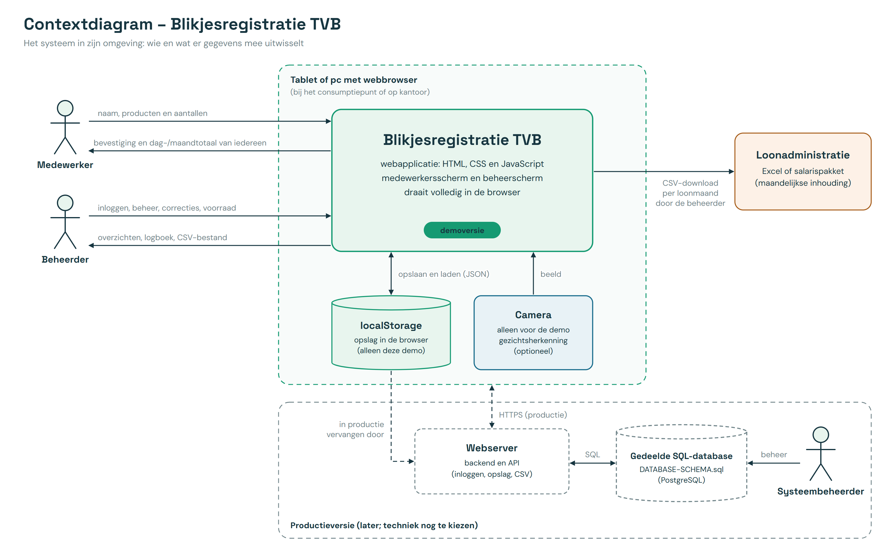

*Figuur: contextdiagram. Het systeem met de medewerker, de beheerder, de tablet met browser, de opslag in `localStorage`, het CSV-bestand voor de loonadministratie en (in productie) de server met database.*

Medewerkers en de beheerder gebruiken het systeem in de browser van de tablet. In de demo staan alle gegevens in `localStorage` van die browser. De beheerder maakt een CSV-bestand en stuurt dat naar de loonadministratie. Er is geen directe koppeling met het loonpakket. In productie komen er een server (backend/API) en een PostgreSQL-database tussen.

### Huidige demo

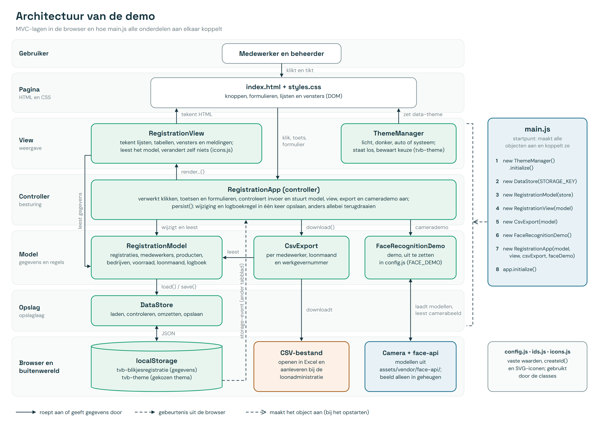

*Figuur: architectuur van de demo. View, controller en model in de browser. `DataStore` is de enige class die de gegevens in `localStorage` leest en schrijft (`ThemeManager` bewaart daar alleen de thema-instelling). `CsvExport`, `ThemeManager` en `FaceRecognitionDemo` staan ernaast.*

De hele demo draait in de browser. Er is geen server nodig behalve een eenvoudige webserver die de bestanden levert. De gegevens gaan zo door de lagen:

- `DataStore` leest bij het starten de gegevens uit `localStorage`, controleert ze en geeft ze aan `RegistrationModel`.
- `RegistrationModel` houdt alle gegevens in het geheugen en bevat de regels.
- `RegistrationView` tekent het scherm uit het model. `RegistrationApp` (controller) verwerkt wat de gebruiker doet, laat het model iets wijzigen en laat daarna `DataStore` alles opslaan.
- `CsvExport` maakt de export uit het model in het geheugen, niet uit `localStorage`. Het bestand gaat via de downloadfunctie van de browser naar de computer van de beheerder.

### Mogelijke productieversie

```text
Browser (HTML, CSS en JavaScript: view en controller)
    ↓  https
Backend en API (login, rechten, regels, transacties, CSV-export)
    ↓  geparametriseerde queries
PostgreSQL-database (DATABASE-SCHEMA.sql)

Backend  →  https met token (alleen de server)  →  AFAS Profit (GetConnector met medewerkergegevens)
```

In productie vervangt de backend de class `DataStore`: de browser vraagt gegevens op en stuurt wijzigingen naar de API, en de server controleert de login, de rechten en de regels. De CSV-export kan dan ook op de server worden gemaakt.

De medewerkergegevens kunnen in productie uit AFAS Profit komen. Alleen de backend praat met AFAS, nooit de browser, omdat het token toegang geeft tot personeelsgegevens. Hoe de synchronisatie werkt, staat in [Koppeling met AFAS Profit (ontwerp)](#koppeling-met-afas-profit-ontwerp) in hoofdstuk 11.

### Opbouw van de JavaScript

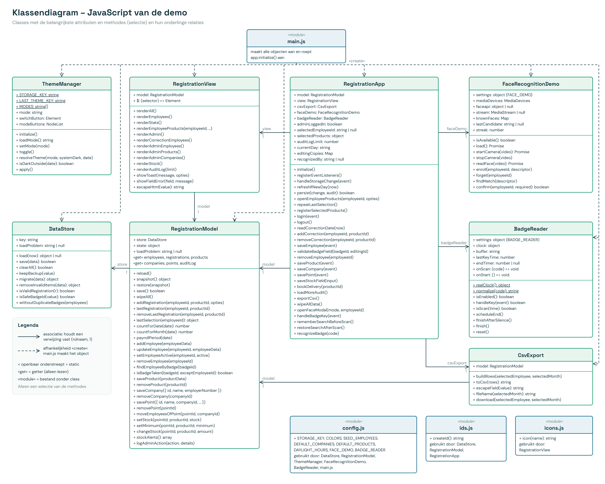

*Figuur: klassendiagram van de JavaScript met de belangrijkste attributen, methodes en relaties. De class `BadgeReader` (sinds versie 3.6) staat nog niet in het diagram.*

De JavaScript is objectgeoriënteerd opgebouwd volgens het MVC-patroon. Er zijn acht classes, ieder in een eigen bestand:

- `DataStore` (opslag, `DataStore.js`) regelt het opslaan en ophalen van gegevens in `localStorage`, controleert de gegevens bij het laden, zet oude gegevens om en maakt reservekopieën.
- `RegistrationModel` (model, `RegistrationModel.js`) bevat de gegevens en de regels van de applicatie, inclusief voorraad, loonmaand, verwijderregels en het logboek. Met `snapshot()` en `restore()` kan een wijziging worden teruggedraaid.
- `RegistrationView` (view, `RegistrationView.js`) zet de gegevens op het scherm en verandert zelf niets. Tekst uit de gegevens wordt met `escapeHtml` veilig gemaakt voordat die in de HTML komt, of met `textContent` gezet.
- `RegistrationApp` (controller, `RegistrationApp.js`) verwerkt klikken, formulieren en andere acties, controleert de invoer en stuurt het model, de view, de export en de demo gezichtsherkenning aan. Ook de synchronisatie tussen tabbladen en de dagwissel zitten hier.
- `CsvExport` (`csvExport.js`) telt de registraties op per medewerker, loonmaand en werkgevernummer, maakt de CSV-tekst veilig voor Excel en laat het bestand downloaden.
- `ThemeManager` (`ThemeManager.js`) regelt het lichte en donkere thema (Systeem, Auto, licht en donker) en onthoudt de keuze in de browser. Die class staat los van de andere classes, omdat het thema een weergave-instelling per browser is en geen gegeven van de registratie.
- `FaceRecognitionDemo` (`FaceRecognitionDemo.js`) is de uitschakelbare demo gezichtsherkenning: camera starten en stoppen, een gezicht omzetten naar een reeks getallen en die vergelijken. De controller krijgt deze class mee in de constructor. De bibliotheek face-api wordt alleen geladen als iemand de demo gebruikt, en komt dan uit het project zelf (`assets/vendor/face-api/`).
- `BadgeReader` (`BadgeReader.js`) herkent een pas die tegen een USB-NFC-pasjeslezer wordt gehouden. De lezer gedraagt zich als een toetsenbord. `BadgeReader` krijgt van de controller iedere toetsaanslag op de beginpagina door, ziet aan de snelheid of het een lezer is en geeft het gelijkgemaakte pasnummer door aan de controller. De controller krijgt deze class mee in de constructor. Het pasnummer koppelen gebeurt gewoon in het medewerkersformulier (FR-66).

Daarnaast zijn er vier bestanden zonder class:

- `main.js` is het startpunt: het maakt de objecten één keer aan, koppelt ze aan elkaar en start eerst het thema.
- `config.js` bevat vaste waarden: de naam van de opslag (`STORAGE_KEY`), de standaardproducten, de bedrijven, de voorbeeldmedewerkers, de kleuren, de tijden van zonsopkomst en zonsondergang, de instellingen van de demo gezichtsherkenning (`FACE_DEMO`) en de instellingen van de pasjeslezer (`BADGE_READER`).
- `icons.js` bevat de SVG-iconen en een hulpfunctie om ze in de pagina te zetten.
- `ids.js` bevat de functie `createId()` voor unieke id's (UUID's). Die gebruikt `crypto.randomUUID()` en anders `crypto.getRandomValues()`, zodat het ook werkt als de website via een netwerkadres zonder https wordt geopend.

Toegepaste OOP-principes: encapsulatie (gegevens alleen via getters en methodes van het model), één verantwoordelijkheid per class, compositie (de controller krijgt model, view, export, de demo gezichtsherkenning en de pasjeslezer mee in de constructor) en losse koppeling (de view kent de controller niet. De opslag is vervangbaar). Bovenaan ieder bestand staat in een comment waarvoor de class is en met welke classes hij verbonden is.

Door deze verdeling blijft de code overzichtelijk. Later kan bijvoorbeeld `localStorage` worden vervangen door een database zonder alles opnieuw te maken.

### Opslaan als één geheel (transactie)

Iedere wijziging door een gebruiker (registreren, correcties en alle beheerwijzigingen) loopt in de controller via de methode `persist`. Alleen `Alle gegevens wissen` slaat de nieuwe demogegevens rechtstreeks op, omdat er dan niets terug te draaien valt.

1. Het model maakt een `snapshot()` van de huidige gegevens.
2. De wijziging wordt uitgevoerd. Meldt het model dat er niets kon worden gewijzigd (bijvoorbeeld omdat een ander tabblad het gegeven intussen heeft verwijderd), dan wordt de snapshot teruggezet en verschijnt "Er is niets gewijzigd: de gegevens zijn intussen veranderd."
3. Bij een wijziging van de beheerder wordt de logboekregel toegevoegd. Registreert een medewerker zelf, dan komt er geen logboekregel (`persist` krijgt dan geen logboekregel mee). Het logboek is alleen voor wijzigingen van de beheerder.
4. Alles wordt in één keer opgeslagen. Mislukt dat (bijvoorbeeld omdat de opslag vol is), dan zet `restore()` de snapshot terug en verschijnt "Opslaan mislukt. Probeer het opnieuw."

Zo ontstaat er nooit een wijziging van de beheerder zonder logboekregel of andersom (FR-61). Dit werkt omdat het model bij iedere wijziging nieuwe lijsten en objecten maakt in plaats van bestaande aan te passen. Een ondiepe kopie is dan genoeg als snapshot. In productie doet een databasetransactie hetzelfde.

### Synchronisatie tussen tabbladen

Staat de website in twee tabbladen van dezelfde browser open, dan delen ze dezelfde `localStorage`. Zonder extra maatregel zou het ene tabblad bij de volgende wijziging zijn oude gegevens terugschrijven en de wijzigingen van het andere tabblad wissen. Daarom luistert de controller naar het `storage`-event van de browser (MDN Web Docs, z.d.), dat afgaat als een ander tabblad iets opslaat (FR-60):

- het model laadt de gegevens opnieuw (met dezelfde controle als bij het starten) en alles wordt opnieuw getekend.
- een open formulier van een gegeven dat in het andere tabblad is verwijderd of gewijzigd, sluit met een melding ("Wat je aan het wijzigen was, is in een ander venster verwijderd. Het formulier is gesloten." of "... gewijzigd. Open het opnieuw om verder te gaan.").
- een open productvenster sluit als de medewerker intussen is verwijderd of gedeactiveerd.
- typt de beheerder op dat moment in de voorraadtabel, dan blijft die tabel staan, zodat het half ingetypte getal niet verdwijnt.
- heeft het andere tabblad alle gegevens gewist, dan wist dit tabblad ook alles (`handleStorageCleared`): het maakt de gegevens in het geheugen leeg, vergeet de ingestelde gezichten van de demo, sluit het cameravenster, het productvenster, open formulieren en het beheervenster (de beheerder is dan uitgelogd), tekent alles opnieuw en toont "De gegevens zijn in een ander venster gewist."

Hoe dit tabblad (B) op het wissen reageert, hangt af van de manier waarop in het andere tabblad (A) is gewist:

| Gewist in tabblad A met | Wat tabblad B ziet | Wat tabblad B doet met de opslag |
|---|---|---|
| De knop `Alle gegevens wissen` | `DataStore.clearAll` verwijdert de gegevenssleutel. B krijgt een `storage`-event voor die sleutel met `newValue === null`. | Niets: `handleStorageCleared({ keepStore: true })` laat `RegistrationModel.wipeAll({ clearStore: false })` alleen het geheugen leegmaken. Daarna laadt B de opslag opnieuw. A slaat direct de nieuwe demogegevens op. Staan die er al, dan laadt B ze meteen, anders bij het volgende `storage`-event. Zo wist B niet per ongeluk de nieuwe demogegevens van A. |
| `localStorage.clear()` (bijvoorbeeld in de ontwikkelaarstools of door het wissen van de websitegegevens) | Een `storage`-event zonder sleutel (`event.key === null`). Opnieuw laden levert niets op en er is geen beschadiging gemeld. | B wist zelf de opslag nog eens (`wipeAll()` met `DataStore.clearAll`) en begint met de demogegevens in het geheugen. Die worden pas opgeslagen bij de volgende wijziging. |

Bij een event zonder sleutel wist B alleen als het opnieuw laden niets opleverde **en** er geen probleem bij het laden was. Was de opslag niet te lezen of beschadigd (`loadProblem` is dan gezet), dan krijgt de gebruiker de waarschuwing uit hoofdstuk 14 en blijven de gegevens in het geheugen staan.

Dit werkt alleen tussen tabbladen in dezelfde browser op hetzelfde apparaat. Tussen apparaten is een gedeelde database nodig.

### Dagwissel

De tablet staat dag en nacht aan. Iedere minuut controleert de controller of de kalenderdag is veranderd. Zo ja, dan worden de datum bovenaan, de totalen en de hoogste toegestane correctiedatum bijgewerkt (FR-53). `ThemeManager` kijkt ook iedere minuut of het thema "Auto" moet omschakelen.

### Ontwerpkeuzes

| Keuze | Alternatieven | Reden |
|---|---|---|
| Gewone JavaScript (ES-modules) zonder framework | React, Vue of Angular | De demo is klein en moet zonder buildstap op iedere webserver draaien. Zonder framework zijn er geen npm-pakketten die bijgewerkt moeten worden, en de code is goed te lezen voor wie alleen HTML, CSS en JavaScript kent. Nadeel: de view tekent zelf HTML, dus het ontsnappen van tekst (`escapeHtml`) moet overal zorgvuldig gebeuren. |
| `localStorage` als opslag in de demo | IndexedDB, een eigen server met database | Er is geen server beschikbaar voor de demo. `localStorage` is eenvoudig, synchroon en ruim genoeg voor deze gegevens. Nadeel: alleen op één apparaat, aan te passen via de ontwikkelaarstools en zonder echte beveiliging. Daarom zit alle opslag in één class (`DataStore`), die in productie door een backend wordt vervangen. |
| Eén registratie per eenheid (aantal altijd 1) | Eén registratie met een aantal | Iedere registratie heeft zo een eigen tijdstip, prijs, werkgevernummer en consumptiepunt. Een correctie `−` haalt precies één eenheid weg, en de voorraad gaat per stuk omhoog of omlaag. De database heeft wel een kolom `amount`, zodat een backend later meer per regel kan opslaan. |
| MVC met classes | Losse functies in één bestand | Iedere class heeft één taak, is apart te testen (met een nep-opslag en een nep-view) en de opslag is te vervangen zonder de rest te veranderen. |
| PostgreSQL voor productie | SQL Server, MySQL | Het schema gebruikt onderdelen van PostgreSQL: `uuid` met `gen_random_uuid()` (pgcrypto), `timestamptz`, `jsonb`, gedeeltelijke unieke indexen en triggers in PL/pgSQL. PostgreSQL is gratis en open source. Een andere database kiezen betekent het schema aanpassen. |
| Alles zelf gehost | Lettertypes van Google Fonts, face-api van een CDN | Er gaan geen gegevens (zoals het IP-adres van de tablet) naar derden, de CSP kan alles behalve de eigen server blokkeren, en de pagina werkt ook als internet even wegvalt, zolang de eigen webserver bereikbaar is. |
| Pasjeslezer als toetsenbord ("keyboard wedge") | Web NFC (`NDEFReader`), WebHID of WebUSB met een eigen driver | Een lezer die zich als toetsenbord gedraagt, werkt in iedere browser en op ieder besturingssysteem zonder bibliotheek, driver of licentie. Web NFC werkt alleen in Chrome op Android (MDN Web Docs, z.d.) en past dus niet bij een tablet met Edge. Nadeel: de website kan een lezer niet onderscheiden van iemand die heel snel typt (zie hoofdstuk 13). |

## 7. Technologiestack

### Gebruikte technieken in de demo

- **HTML5:** voor de structuur van de pagina.
- **CSS3:** voor kleuren, layout en responsive design.
- **JavaScript (ES-modules):** voor de werking van de website. Er is geen buildstap en er zijn geen npm-afhankelijkheden: de browser laadt de bestanden zoals ze in het project staan.
- **OOP:** de JavaScript is verdeeld in classes.
- **Lokale webserver nodig:** browsers blokkeren ES-modules via `file://`. Wie `index.html` als los bestand opent, krijgt de melding "Deze pagina werkt niet als los bestand. Open de map in VS Code en start hem met Live Server (of een andere lokale webserver)."
- **localStorage:** tijdelijke opslag in de browser.
- **CSV-export:** gemaakt met eigen JavaScript, zonder externe bibliotheek.
- **Lettertypes DM Sans en Space Grotesk:** zelf gehost in `assets/fonts/` (woff2, SIL Open Font License 1.1. SIL International, 2007. Zie `assets/fonts/LICENSE.txt`). De lettertypes komen oorspronkelijk van Google Fonts (z.d.), maar er wordt tijdens gebruik niets van Google Fonts geladen.
- **face-api (@vladmandic/face-api 1.7.15. Mandic, z.d.):** alleen voor de demo gezichtsherkenning. De bibliotheek en de drie modellen (gezicht vinden, gezichtspunten en herkenning) staan in `assets/vendor/face-api/` (MIT-licentie, samen ongeveer 8 MB, waarvan 6,4 MB het herkenningsmodel). Er wordt tijdens gebruik niets van een CDN geladen.
- **Content-Security-Policy:** een `<meta>`-tag in `index.html` die de browser alleen bestanden van de eigen server laat laden (zie hoofdstuk 13).
- **Node.js test runner (`node:test`. Node.js, z.d.):** voor de unit tests, met Node.js 20 of hoger (`"engines": { "node": ">=20" }` in `package.json`). De tests draaien automatisch via GitHub Actions (Node.js 20) bij iedere push en pull request naar `main` en `development`. De workflow heeft alleen leesrechten (`permissions: contents: read`), bewaart het GitHub-token niet (`persist-credentials: false`) en gebruikt actions die vastgezet zijn op een commit-SHA.

**Gebruikte browserfuncties:**

| Functie | Waarvoor |
|---|---|
| `localStorage` en het `storage`-event | Gegevens en thema-instelling bewaren. Wijzigingen uit andere tabbladen opmerken. |
| `crypto.randomUUID()` / `crypto.getRandomValues()` | Unieke id's maken (`ids.js`). |
| `matchMedia("(prefers-color-scheme: dark)")` | Het thema "Systeem" volgt de instelling van het apparaat. |
| `Intl.DateTimeFormat("nl-NL")` | Datums en maandnamen in het Nederlands. |
| `Blob` en `URL.createObjectURL` | Het CSV-bestand laten downloaden. |
| `navigator.mediaDevices.getUserMedia` | De camera voor de demo gezichtsherkenning. Werkt alleen op een veilige pagina (`https` of `localhost`). Anders verschijnt de knop "Herken mij" niet. |
| Het `keydown`-event op `document` | De tekens van de pasjeslezer opvangen (`BadgeReader`). Werkt ook zonder https. |

### Technieken voor productie

De database voor productie is **PostgreSQL** (versie 15 of hoger): het schema in [`DATABASE-SCHEMA.sql`](./DATABASE-SCHEMA.sql) is daarvoor geschreven (zie de ontwerpkeuzes in hoofdstuk 6). De backend en de hosting zijn nog niet gekozen. Mogelijke keuzes zijn:

- PHP, .NET of Node.js voor de backend.
- een interne server of Azure voor de hosting.

De definitieve keuze moet samen met de IT-afdeling van TVB worden gemaakt.

## 8. Databaseontwerp

### Opslag in de huidige demo

De demo bewaart één JSON-object in `localStorage` (MDN Web Docs, z.d.) onder de sleutel `tvb-blikjesregistratie`:

```js
{
  employees: [
    {
      id: "unieke-id",
      name: "Lotte van Dijk",            // volledige naam: voornaam + achternaam
      firstName: "Lotte",
      lastName: "van Dijk",
      payrollCode: "1234",               // looncode (alleen cijfers)
      personnelNumber: "5678",           // personeelsnummer (uniek, alleen cijfers)
      employerNumber: "",                // afwijkend werkgevernummer; leeg = dat van het bedrijf
      active: true,
      companyId: "id-van-bedrijf",
      pointId: "id-van-consumptiepunt",
      color: "#d8f1e8",                  // achtergrondkleur van de avatar
      badgeId: "04A1B2C3"                // pasnummer (alleen A-Z en 0-9, hooguit 64 tekens); "" = geen pas
    }
  ],
  registrations: [
    {
      id: "unieke-id",
      employeeId: "id-van-medewerker",
      productId: "blikje",
      price: 0.65,                       // prijs op het moment van registreren
      employerNumber: "4711",            // werkgevernummer op het moment van registreren (alleen als dat bekend was)
      pointId: "id-van-consumptiepunt",  // punt dat het product aanbood; null als het punt het product niet aanbood
      createdAt: "2026-09-07T08:00:00.000Z"
    },
    {
      id: "unieke-id",
      employeeId: "id-van-medewerker",
      productId: "ei",
      price: 0.5,
      pointId: "id-van-consumptiepunt",
      createdAt: "2026-09-15T10:00:00.000Z", // correctie "+" op een eerdere dag: 12:00 uur Nederlandse tijd
      correction: true                   // alleen bij een correctie "+" van de beheerder
    }
  ],
  products: [
    { id: "blikje", name: "Blikje", price: 0.65 },  // standaardproduct (vaste id)
    { id: "unieke-id", name: "Soep", price: 1.25 }  // door de beheerder toegevoegd
  ],
  companies: [
    { id: "unieke-id", name: "IT Supervision", employerNumber: "1234" }
  ],
  points: [
    {
      id: "unieke-id",
      name: "Kantine begane grond",
      companyId: "id-van-bedrijf",
      products: {
        blikje: { offered: true, stock: 24, minimum: 6, countedAt: "2026-10-01T07:30:00.000Z" }, // countedAt: tijdstip van de laatste telling
        ei: { offered: false, stock: 0, minimum: 0 } // nog nooit geteld: geen countedAt
      }
    }
  ],
  auditLog: [
    {
      id: "unieke-id",
      action: "Registratie verwijderd",
      details: "Blikje van Lotte van Dijk",
      createdAt: "2026-10-02T09:15:00.000Z"
    }
  ]
}
```

Elke gekozen eenheid wordt één registratie. Daarom is het aantal in de demo altijd `1`. Iedere registratie bewaart de prijs van dat moment (`price`). Oude registraties zonder prijs gebruiken de huidige prijs van het product. Op dezelfde manier bewaart iedere registratie het werkgevernummer van dat moment (`employerNumber`, zie `RegistrationModel.registrationEmployerNumber`). Was er toen nog geen nummer ingevuld, of is de registratie van vóór deze regel, dan gebruikt de export het huidige nummer. Id's worden gemaakt met `createId()` uit `assets/js/ids.js`.

De demo heeft geen accounts, dus er wordt niet vastgelegd welke beheerder de wijziging deed. De namen van de betrokken medewerker of het product staan als tekst in `details`.

**localStorage-sleutels**

| Sleutel | Inhoud | Gebruikt door |
|---|---|---|
| `tvb-blikjesregistratie` | Alle gegevens (het JSON-object hierboven). | `DataStore` (`STORAGE_KEY` in `config.js`) |
| `tvb-blikjesregistratie-backup` | De eerste reservekopie van beschadigde gegevens. Wordt nooit overschreven. | `DataStore.keepBackup` |
| `tvb-blikjesregistratie-backup-laatste` | De nieuwste andere reservekopie. Wordt steeds vervangen. | `DataStore.keepBackup` |
| `tvb-blikjesregistratie-backup-<tijdstempel>` | Oude reservekopieën uit een eerdere versie. Worden niet meer gemaakt, alleen nog gewist door `Alle gegevens wissen`. | `DataStore.clearAll` |
| `tvb-theme` | De thema-instelling: `system`, `auto`, `light` of `dark`. | `ThemeManager`, script in `<head>` van `index.html` |
| `tvb-theme-last` | Het thema dat het laatst zichtbaar was (`light` of `dark`), zodat de pagina bij "Auto" niet eerst licht oplicht. | `ThemeManager`, script in `<head>` van `index.html` |

`Alle gegevens wissen` wist de gegevens en alle reservekopieën, maar niet de twee thema-sleutels: die bevatten geen persoonsgegevens.

### Controle bij het laden

`DataStore` controleert de opgeslagen gegevens bij iedere keer laden: bij het starten van de pagina en als een ander tabblad iets heeft opgeslagen. Wie de gegevens via de ontwikkelaarstools aanpast, kan zo de pagina niet kapotmaken of eigen HTML of code op de pagina zetten. De uitkomst staat in `loadProblem`. De controller toont dan een melding.

**Helemaal onleesbaar of niet beschikbaar**

| Situatie | Gevolg | Melding |
|---|---|---|
| De browseropslag kan niet worden gelezen (bijvoorbeeld geblokkeerd) | `loadProblem = "unavailable"`. De demo start met demogegevens. Het is niet bekend of er gegevens zijn, dus niets wordt als "leeg" behandeld (ook niet bij het samenwerken met andere tabbladen). | "De opslag van de browser kon niet worden gelezen. De demo start met voorbeeldgegevens. Wijzigingen worden mogelijk niet bewaard." |
| De tekst is geen geldige JSON of geen object, of `companies` staat er wel maar is geen lijst | `loadProblem = "unreadable"`. Er komt een reservekopie en de demo start opnieuw met demogegevens. Een beschadigde bedrijvenlijst telt als onleesbaar, omdat anders alle consumptiepunten en hun voorraad zouden worden vervangen. | "De opgeslagen gegevens waren onleesbaar. De demo is opnieuw gestart. Er staat een reservekopie in de browser." |

**Losse regels.** Een regel die niet aan de controle voldoet, wordt overgeslagen. De rest wordt gewoon geladen. Dan is `loadProblem = "skipped"`, komt er een reservekopie en verschijnt "Een deel van de opgeslagen gegevens was beschadigd en is overgeslagen. Er staat een reservekopie in de browser." Gecontroleerd wordt:

- **Id's en verwijzingen** (naar medewerker, product, bedrijf en punt) passen bij `^[A-Za-z0-9_-]{1,64}$` (letters, cijfers, `-` en `_`) en zijn niet `__proto__`, `constructor` of `prototype`. Die drie namen hebben in JavaScript een speciale betekenis en zouden de voorraadlijst van een punt kunnen verstoren.
- **Dubbele id's** binnen een lijst (ook in het logboek): alleen de eerste regel met die id blijft, de rest wordt overgeslagen. Anders zou bijvoorbeeld `Wijzigen` of `Verwijderen` op de ene regel ook de andere raken.
- **Tekstlengtes:** namen van producten, bedrijven en punten en de voor- en achternaam hooguit 200 tekens. De volledige naam van een medewerker hooguit 401 tekens (twee keer 200 plus een spatie) en niet leeg. Looncode, personeelsnummer en werkgevernummer hooguit 64 tekens. Actie en details in het logboek hooguit 500 tekens. Dit zijn alleen veiligheidsgrenzen tegen aangepaste gegevens, geen bedrijfsregel: de formulieren laten 100 tekens toe (FR-59).
- **Prijzen** zijn een getal van 0 tot en met 1000. Een product zonder prijs (`null` of leeg) telt als ongeldig en wordt dus niet gratis. Bij een registratie is de prijs optioneel (oude registraties hebben er geen), maar als die er staat, moet hij geldig zijn.
- **Registraties** hebben een geldige datum (`createdAt`) die niet meer dan 1 dag na het moment van laden ligt (een kleine afwijking van de klok van de tablet mag). Een registratie ver in de toekomst is vrijwel zeker geknoeid en zou in een verkeerde loonmaand in de export komen. Een `employerNumber` is optioneel, maar als het er staat, is het tekst van hooguit 64 tekens.
- **Medewerkers** hebben een status (`active`) en een kleur in de vorm `#rrggbb`. De status wordt vóór de controle al omgezet (`migrateEmployee`): alleen de waarde `false` wordt inactief, iedere andere waarde (ook een ontbrekende) wordt actief. De controle op een boolean slaat daardoor in de praktijk nooit een medewerker over. Een medewerker met een ongeldige kleur blijft bewaard en krijgt een standaardkleur. Het pasnummer (`badgeId`) is optioneel. Staat het er, dan moet het tekst zijn met alleen hoofdletters en cijfers (`^[A-Z0-9]{0,64}$`). Een ongeldig pasnummer wordt leeggemaakt (`""`, geen pas). De medewerker blijft bewaard.
- **Consumptiepunten** hebben een bedrijfs-id in de juiste vorm (zie id's hierboven) en een voorraadlijst. Of dat bedrijf ook bestaat, wordt bij het laden niet gecontroleerd.
- **Logboekregels** hebben een actie, details en een geldige datum. De id is optioneel (heel oude regels hebben er geen).

**Waarden die worden rechtgezet (zonder melding)**

- Een `countedAt` (tijdstip van de laatste telling) die geen geldige datum is of in de toekomst ligt, wordt weggelaten. Het product telt dan als "niet geteld", zodat de voorraad niet geblokkeerd raakt: anders zou geen enkele registratie de voorraad nog verlagen.
- Voorraad en minimum worden altijd getallen (een getal als tekst, zoals `"5"`, zou bij optellen anders `"51"` worden). Een ongeldige waarde wordt 0. Een negatief minimum wordt 0. Een negatieve voorraad mag (er is dan meer geregistreerd dan geteld).
- Ieder consumptiepunt krijgt een voorraadregel voor ieder product. Ontbrekende producten staan uit.
- Een ongeldig pasnummer wordt leeggemaakt (zie Medewerkers hierboven). Komt hetzelfde pasnummer bij meer medewerkers voor, dan houdt de eerste medewerker de pas en wordt het pasnummer bij de anderen leeggemaakt. Anders weet de pasjeslezer niet wie er staat.

**Oude gegevens omzetten (migratie)**

- Oude product-id's (`melk`, `brood`) worden `glas-melk` en `sneetje-brood`, in de registraties, de productlijst en de voorraad van de punten. Een registratie zonder product wordt een blikje.
- Gegevens zonder productlijst krijgen de standaardproducten. Een lege lijst blijft leeg (dan heeft de beheerder alle producten zelf verwijderd).
- Een oude naam als "Anna van der Berg" wordt opgesplitst in voornaam "Anna van der" en achternaam "Berg". Ontbrekende velden van een medewerker krijgen een standaardwaarde. Oude gegevens zonder pasnummer krijgen `badgeId: ""` (geen pas).
- Gegevens zonder bedrijven (oude vrije tekstvelden voor bedrijfsnaam en werkgevernummer) krijgen de 13 bedrijven, plus per bedrijf met medewerkers één consumptiepunt dat alle producten aanbiedt. Het eerste werkgevernummer wordt de standaard van het bedrijf. Een afwijkend nummer blijft bij de medewerker staan, zodat de export niet verandert.

**Reservekopieën.** Er zijn hooguit twee reservekopieën, zodat de opslag niet volloopt: de eerste (`-backup`) wordt nooit overschreven, de tweede (`-backup-laatste`) wordt steeds vervangen door de nieuwste andere kopie. Is er geen ruimte voor een kopie, dan blijft alleen de waarschuwing in de console.

### Bedrijven, consumptiepunten en voorraad

- Een **bedrijf** heeft een naam en een standaard werkgevernummer. Een medewerker kan een afwijkend werkgevernummer hebben (bijvoorbeeld per teamleider). `employerNumberFor` gebruikt dat nummer als het is ingevuld, en anders dat van het bedrijf.
- Een bedrijf heeft geen, één of meerdere **consumptiepunten**. Per punt staat per product of het wordt aangeboden (`offered`), de voorraad (`stock`), het minimum (`minimum`) en, als de voorraad is geteld, het tijdstip van de laatste telling (`countedAt`).
- Een **medewerker** is gekoppeld aan een bedrijf en een vast consumptiepunt, en ziet alleen de producten die dat punt aanbiedt.
- Een **registratie** onthoudt het consumptiepunt dat het product aanbood (`pointId`). Biedt het punt van de medewerker het product niet aan, dan is `pointId` leeg (`null`) en verandert er geen voorraad. Biedt het punt het product wel aan, dan gaat er 1 van de voorraad af, behalve als de registratie vóór de laatste telling ligt (alleen mogelijk bij een correctie `+` met een eerdere datum): dan zat het product al niet meer in de getelde hoeveelheid. `pointId` wordt in dat geval wel ingevuld.
- Bij een correctie `−` gaat het product naar het punt uit `pointId` terug, ook als de medewerker inmiddels bij een ander punt hoort. Dat gebeurt alleen als de registratie niet vóór de laatste telling ligt: is de voorraad daarna geteld, dan zat het product al niet meer in de getelde hoeveelheid en blijft de telling staan.
- De getelde voorraad en het minimum zijn hele getallen van 0 tot en met 100.000. Door registraties kan de voorraad wel onder 0 komen (er is dan meer geregistreerd dan er volgens de telling was). Dat is zo bedoeld. Een negatieve telling wordt geweigerd.
- Een registratie die de beheerder met `+` toevoegt, krijgt `correction: true`. Zo'n correctie telt niet mee als "Vorige keer koos je …" en niet voor "welkom terug" in het productvenster, omdat de medewerker die keuze niet zelf heeft gemaakt.
- Een nieuw product krijgt bij ieder punt `offered: false`. Een verwijderd product (alleen mogelijk als het nooit is geregistreerd) verdwijnt uit alle voorraadlijsten. Een verwijderd consumptiepunt neemt zijn voorraad mee. De registraties blijven bestaan.
- Status per product: `Op` bij voorraad 0 of lager, `Bijbestellen` bij voorraad op of onder het minimum, anders `Op voorraad`.

### Logisch datamodel

Het logische datamodel hieronder geldt voor de productieversie. De kolom "In SQL" noemt de kolom in [`DATABASE-SCHEMA.sql`](./DATABASE-SCHEMA.sql). Waar de demo een ander veld gebruikt, staat dat in de uitleg. Alle id's zijn in productie UUID's. PK = primaire sleutel, FK = vreemde sleutel.

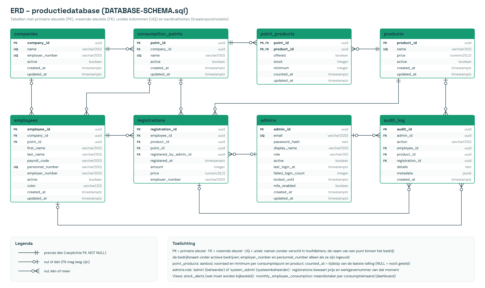

*Figuur: ERD van het productieschema (`DATABASE-SCHEMA.sql`) met primaire en vreemde sleutels en kardinaliteiten.*

De relaties in het kort: een bedrijf heeft nul of meer consumptiepunten en nul of meer medewerkers. Een medewerker hoort bij hooguit één bedrijf en één consumptiepunt. Per consumptiepunt en product is er één regel aanbod en voorraad. Een registratie hoort bij precies één medewerker en één product, en bij hooguit één consumptiepunt en één beheerder (bij een correctie). Een logboekregel hoort bij hooguit één beheerder, medewerker, product en registratie.

#### Tabel Bedrijven

| Veld | In SQL | Type | Sleutel | Uitleg |
|---|---|---|---|---|
| `BedrijfID` | `company_id` | UUID | PK | Uniek nummer van het bedrijf (demo: `id`) |
| `Naam` | `name` | Tekst (150) | Uniek (zonder hoofdletters, bij actieve bedrijven) | Naam van het bedrijf |
| `Werkgevernummer` | `employer_number` | Tekst (100) | Uniek (alleen ingevulde nummers) | Standaard werkgevernummer voor de export. Mag leeg zijn (NULL). Een `UNIQUE`-constraint laat meerdere NULL-waarden toe, maar geen dubbele lege tekst `''` |
| `Actief` | `active` | Boolean | | Bedrijf in gebruik (bestaat niet in de demo) |

#### Tabel Consumptiepunten

| Veld | In SQL | Type | Sleutel | Uitleg |
|---|---|---|---|---|
| `ConsumptiepuntID` | `point_id` | UUID | PK | Uniek nummer van het punt (demo: `id`) |
| `BedrijfID` | `company_id` | UUID | FK → Bedrijven, verplicht | Bedrijf waar het punt bij hoort |
| `Naam` | `name` | Tekst (150) | Uniek per bedrijf (zonder hoofdletters) | Bijvoorbeeld "Hoofdkantoor" |
| `Actief` | `active` | Boolean | | Punt in gebruik (bestaat niet in de demo) |

#### Tabel Medewerkers

| Veld | In SQL | Type | Sleutel | Uitleg |
|---|---|---|---|---|
| `MedewerkerID` | `employee_id` | UUID | PK | Uniek nummer van de medewerker |
| `Voornaam` | `first_name` | Tekst (100) | | Voornaam van de medewerker. Verplicht en niet leeg (`NOT NULL` en een `CHECK`) |
| `Achternaam` | `last_name` | Tekst (150) | | Achternaam van de medewerker. Verplicht en niet leeg (`NOT NULL` en een `CHECK`). Let op: in de demo kan de achternaam leeg zijn (zie hieronder) |
| `Actief` | `active` | Boolean | | Geeft aan of de medewerker nog actief is |
| `Looncode` | `payroll_code` | Tekst (100) | | Looncode voor de CSV-export |
| `Personeelsnummer` | `personnel_number` | Tekst (100) | Uniek (alleen ingevulde nummers) | Nummer van de medewerker. Leeg = NULL |
| `BedrijfID` | `company_id` | UUID | FK → Bedrijven | Bedrijf waar de medewerker werkt (het standaard werkgevernummer staat bij het bedrijf) |
| `Werkgevernummer` | `employer_number` | Tekst (100) | | Optioneel afwijkend werkgevernummer. Leeg = dat van het bedrijf |
| `ConsumptiepuntID` | `point_id` | UUID | FK → Consumptiepunten | Vast consumptiepunt van de medewerker |
| `Kleur` | `color` | Tekst (20) | | Achtergrondkleur van de avatar |
| `Pasnummer` | `badge_id` (voorstel, nog niet in het schema) | Tekst (64) | Uniek (alleen ingevulde nummers) | Pasnummer (UID) van de pas, alleen hoofdletters en cijfers, 4 tot en met 64 tekens. Leeg = NULL (geen pas). Demo: `badgeId`, met `""` voor geen pas |

#### Tabel Producten

| Veld | In SQL | Type | Sleutel | Uitleg |
|---|---|---|---|---|
| `ProductID` | `product_id` | UUID | PK | Uniek nummer van het product (demo: vaste id zoals `blikje` voor standaardproducten) |
| `Naam` | `name` | Tekst (150) | Uniek (zonder hoofdletters) | Bijvoorbeeld Blikje, Glas melk, Beleg of Sneetje brood |
| `Prijs` | `price` | Decimaal (10,2) | | Huidige prijs per stuk, 0 of hoger |
| `Actief` | `active` | Boolean | | Product in gebruik (bestaat niet in de demo) |

De standaardprijzen zijn: blikje €0,65, sneetje brood €0,10, boter €0,10, zoet beleg €0,20, glas melk €0,20, beleg €0,50, ei €0,50 en yoghurt €0,50.

#### Tabel Aanbod en voorraad (PuntProduct)

| Veld | In SQL | Type | Sleutel | Uitleg |
|---|---|---|---|---|
| `ConsumptiepuntID` | `point_id` | UUID | PK, FK → Consumptiepunten | Het punt |
| `ProductID` | `product_id` | UUID | PK, FK → Producten | Het product |
| `Aangeboden` | `offered` | Boolean | | Biedt het punt dit product aan (demo: `offered`) |
| `Voorraad` | `stock` | Integer | | Huidige voorraad. Mag negatief worden (demo: `stock`) |
| `Minimum` | `minimum` | Integer | | Op of onder dit aantal bijbestellen. 0 of hoger (demo: `minimum`) |
| `LaatstGeteld` | `counted_at` | DatumTijd | | Tijdstip van de laatste telling. Leeg = nooit geteld (demo: `countedAt`) |

De primaire sleutel bestaat uit twee kolommen: per punt en product is er precies één regel. In de demo staat deze tabel als object `products` in ieder consumptiepunt.

#### Tabel Registraties

| Veld | In SQL | Type | Sleutel | Uitleg |
|---|---|---|---|---|
| `RegistratieID` | `registration_id` | UUID | PK | Uniek nummer van de registratie |
| `MedewerkerID` | `employee_id` | UUID | FK → Medewerkers, verplicht | Koppeling met de medewerker |
| `ProductID` | `product_id` | UUID | FK → Producten, verplicht | Geregistreerd product |
| `ConsumptiepuntID` | `point_id` | UUID | FK → Consumptiepunten | Punt dat het product aanbood. Leeg als het punt het product niet aanbood (demo: `pointId`) |
| `DatumTijd` | `registered_at` | DatumTijd | | Datum en tijd van de registratie (demo: `createdAt`) |
| `Aantal` | `amount` | Integer | | Aantal, standaard `1`. In de demo altijd `1` |
| `Prijs` | `price` | Decimaal (8,2) | | Prijs per stuk op het moment van registreren. Een latere prijswijziging verandert oude registraties niet |
| `Werkgevernummer` | `employer_number` | Tekst (100) | | Werkgevernummer op het moment van registreren. Een latere wijziging verandert oude registraties niet |
| `Correctie` | `registered_by_admin_id` | UUID | FK → Beheerders | Ingevuld = door een beheerder toegevoegd (correctie). De demo heeft geen beheerders en gebruikt `correction: true`. |

Een medewerker of product met registraties kan in de database niet worden verwijderd (`ON DELETE RESTRICT`). Deactiveren kan wel. Wordt een consumptiepunt verwijderd, dan blijft de registratie bestaan en wordt `point_id` leeg (`ON DELETE SET NULL`).

#### Tabel Beheerders

Deze tabel bestaat alleen in productie. De demo heeft geen accounts.

| Veld | In SQL | Type | Sleutel | Uitleg |
|---|---|---|---|---|
| `BeheerderID` | `admin_id` | UUID | PK | Uniek nummer van de beheerder |
| `Email` | `email` | Tekst (320) | Uniek (zonder hoofdletters) | Inlognaam |
| `WachtwoordHash` | `password_hash` | Tekst | | Alleen de hash (Argon2id of bcrypt), nooit het wachtwoord zelf |
| `Naam` | `display_name` | Tekst (150) | | Naam op het scherm |
| `Rol` | `role` | Tekst (30) | | `admin` (beheerder) of `system_admin` (systeembeheerder) |
| `Actief` | `active` | Boolean | | Mag deze beheerder inloggen |
| `LaatsteLogin` | `last_login_at` | DatumTijd | | Moment van de laatste geslaagde login |
| `MisluktePogingen` | `failed_login_count` | Integer | | Aantal mislukte inlogpogingen na elkaar |
| `GeblokkeerdTot` | `locked_until` | DatumTijd | | Account geblokkeerd tot dit tijdstip. Leeg = niet geblokkeerd |
| `Tweestaps` | `mfa_enabled` | Boolean | | Staat tweestapsverificatie aan |

#### Tabel Logboek (`audit_log`)

| Veld | In SQL | Type | Sleutel | Uitleg |
|---|---|---|---|---|
| `LogID` | `audit_id` | UUID | PK | Uniek nummer van de logregel (demo: `id`) |
| `BeheerderID` | `admin_id` | UUID | FK → Beheerders | Wie de wijziging deed (niet in de demo) |
| `Actie` | `action` | Tekst (100) | | Bijvoorbeeld "Registratie verwijderd" (demo: `action`) |
| `MedewerkerID` | `employee_id` | UUID | FK → Medewerkers | Betrokken medewerker (niet in de demo) |
| `ProductID` | `product_id` | UUID | FK → Producten | Betrokken product (niet in de demo) |
| `RegistratieID` | `registration_id` | UUID | FK → Registraties | Betrokken registratie (niet in de demo) |
| `Details` | `details` | Tekst | | Uitleg over de actie (demo: `details`) |
| `Metadata` | `metadata` | JSON (`jsonb`) | | Extra gegevens, bijvoorbeeld oude en nieuwe waarde (niet in de demo) |
| `DatumTijd` | `created_at` | DatumTijd | | Moment van de actie (demo: `createdAt`) |

In de demo bestaat een logregel alleen uit `id`, `action`, `details` en `createdAt`. Alle vreemde sleutels in het logboek staan op `ON DELETE SET NULL`, zodat een logregel blijft bestaan als de beheerder, medewerker of het product later wordt verwijderd.

### Productieschema

Het volledige PostgreSQL-schema staat in [`DATABASE-SCHEMA.sql`](./DATABASE-SCHEMA.sql). Het schema bevat:

- `companies` voor bedrijven en werkgevernummers (het werkgevernummer is uniek, FR-59).
- `consumption_points` voor de consumptiepunten per bedrijf.
- `point_products` voor aanbod, voorraad, minimum en het tijdstip van de laatste telling (`counted_at`) per consumptiepunt per product.
- `stock_alerts` als databaseview voor alles wat bijbesteld moet worden.
- `employees` voor actieve en inactieve medewerkers, met bedrijf en vast consumptiepunt (de kolom `badge_id` voor het pasnummer is een voorstel, zie hieronder).
- `products` voor producten en prijzen.
- `admins` voor beheerders en rollen (`admin` en `system_admin`), met het aantal mislukte inlogpogingen (`failed_login_count`), een blokkade tot een tijdstip (`locked_until`) en of tweestapsverificatie aan staat (`mfa_enabled`).
- `registrations` voor iedere consumptieregistratie met datum, tijd, aantal, prijs en werkgevernummer van dat moment.
- `audit_log` voor administratieve wijzigingen.
- `monthly_employee_consumption` als databaseview met maandtotalen per medewerker (aantal en bedrag) voor het beheerdashboard. Deze view groepeert op de **consumptiemaand** (`date_trunc('month', registered_at)`) en de medewerker, niet op loonmaand en niet op werkgevernummer. De view is dus **niet** geschikt voor de loonexport: die telt op per medewerker, loonmaand en werkgevernummer (FR-20, FR-30) en moet door de backend apart worden gemaakt, zoals `CsvExport` dat nu in de browser doet.

**Verschillen tussen de demo en het schema.** Wie gegevens uit de demo naar de database overzet, moet rekening houden met deze verschillen:

- De demo bewaart "geen nummer" als lege tekst `""` (werkgevernummer van een bedrijf of medewerker, personeelsnummer, looncode). In de database moet dat `NULL` worden (`''` → `NULL`). Anders botsen bijvoorbeeld twee bedrijven zonder werkgevernummer op de `UNIQUE`-constraint, want `UNIQUE` laat wel meerdere `NULL`-waarden toe, maar geen twee keer `''`. "Uniek" geldt dus alleen voor ingevulde nummers.
- `employees.last_name` is `NOT NULL` en mag niet leeg zijn (`CHECK`). In de demo maakt het formulier de achternaam verplicht, maar het omzetten van oude gegevens kan een lege achternaam opleveren (een oude naam van één woord, zoals "Anna", wordt alleen een voornaam). Zo'n medewerker moet vóór het overzetten een achternaam krijgen.
- Een aantal invoerregels van FR-59 staat niet in het schema: de prijsgrens van 1000 euro en hooguit twee decimalen (het schema controleert alleen `price >= 0`), alleen cijfers in looncode, personeelsnummer en werkgevernummer, en de grens van 100 tekens voor namen (het schema staat 150 tekens toe voor een achternaam en namen van producten, bedrijven en punten). Deze regels moet de backend controleren (NFR-07).
- Productnamen en namen van consumptiepunten zijn in het schema uniek zonder op hoofdletters te letten (`lower(name)`), net als in de demo. Een bedrijfsnaam is in het schema alleen uniek bij actieve bedrijven. De demo kent geen inactieve bedrijven.
- Het pasnummer (`badgeId` in de demo, FR-66) staat nog niet in `DATABASE-SCHEMA.sql`. In productie komt er in `employees` een kolom `badge_id` bij. Dit is een voorstel, het schemabestand is in deze versie bewust niet aangepast:

```sql
-- Voorstel: pasnummer per medewerker (NULL = geen pas).
ALTER TABLE employees ADD COLUMN badge_id varchar(64);
ALTER TABLE employees ADD CONSTRAINT employees_badge_id_format
    CHECK (badge_id ~ '^[A-Z0-9]{4,64}$');
ALTER TABLE employees ADD CONSTRAINT employees_badge_id_unique UNIQUE (badge_id);
```

Net als bij de andere nummers wordt een leeg pasnummer `""` uit de demo in de database `NULL`. Komt het pasnummer in productie uit AFAS of uit het toegangssysteem van TVB, dan vult de synchronisatie deze kolom (zie [Koppeling met AFAS Profit (ontwerp)](#koppeling-met-afas-profit-ontwerp)).

Registraties verdwijnen niet als een medewerker, bedrijf, consumptiepunt of product wordt gedeactiveerd: daarvoor heeft iedere tabel de kolom `active`, en de vreemde sleutels voorkomen dat een medewerker of product met registraties wordt verwijderd. Alleen een correctie `−` van een beheerder verwijdert een registratie. De backend doet dat in één transactie samen met een regel in `audit_log`, net als `persist` in de demo.

Gebruik voor `password_hash` een sterk wachtwoordalgoritme zoals Argon2id (of anders bcrypt), met een eigen salt per gebruiker (OWASP Foundation, z.d.-b). Sla nooit een wachtwoord zelf op. Gebruik in de backend parameterized queries, transacties rond correcties en een databasegebruiker met alleen de benodigde rechten.

Onderaan het schema staan als voorbeeld (in commentaar):

- **Rollen met zo weinig rechten als nodig:** de applicatie logt in met een eigen rol (`blikjes_app`) die geen tabellen mag aanmaken of verwijderen, en er is een aparte rol met alleen leesrechten voor rapportages.
- **Logboek alleen-toevoegen:** de applicatie mag regels in `audit_log` lezen en toevoegen, maar niet wijzigen of verwijderen.
- **Bewaartermijn en anonimiseren:** registraties niet langer bewaren dan nodig (bijvoorbeeld de fiscale bewaarplicht van 7 jaar. Belastingdienst, z.d.) en daarna verwijderen of anonimiseren. Bij uit dienst na de bewaartermijn naam, looncode en personeelsnummer anonimiseren.
- **Queries:** alleen geparametriseerde queries, nooit invoer van gebruikers in de SQL-tekst.

## 9. Schermontwerpen en wireframes

### Medewerkersscherm

Op dit scherm staan:

- een knop `Herken mij met de camera (demo)`, een zoekveld (sneltoets Ctrl K) en een bedrijfsfilter.
- de actieve medewerkers, gegroepeerd per bedrijf, met naam en avatar.
- het totaal van vandaag en van deze maand (voor alle medewerkers samen).
- na een klik op een medewerker: een productvenster met een begroeting, alleen de producten van het eigen consumptiepunt, per product een `−`- en `+`-knop (44 × 44 pixels, geschikt voor een aanraakscherm) en een knop `Registreren (aantal)`.
- bij een medewerker die eerder heeft geregistreerd: een voorstel `Zelfde als vorige keer`.
- een melding na het opslaan.

Voor de pasjeslezer is geen knop nodig. Houdt een medewerker de pas tegen de lezer terwijl er geen venster open is, dan opent het eigen productvenster met "Je bent herkend met je pas." achter de begroeting (FR-65, UC-20).

Een medewerker ziet geen persoonlijke aantallen of kosten. De `−`-knop in het productvenster verlaagt alleen de keuze die nog niet is opgeslagen. Een opgeslagen registratie verlagen kan alleen de beheerder.

### Admin-login

Het loginvenster bevat:

- een e-mailadres.
- een wachtwoord.
- een knop om in te loggen.
- een melding bij lege invoer.
- een sluitknop.

In de demo werkt ieder ingevuld wachtwoord. Dit is alleen voor demonstratie en is niet veilig voor productie. Wordt het beheervenster gesloten (kruisje, klik naast het venster of Escape), dan is de beheerder ook uitgelogd, zodat op een gedeelde tablet de volgende persoon niet zonder wachtwoord in het beheer komt.

### Beheerscherm

Het beheerscherm heeft zes tabbladen:

- **Registraties:** alle registraties bekijken, filteren op medewerker en maand, correcties met `+` en `−`, en CSV exporteren.
- **Medewerkers:** medewerkers toevoegen, wijzigen, aan een bedrijf, consumptiepunt en pas koppelen, activeren, deactiveren en (zonder registraties) verwijderen.
- **Producten:** producten en prijzen beheren.
- **Bedrijven:** bedrijven en consumptiepunten beheren en per punt het aanbod aan- of uitzetten.
- **Voorraad:** de bijbestellijst, de voorraad per consumptiepunt, leveringen boeken en minimums instellen.
- **Logboek:** alle administratieve wijzigingen, en daaronder de knop `Alle gegevens wissen`.

### Licht en donker thema

Rechtsboven in de bovenbalk staat een slider (met een zon- en een maanicoon) met daarnaast de knoppen `Systeem` en `Auto`:

- `Systeem` (standaard) volgt de instelling van het apparaat.
- de slider kiest vast licht of donker.
- `Auto` is overdag licht en na zonsondergang donker.

Technisch: alle kleuren staan als CSS-variabelen in `:root` (licht) en `:root[data-theme="dark"]` (donker). De class `ThemeManager` zet `data-theme` op het `<html>`-element en bewaart de keuze in `localStorage` onder `tvb-theme`. De tijden van zonsopkomst en zonsondergang staan per maand in `config.js` (`DAYLIGHT_HOURS`), een benadering voor Nederland. Iedere minuut wordt gecontroleerd of het thema moet wisselen. Een klein script in de `<head>` zet het donkere thema al vóór het tekenen, zodat de pagina niet eerst wit oplicht. Bij `Auto` gebruikt dat script het thema van het vorige bezoek, dat `ThemeManager` bewaart onder `tvb-theme-last`. Daarna past `ThemeManager` het thema zo nodig aan. In het donkere thema blijven de huiskleuren behouden en krijgt de tekst een iets lichtere tint van het huisgroen (`#1fbf8c`), zodat hij goed leesbaar is.

### Mobiele weergave

Op een klein scherm komen de onderdelen onder elkaar te staan. Hierdoor blijven de knoppen en teksten goed leesbaar op een telefoon. In de bovenbalk vervallen dan de statustekst, de icoontjes naast de slider en (op telefoons) de naam naast het logo, zodat de thema-knoppen en de admin-knop blijven passen.

De pagina is altijd minstens schermhoog, met de footer onderaan. Staat er weinig op het scherm (bijvoorbeeld op een staande tablet bij het consumptiepunt, of na zoeken op één naam), dan rekt de medewerkerskaart mee tot boven de footer in plaats van dat er onder de footer een leeg vlak ontstaat. Staat er meer op dan past, dan scrollt de pagina zoals normaal.

Bovenbalk, inhoud en footer gebruiken dezelfde paginabreedte en zijmarge (CSS-variabelen `--page-width` en `--gutter`), zodat de randen op ieder scherm gelijk lopen. Op tablets en telefoons (tot 1100 pixels breed) zijn de kleine teksten groter gemaakt, zodat ze op armlengte leesbaar zijn. Op een groot scherm blijven de oorspronkelijke maten staan.

Knoppen en medewerkerrijen reageren kort bij indrukken (ze worden heel even iets kleiner), vensters openen met een zachte fade en tabbladen faden in. Alle effecten duren hooguit een kwart seconde. Wie op het apparaat "minder beweging" heeft ingesteld, krijgt geen animaties.

### Van schets naar website: drie niveaus

Een wireframe kan op drie niveaus worden uitgewerkt:

| Niveau | Wat het laat zien | Waar in dit document |
|---|---|---|
| Low-fidelity | Alleen de indeling: vlakken, kaders, knoppen en waar tekst komt. Geen kleuren en (bijna) geen tekst. | [Low-fidelity wireframes](#low-fidelity-wireframes) |
| Mid-fidelity | De indeling met de echte teksten, labels en volgorde, in grijstinten en met één lettertype. Nog zonder huisstijl. | [Mid-fidelity wireframes](#mid-fidelity-wireframes) |
| High-fidelity | Het eindontwerp met de kleuren, lettertypes, iconen en afbeeldingen van TVB. | [Wireframes](#wireframes) (de screenshots van de website) |

**Hoe de low- en mid-fidelity wireframes zijn gemaakt.** Aan het begin van het project zijn de twee schetsen hieronder gemaakt ("Eerste schets" en "Eerste uitwerking"). De website is daarna flink veranderd, dus die schetsen laten niet meer zien hoe de website nu is. Daarom zijn de low- en mid-fidelity wireframes in dit hoofdstuk opnieuw gemaakt **vanuit de huidige website**, zodat ze precies overeenkomen met de echte schermen. Dat is gedaan met Microsoft Edge zonder venster (headless), met dezelfde demogegevens als de high-fidelity screenshots (ingevoerd via de website zelf). De meeste zijn gemaakt op 1 oktober 2026. Een paar zijn later op dezelfde manier en met dezelfde stappen opnieuw gemaakt, omdat de website op die plek was veranderd:

- L07 en M07 (Registraties) op 2 oktober 2026, omdat het datumveld `Datum bij toevoegen (+)` is bijgekomen.
- L15 en M15 (Logboek) op 2 oktober 2026, omdat onder het logboek de knop `Alle gegevens wissen` is bijgekomen.
- L12 en M12 (Bedrijven) op 6 oktober 2026, omdat er nu "1 medewerker" staat in plaats van "1 medewerkers".

Een klein script verandert alleen de weergave van de pagina. De indeling, de plaats en de grootte van alles blijven gelijk. Dit script en de hulpscripts voor de screenshots staan niet in de repository. De afbeeldingen zijn dus niet met één opdracht opnieuw te maken. Het script verandert per niveau het volgende:

- **Low-fidelity:** alle kleuren en schaduwen zijn weg, ieder vlak, kaart, knop en invoerveld is een zwart kader op wit. Koppen, knoppen, tabbladen, labels van velden, kolomkoppen, links en de tekst naast een vinkje houden hun tekst. De meeste andere tekst (zoals namen, uitleg en details) is een grijze balk. Iconen zijn kleine grijze blokjes en afbeeldingen en het camerabeeld zijn een kader met een kruis.
- **Mid-fidelity:** de pagina staat in grijstinten, alles gebruikt één lettertype (Arial) en schaduwen en kleurverlopen zijn weg. De banner is een grijs vlak. De lichte cirkels die als versiering in de banner staan, blijven zichtbaar. Alle echte teksten staan erin. Het camerabeeld is een grijs vlak met de tekst "Camerabeeld" en het ovale kader.

Bij schermen met een venster (zoals het productvenster of het beheer) is de pagina erachter ook te zien, net als op de website: gedimd achter het venster.

| Teken in de low-fidelity wireframe | Betekenis |
|---|---|
| Zwart kader | Vlak, kaart, knop, invoerveld of keuzelijst |
| Grijze balk | Tekst zoals namen, uitleg en details (de lengte van de balk is de lengte van de tekst) |
| Kader met een kruis | Afbeelding of camerabeeld |
| Klein grijs blok | Icoon |
| Ingebouwd element van de browser | De datumkiezer, vinkjes en de slider van het thema worden door de browser zelf getekend. Ze zijn niet omgezet naar een kader en blijven zichtbaar zoals in de echte website. |

### Low-fidelity wireframes

#### Eerste schets (begin van het project)

```text
+------------------------------------------------------+
| TVB Blikjesregistratie                 [Admin login] |
+------------------------------------------------------+
| Vandaag: [datum]                                     |
| Wie heeft er vandaag een blikje gepakt?              |
|------------------------------------------------------|
| Medewerkers                         | Statistieken  |
| [ Zoek medewerker................ ] | Vandaag:  12  |
| [Naam medewerker................ +] | Deze maand: 30|
+------------------------------------------------------+
```

Bij deze eerste schets ging het vooral om de grote indeling van het scherm: een lijst met medewerkers links en de totalen rechts. In die tijd ging het alleen om blikjes en had iedere medewerker een eigen `+`-knop in de lijst.

#### L01 – Beginpagina op een tablet

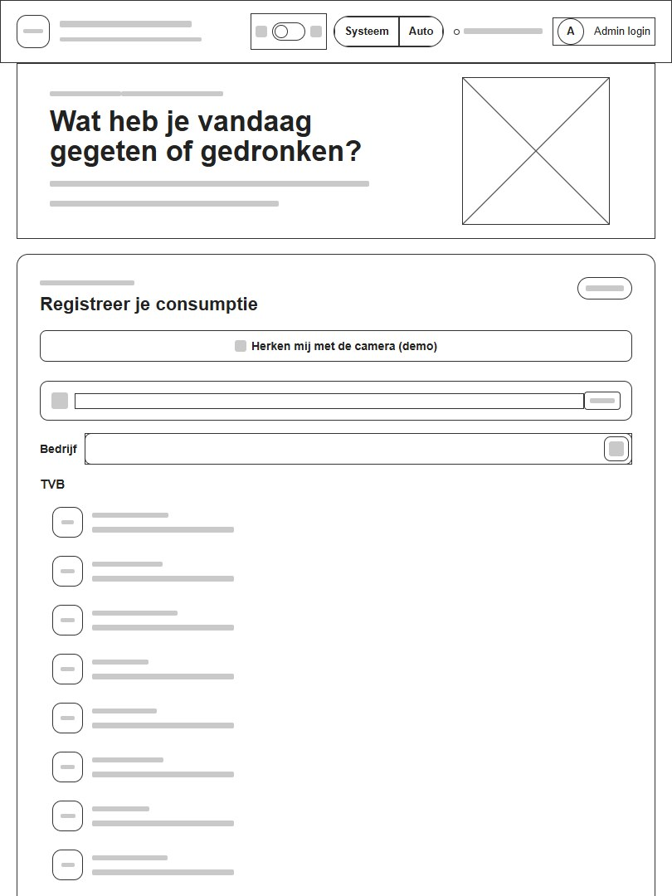

Bovenaan de bovenbalk met links het logo en de naam, en rechts de themakeuze (slider en twee knoppen), de status en de admin-knop. Daaronder de banner met de vraag als grote kop en rechts een afbeelding. Daaronder één grote kaart met een kop, een teller, een brede knop voor de camera, het zoekveld, het bedrijfsfilter en de lijst met medewerkers onder een bedrijfsnaam: per medewerker een avatar met twee regels tekst. Uitgewerkt in [W01](#w01--beginpagina-op-een-tablet).

#### L02 – Beginpagina op een groot scherm

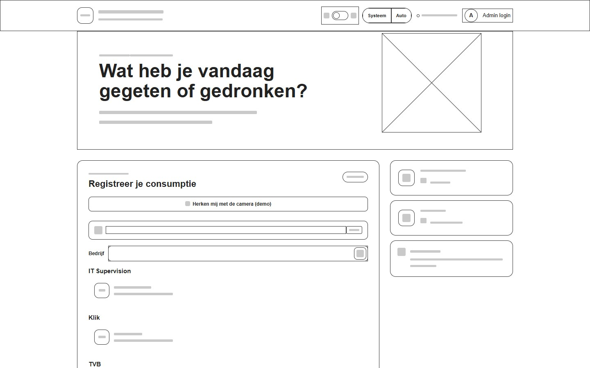

Dezelfde onderdelen in twee kolommen: links de kaart met medewerkers (nu onder drie bedrijfsnamen), rechts drie kleinere kaarten onder elkaar: twee voor de totalen (icoon, label en getal) en één tipkaart. Uitgewerkt in [W02](#w02--beginpagina-op-een-groot-scherm).

#### L03 – Beginpagina op een telefoon

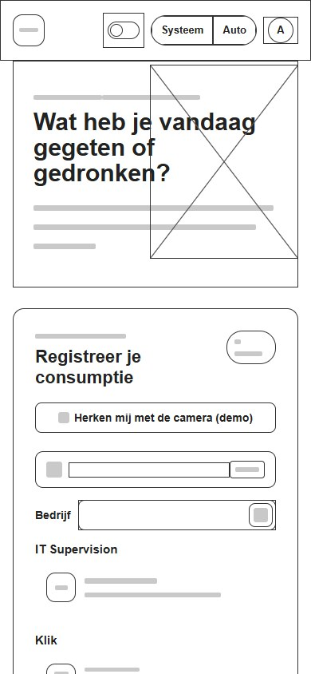

Alles staat in één kolom. In de bovenbalk blijven alleen het logo, de themakeuze en de admin-knop over. De afbeelding in de banner schuift achter de kop. Uitgewerkt in [W03](#w03--beginpagina-op-een-telefoon).

#### L04 – Productvenster

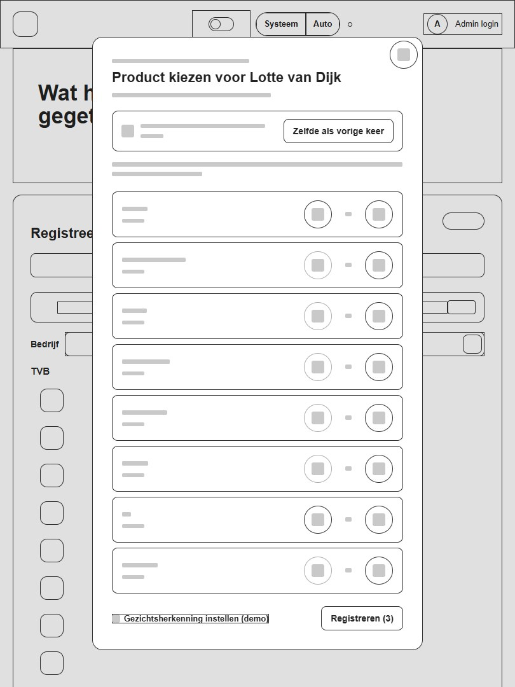

Een venster boven de beginpagina met bovenaan de kop met de naam van de medewerker en een sluitknop. Daaronder een vak met het voorstel en de knop `Zelfde als vorige keer`, een korte uitleg en een lijst met even grote productrijen: links naam en prijs, rechts een ronde `−`-knop, het aantal en een ronde `+`-knop. Onderaan links de link voor de gezichtsherkenning en rechts de knop `Registreren (3)`. Uitgewerkt in [W07](#w07--productvenster-eerste-keer) tot en met [W10](#w10--productvenster-met-zelfde-als-vorige-keer).

#### L05 – Gezichtsherkenning instellen (demo)

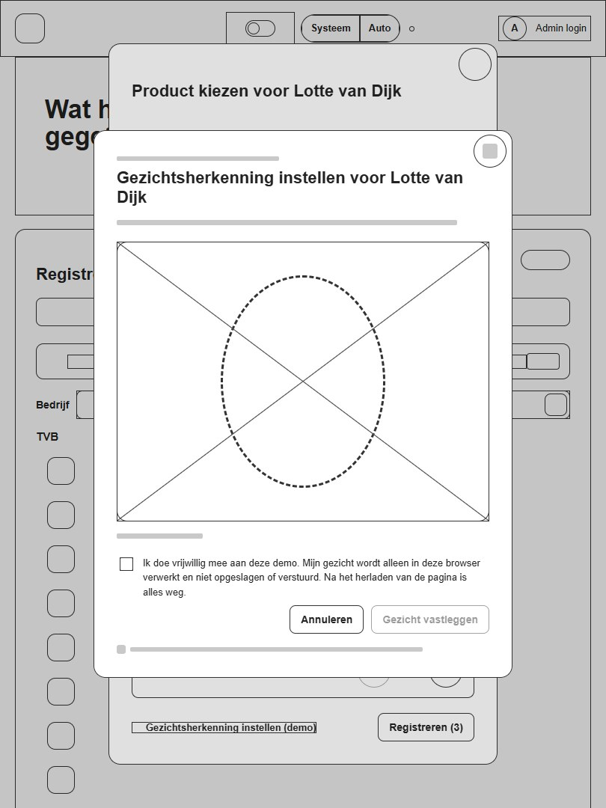

Een tweede venster boven het productvenster. Het grootste deel is het camerabeeld (kader met kruis) met daarin het ovale kader voor het gezicht. Daaronder een statusregel, een vinkje met de toestemmingstekst, de knoppen `Annuleren` en `Gezicht vastleggen` en een regel met een slot-icoon. Uitgewerkt in [W12](#w12--gezichtsherkenning-instellen-demo).

#### L06 – Inloggen als beheerder

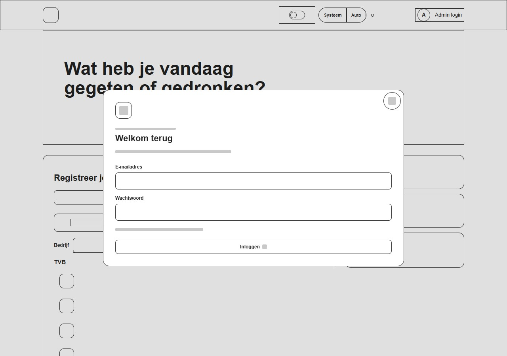

Een venster met een icoon, een kop, een korte uitleg, twee velden onder elkaar met hun label erboven, een hint en één brede knop `Inloggen`. Uitgewerkt in [W16](#w16--inloggen-als-beheerder).

#### L07 – Beheer: Registraties

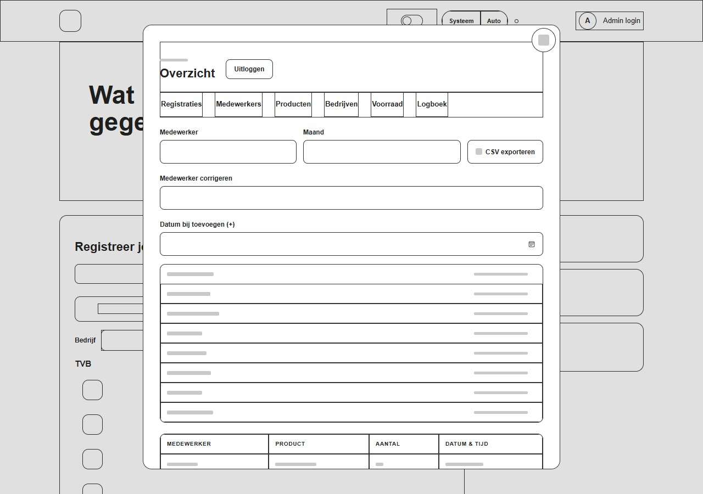

Het beheervenster met bovenaan de kop `Overzicht` en de knop `Uitloggen`, daaronder een rij met zes tabbladen. Op dit tabblad: twee keuzelijsten en een exportknop op één regel, een zoekveld, een datumveld, een lijst met per medewerker links een naam en rechts een totaal, en daaronder een tabel met vier kolommen. Uitgewerkt in [W18](#w18--beheer-registraties).

#### L08 – Beheer: Medewerkers

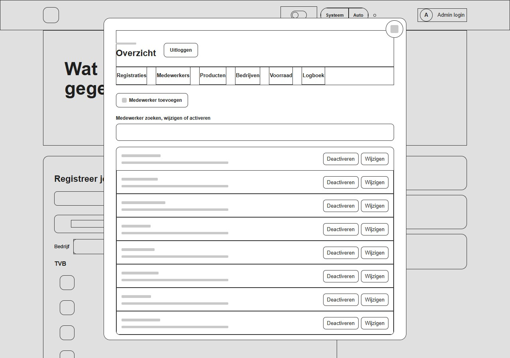

Een knop om een medewerker toe te voegen, een zoekveld met label en een lijst met rijen: links twee regels tekst, rechts de knoppen `Deactiveren` en `Wijzigen`. Uitgewerkt in [W21](#w21--beheer-medewerkers).

#### L09 – Medewerker toevoegen

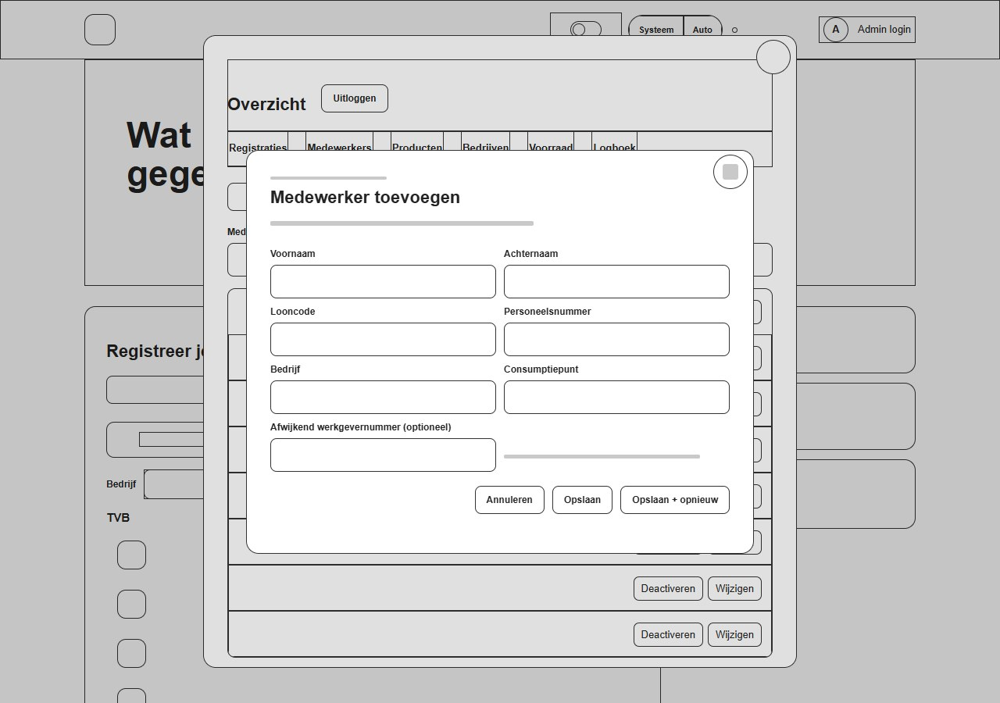

Een formulier in een venster boven het beheer, met de velden in twee kolommen en het label boven ieder veld, een hint naast het laatste veld en rechtsonder drie knoppen. Uitgewerkt in [W22](#w22--medewerker-toevoegen).

#### L10 – Beheer: Producten

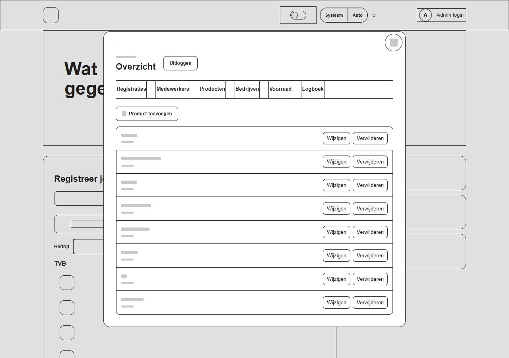

Een knop om een product toe te voegen en een lijst met rijen: links naam en prijs, rechts `Wijzigen` en `Verwijderen`. Dezelfde opbouw als de lijst met medewerkers. Uitgewerkt in [W25](#w25--beheer-producten).

#### L11 – Product toevoegen

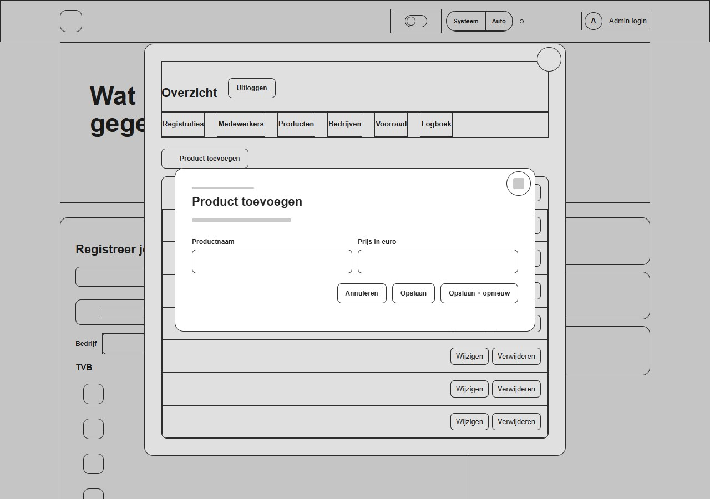

Een klein formulier met twee velden naast elkaar en drie knoppen, in dezelfde opbouw als het formulier voor medewerkers. Uitgewerkt in [W26](#w26--product-toevoegen).

#### L12 – Beheer: Bedrijven en consumptiepunten

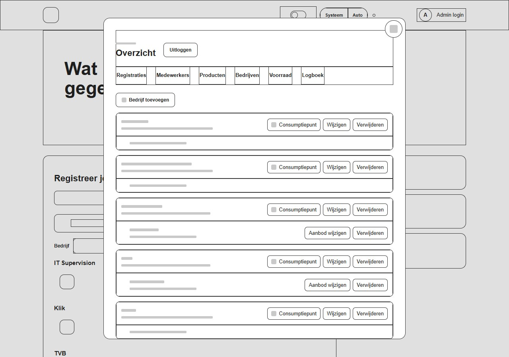

Een knop om een bedrijf toe te voegen en per bedrijf een blok: bovenin de bedrijfsregel met drie knoppen, daaronder ingesprongen de consumptiepunten met twee knoppen, of één regel tekst als er nog geen punt is. Uitgewerkt in [W28](#w28--beheer-bedrijven-en-consumptiepunten).

#### L13 – Consumptiepunt toevoegen

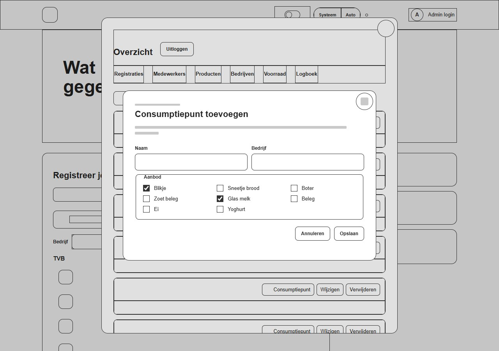

Een formulier met twee velden naast elkaar en een omkaderd blok `Aanbod` met een vinkje per product in drie kolommen, en daaronder twee knoppen. Uitgewerkt in [W30](#w30--consumptiepunt-toevoegen-met-aanbod).

#### L14 – Beheer: Voorraad

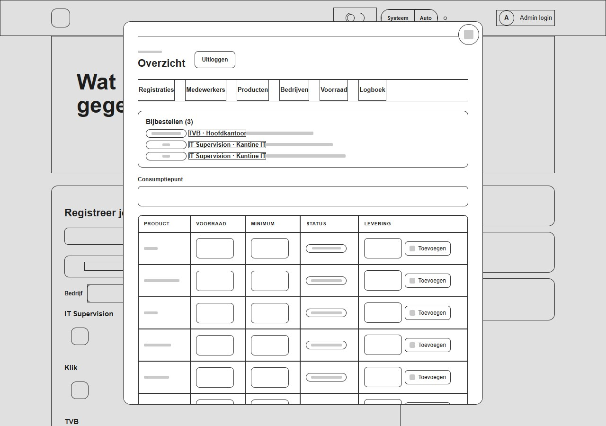

Bovenaan een blok `Bijbestellen (3)` met per regel een label, een link naar het punt en tekst. Daaronder een keuzelijst voor het consumptiepunt en een tabel met vijf kolommen: product, twee invoervelden (voorraad en minimum), een statuslabel en een invoerveld met de knop `Toevoegen`. Uitgewerkt in [W31](#w31--beheer-voorraad).

#### L15 – Beheer: Logboek

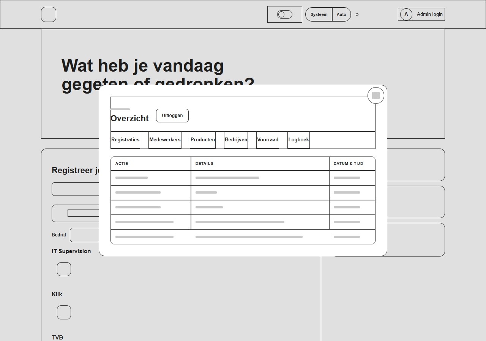

Een tabel met drie kolommen: actie, details en datum en tijd. Daaronder twee regels tekst (grijze balken) en één knop `Alle gegevens wissen`, los van de tabel. Uitgewerkt in [W33](#w33--beheer-logboek).

### Mid-fidelity wireframes

#### Eerste uitwerking (begin van het project)

```text
+------------------------------------------------------+
| [TVB] Blikjesregistratie       Systeem actief [ A ]  |
+------------------------------------------------------+
| Vandaag · datum                                      |
| Medewerkers                              8 totaal   |
| [ Zoek op voor- of achternaam... ]                   |
| [avatar] Mark Jansen                    [ + ]        |
|          0 blikjes gepakt                             |
| [avatar] Sophie de Boer                 [ + ]        |
|          3 blikjes gepakt                             |
+------------------------------+-----------------------+
| Vandaag gepakt: 5            | Deze maand: 5         |
+------------------------------+-----------------------+
```

Hier waren de kaarten, knoppen en informatie al duidelijker uitgewerkt. In de uiteindelijke versie zijn de persoonlijke aantallen weggehaald (FR-29) en opent een klik op de medewerker een productvenster.

#### M01 – Beginpagina op een tablet

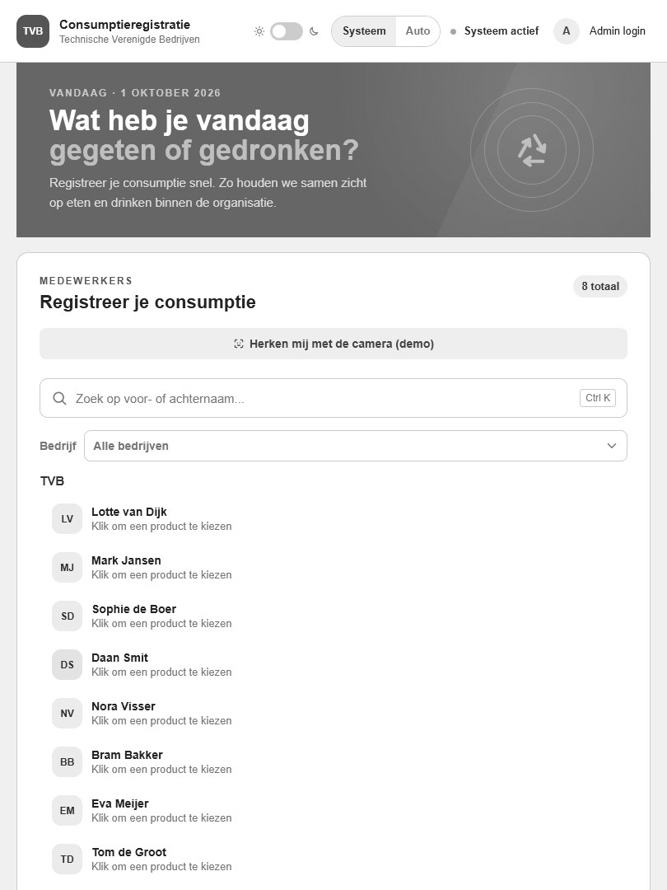

De indeling van L01 met de echte teksten: de datum en de vraag in de banner, de kop `Registreer je consumptie`, de teller `8 totaal`, de voorbeeldtekst in het zoekveld met `Ctrl K`, `Alle bedrijven` in het filter en de namen met initialen. De hiërarchie is al zichtbaar door grootte en dikte van de letters, zonder huiskleuren. Uitgewerkt in [W01](#w01--beginpagina-op-een-tablet).

#### M02 – Beginpagina op een groot scherm

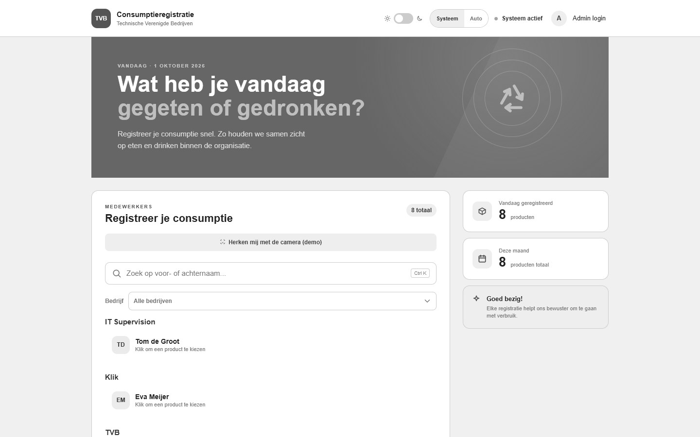

Twee kolommen met rechts de totalen (`Vandaag geregistreerd`, `Deze maand`) en de tipkaart `Goed bezig!`. Links de medewerkers onder IT Supervision, Klik en TVB. Uitgewerkt in [W02](#w02--beginpagina-op-een-groot-scherm).

#### M03 – Beginpagina op een telefoon

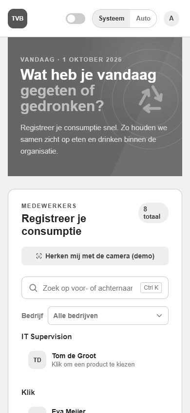

Eén kolom met dezelfde teksten. Hier is ook te zien dat de voorbeeldtekst in het zoekveld op een telefoon net niet past en dat de teller "8 totaal" over twee regels breekt (een beperking, zie W03). Uitgewerkt in [W03](#w03--beginpagina-op-een-telefoon).

#### M04 – Productvenster

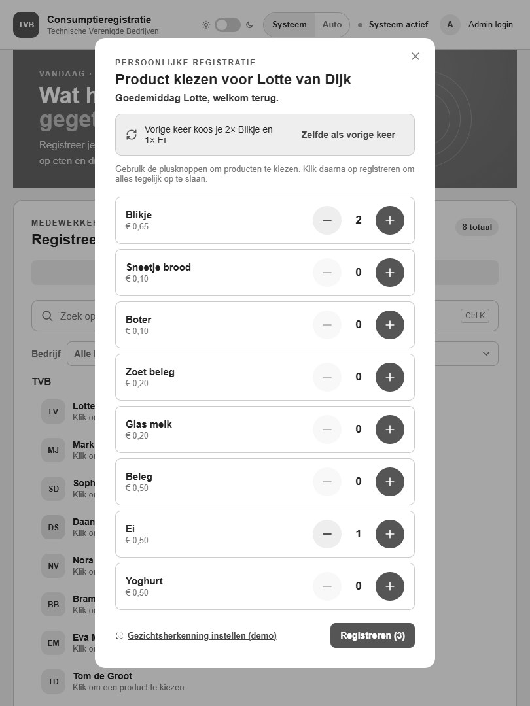

Met de echte inhoud: de begroeting "Goedemiddag Lotte, welkom terug.", het voorstel "Vorige keer koos je 2× Blikje en 1× Ei.", de productnamen met prijzen, de aantallen (2 en 1 na `Zelfde als vorige keer`) en `Registreren (3)`. De `+`-knoppen en `Registreren` zijn donker, de uitgeschakelde `−`-knoppen licht: het verschil tussen hoofdactie en uitgeschakeld is al zonder kleur te zien. Uitgewerkt in [W07](#w07--productvenster-eerste-keer) tot en met [W10](#w10--productvenster-met-zelfde-als-vorige-keer).

#### M05 – Gezichtsherkenning instellen (demo)

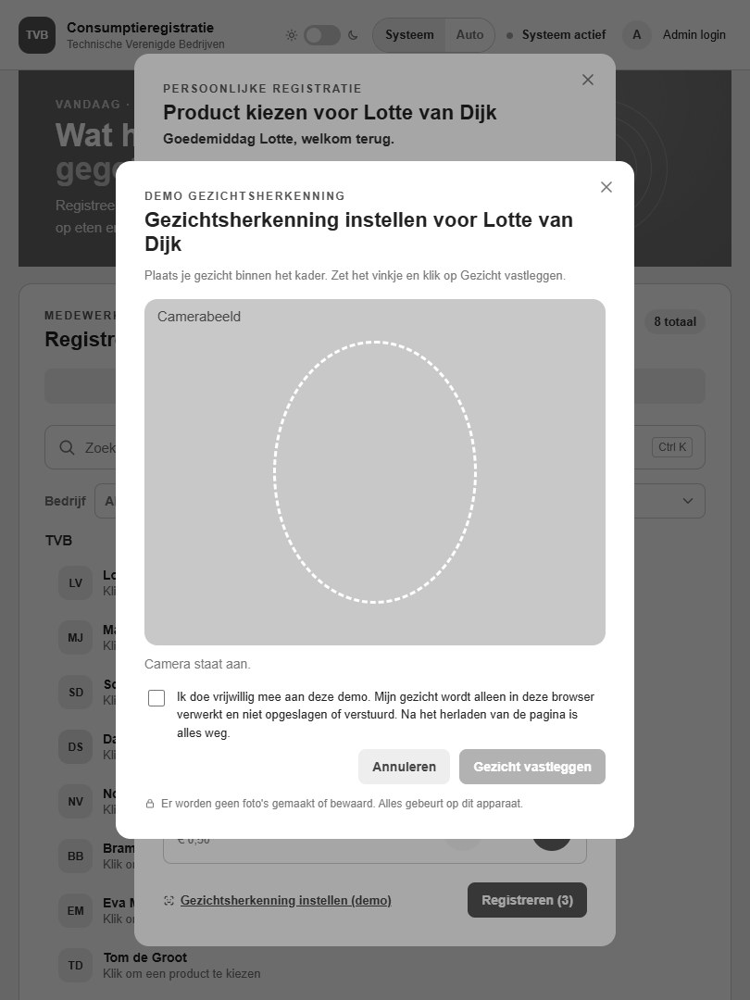

Het camerabeeld als grijs vlak met de tekst "Camerabeeld" en het ovale kader, de status `Camera staat aan.`, de volledige toestemmingstekst, de lichte (uitgeschakelde) knop `Gezicht vastleggen` en de privacyregel. Uitgewerkt in [W12](#w12--gezichtsherkenning-instellen-demo).

#### M06 – Inloggen als beheerder

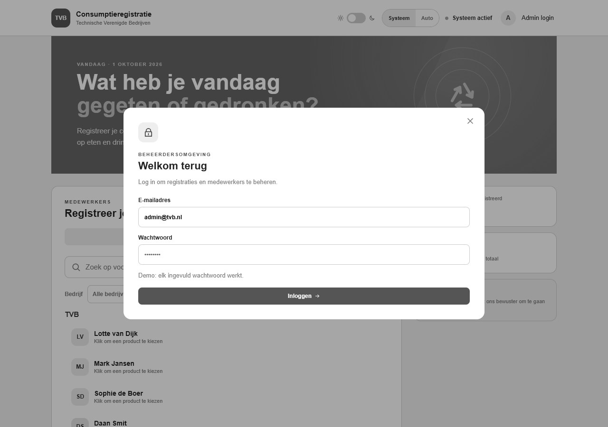

Het loginvenster met `Beheerdersomgeving`, `Welkom terug`, het ingevulde e-mailadres, het wachtwoordveld, de hint "Demo: elk ingevuld wachtwoord werkt." en de donkere knop `Inloggen`. Uitgewerkt in [W16](#w16--inloggen-als-beheerder).

#### M07 – Beheer: Registraties

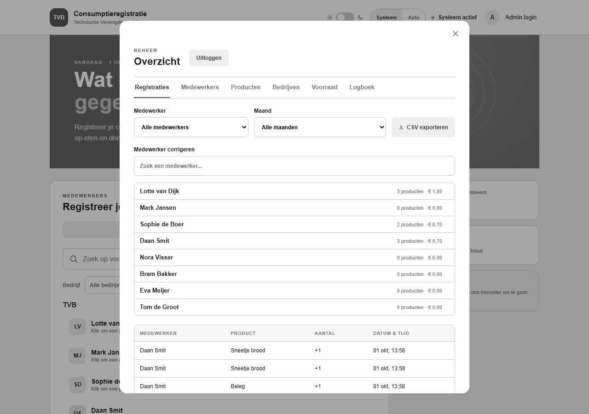

De tabbladen met het actieve tabblad onderstreept, de filters `Alle medewerkers` en `Alle maanden`, `CSV exporteren`, het zoekveld, het datumveld `Datum bij toevoegen (+)`, de totalen per medewerker (bijvoorbeeld "3 producten · € 1,80") en de tabel met de nieuwste registratie bovenaan. Uitgewerkt in [W18](#w18--beheer-registraties).

#### M08 – Beheer: Medewerkers

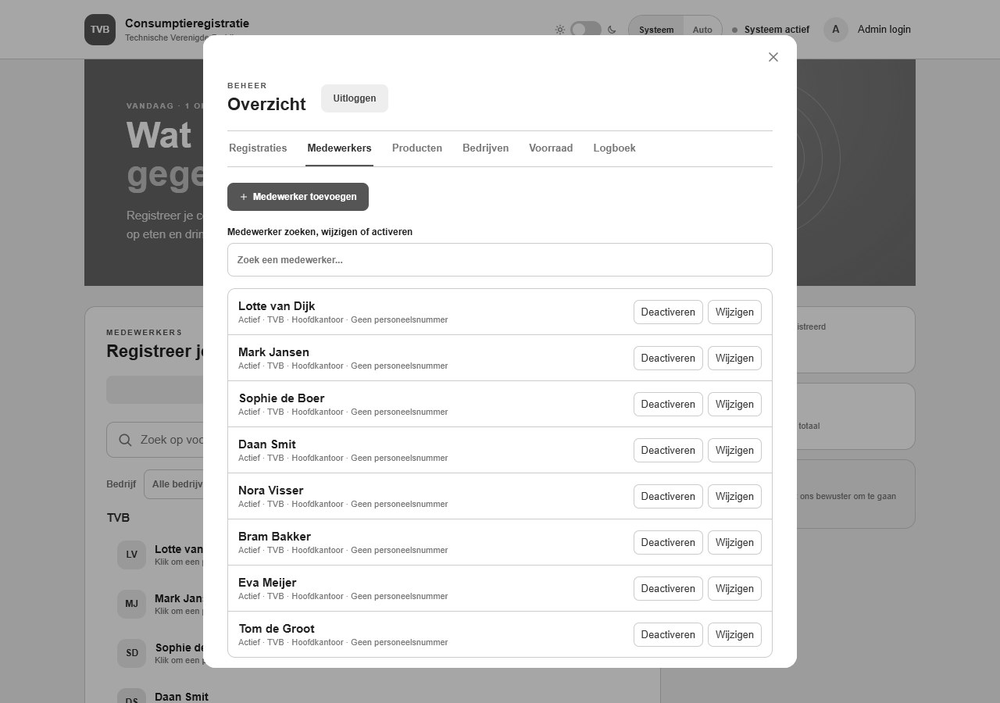

De lijst met per medewerker de naam en "Actief · TVB · Hoofdkantoor · Geen personeelsnummer", en de knoppen `Deactiveren` en `Wijzigen`. Uitgewerkt in [W21](#w21--beheer-medewerkers).

#### M09 – Medewerker toevoegen

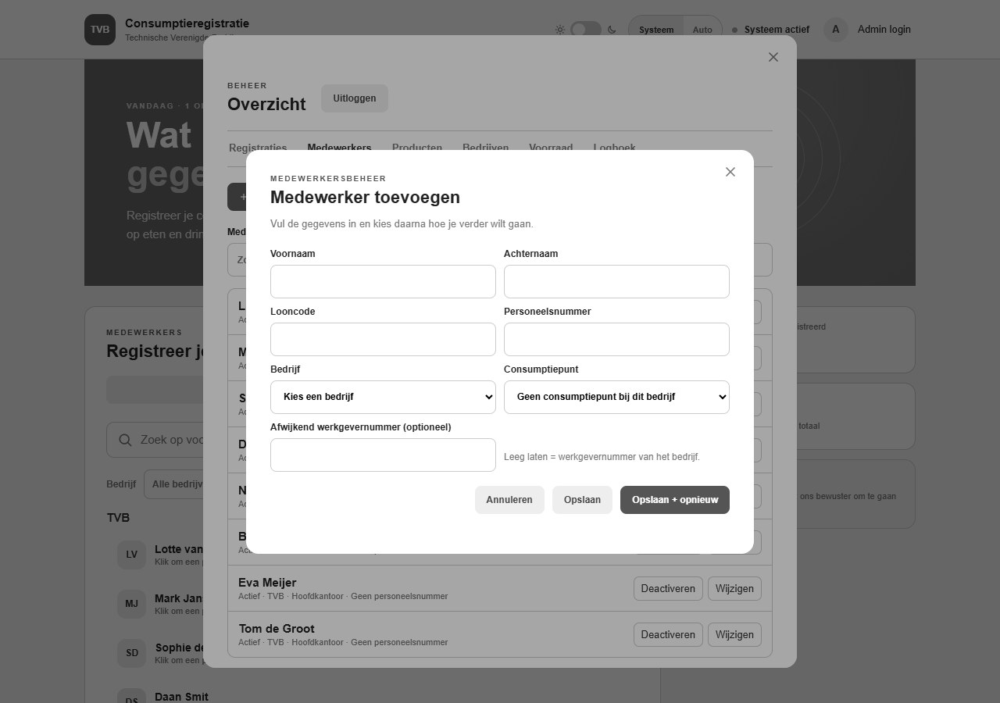

Het formulier met alle labels, de keuzelijsten `Kies een bedrijf` en `Geen consumptiepunt bij dit bedrijf`, de hint bij het werkgevernummer en de knoppen `Annuleren`, `Opslaan` en (donker) `Opslaan + opnieuw`. Uitgewerkt in [W22](#w22--medewerker-toevoegen).

#### M10 – Beheer: Producten

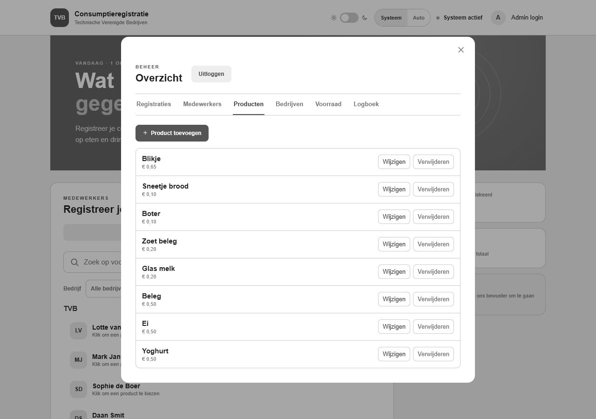

De acht producten met hun prijs en de knoppen `Wijzigen` en `Verwijderen`. Uitgewerkt in [W25](#w25--beheer-producten).

#### M11 – Product toevoegen

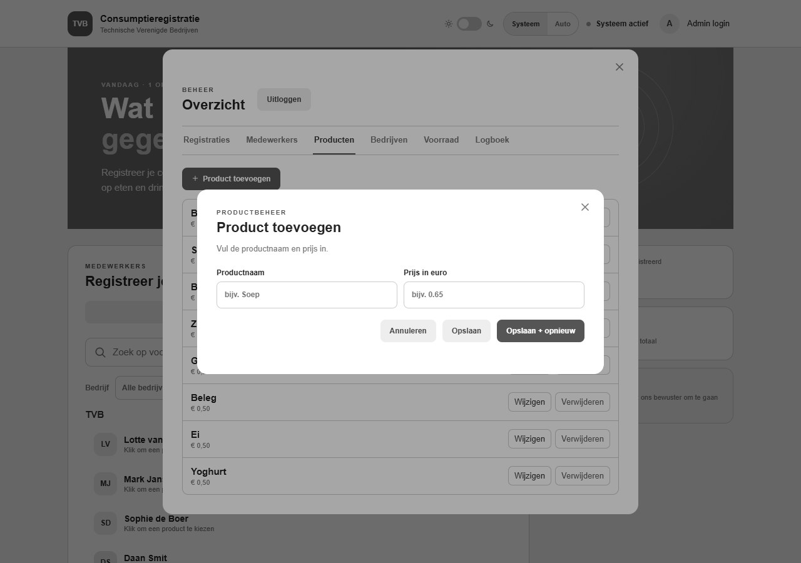

De velden `Productnaam` en `Prijs in euro` met de voorbeelden "bijv. Soep" en "bijv. 0.65", en de drie knoppen. Uitgewerkt in [W26](#w26--product-toevoegen).

#### M12 – Beheer: Bedrijven en consumptiepunten

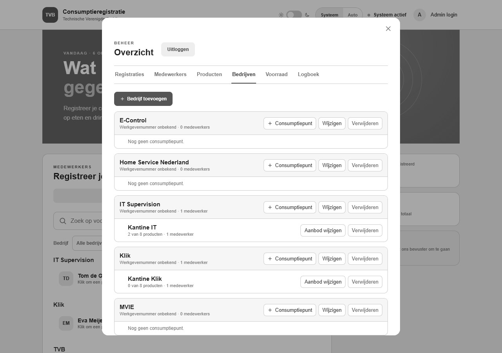

De bedrijven op alfabetische volgorde met "Werkgevernummer onbekend" en het aantal medewerkers ("0 medewerkers", of "1 medewerker" bij IT Supervision en Klik), de punten Kantine IT ("2 van 8 producten · 1 medewerker") en Kantine Klik ("0 van 8 producten · 1 medewerker"), en "Nog geen consumptiepunt." bij bedrijven zonder punt. Uitgewerkt in [W28](#w28--beheer-bedrijven-en-consumptiepunten).

#### M13 – Consumptiepunt toevoegen

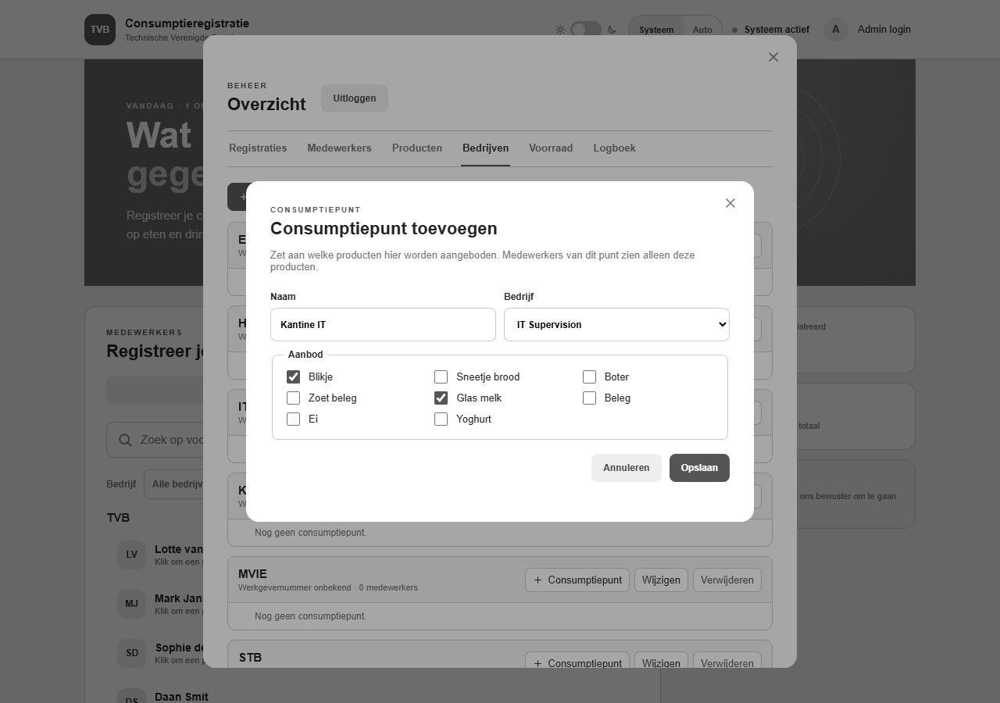

De uitleg over het aanbod, de naam `Kantine IT`, het bedrijf `IT Supervision` en de productnamen bij de vinkjes, met Blikje en Glas melk aangevinkt. Uitgewerkt in [W30](#w30--consumptiepunt-toevoegen-met-aanbod).

#### M14 – Beheer: Voorraad

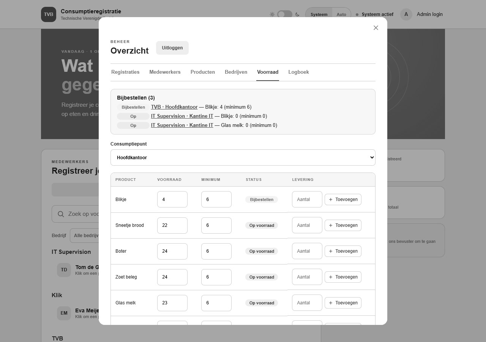

De bijbestellijst met de labels `Bijbestellen` en `Op` en de teksten (bijvoorbeeld "Blikje: 4 (minimum 6)"), en de tabel van Hoofdkantoor met de getallen, de statuslabels `Bijbestellen` en `Op voorraad` en de velden `Aantal` met `Toevoegen`. Zonder kleur zijn de labels alleen nog aan hun tekst te herkennen. In het eindontwerp helpen kleuren hierbij. Uitgewerkt in [W31](#w31--beheer-voorraad).

#### M15 – Beheer: Logboek

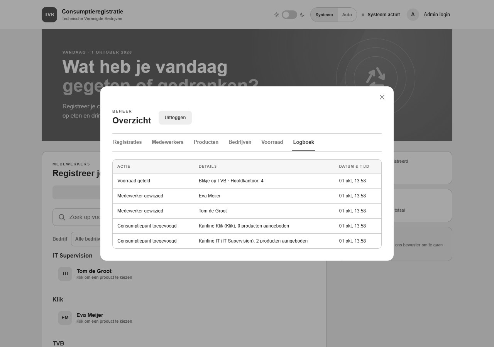

Het logboek met de echte regels, zoals "Consumptiepunt toegevoegd" en "Voorraad geteld", met de details en de datum en tijd (hier "02 okt, 14:35"). Onder de tabel staat de uitleg "Wist alle medewerkers, registraties, producten, voorraad, het logboek en de reservekopieën op deze tablet en zet de demogegevens terug." en de knop `Alle gegevens wissen`. Zonder kleur lijkt die knop op een gewone knop. In het eindontwerp is hij rood. Uitgewerkt in [W33](#w33--beheer-logboek).

### High-fidelity wireframe

De high-fidelity versie is de uiteindelijke website. Deze heeft:

- de groene en blauwe kleuren van TVB.
- afgeronde kaarten.
- duidelijke teksten.
- avatars en iconen.
- hover-effecten.
- meldingen na een actie.
- een mobiele indeling.
- een aparte admin-modal.

Van ieder scherm van de high-fidelity versie staat een screenshot in de paragraaf [Wireframes](#wireframes) hieronder.

### Ontwerpkeuzes en Nielsen-heuristieken

- De melding na het registreren laat zien wat er is gebeurd. Dit past bij **zichtbaarheid van de systeemstatus**.
- De zoekbalk voorkomt dat de gebruiker alle namen moet onthouden. Dit past bij **herkenning in plaats van onthouden**.
- Knoppen volgen overal hetzelfde patroon. Een formulier met twee opslaanknoppen heeft `Opslaan` als gewone (secundaire) knop en `Opslaan + opnieuw` als groene hoofdknop, omdat de beheerder vaak meerdere medewerkers of producten achter elkaar invoert. Een formulier met één opslaanknop heeft `Opslaan` als groene hoofdknop: bij een bedrijf en een consumptiepunt, en bij het wijzigen van een medewerker of product, waar `Opslaan + opnieuw` wegvalt (zie W24). Knoppen die iets verwijderen, hebben rode tekst. Dit past bij **consistentie en standaarden**.
- Het beheervenster heeft een sluitknop en een knop `Uitloggen`. Sluiten logt de beheerder ook uit, zodat op een gedeelde tablet niemand per ongeluk ingelogd blijft. Met `Uitloggen` blijft het venster open met het loginformulier. Dit past bij **gebruikerscontrole en vrijheid** en **foutpreventie**.
- Een medewerker kan zelf niet verlagen en ziet alleen producten die op het eigen punt aanwezig zijn. Dit helpt om fouten te voorkomen en past bij **foutpreventie**.
- De website werkt op verschillende schermen: telefoon, tablet en groot scherm (het UI-principe responsief ontwerp). Op ieder scherm zien de onderdelen er hetzelfde uit en blijft op een klein scherm alleen het noodzakelijke staan. Dit past bij **consistentie en standaarden** en **esthetisch en minimalistisch ontwerp**.
- Hoort een registratie bij een medewerker die niet (meer) bestaat, dan staat er `Verwijderd` in plaats van een naam, in de tabel en in de CSV-export. Dat komt alleen voor bij oude of geïmporteerde gegevens: een medewerker met registraties kan niet worden verwijderd, en alleen een inactieve medewerker zonder registraties kan definitief worden verwijderd. Zo blijft de registratie zichtbaar en raakt er niets ongemerkt kwijt. Dit past bij **zichtbaarheid van de systeemstatus**: de beheerder ziet dat er een registratie is waarvan de medewerker niet meer bestaat, in plaats van dat die stil uit de tabel of de export verdwijnt.
- Het productvenster heeft naast `+` ook een `−`-knop, zodat een verkeerde tik direct te herstellen is. Dit past bij **gebruikerscontrole en vrijheid**.
- De melding na het registreren noemt de naam en de producten, staat onderaan in het midden en blijft 4 seconden staan. Dit past bij **zichtbaarheid van de systeemstatus**, belangrijk op een gedeelde tablet.
- Formulieren hebben labels boven de velden in plaats van alleen voorbeeldtekst die verdwijnt tijdens het typen. Dit past bij **herkenning in plaats van onthouden** en **foutpreventie**.
- Knoppen voor aanraakschermen zijn minstens 44 × 44 pixels (het UI-principe toegankelijkheid), en op een staande tablet is de banner compacter zodat de medewerkerlijst hoger begint. Die compactere banner past bij **esthetisch en minimalistisch ontwerp**: wat de medewerker nodig heeft, de lijst met namen, staat zo hoog mogelijk.
- Foutmeldingen in formulieren staan direct onder het veld (met een waarschuwingsteken), het eerste foute veld krijgt de focus en de melding verdwijnt zodra je het veld aanpast. Dit past bij **fouten herkennen en herstellen**.
- Lege lijsten en tabellen tonen een icoon, een korte uitleg en waar nodig een knop, zoals "Zoekopdracht wissen" of "Naar Bedrijven". Dit past bij **hulp en documentatie** en **fouten herstellen**.
- Meldingen tonen een vinkje bij succes en een uitroepteken in een cirkel bij een fout. De melding zelf heeft altijd dezelfde donkere achtergrond. Het verschil zit in het icoon (en de kleur van het icoon), dus niet alleen in kleur. Dit past bij **zichtbaarheid van de systeemstatus**.
- Alle iconen zijn eenvoudige SVG-lijntekeningen met dezelfde lijndikte (`assets/js/icons.js`) in plaats van teksttekens, zodat ze op ieder apparaat hetzelfde en scherp zijn. Dit past bij **consistentie en standaarden**.
- Ieder venster sluit ook met de Escape-toets, en met Tab blijft de focus binnen het open venster in plaats van te verdwijnen naar de pagina erachter. Ctrl K werkt alleen als er geen venster open is. Bij het openen van een venster staat de focus meteen in het venster (in het productvenster op de eerste `+`-knop), en na een druk op `+` of `−` houdt dezelfde knop de focus, zodat je met het toetsenbord meerdere keren kunt drukken. Dit past bij **gebruikerscontrole en vrijheid** en **flexibiliteit en efficiënt gebruik**.
- Na het sluiten van een venster (kruisje, achtergrond, Escape of na opslaan) gaat de focus terug naar de knop of medewerkerrij waarmee het werd geopend. Wie met het toetsenbord of een schermlezer werkt, hoeft dan niet opnieuw te zoeken waar die was gebleven. Dit past bij **gebruikerscontrole en vrijheid** en bij toegankelijkheid.
- Acties die niet terug te draaien zijn of die een verwerkte loonmaand kunnen raken, vragen eerst om bevestiging: `Alle gegevens wissen` twee keer. Een correctie met `−` op een registratie uit een andere maand ("Deze registratie is van … Die loonmaand is mogelijk al verwerkt. Toch verwijderen?"). Een correctie met `+` op een datum in een eerdere maand ("Deze registratie komt in … Die loonmaand is mogelijk al verwerkt. Toch toevoegen?"). En het verwijderen van een inactieve medewerker, een product ("Product <naam> verwijderen?"), een bedrijf of een consumptiepunt. Dit past bij **foutpreventie**.

### Wireframes

Deze paragraaf laat ieder scherm van de website zien zoals het nu werkt. Per scherm staan een naam, een omschrijving, de UI-principes die erin zitten en de heuristieken van Nielsen die erin terugkomen.

**Hoe de screenshots zijn gemaakt.** Alle afbeeldingen staan in de map `docs/wireframes/` en zijn screenshots van de echte website, gemaakt met Microsoft Edge zonder venster (headless). Er is niets in getekend of nagemaakt. De screenshots zijn niet allemaal op dezelfde dag gemaakt. De datum staat in de banner ("Vandaag · …") en soms ook in een tabel of datumveld:

- **1 oktober 2026** (rond 12:00 uur): W01 tot en met W17, W21 tot en met W23, W25 tot en met W27, W30 tot en met W32 en W34.
- **2 oktober 2026:** W18, W19 en W20 (Registraties), opnieuw gemaakt omdat het datumveld `Datum bij toevoegen (+)` is bijgekomen, en W33 (Logboek), opnieuw gemaakt omdat de knop `Alle gegevens wissen` is bijgekomen.
- **6 oktober 2026** ('s ochtends): W28 en W29 (Bedrijven), opnieuw gemaakt omdat er nu "1 medewerker" staat in plaats van "1 medewerkers". W24 (Medewerker wijzigen), opnieuw gemaakt omdat `Opslaan` daar nu de groene hoofdknop is. En de nieuwe screenshots W35 tot en met W40. W40 is daarna nog een keer gemaakt, omdat de filters op een telefoon nu onder elkaar staan.

Bij het opnieuw maken zijn steeds dezelfde stappen en demogegevens gebruikt, zodat alleen het bedoelde onderdeel verschilt (en de datum in de banner). Voor W28, W29 en W24 is dat gecontroleerd door de oude en nieuwe afbeelding pixel voor pixel te vergelijken: bij W28 en W29 zijn alleen de datum en de woorden "medewerker(s)" anders, bij W24 alleen de datum en de knop `Opslaan`. Bij W35 is het ochtend, daarom staat daar "Goedemorgen" in plaats van "Goedemiddag". De demogegevens zijn via de website zelf ingevoerd: Lotte van Dijk registreerde 2× Blikje en 1× Ei, Sophie de Boer 1× Yoghurt en 1× Glas melk, en Daan Smit 2× Sneetje brood en 1× Beleg. Daarna zijn in het beheer het consumptiepunt Kantine IT (IT Supervision, alleen Blikje en Glas melk) en Kantine Klik (Klik, geen producten) aangemaakt, is Tom de Groot naar Kantine IT en Eva Meijer naar Kantine Klik verplaatst en is de voorraad Blikje op Hoofdkantoor op 4 gezet. Of een screenshot vóór of na die beheerstappen is gemaakt, hangt af van wat het scherm moet laten zien, niet van de datum. In de screenshots van vóór de beheerstappen (zoals W01 en W05) staan alle medewerkers onder TVB. In de screenshots erna (zoals W02, W11, W28 en W31) staan Tom de Groot onder IT Supervision en Eva Meijer onder Klik. Voor W35 tot en met W40 zijn alleen de drie registraties ingevoerd (zonder de nieuwe consumptiepunten). Daar staan dus alle medewerkers onder TVB. Voor W38 zijn daarna Mark Jansen en Daan Smit op inactief gezet.

Een paar dingen om te weten:

- **Camera.** Bij de schermen van de gezichtsherkenning (W12 en W13) gebruikt de browser zijn eigen testbeeld als camera (een groen vlak met een draaiende cirkel en een teller). Er staan dus geen echte gezichten in dit document. Het beeld is gespiegeld, net als bij een echte camera aan de voorkant.
- **W13.** Het venster `Herken mij` opent alleen als er minstens één gezicht is ingesteld. Met het testbeeld kan geen gezicht worden vastgelegd. Alleen voor deze screenshot is daarom nagebootst dat er iemand is ingesteld. Het venster zelf is ongewijzigd.
- **W14.** Hier is echt herkend: als camerabeeld is een voorbeeldfoto gebruikt. De screenshot is gemaakt nadat het cameravenster vanzelf was gesloten, dus de foto staat er niet op.
- **W35.** Hier weigert de browser de camera (de toestemming voor de camera staat in de browser op "geweigerd"). De foutmelding komt dus uit de echte code. Er is niets nagebootst.
- **W36.** Voor deze screenshot is in de opslag van de browser (localStorage) één registratie met een kapotte datum gezet, en daarna is de pagina opnieuw geladen. De melding komt uit de echte controle bij het laden.
- **Bevestigingsvragen.** Bij het verwijderen van een medewerker, product ("Product <naam> verwijderen?"), bedrijf of consumptiepunt, bij een correctie met `−` op een registratie uit een andere maand, bij een correctie met `+` op een datum in een eerdere maand en bij `Alle gegevens wissen` vraagt de browser om bevestiging met een eigen venster (`window.confirm`). Dat venster hoort bij de browser en niet bij de website en staat daarom niet tussen de screenshots.
- **Schermformaten.** De medewerkerskant is vastgelegd op een staande tablet (810 × 1080 pixels), omdat de website op een tablet bij het consumptiepunt wordt gebruikt. Het beheer is vastgelegd op een laptopscherm (1280 × 900). W02 en W03 tonen de beginpagina op een groot scherm (1440 × 900) en een telefoon (390 × 844), W40 het beheer op een telefoon (390 × 844). W15 (waarschuwing bij openen als los bestand) is vastgelegd op 1280 × 800.
- **Thema.** Alle screenshots staan in het lichte thema, behalve W04 en W39 (donker thema).

#### Gebruikte UI-principes

| UI-principe | Betekenis in deze website |
|---|---|
| Visuele hiërarchie | Het belangrijkste valt het eerst op door grootte, gewicht en kleur, zoals de vraag in de banner en de groene hoofdknop. |
| Consistentie | Dezelfde onderdelen zien er overal hetzelfde uit en werken hetzelfde: kaarten, knoppen, vensters, labels en iconen. |
| Feedback | Iedere actie geeft een zichtbare reactie: een teller, een melding, een status of een foutmelding. |
| Affordance | Aan een element is te zien wat je ermee kunt: knoppen zien eruit als knoppen, een uitgeschakelde knop is vaag. |
| Groeperen (nabijheid) | Wat bij elkaar hoort, staat bij elkaar: medewerkers per bedrijf, consumptiepunten onder hun bedrijf, filters boven de tabel. |
| Kleur met betekenis | Groen voor de hoofdactie en succes, rood voor fouten en verwijderen, oranje voor bijbestellen. |
| Witruimte en eenvoud | Weinig onderdelen per scherm en genoeg ruimte ertussen. |
| Uitlijning | Alle onderdelen volgen dezelfde paginabreedte, zijmarge en kolommen. |
| Toegankelijkheid | Grote aanraakvlakken (minstens 44 × 44 pixels), labels boven velden, voldoende contrast en bediening met het toetsenbord. |
| Progressieve onthulling | Details komen pas in beeld als ze nodig zijn, bijvoorbeeld in een venster of een uitklapbare rij. |
| Responsief ontwerp | De indeling past zich aan het scherm aan: telefoon, tablet of groot scherm. |

#### De tien heuristieken van Nielsen

De codes H1 tot en met H10 verwijzen naar de tien heuristieken van Nielsen (1994).

| Code | Heuristiek |
|---|---|
| H1 | Zichtbaarheid van de systeemstatus |
| H2 | Overeenkomst tussen het systeem en de echte wereld |
| H3 | Gebruikerscontrole en vrijheid |
| H4 | Consistentie en standaarden |
| H5 | Foutpreventie |
| H6 | Herkennen in plaats van herinneren |
| H7 | Flexibiliteit en efficiëntie |
| H8 | Esthetisch en minimalistisch ontwerp |
| H9 | Gebruikers helpen fouten te herkennen, begrijpen en herstellen |
| H10 | Hulp en documentatie |

#### Overzicht

W35 tot en met W40 zijn later toegevoegd. Ze hebben een nieuw nummer gekregen, zodat de nummers van de andere screenshots (en verwijzingen ernaar) niet veranderen, en staan in de lijst en in deze paragraaf direct naast het scherm waar ze bij horen (bijvoorbeeld W35 na de andere schermen van de camera en W37 na W19).

| Nr. | Naam | Wie |
|---|---|---|
| W01 | Beginpagina op een tablet | Medewerker |
| W02 | Beginpagina op een groot scherm | Medewerker |
| W03 | Beginpagina op een telefoon | Medewerker |
| W04 | Beginpagina in het donkere thema | Medewerker |
| W05 | Bedrijfsfilter geopend | Medewerker |
| W06 | Zoeken zonder resultaat | Medewerker |
| W07 | Productvenster, eerste keer | Medewerker |
| W08 | Productvenster met een keuze | Medewerker |
| W09 | Bevestiging na registreren | Medewerker |
| W10 | Productvenster met "Zelfde als vorige keer" | Medewerker |
| W11 | Productvenster zonder producten | Medewerker |
| W12 | Gezichtsherkenning instellen (demo) | Medewerker |
| W13 | Herken mij met de camera (demo) | Medewerker |
| W14 | Herkend met de camera (demo) | Medewerker |
| W35 | Camera zonder toegang (demo) | Medewerker |
| W15 | Waarschuwing bij openen als los bestand | Iedereen |
| W36 | Melding bij beschadigde opgeslagen gegevens | Iedereen |
| W16 | Inloggen als beheerder | Beheerder |
| W17 | Inloggen met een foutmelding | Beheerder |
| W18 | Beheer: Registraties | Beheerder |
| W19 | Beheer: registratie corrigeren | Beheerder |
| W37 | Beheer: correctiedatum met foutmelding | Beheerder |
| W20 | Beheer: filter zonder registraties | Beheerder |
| W21 | Beheer: Medewerkers | Beheerder |
| W38 | Beheer: inactieve medewerkers | Beheerder |
| W22 | Medewerker toevoegen | Beheerder |
| W23 | Medewerker toevoegen met foutmeldingen | Beheerder |
| W24 | Medewerker wijzigen | Beheerder |
| W25 | Beheer: Producten | Beheerder |
| W26 | Product toevoegen | Beheerder |
| W27 | Product met een bestaande naam | Beheerder |
| W28 | Beheer: Bedrijven en consumptiepunten | Beheerder |
| W29 | Bedrijf wijzigen | Beheerder |
| W30 | Consumptiepunt toevoegen met aanbod | Beheerder |
| W31 | Beheer: Voorraad | Beheerder |
| W32 | Voorraad van een punt zonder aanbod | Beheerder |
| W33 | Beheer: Logboek | Beheerder |
| W34 | Foutmelding bij een levering | Beheerder |
| W39 | Beheer in het donkere thema | Beheerder |
| W40 | Beheer op een telefoon | Beheerder |

#### W01 – Beginpagina op een tablet

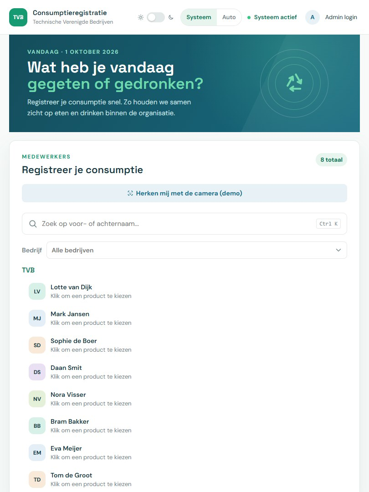

**Omschrijving.** Dit is het eerste scherm dat een medewerker op de tablet bij het consumptiepunt ziet. Bovenaan staat de bovenbalk met het TVB-logo, de naam `Consumptieregistratie`, de themakeuze (slider met zon en maan, en de knoppen `Systeem` en `Auto`), de status `Systeem actief` en de knop `Admin login`. Daaronder staat de banner met de datum (`Vandaag · 1 oktober 2026`) en de vraag "Wat heb je vandaag gegeten of gedronken?". Op een staande tablet is deze banner compacter, zodat de lijst hoger begint. In de kaart `Registreer je consumptie` staan het aantal medewerkers (`8 totaal`), de knop `Herken mij met de camera (demo)`, het zoekveld met de sneltoets `Ctrl K` en het bedrijfsfilter. De medewerkers staan per bedrijf (hier alleen TVB), met een gekleurde avatar met initialen en de tekst "Klik om een product te kiezen". De totalen van vandaag en deze maand staan op de tablet onder de lijst (zie W06).

**UI-principes:**
- *Visuele hiërarchie:* de grote vraag in de banner en de kop van de kaart zijn het eerst te zien. De uitleg is kleiner en lichter.
- *Groeperen:* medewerkers staan onder de naam van hun bedrijf.
- *Toegankelijkheid:* de rijen van de medewerkers zijn groot genoeg om met een vinger aan te tikken en werken ook met Enter of spatie.
- *Responsief ontwerp:* op een staande tablet komen de totalen onder de lijst en is de banner lager.
- *Witruimte en eenvoud:* alleen wat nodig is om te registreren staat op het scherm.

**Nielsen-heuristieken:**
- *H1:* de datum, `Systeem actief` en `8 totaal` laten zien waar de gebruiker is en wat het systeem doet.
- *H2:* de vraag en de teksten zijn gewone taal ("Klik om een product te kiezen") en er worden echte namen getoond, geen nummers.
- *H6:* de medewerker zoekt de eigen naam op in een lijst met avatars en hoeft niets te onthouden of in te typen.
- *H7:* zoeken, het bedrijfsfilter, de sneltoets `Ctrl K` en de camera zijn snellere wegen naar de eigen naam.
- *H8:* er staan geen persoonlijke aantallen of bedragen in de lijst.

#### W02 – Beginpagina op een groot scherm

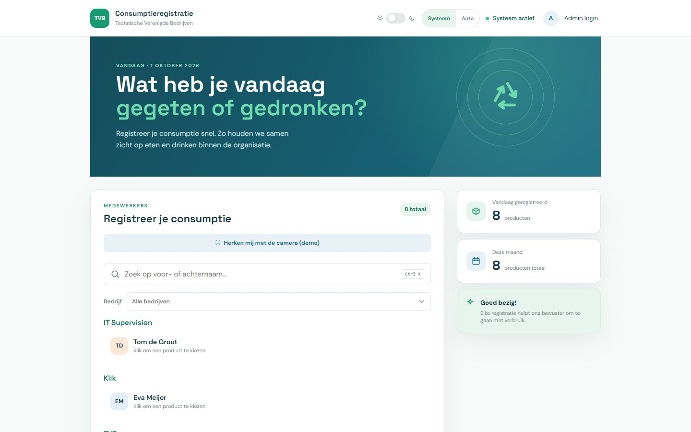

**Omschrijving.** Dezelfde beginpagina op een scherm van 1440 pixels breed. De inhoud blijft binnen een vaste paginabreedte in het midden. Links staat de kaart met medewerkers, nu verdeeld over IT Supervision (Tom de Groot), Klik (Eva Meijer) en TVB. Rechts staan de kaarten `Vandaag geregistreerd` (8 producten) en `Deze maand` (8 producten totaal) en een tipkaart `Goed bezig!` met de tekst "Elke registratie helpt ons bewuster om te gaan met verbruik."

**UI-principes:**
- *Uitlijning:* bovenbalk, banner, kaarten en footer hebben dezelfde linker- en rechterrand.
- *Responsief ontwerp:* op een groot scherm staan de lijst en de totalen naast elkaar in twee kolommen.
- *Groeperen:* de bedrijven staan op alfabetische volgorde, met hun medewerkers eronder.
- *Visuele hiërarchie:* de getallen in de totaalkaarten zijn groot, het label erboven is klein.
- *Consistentie:* de totaalkaarten hebben dezelfde opbouw (icoon, label, getal, eenheid).

**Nielsen-heuristieken:**
- *H1:* de totalen laten direct zien hoeveel er vandaag en deze maand is geregistreerd.
- *H4:* de kaarten, iconen en kleuren zijn dezelfde als op de tablet.
- *H8:* de tipkaart is de enige extra informatie. Verder staat er alleen wat nodig is.

#### W03 – Beginpagina op een telefoon

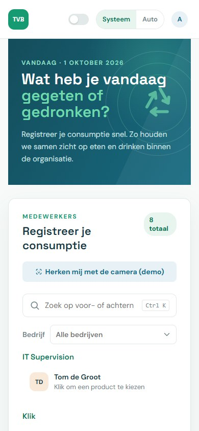

**Omschrijving.** De beginpagina op een telefoon van 390 pixels breed. In de bovenbalk vervallen de naam naast het logo, de status en de icoontjes naast de slider. De themaknoppen en de admin-knop (alleen de letter `A`) blijven staan. Banner, kaart en lijst staan onder elkaar over de volle breedte. De voorbeeldtekst in het zoekveld past niet helemaal en wordt afgekapt ("Zoek op voor- of achtern"). Ook de teller rechts naast de kop staat op twee regels ("8" en daaronder "totaal"), omdat de kop `Registreer je consumptie` de meeste breedte inneemt.

**UI-principes:**
- *Responsief ontwerp:* alles staat in één kolom. Er is geen horizontaal scrollen.
- *Witruimte en eenvoud:* minder belangrijke teksten in de bovenbalk zijn weggelaten zodat de knoppen passen.
- *Toegankelijkheid:* de knoppen en rijen blijven even groot als op de tablet.

**Nielsen-heuristieken:**
- *H4:* de onderdelen zien er hetzelfde uit als op de andere schermen.
- *H8:* op het kleine scherm is alleen het noodzakelijke overgebleven.
- *Beperking:* op 390 pixels breed zijn twee teksten te lang voor hun plek: de voorbeeldtekst in het zoekveld wordt afgekapt en de teller "8 totaal" breekt over twee regels. Alles blijft bruikbaar, maar het oogt minder netjes. De tegels met de totalen staan op een telefoon onder de lijst en vallen buiten deze screenshot.

#### W04 – Beginpagina in het donkere thema

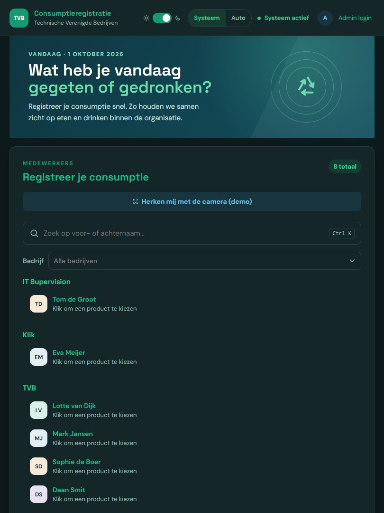

**Omschrijving.** De beginpagina op de tablet als het apparaat op donker staat. `Systeem` is gekozen, dus de website volgt het apparaat. De slider staat daarom naar de maan. De achtergrond en kaarten zijn donker, de huiskleuren blijven en koppen en namen krijgen een lichtere tint van het huisgroen, zodat ze goed leesbaar zijn.

**UI-principes:**
- *Kleur met betekenis:* groen blijft de kleur van koppen en acties, ook in het donker.
- *Toegankelijkheid:* de lichtere groene tekst geeft genoeg contrast op de donkere achtergrond.
- *Consistentie:* indeling en onderdelen zijn gelijk aan het lichte thema. Alleen de kleuren wisselen.

**Nielsen-heuristieken:**
- *H1:* de slider laat zien welk thema actief is.
- *H7:* de gebruiker kan het thema aan zichzelf aanpassen: het apparaat volgen (`Systeem`), vast licht of donker, of `Auto` (overdag licht, na zonsondergang donker).

#### W05 – Bedrijfsfilter geopend


**Omschrijving.** Het bedrijfsfilter is uitgeklapt. Het is een keuzelijst waarin je ook kunt typen. De lijst toont `Alle bedrijven` en alleen de bedrijven waar actieve medewerkers bij horen. Op dit moment is dat alleen TVB.

**UI-principes:**
- *Affordance:* het pijltje rechts laat zien dat het veld uitklapt.
- *Progressieve onthulling:* de bedrijven komen pas in beeld als het filter wordt geopend.
- *Visuele hiërarchie:* de uitklaplijst ligt met een schaduw boven de medewerkerslijst.

**Nielsen-heuristieken:**
- *H5:* er staan geen bedrijven zonder medewerkers in de lijst, dus kiezen leidt nooit tot een lege lijst.
- *H6:* de bedrijven staan uitgeschreven in de lijst en hoeven niet te worden onthouden.
- *H7:* door één bedrijf te kiezen (of de naam in het filter te typen) toont de medewerkerslijst alleen dat bedrijf. Hier heeft dat nog weinig zin, omdat alle medewerkers bij TVB horen, maar zodra medewerkers over meer van de 13 bedrijven verdeeld zijn, scheelt het zoeken en scrollen.

#### W06 – Zoeken zonder resultaat

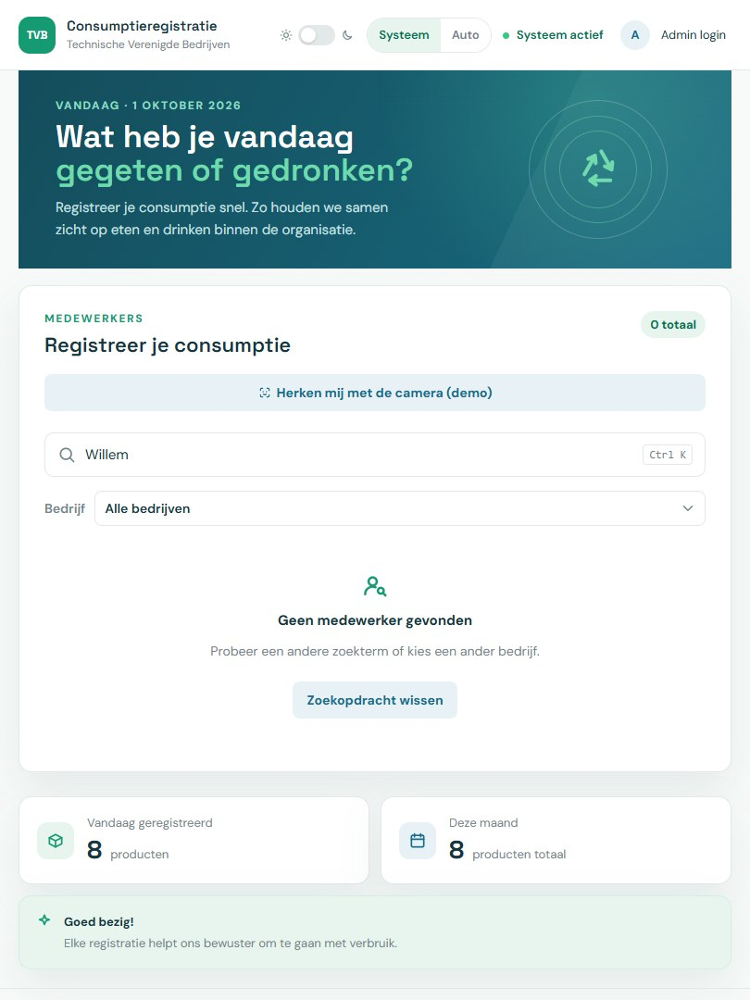

**Omschrijving.** Er is gezocht op "Willem", maar die medewerker bestaat niet. De teller springt naar `0 totaal` en in de kaart staat een lege toestand: een icoon, de tekst "Geen medewerker gevonden", de uitleg "Probeer een andere zoekterm of kies een ander bedrijf." en de knop `Zoekopdracht wissen`. Onder de kaart staan de totalen naast elkaar (8 producten vandaag, 8 deze maand) met daaronder de tipkaart.

**UI-principes:**
- *Feedback:* de teller en de lege toestand laten direct zien dat er niets is gevonden.
- *Affordance:* de knop `Zoekopdracht wissen` geeft één duidelijke vervolgstap.
- *Responsief ontwerp:* op de tablet staan de totalen in twee kolommen onder de lijst.

**Nielsen-heuristieken:**
- *H1:* `0 totaal` toont het resultaat van het zoeken.
- *H3:* met één knop is de zoekopdracht weg en staat de hele lijst er weer.
- *H9:* de melding zegt wat er aan de hand is en wat de gebruiker kan doen.
- *H10:* de uitleg in de lege toestand helpt verder zonder handleiding.

#### W07 – Productvenster, eerste keer

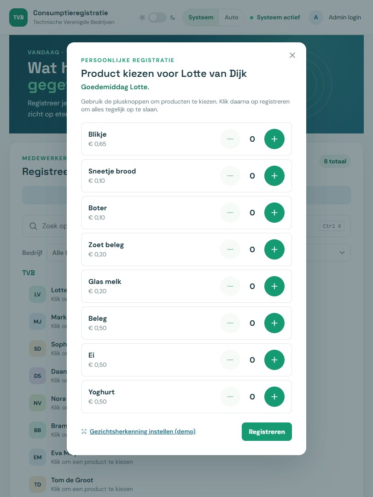

**Omschrijving.** Na een klik op Lotte van Dijk opent het productvenster. Bovenaan staan `Persoonlijke registratie`, `Product kiezen voor Lotte van Dijk` en een begroeting die bij het tijdstip past ("Goedemiddag Lotte."). Daaronder staat een korte uitleg en de lijst met producten van het consumptiepunt van Lotte, met de prijs. Per product is er een `−`-knop, het aantal en een `+`-knop. Omdat er nog niets is gekozen, staan alle aantallen op 0 en zijn de `−`-knoppen uitgeschakeld. Onderaan staan de link `Gezichtsherkenning instellen (demo)` en de knop `Registreren`. Het venster sluit met het kruisje, met een klik naast het venster of met de Escape-toets.

**UI-principes:**
- *Affordance:* de groene `+`-knoppen zijn opvallend. De uitgeschakelde `−`-knoppen zijn vaag.
- *Toegankelijkheid:* de `−`- en `+`-knoppen zijn 44 × 44 pixels, goed te raken op een aanraakscherm.
- *Consistentie:* iedere productrij heeft dezelfde opbouw: naam, prijs, `−`, aantal, `+`.
- *Visuele hiërarchie:* de naam van de medewerker staat groot bovenaan en de knop `Registreren` is de enige gevulde knop onderaan.
- *Progressieve onthulling:* de producten verschijnen pas na het kiezen van een naam.

**Nielsen-heuristieken:**
- *H2:* bekende productnamen en prijzen in euro. De begroeting voelt als een gesprek.
- *H3:* het venster is altijd te sluiten zonder iets op te slaan.
- *H5:* de `−`-knop werkt niet onder 0, er wordt pas opgeslagen na `Registreren` en een medewerker ziet alleen producten van het eigen punt.
- *H6:* alle producten staan in beeld. Niets hoeft te worden onthouden.
- *H9:* wie op `Registreren` drukt zonder keuze, krijgt de melding "Kies eerst minimaal één product".

#### W08 – Productvenster met een keuze

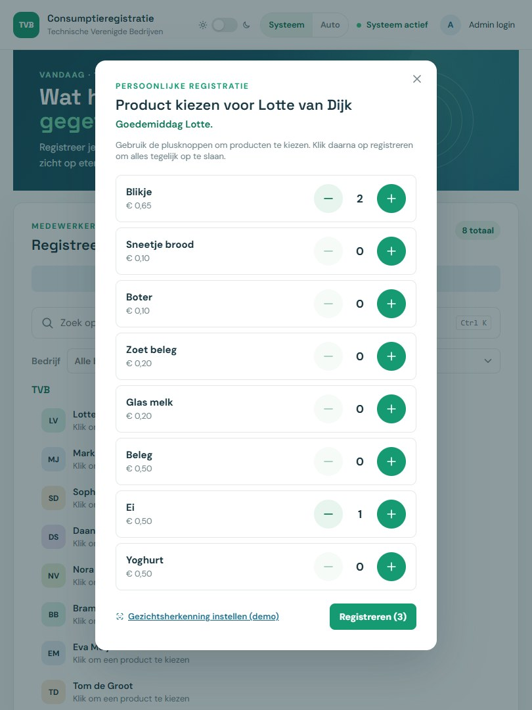

**Omschrijving.** Lotte heeft 2× Blikje en 1× Ei gekozen. Bij die producten is de `−`-knop nu actief en de knop onderaan toont het totaal: `Registreren (3)`. Er is nog niets opgeslagen.

**UI-principes:**
- *Feedback:* de aantallen en de tekst op de knop veranderen direct bij iedere tik.
- *Affordance:* de `−`-knop wordt pas actief als er iets te verlagen is.

**Nielsen-heuristieken:**
- *H1:* `Registreren (3)` laat zien hoeveel producten worden opgeslagen.
- *H3:* een verkeerde tik is met `−` direct te herstellen, vóór het opslaan.
- *H5:* de gebruiker ziet de hele keuze voordat die wordt opgeslagen.

#### W09 – Bevestiging na registreren

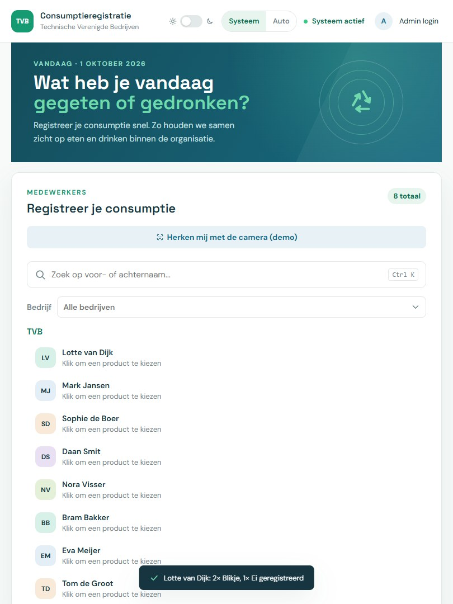

**Omschrijving.** Na `Registreren` sluit het productvenster en verschijnt onderaan in het midden een melding met een vinkje: "Lotte van Dijk: 2× Blikje, 1× Ei geregistreerd". De melding blijft 4 seconden staan. De lijst is direct weer klaar voor de volgende medewerker.

**UI-principes:**
- *Feedback:* de melding bevestigt wat er is opgeslagen.
- *Toegankelijkheid:* het vinkje toont dat het gelukt is. Bij een fout heeft de melding dezelfde donkere achtergrond maar een ander icoon: een uitroepteken in een cirkel (zie W34). Het verschil zit dus in de vorm van het icoon en niet alleen in kleur.
- *Witruimte en eenvoud:* de melding bedekt de lijst nauwelijks en verdwijnt vanzelf.

**Nielsen-heuristieken:**
- *H1:* de melding noemt de naam en de producten, zodat op een gedeelde tablet duidelijk is wat er voor wie is opgeslagen.
- *H2:* de melding is één zin in gewone taal.

#### W10 – Productvenster met "Zelfde als vorige keer"

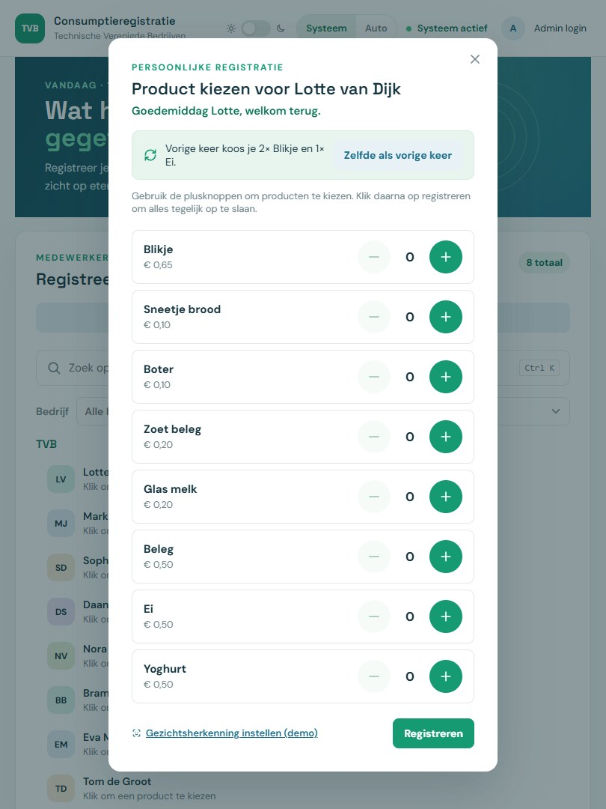

**Omschrijving.** Lotte opent het productvenster opnieuw. De begroeting is nu "Goedemiddag Lotte, welkom terug." Daaronder staat een groen vak met een icoon: "Vorige keer koos je 2× Blikje en 1× Ei." met de knop `Zelfde als vorige keer`. Die knop vult de aantallen in. Opslaan gebeurt pas met `Registreren`. Het voorstel bestaat uit de laatste registratie en alles wat binnen 60 seconden daarvoor is geregistreerd, en bevat alleen producten die het punt nu aanbiedt. Correcties van de beheerder tellen niet mee.

**UI-principes:**
- *Visuele hiërarchie:* het voorstel staat boven de productlijst en valt op door de lichtgroene achtergrond.
- *Groeperen:* het voorstel en de knop staan samen in één vak.
- *Feedback:* de begroeting laat zien dat het systeem de medewerker herkent als terugkerende gebruiker.

**Nielsen-heuristieken:**
- *H6:* de medewerker hoeft niet te onthouden wat er vorige keer is gekozen.
- *H7:* met één tik is een vaste keuze ingevuld. Een sneltoets voor wie vaak hetzelfde neemt.
- *H3:* na het invullen kunnen de aantallen nog worden aangepast voordat er iets wordt opgeslagen.

#### W11 – Productvenster zonder producten

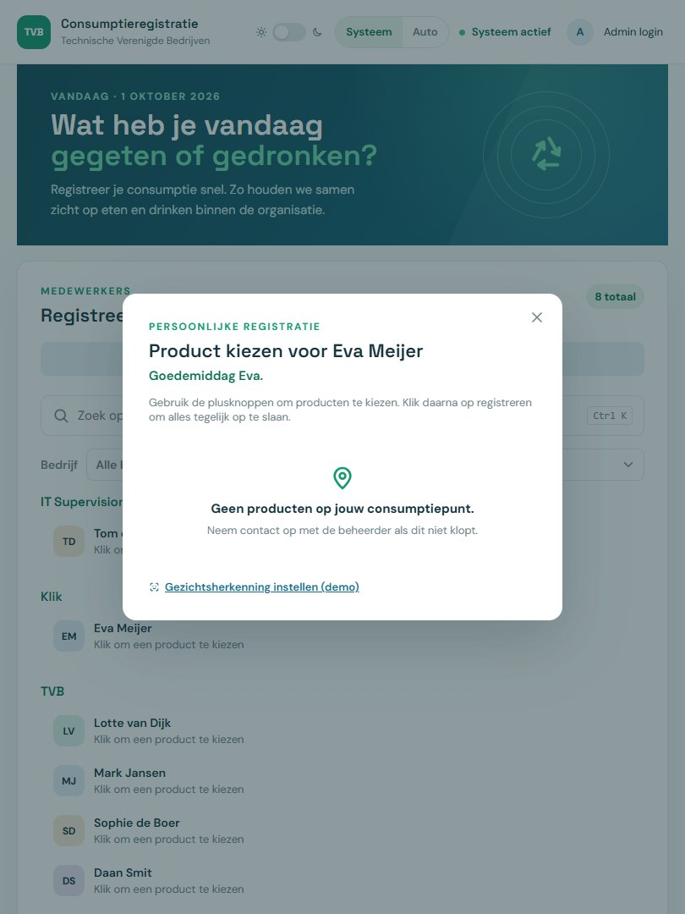

**Omschrijving.** Eva Meijer hoort bij Kantine Klik, waar nog geen producten zijn aangezet. In het productvenster staat daarom een lege toestand met een locatie-icoon: "Geen producten op jouw consumptiepunt." en "Neem contact op met de beheerder als dit niet klopt." De knop `Registreren` is weggelaten.

**UI-principes:**
- *Feedback:* in plaats van een leeg venster staat er een uitleg.
- *Witruimte en eenvoud:* knoppen die niets kunnen doen, zijn weggelaten.
- *Consistentie:* de lege toestand heeft dezelfde vorm als in W06, W20 en W32 (icoon, titel, uitleg).

**Nielsen-heuristieken:**
- *H5:* zonder producten is er geen knop om iets te registreren.
- *H9:* de melding zegt wat er aan de hand is en wat de medewerker kan doen.
- *H10:* de medewerker weet bij wie die terecht kan.

#### W12 – Gezichtsherkenning instellen (demo)

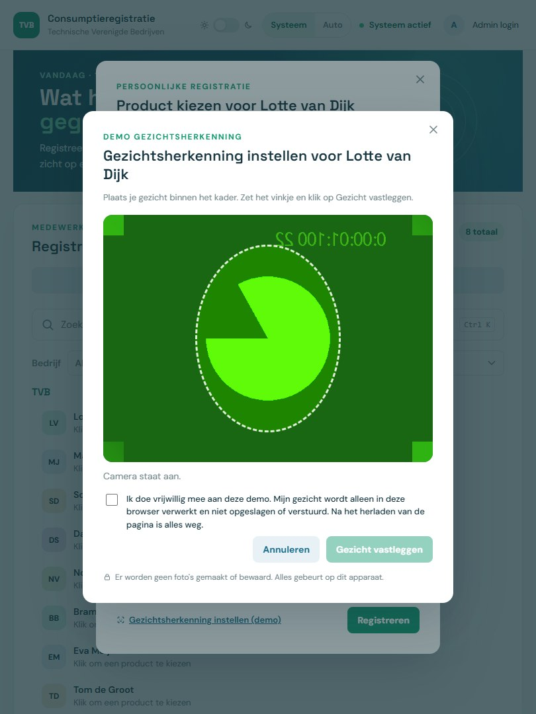

**Omschrijving.** Via de link `Gezichtsherkenning instellen (demo)` in het productvenster opent dit venster bovenop het productvenster. De titel is `Gezichtsherkenning instellen voor Lotte van Dijk`, met de uitleg "Plaats je gezicht binnen het kader. Zet het vinkje en klik op Gezicht vastleggen." In het camerabeeld (hier het testbeeld van de browser) staat een ovaal kader. Onder het beeld staat de status `Camera staat aan.` en een vinkje voor toestemming: "Ik doe vrijwillig mee aan deze demo. Mijn gezicht wordt alleen in deze browser verwerkt en niet opgeslagen of verstuurd. Na het herladen van de pagina is alles weg." De knop `Gezicht vastleggen` is uitgeschakeld tot het vinkje is gezet. Onderaan staat met een slotje: "Er worden geen foto's gemaakt of bewaard. Alles gebeurt op dit apparaat." Zie ook de paragraaf over privacy in hoofdstuk 13.

**UI-principes:**
- *Affordance:* de uitgeschakelde knop is vaag en wordt pas groen na toestemming.
- *Visuele hiërarchie:* het camerabeeld met het kader neemt de meeste ruimte in, omdat de gebruiker daar moet kijken.
- *Feedback:* de status onder het beeld laat zien wat de camera doet.

**Nielsen-heuristieken:**
- *H1:* de status (`Camera staat aan.`) laat zien wat er gebeurt.
- *H3:* de camera start alleen als de medewerker daar zelf voor kiest, en `Annuleren` en het kruisje stoppen de camera en sluiten het venster. Zo houdt de medewerker zelf de controle over het eigen gezicht (privacy).
- *H5:* zonder vinkje kan er niets worden vastgelegd.
- *H10:* de toestemmingstekst en de privacyregel leggen uit wat er met het beeld gebeurt.

#### W13 – Herken mij met de camera (demo)

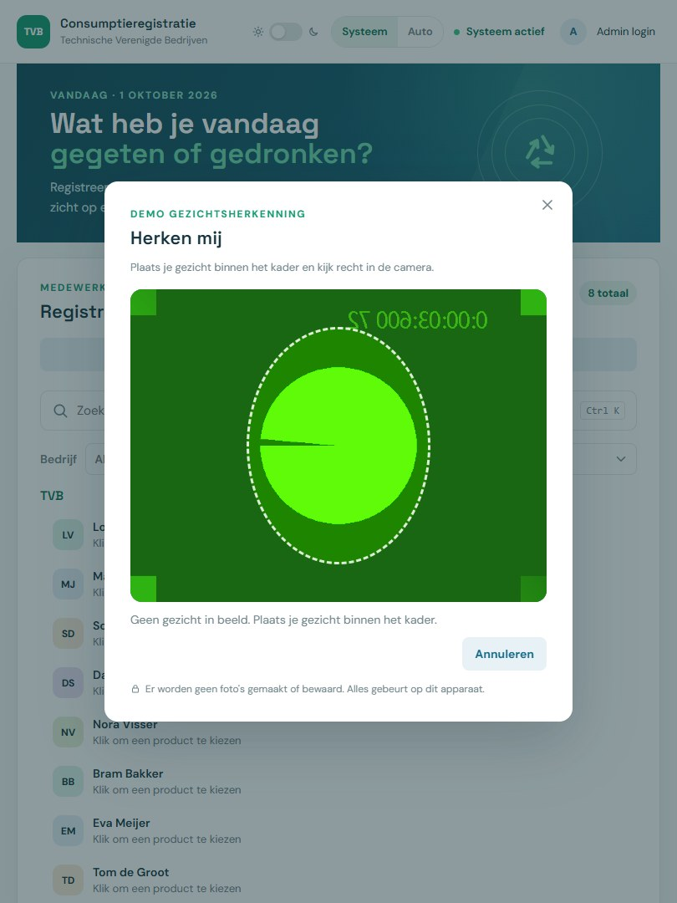

**Omschrijving.** Na een klik op `Herken mij met de camera (demo)` op de beginpagina opent dit venster: `Herken mij`, met de uitleg "Plaats je gezicht binnen het kader en kijk recht in de camera." De status is hier "Geen gezicht in beeld. Plaats je gezicht binnen het kader." Andere statussen zijn "Gezicht gevonden, maar niet herkend. Blijf rustig in het kader kijken." en "Bijna herkend. Blijf even rustig in het kader kijken." Pas als dezelfde actieve medewerker twee keer achter elkaar wordt herkend, telt het. Lukt het na 20 seconden niet, dan staat er "Niet herkend. Sluit dit venster en kies je naam in de lijst." Is er nog niemand ingesteld, dan opent het venster niet en verschijnt een melding.

**UI-principes:**
- *Feedback:* de status verandert terwijl de camera zoekt.
- *Consistentie:* dit venster lijkt op W12 (zelfde kader, status en privacyregel).
- *Witruimte en eenvoud:* er is maar één knop (`Annuleren`). Herkennen gaat vanzelf.

**Nielsen-heuristieken:**
- *H1:* de status vertelt steeds wat het systeem ziet.
- *H3:* `Annuleren` en het kruisje stoppen de camera. De lijst met namen blijft altijd een alternatief.
- *H5:* twee keer achter elkaar dezelfde uitkomst voorkomt dat de verkeerde persoon wordt gekozen.
- *H9:* bij niet herkennen staat erbij wat de gebruiker dan moet doen.

#### W14 – Herkend met de camera (demo)

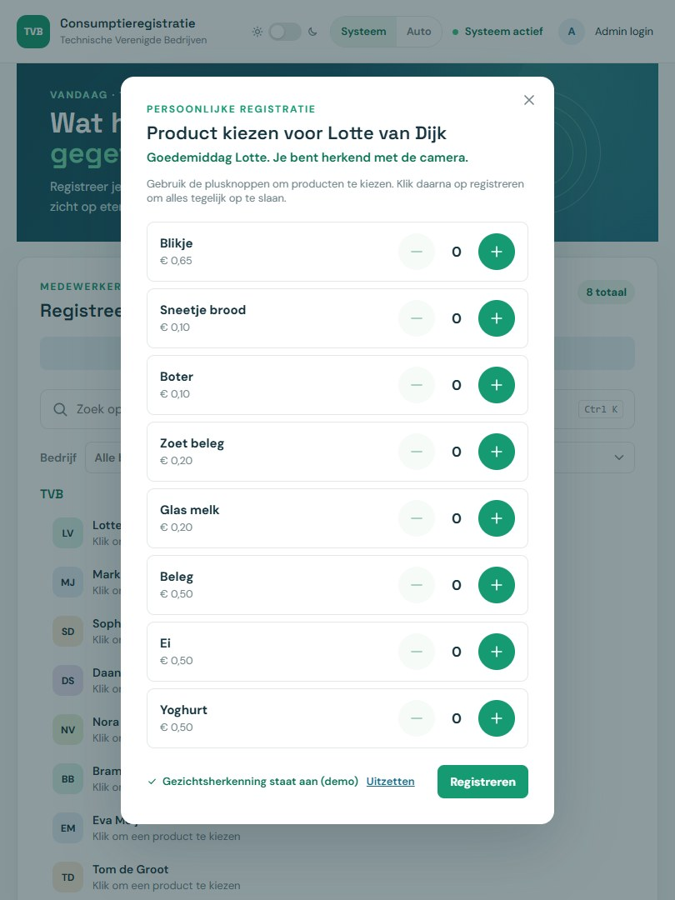

**Omschrijving.** Lotte is herkend. Het cameravenster sluit vanzelf en het productvenster van Lotte opent met de begroeting "Goedemiddag Lotte. Je bent herkend met de camera." Onderaan staat met een vinkje "Gezichtsherkenning staat aan (demo)" en de link `Uitzetten`. Verder werkt het venster hetzelfde als in W07.

**UI-principes:**
- *Feedback:* de begroeting zegt dat de camera de medewerker heeft herkend.
- *Consistentie:* na herkennen ziet het productvenster eruit zoals altijd.

**Nielsen-heuristieken:**
- *H1:* de medewerker ziet dat herkennen is gelukt en dat de functie aan staat.
- *H3:* met `Uitzetten` wordt het gezicht direct vergeten. Is de verkeerde naam gekozen, dan sluit het kruisje het venster zonder iets op te slaan.
- *H5:* de naam staat groot bovenaan, zodat een verkeerde herkenning opvalt vóór het registreren.

#### W35 – Camera zonder toegang (demo)

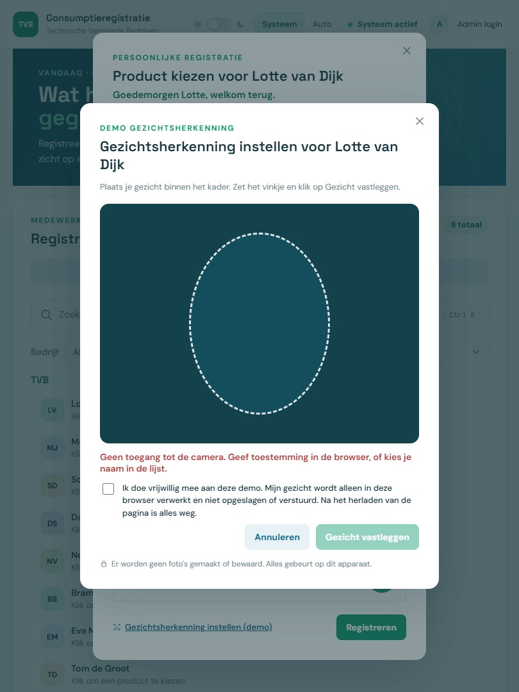

**Omschrijving.** Lotte van Dijk heeft in het productvenster op `Gezichtsherkenning instellen (demo)` geklikt, maar de browser geeft geen toegang tot de camera (de toestemming is geweigerd). Het venster `Gezichtsherkenning instellen voor Lotte van Dijk` is wel open, maar het camerabeeld is een leeg donker vlak met alleen het gestippelde ovale kader. Onder het beeld staat in rood: "Geen toegang tot de camera. Geef toestemming in de browser, of kies je naam in de lijst." Het vinkje voor toestemming staat er nog, maar de knop `Gezicht vastleggen` blijft uitgeschakeld (lichtgroen), omdat er geen camerabeeld is. Daaronder staan `Annuleren` en de privacyregel. Achter het venster is het productvenster te zien met "Goedemorgen Lotte, welkom terug." Dezelfde melding verschijnt in het venster `Herken mij` (W13), want beide vensters starten de camera op dezelfde manier. Als het starten mislukt, zet de website de camera ook meteen weer uit.

**UI-principes:**
- *Feedback:* de fout staat op dezelfde plek als de gewone status (`Camera staat aan.` in W12), nu in rood.
- *Affordance:* `Gezicht vastleggen` blijft vaag en werkt niet, omdat er niets vast te leggen is.
- *Consistentie:* het venster is verder gelijk aan W12. Alleen de status en het camerabeeld verschillen.

**Nielsen-heuristieken:**
- *H1:* de medewerker ziet direct dat de camera niet werkt, in plaats van een leeg beeld zonder uitleg.
- *H9:* de melding zegt wat er mis is en geeft twee oplossingen: toestemming geven in de browser, of de eigen naam in de lijst kiezen.
- *H3:* `Annuleren` en het kruisje sluiten het venster. De lijst met namen blijft altijd een andere weg.
- *H5:* zonder camerabeeld kan er niets worden vastgelegd.

#### W15 – Waarschuwing bij openen als los bestand

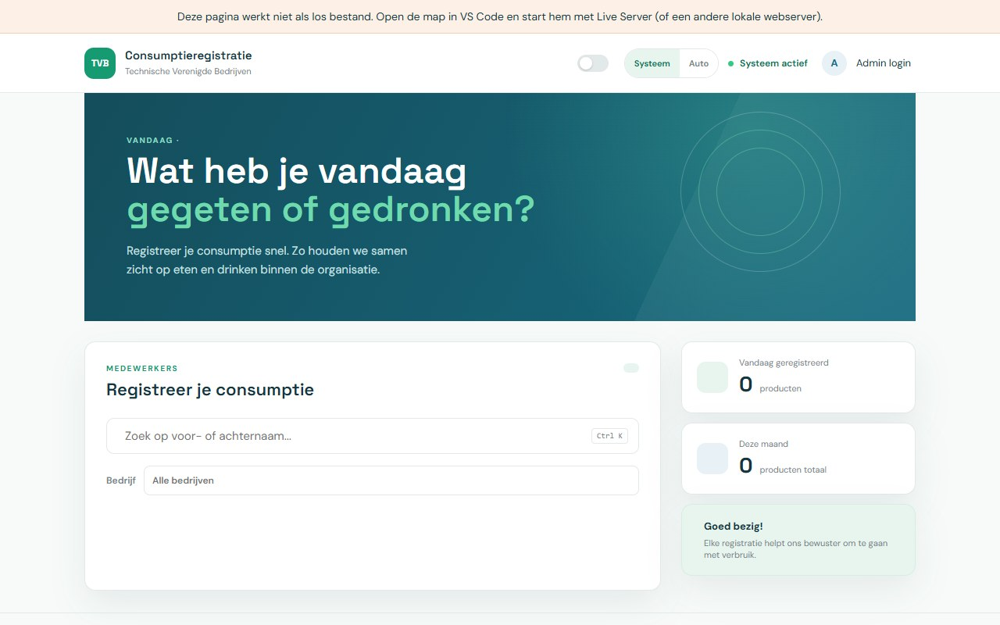

**Omschrijving.** Wie `index.html` dubbelklikt (adres begint met `file://`), krijgt de website zonder werkende JavaScript, omdat browsers ES-modules niet laden vanaf een los bestand. Bovenaan staat dan een lichtoranje balk: "Deze pagina werkt niet als los bestand. Open de map in VS Code en start hem met Live Server (of een andere lokale webserver)." Op de rest van de pagina is te zien dat de website niet werkt: geen datum, geen medewerkers, totalen op 0 en geen iconen.

**UI-principes:**
- *Kleur met betekenis:* de lichtoranje balk valt op boven de rest.
- *Visuele hiërarchie:* de melding staat helemaal bovenaan, vóór alle andere inhoud.

**Nielsen-heuristieken:**
- *H1:* het is direct duidelijk dat de pagina niet goed is gestart.
- *H9:* de melding zegt wat er mis is en hoe het op te lossen is.
- *H10:* de oplossing (Live Server) staat erbij.

#### W36 – Melding bij beschadigde opgeslagen gegevens

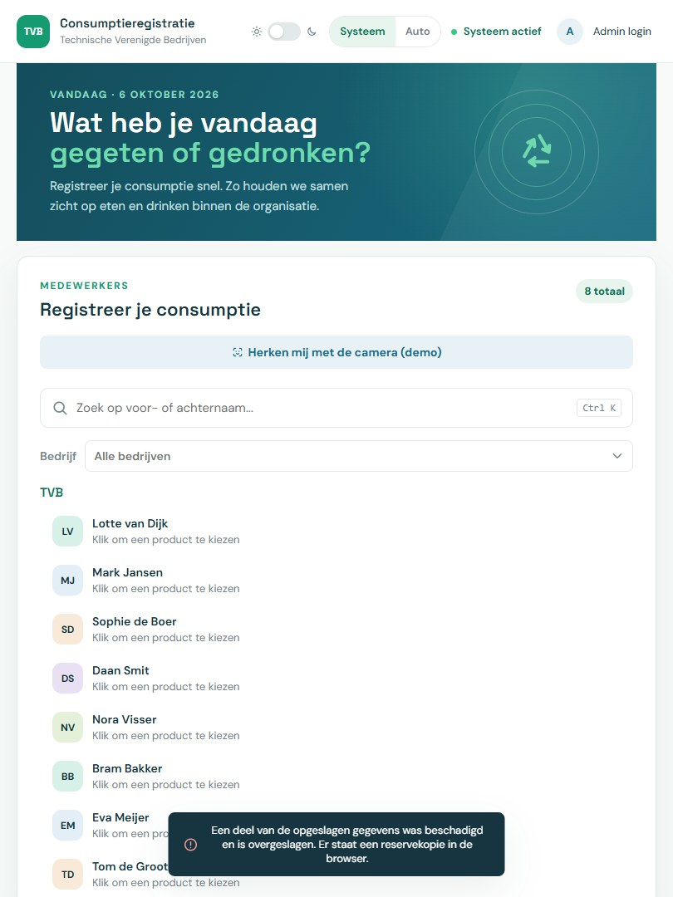

**Omschrijving.** De beginpagina op de tablet direct na het laden, terwijl er in de opslag van de browser een registratie met een kapotte datum stond. De website slaat die ene registratie over, laadt de rest gewoon en bewaart de oorspronkelijke gegevens als reservekopie in de browser. Onderaan in het midden staat een melding met een uitroepteken in een cirkel: "Een deel van de opgeslagen gegevens was beschadigd en is overgeslagen. Er staat een reservekopie in de browser." Deze melding blijft 8 seconden staan, langer dan een gewone melding. De rest van de pagina is normaal: de datum (`Vandaag · 6 oktober 2026`), `8 totaal` en de medewerkers onder TVB. Zijn de gegevens helemaal onleesbaar, dan start de demo opnieuw met de melding "De opgeslagen gegevens waren onleesbaar. De demo is opnieuw gestart. Er staat een reservekopie in de browser."

**UI-principes:**
- *Feedback:* de gebruiker merkt dat er iets mis was met de opgeslagen gegevens, ook al werkt de pagina gewoon.
- *Consistentie:* de melding staat op dezelfde plek en heeft dezelfde vorm als de andere meldingen (W09 en W34).
- *Toegankelijkheid:* het uitroepteken laat zien dat het om een probleem gaat. Het verschil met een succesmelding zit niet alleen in kleur.

**Nielsen-heuristieken:**
- *H1:* de gebruiker weet dat er gegevens zijn overgeslagen.
- *H9:* de melding zegt in gewone taal wat er is gebeurd en dat er een reservekopie is. Een beperking: de melding zegt niet welke gegevens zijn overgeslagen.
- *H5:* één kapotte regel laat de website niet vastlopen, en de oorspronkelijke gegevens blijven als reservekopie bewaard, zodat er niets ongemerkt verloren gaat.

#### W16 – Inloggen als beheerder

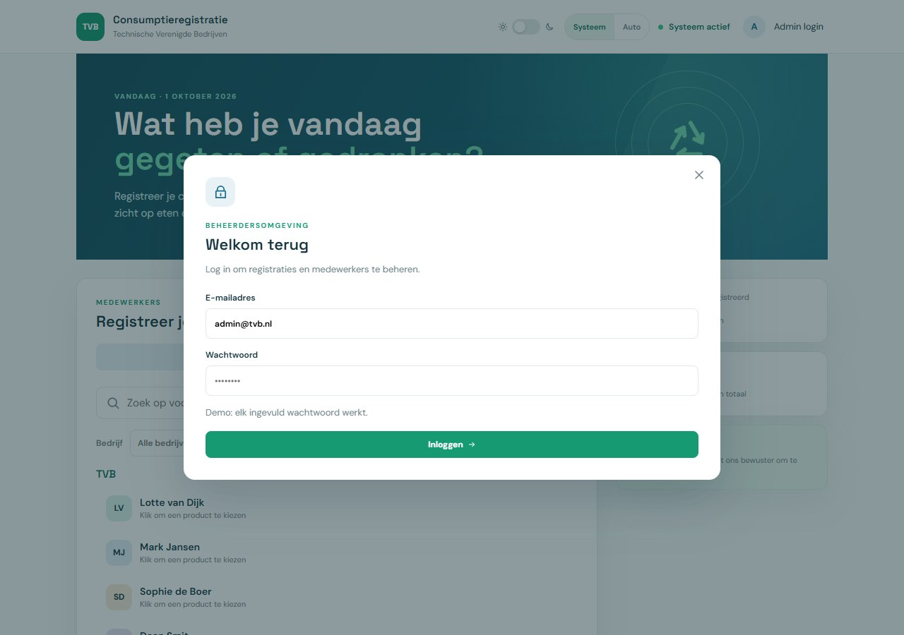

**Omschrijving.** Na `Admin login` opent het loginvenster met een slot-icoon, `Beheerdersomgeving`, de titel `Welkom terug` en "Log in om registraties en medewerkers te beheren." Het e-mailadres staat al ingevuld (`admin@tvb.nl`). Het wachtwoordveld is leeg (de puntjes zijn voorbeeldtekst). Onder het wachtwoord staat "Demo: elk ingevuld wachtwoord werkt." en daaronder de knop `Inloggen` met een pijl.

**UI-principes:**
- *Consistentie:* labels staan boven de velden, net als in alle andere formulieren.
- *Visuele hiërarchie:* `Inloggen` is de enige grote groene knop.
- *Witruimte en eenvoud:* alleen e-mailadres, wachtwoord en één knop.

**Nielsen-heuristieken:**
- *H4:* een standaard loginformulier met de gebruikelijke velden en volgorde.
- *H10:* de hint legt uit hoe inloggen in de demo werkt.
- *H3:* het kruisje, een klik naast het venster of de Escape-toets sluit het zonder in te loggen.

#### W17 – Inloggen met een foutmelding

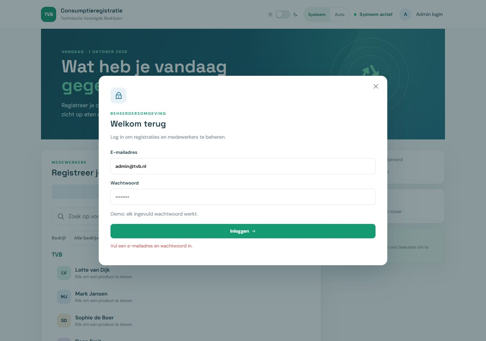

**Omschrijving.** Er is op `Inloggen` geklikt zonder wachtwoord. Onder de knop staat in rood: "Vul een e-mailadres en wachtwoord in." Het venster blijft open.

**UI-principes:**
- *Feedback:* de fout wordt in het venster zelf getoond, onder de knop.
- *Kleur met betekenis:* rood voor een fout.

**Nielsen-heuristieken:**
- *H9:* de melding zegt in gewone taal wat er moet gebeuren. Een beperking: de melding staat onder de knop en niet bij het veld, en zegt niet welk veld ontbreekt (hier het wachtwoord). Het veld krijgt ook geen rode rand, anders dan in de andere formulieren (W23).
- *H1:* de gebruiker ziet meteen waarom er niets gebeurt.

#### W18 – Beheer: Registraties

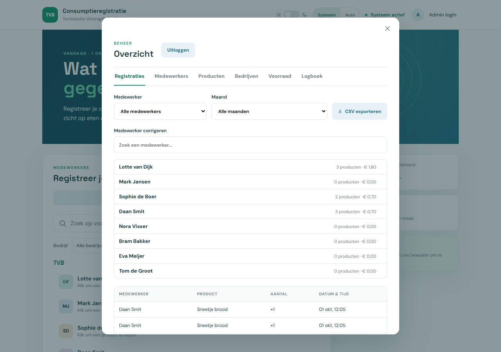

**Omschrijving.** Na inloggen opent het beheer (`Beheer` / `Overzicht`) met de knop `Uitloggen` en zes tabbladen: Registraties, Medewerkers, Producten, Bedrijven, Voorraad en Logboek. Het actieve tabblad is groen en onderstreept. Op `Registraties` staan de filters `Medewerker` en `Maand` en de knop `CSV exporteren`. Onder `Medewerker corrigeren` staan een zoekveld, het datumveld `Datum bij toevoegen (+)` (standaard vandaag: 02-10-2026) en per medewerker het aantal producten en het bedrag (bijvoorbeeld Lotte van Dijk: 3 producten · € 1,80). Daaronder staat de tabel met Medewerker, Product, Aantal en Datum & tijd, met de nieuwste registratie bovenaan (in de screenshot staan alleen de kolomkoppen net boven de rand).

**UI-principes:**
- *Groeperen:* filters en export staan samen boven de lijst. Correcties en de tabel zijn aparte blokken.
- *Consistentie:* dezelfde knoppen, velden en kleuren als op de medewerkerskant.
- *Visuele hiërarchie:* het actieve tabblad valt op door kleur en onderstreping.
- *Uitlijning:* de kolommen van de tabel en de bedragen staan recht onder elkaar.

**Nielsen-heuristieken:**
- *H1:* het actieve tabblad en de totalen per medewerker laten de stand zien.
- *H4:* tabbladen en tabellen werken zoals de gebruiker gewend is.
- *H6:* medewerkers en maanden worden uit een lijst gekozen.
- *H7:* filteren en zoeken maken een lange lijst snel kleiner. De export gebruikt dezelfde filters.
- *H5:* het datumveld staat al op vandaag. De kalender van het veld biedt geen datum na vandaag aan, en een ingetypte datum na vandaag wordt geweigerd met een melding bij het veld (zie W37).

#### W19 – Beheer: registratie corrigeren

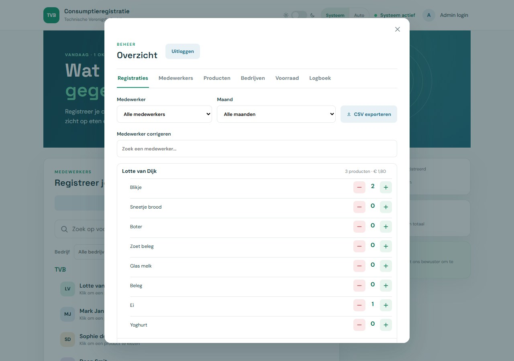

**Omschrijving.** De rij van Lotte van Dijk is opengeklapt. Per product staan een rode `−`-knop, het aantal (Blikje 2, Ei 1, de rest 0) en een groene `+`-knop. `−` verwijdert de laatste registratie van dat product, `+` voegt er één toe op de datum uit `Datum bij toevoegen (+)`. Valt die datum in een eerdere maand, dan vraagt de browser eerst "Deze registratie komt in … Die loonmaand is mogelijk al verwerkt. Toch toevoegen?". Is bij `−` de laatste registratie uit een andere maand dan de huidige, dan vraagt de browser eerst "Deze registratie is van … Die loonmaand is mogelijk al verwerkt. Toch verwijderen?" (met de naam van de maand). Iedere correctie geeft een melding en komt in het logboek. De correctie en de logboekregel worden in één keer opgeslagen.

**UI-principes:**
- *Progressieve onthulling:* de producten van een medewerker zijn pas zichtbaar na openklappen.
- *Kleur met betekenis:* rood voor verlagen, groen voor verhogen.
- *Consistentie:* dezelfde volgorde `−` / aantal / `+` als in het productvenster (W07). De knoppen hebben wel een andere vorm: hier kleine vierkante knoppen met afgeronde hoeken en een lichtrode of lichtgroene achtergrond, in het productvenster ronde knoppen.

**Nielsen-heuristieken:**
- *H3:* een verkeerde registratie is door de beheerder terug te draaien.
- *H1:* het aantal per product is direct zichtbaar en verandert na iedere klik.
- *H5:* een correctie in een oude maand vraagt eerst om bevestiging, omdat die loonmaand al verwerkt kan zijn.

#### W37 – Beheer: correctiedatum met foutmelding

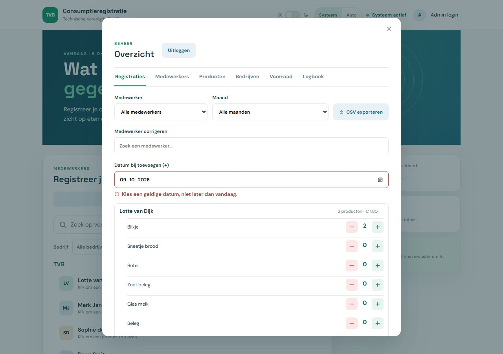

**Omschrijving.** In het veld `Datum bij toevoegen (+)` is een datum na vandaag ingetypt (09-10-2026, terwijl het 6 oktober is) en daarna is bij Lotte van Dijk op `+` naast Blikje geklikt. In de kalender van het veld kan geen datum na vandaag worden gekozen, maar intypen kan wel. Daarom controleert de website de datum ook zelf. Het veld krijgt een rode rand en eronder staat met een waarschuwingsteken: "Kies een geldige datum, niet later dan vandaag." De focus springt naar het datumveld. Er is niets opgeslagen: bij Blikje staat nog steeds 2. Dezelfde melding verschijnt bij een datum die niet bestaat of van vóór 2000 is. Zodra de beheerder de datum verandert, verdwijnt de melding.

**UI-principes:**
- *Feedback:* de fout staat direct onder het veld waar hij bij hoort, niet bij de knop waarop is geklikt.
- *Consistentie:* dezelfde foutweergave (rode rand, icoon, tekst onder het veld) als in W23 en W27.
- *Kleur met betekenis:* rood voor de fout, samen met een icoon en tekst.

**Nielsen-heuristieken:**
- *H5:* de kalender staat geen datum na vandaag toe, en een ingetypte datum na vandaag wordt niet opgeslagen. Zo komt er geen registratie in de toekomst.
- *H9:* de melding zegt wat er moet gebeuren: een geldige datum kiezen, niet later dan vandaag.
- *H1:* het aantal bij Blikje is niet veranderd, dus de beheerder ziet dat er niets is toegevoegd.

#### W20 – Beheer: filter zonder registraties

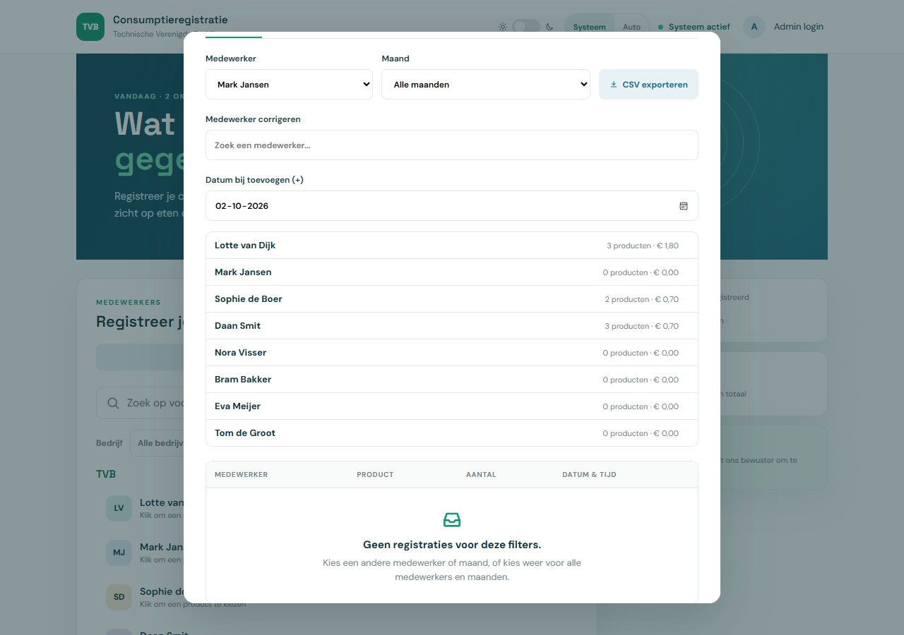

**Omschrijving.** Bij het filter `Mark Jansen` zijn er geen registraties. In de tabel staat een lege toestand met een icoon en "Geen registraties voor deze filters.", gevolgd door de uitleg "Kies een andere medewerker of maand, of kies weer voor alle medewerkers en maanden." Voor deze screenshot is het venster naar beneden gescrold, zodat de lege toestand helemaal zichtbaar is. Met dit filter geeft `CSV exporteren` de melding "Geen registraties om te exporteren voor deze filters."

**UI-principes:**
- *Feedback:* een lege tabel krijgt een uitleg in plaats van alleen kolomkoppen.
- *Consistentie:* zelfde opbouw van de lege toestand als in W06.

**Nielsen-heuristieken:**
- *H1:* het filter staat zichtbaar ingesteld, zodat duidelijk is waarom de tabel leeg is.
- *H9:* de uitleg zegt hoe de gebruiker weer resultaten krijgt.
- *H5:* er wordt geen leeg CSV-bestand gemaakt.

#### W21 – Beheer: Medewerkers


**Omschrijving.** Het tabblad `Medewerkers` met de knop `Medewerker toevoegen`, een zoekveld ("Medewerker zoeken, wijzigen of activeren") en de lijst. Per medewerker staan de naam en een regel met status, bedrijf, consumptiepunt en personeelsnummer (bijvoorbeeld "Actief · TVB · Hoofdkantoor · Geen personeelsnummer"), met de knoppen `Deactiveren` en `Wijzigen`. De knop `Verwijderen` verschijnt alleen bij een inactieve medewerker zonder registraties en vraagt dan eerst om bevestiging (zie W38). Sinds versie 3.6 staat bij een medewerker met een gekoppelde pas het label "Pas gekoppeld" achter de naam. Het pasnummer zelf staat niet in de lijst. Dit label staat nog niet in de screenshot.

**UI-principes:**
- *Groeperen:* alle gegevens van één medewerker staan in één rij, de acties rechts.
- *Visuele hiërarchie:* de naam is vet, de details eronder kleiner en grijs.
- *Consistentie:* iedere rij heeft dezelfde knoppen op dezelfde plek.

**Nielsen-heuristieken:**
- *H1:* de status (`Actief`) staat bij iedere medewerker.
- *H5:* een actieve medewerker kan niet direct worden verwijderd. Eerst deactiveren, dan verwijderen met bevestiging. Een medewerker met registraties kan helemaal niet worden verwijderd, zodat de CSV-export altijd een naam en looncode heeft.
- *H3:* deactiveren is met `Activeren` terug te draaien.

#### W38 – Beheer: inactieve medewerkers

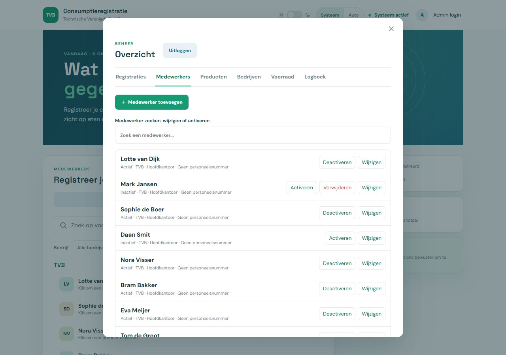

**Omschrijving.** Het tabblad `Medewerkers` nadat Mark Jansen en Daan Smit met `Deactiveren` op inactief zijn gezet. Bij beiden staat nu "Inactief · TVB · Hoofdkantoor · Geen personeelsnummer" en de knop `Activeren` in plaats van `Deactiveren`. Alleen bij Mark Jansen staat ook de rode knop `Verwijderen`, want er zijn geen registraties van Mark. Daan Smit heeft wel registraties (2× Sneetje brood en 1× Beleg) en kan daarom niet worden verwijderd. Op de pagina achter het venster staan Mark en Daan niet meer in de lijst met medewerkers: een inactieve medewerker kan niet registreren. `Verwijderen` vraagt eerst "Mark Jansen definitief verwijderen? Dit kan niet ongedaan worden gemaakt." Deactiveren en activeren vragen geen bevestiging, omdat ze altijd terug te draaien zijn.

**UI-principes:**
- *Feedback:* de status in de rij (`Inactief`) en de knop (`Activeren`) veranderen direct.
- *Kleur met betekenis:* alleen de knop die iets definitief weghaalt, heeft rode tekst.
- *Consistentie:* de knoppen staan op dezelfde plek als bij actieve medewerkers. Alleen `Verwijderen` komt erbij.

**Nielsen-heuristieken:**
- *H5:* `Verwijderen` verschijnt alleen bij een inactieve medewerker zonder registraties, en vraagt dan nog om bevestiging. Een medewerker met registraties blijft bewaard, zodat de CSV-export altijd een naam en looncode heeft.
- *H3:* deactiveren is met `Activeren` terug te draaien.
- *H1:* bij iedere medewerker staat of die actief of inactief is.

#### W22 – Medewerker toevoegen

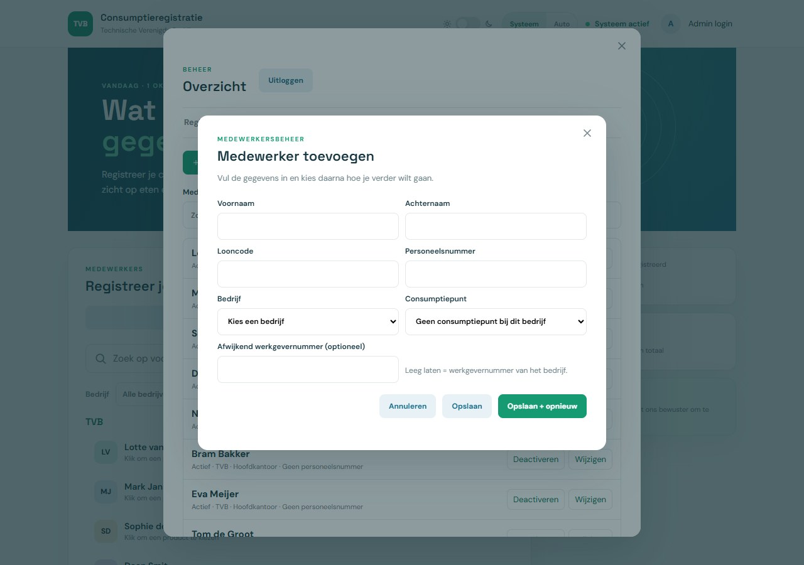

**Omschrijving.** Het formulier `Medewerker toevoegen` (boven het beheer) met de velden Voornaam, Achternaam, Looncode, Personeelsnummer, Bedrijf, Consumptiepunt en `Afwijkend werkgevernummer (optioneel)`. Naast dat laatste veld staat "Leeg laten = werkgevernummer van het bedrijf." De keuzelijst Consumptiepunt toont alleen de punten van het gekozen bedrijf. Zonder bedrijf staat er "Geen consumptiepunt bij dit bedrijf". Onderaan staan `Annuleren`, `Opslaan` en `Opslaan + opnieuw`.

Sinds versie 3.6 heeft het formulier ook het optionele veld "Pasnummer" (`#newEmployeeBadgeId`), met de hint "Klik in dit veld en houd de pas tegen de lezer. Leeg laten = geen pas." Dit veld staat nog niet in de screenshot (ook niet in W23 en W24). Met de pasjeslezer typt de lezer het pasnummer in het veld. Enter in dit veld verstuurt het formulier niet, zodat de Enter van de lezer niet per ongeluk opslaat (FR-66).

**UI-principes:**
- *Uitlijning:* de velden staan in twee nette kolommen.
- *Groeperen:* naam, nummers en koppeling met bedrijf en punt staan per paar naast elkaar.
- *Toegankelijkheid:* ieder veld heeft een label boven het veld.
- *Visuele hiërarchie:* `Opslaan + opnieuw` is de groene hoofdknop.

**Nielsen-heuristieken:**
- *H5:* bedrijf en consumptiepunt worden gekozen uit een lijst, dus een tikfout is niet mogelijk en een punt van een ander bedrijf kan niet. Looncode, personeelsnummer en werkgevernummer mogen alleen cijfers bevatten. Anders verschijnt "Gebruik alleen cijfers." bij het veld. Een personeelsnummer dat een andere medewerker al heeft, wordt geweigerd ("Er is al een medewerker met dit personeelsnummer.").
- *H7:* met `Opslaan + opnieuw` voegt de beheerder snel meerdere medewerkers achter elkaar toe.
- *H10:* de hint bij het werkgevernummer legt uit wat leeg laten betekent.
- *H3:* `Annuleren` en het kruisje sluiten het formulier zonder op te slaan.

#### W23 – Medewerker toevoegen met foutmeldingen

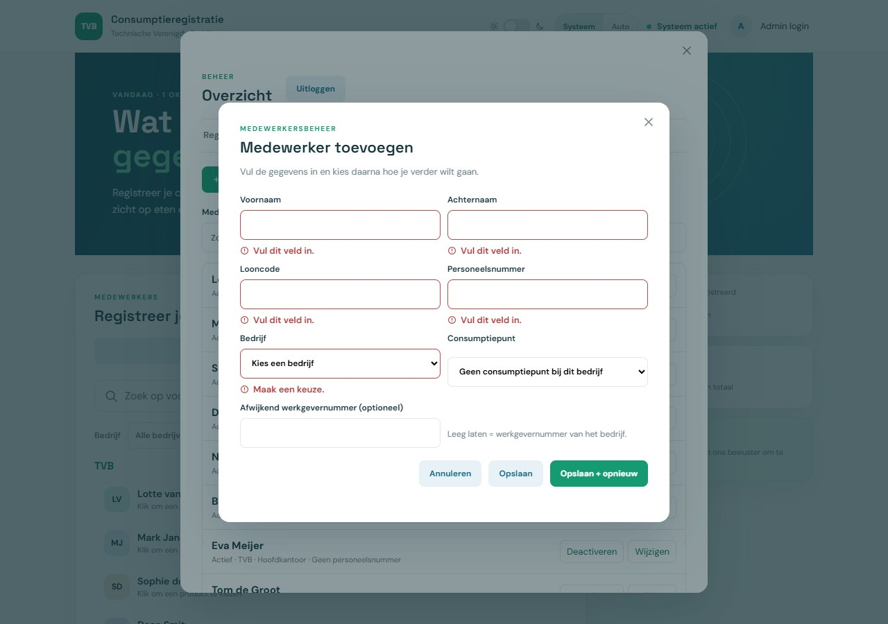

**Omschrijving.** Het formulier is leeg opgeslagen. De verplichte velden hebben een rode rand en eronder staat met een waarschuwingsteken "Vul dit veld in." of, bij Bedrijf, "Maak een keuze." Het eerste foute veld krijgt de focus. Zodra de gebruiker een veld aanpast, verdwijnt de melding bij dat veld. Het optionele veld en Consumptiepunt krijgen geen melding: er is nog geen bedrijf gekozen. Consumptiepunt wordt pas verplicht als het gekozen bedrijf consumptiepunten heeft. Dan staat er "Maak een keuze." als het leeg is.

**UI-principes:**
- *Feedback:* iedere fout staat direct onder het veld waar hij bij hoort.
- *Kleur met betekenis:* rood voor fouten, samen met een icoon (niet alleen kleur).
- *Toegankelijkheid:* de focus springt naar het eerste foute veld.

**Nielsen-heuristieken:**
- *H9:* de melding zegt per veld wat er moet gebeuren.
- *H5:* er wordt niets opgeslagen zolang verplichte velden leeg zijn.
- *H1:* de rode randen laten in één oogopslag zien welke velden nog ontbreken.

#### W24 – Medewerker wijzigen

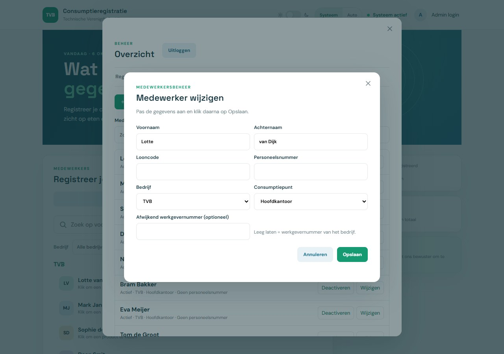

**Omschrijving.** Na `Wijzigen` bij Lotte van Dijk opent hetzelfde formulier met de titel `Medewerker wijzigen` en de uitleg "Pas de gegevens aan en klik daarna op Opslaan." De velden zijn ingevuld met de gegevens van Lotte (Lotte, van Dijk, TVB, Hoofdkantoor). Looncode en Personeelsnummer zijn leeg, omdat de demogegevens die niet bevatten. Die twee velden zijn wel verplicht: `Opslaan` lukt pas als ze zijn ingevuld (anders verschijnt "Vul dit veld in.", zoals in W23). Bij wijzigen zijn er alleen de knoppen `Annuleren` en `Opslaan`. `Opslaan` is hier de groene hoofdknop, want het is de enige opslaanknop. Het formulier `Product wijzigen` werkt op dezelfde manier (niet als aparte screenshot opgenomen). Bij het openen verschijnt kort de melding "Gegevens geladen om te wijzigen" (niet in de screenshot).

**UI-principes:**
- *Consistentie:* toevoegen en wijzigen gebruiken hetzelfde formulier.
- *Feedback:* titel en uitleg laten zien dat het om wijzigen gaat.

**Nielsen-heuristieken:**
- *H1:* de titel maakt het verschil tussen toevoegen en wijzigen duidelijk.
- *H6:* de huidige gegevens staan al ingevuld. Alleen wat ontbreekt of verandert, hoeft te worden getypt.
- *H4:* dezelfde velden en volgorde als bij toevoegen.

#### W25 – Beheer: Producten

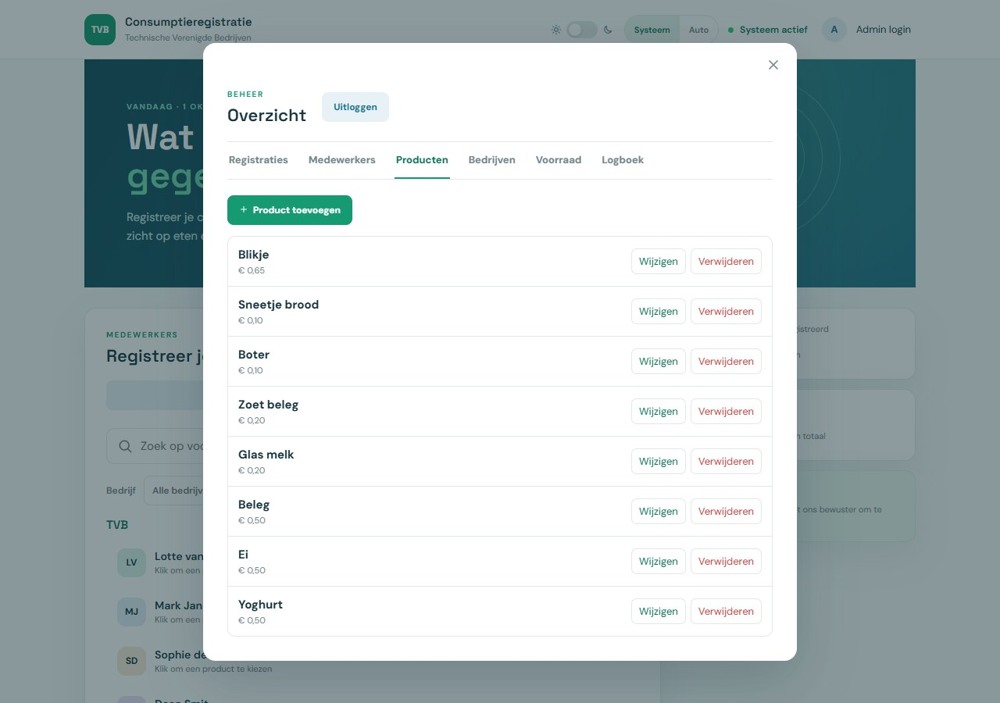

**Omschrijving.** Het tabblad `Producten` met de knop `Product toevoegen` en de lijst van acht producten met hun prijs (van Blikje € 0,65 tot Yoghurt € 0,50). Per product staan de knoppen `Wijzigen` (groen) en `Verwijderen` (rood). Een product dat al eens is geregistreerd, kan niet worden verwijderd. Dan verschijnt de melding "Dit product wordt al gebruikt en kan niet worden verwijderd".

**UI-principes:**
- *Kleur met betekenis:* rood voor verwijderen, groen voor wijzigen.
- *Consistentie:* dezelfde lijstopbouw als bij Medewerkers.
- *Uitlijning:* de knoppen staan in iedere rij recht onder elkaar.

**Nielsen-heuristieken:**
- *H5:* een product met registraties kan niet weg, zodat oude registraties en de export blijven kloppen.
- *H4:* `Wijzigen` en `Verwijderen` staan in iedere lijst op dezelfde plek.
- *H9:* als verwijderen niet mag, zegt de melding waarom.

#### W26 – Product toevoegen

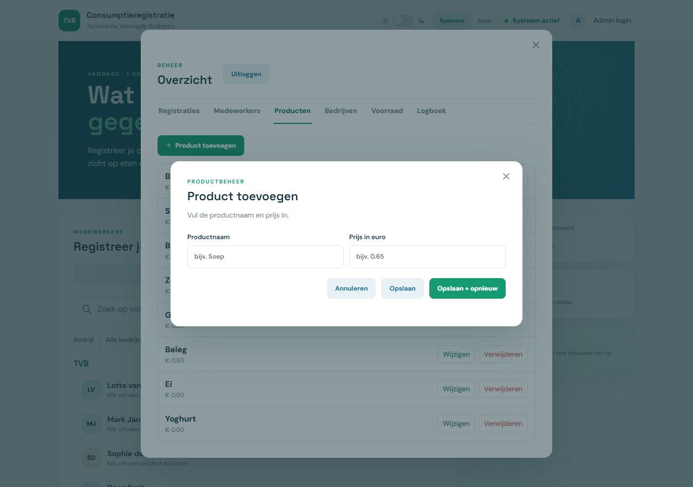

**Omschrijving.** Het formulier `Product toevoegen` met de velden `Productnaam` (voorbeeld "bijv. Soep") en `Prijs in euro` (voorbeeld "bijv. 0.65") en de knoppen `Annuleren`, `Opslaan` en `Opslaan + opnieuw`.

**UI-principes:**
- *Witruimte en eenvoud:* maar twee velden.
- *Consistentie:* dezelfde opbouw en knoppen als het medewerkersformulier (W22).

**Nielsen-heuristieken:**
- *H2:* "Prijs in euro" zegt in welke eenheid de prijs moet.
- *H10:* de voorbeelden in de velden laten zien wat er verwacht wordt.
- *H7:* `Opslaan + opnieuw` voor meerdere producten achter elkaar.
- *H5:* een prijs onder 0, boven 1000 euro of met meer dan twee decimalen wordt niet opgeslagen. Bij het veld staat dan "Vul een prijs van 0 tot en met 1000 euro in, met hooguit twee decimalen."

#### W27 – Product met een bestaande naam

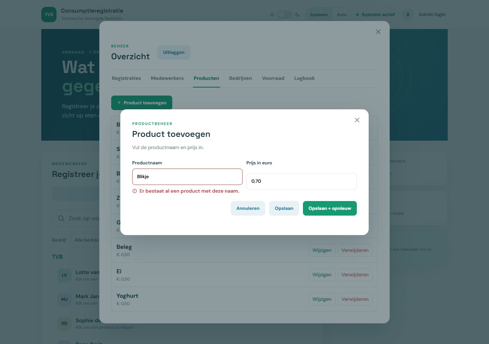

**Omschrijving.** Er is geprobeerd een nieuw product "Blikje" op te slaan. Omdat die naam al bestaat, krijgt het veld een rode rand en staat eronder "Er bestaat al een product met deze naam." Het venster blijft open en er is niets opgeslagen.

**UI-principes:**
- *Feedback:* de fout staat direct onder het veld.
- *Consistentie:* dezelfde foutweergave als in W23.

**Nielsen-heuristieken:**
- *H5:* dubbele productnamen worden tegengehouden, zodat de lijst en de export niet verwarrend worden.
- *H9:* de melding zegt precies wat er mis is.

#### W28 – Beheer: Bedrijven en consumptiepunten

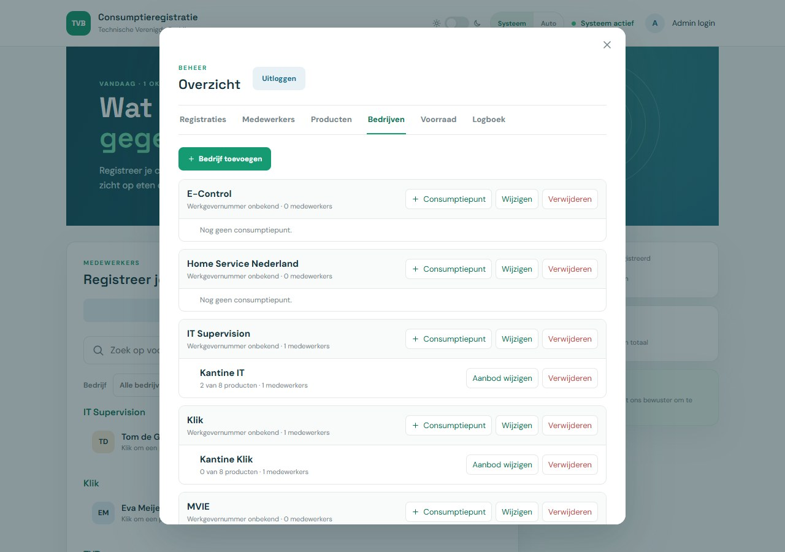

**Omschrijving.** Het tabblad `Bedrijven` met de knop `Bedrijf toevoegen` en de bedrijven op alfabetische volgorde (E-Control, Home Service Nederland, IT Supervision, Klik, MVIE, …). Ieder bedrijf is een blok met het werkgevernummer en het aantal medewerkers ("0 medewerkers", of "1 medewerker" bij IT Supervision en Klik), en de knoppen `Consumptiepunt` (met plusteken), `Wijzigen` en `Verwijderen`. Daaronder staan de consumptiepunten van dat bedrijf, met hoeveel producten er worden aangeboden en het aantal medewerkers (bijvoorbeeld Kantine IT: "2 van 8 producten · 1 medewerker"), en de knoppen `Aanbod wijzigen` en `Verwijderen`. Zonder punt staat er "Nog geen consumptiepunt."

**UI-principes:**
- *Groeperen:* de consumptiepunten staan ingesprongen onder hun bedrijf, in hetzelfde blok.
- *Visuele hiërarchie:* bedrijven zijn groter en vet, punten iets kleiner en ingesprongen.
- *Consistentie:* dezelfde knoppen en kleuren als op de andere tabbladen.

**Nielsen-heuristieken:**
- *H1:* per bedrijf en punt is te zien hoeveel medewerkers en producten erbij horen, en of het werkgevernummer bekend is.
- *H5:* een bedrijf met medewerkers of consumptiepunten kan niet worden verwijderd, en een consumptiepunt met medewerkers ook niet. Verwijderen vraagt altijd om bevestiging.
- *H2:* de opbouw volgt de echte organisatie: bedrijven met hun eigen kantines.

#### W29 – Bedrijf wijzigen

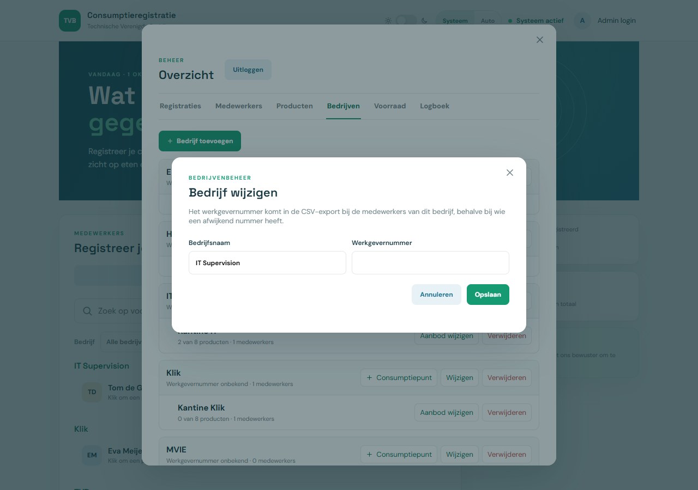

**Omschrijving.** Het formulier `Bedrijf wijzigen` voor IT Supervision met de uitleg "Het werkgevernummer komt in de CSV-export bij de medewerkers van dit bedrijf, behalve bij wie een afwijkend nummer heeft." en de velden `Bedrijfsnaam` en `Werkgevernummer` (nog leeg).

**UI-principes:**
- *Witruimte en eenvoud:* twee velden en twee knoppen.
- *Consistentie:* zelfde vensteropbouw als de andere formulieren.

**Nielsen-heuristieken:**
- *H10:* de uitleg zegt waar het werkgevernummer voor wordt gebruikt.
- *H2:* termen uit de salarisadministratie (werkgevernummer) die de beheerder kent.
- *H5:* een werkgevernummer mag alleen cijfers bevatten en mag niet al bij een ander bedrijf horen. Anders staat bij het veld "Gebruik alleen cijfers." of "Er bestaat al een bedrijf met dit werkgevernummer." en wordt er niets opgeslagen. Een leeg werkgevernummer mag wel.

#### W30 – Consumptiepunt toevoegen met aanbod

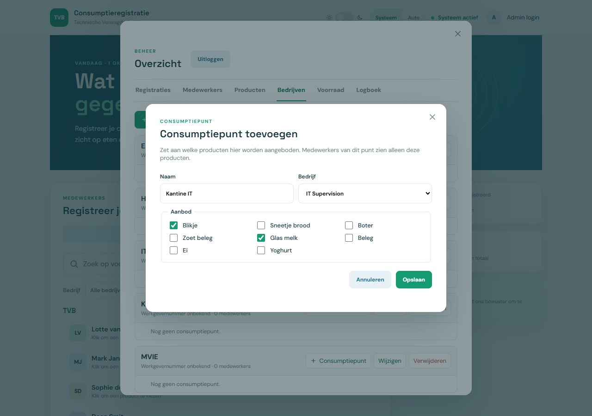

**Omschrijving.** Het formulier `Consumptiepunt toevoegen`, geopend via `Consumptiepunt` bij IT Supervision. De uitleg is "Zet aan welke producten hier worden aangeboden. Medewerkers van dit punt zien alleen deze producten." Er zijn velden voor `Naam` (Kantine IT) en `Bedrijf` (IT Supervision staat al gekozen) en een blok `Aanbod` met een vinkje per product. Hier zijn Blikje en Glas melk aangevinkt.

**UI-principes:**
- *Groeperen:* de producten staan samen in een omkaderd blok `Aanbod`.
- *Uitlijning:* de vinkjes staan in drie kolommen.
- *Affordance:* vinkjes laten zien dat meerdere producten tegelijk kunnen worden gekozen.

**Nielsen-heuristieken:**
- *H6:* alle producten staan in beeld. De beheerder hoeft ze niet te kennen.
- *H5:* het bedrijf staat al ingevuld vanuit het bedrijf waar op is geklikt.
- *H10:* de uitleg zegt wat het aanbod voor medewerkers betekent.

#### W31 – Beheer: Voorraad

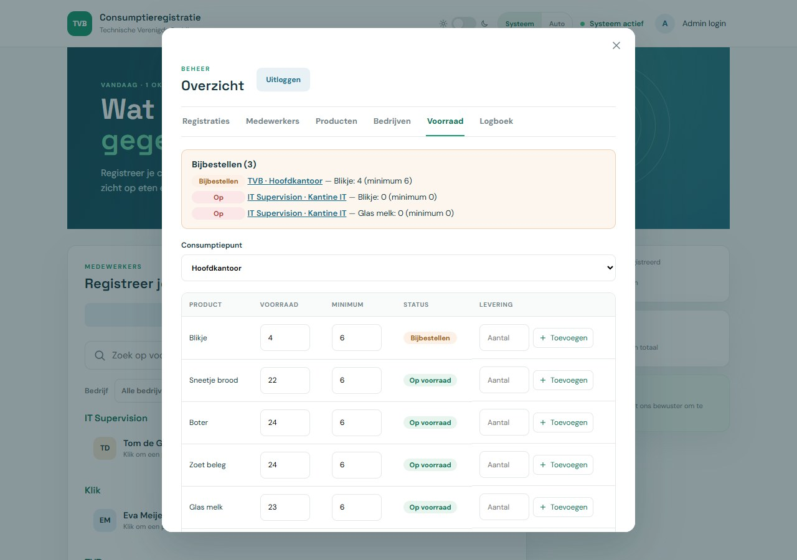

**Omschrijving.** Het tabblad `Voorraad`. Bovenaan staat een oranje blok `Bijbestellen (3)` met alle aangeboden producten die op zijn of bijna op zijn, over alle punten: een oranje label `Bijbestellen` bij "TVB · Hoofdkantoor — Blikje: 4 (minimum 6)" en twee rode labels `Op` bij Kantine IT (nieuw punt, nog voorraad 0). De naam van het punt is een link die de voorraad van dat punt opent. Daaronder kiest de beheerder een consumptiepunt (de lijst is per bedrijf gegroepeerd) en ziet een tabel met Product, Voorraad, Minimum, Status en Levering. Voorraad en minimum zijn direct aan te passen (een heel getal van 0 tot en met 100.000). Bij Levering vult de beheerder een aantal in (1 tot en met 100.000) en klikt op `Toevoegen`. Een tweede tik op dezelfde knop `Toevoegen` binnen 800 milliseconden na een geboekte levering wordt genegeerd, zodat een dubbele tik op de tablet geen onterechte foutmelding geeft. De status is `Op` bij 0, `Bijbestellen` bij een voorraad op of onder het minimum en anders `Op voorraad`.

**UI-principes:**
- *Visuele hiërarchie:* wat aandacht nodig heeft, staat bovenaan in een opvallend blok.
- *Kleur met betekenis:* rood voor op, oranje voor bijbestellen, groen voor op voorraad, telkens met tekst erbij.
- *Uitlijning:* een tabel met vaste kolommen.
- *Feedback:* na het aanpassen van voorraad of minimum verandert de status direct.

**Nielsen-heuristieken:**
- *H1:* de bijbestellijst en de statuslabels tonen de voorraad zonder te hoeven rekenen.
- *H2:* "Bijbestellen", "Op" en "Levering" zijn woorden uit de praktijk.
- *H7:* de links in de bijbestellijst springen direct naar het juiste punt. Voorraad en minimum zijn in de tabel zelf aan te passen.
- *H4:* dezelfde kleuren betekenen overal hetzelfde.

#### W32 – Voorraad van een punt zonder aanbod

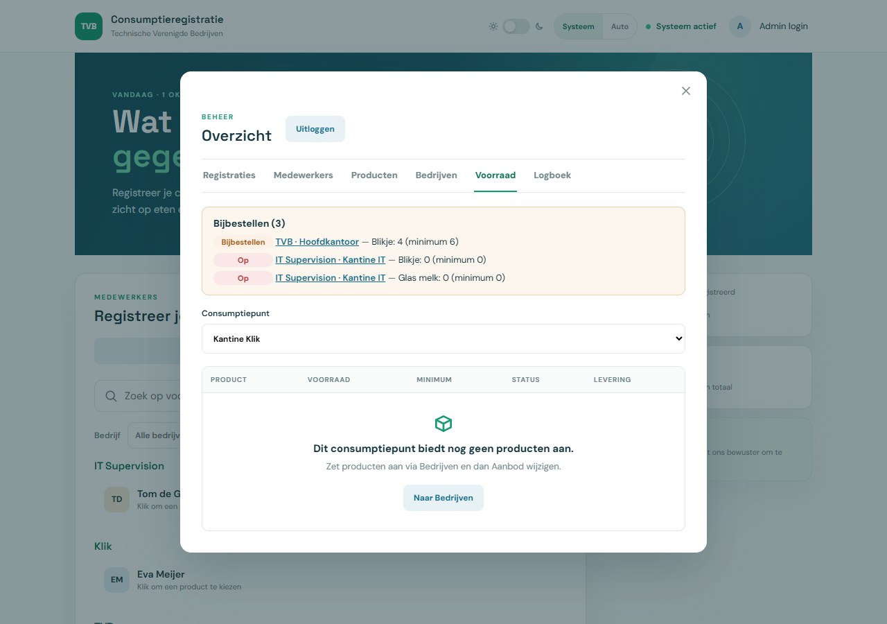

**Omschrijving.** In de voorraad is Kantine Klik gekozen. Dit punt biedt nog niets aan, dus de tabel toont een lege toestand met een pakket-icoon: "Dit consumptiepunt biedt nog geen producten aan.", "Zet producten aan via Bedrijven en dan Aanbod wijzigen." en de knop `Naar Bedrijven`, die direct naar dat tabblad gaat.

**UI-principes:**
- *Feedback:* de lege tabel legt uit waarom hij leeg is.
- *Affordance:* de knop brengt de gebruiker naar de plek waar het op te lossen is.
- *Consistentie:* zelfde lege toestand als in W06, W11 en W20.

**Nielsen-heuristieken:**
- *H9:* de melding zegt wat er ontbreekt en hoe het op te lossen is.
- *H10:* de uitleg noemt de stappen (Bedrijven, dan Aanbod wijzigen).
- *H7:* `Naar Bedrijven` scheelt zoeken naar het juiste tabblad.

#### W33 – Beheer: Logboek

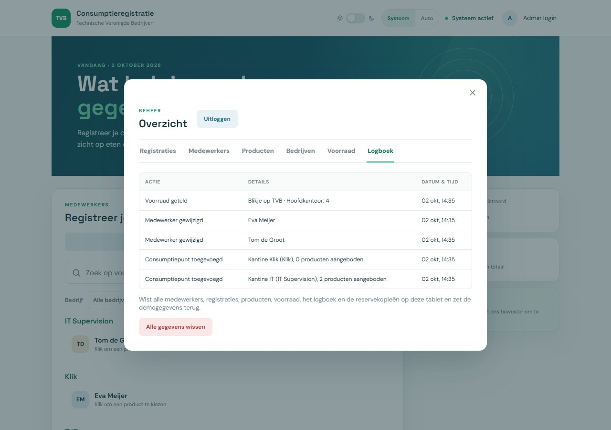

**Omschrijving.** Het tabblad `Logboek` met een tabel van Actie, Details en Datum & tijd, nieuwste bovenaan. Hier staan de vijf acties die in de beheer-screenshots zijn gedaan: "Voorraad geteld — Blikje op TVB · Hoofdkantoor: 4", "Medewerker gewijzigd" voor Eva Meijer en Tom de Groot, en "Consumptiepunt toegevoegd" voor Kantine Klik (Klik, 0 producten aangeboden) en Kantine IT (IT Supervision, 2 producten aangeboden), allemaal op "02 okt, 14:35". Het logboek toont 20 regels per keer. Als er meer zijn, verschijnt `Meer laden`. Het logboek bevat de wijzigingen van de beheerder. De registraties die medewerkers zelf doen, staan op het tabblad Registraties.

Onder de tabel staat in grijze tekst "Wist alle medewerkers, registraties, producten, voorraad, het logboek en de reservekopieën op deze tablet en zet de demogegevens terug." met daaronder de knop `Alle gegevens wissen`: rode tekst op een lichtrode achtergrond, dezelfde stijl als de andere verwijderknoppen. Na een klik vraagt de browser twee keer om bevestiging ("Alle medewerkers, registraties, producten, voorraad, het logboek en de reservekopieën op deze tablet wissen?" en "Weet je het zeker? Dit kan niet ongedaan worden gemaakt."). Na twee keer OK worden alle gegevens, beide reservekopieën en de ingestelde gezichten van de demo gewist, wordt de beheerder uitgelogd (het beheervenster sluit) en staan de demogegevens er weer. De melding is dan "Alle gegevens zijn gewist. De demogegevens staan er weer." Bij `Annuleren` op een van de twee vragen verandert er niets. De knop is bedoeld voor het recht op vergetelheid uit de AVG, bijvoorbeeld als de tablet ergens anders wordt gebruikt.

**UI-principes:**
- *Uitlijning:* vaste kolommen met datum en tijd rechts.
- *Witruimte en eenvoud:* één tabel met daaronder één knop. De knop staat los van de tabel, zodat hij niet als onderdeel van het logboek wordt gezien.
- *Kleur met betekenis:* de wisknop is rood, net als de andere knoppen die iets verwijderen.
- *Progressieve onthulling:* eerst de 20 nieuwste regels, de rest met `Meer laden`.

**Nielsen-heuristieken:**
- *H1:* de beheerder kan terugzien wat er is gewijzigd en wanneer.
- *H2:* de acties staan in gewone zinnen met namen in plaats van codes.
- *H5:* wissen kan niet ongedaan worden gemaakt. Daarom zijn er twee bevestigingen, en bij `Annuleren` op een van de twee vragen verandert er niets.
- *H10:* de grijze uitleg boven de knop zegt precies wat er wordt gewist en dat de demogegevens terugkomen, nog vóór de beheerder klikt.

#### W34 – Foutmelding bij een levering

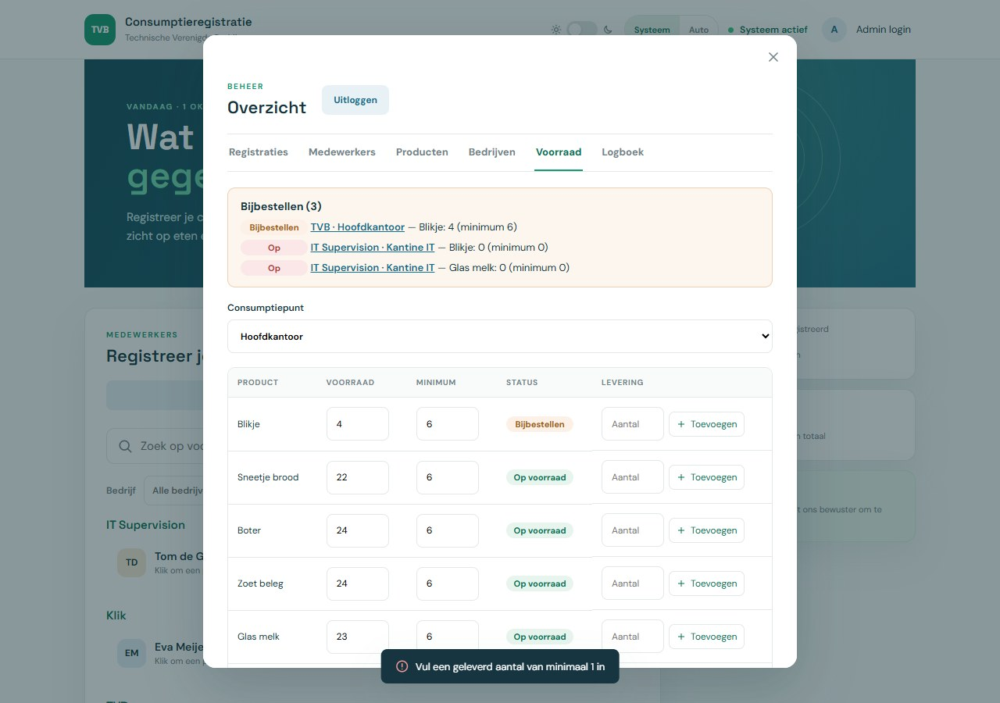

**Omschrijving.** In de voorraad is op `Toevoegen` geklikt zonder een geleverd aantal in te vullen. Onderaan verschijnt een melding met een waarschuwingsteken: "Vul een geleverd aantal van minimaal 1 in". De voorraad is niet veranderd.

**UI-principes:**
- *Feedback:* de actie geeft direct een reactie, ook als hij niet lukt.
- *Toegankelijkheid:* een foutmelding heeft een uitroepteken in een cirkel in plaats van het vinkje uit W09. De achtergrond van de melding is hetzelfde, dus het verschil zit niet alleen in kleur.
- *Consistentie:* de melding staat op dezelfde plek als alle andere meldingen.

**Nielsen-heuristieken:**
- *H5:* een lege levering, een levering van 0 of minder, een aantal dat geen heel getal is of een levering van meer dan 100.000 wordt niet geboekt, zodat de voorraad niet verkeerd wordt.
- *H9:* de melding zegt wat de beheerder moet doen: "Vul een geleverd aantal van minimaal 1 in" of, bij een te groot aantal, "Vul een geleverd aantal van hooguit 100.000 in". Het ingevulde aantal blijft staan, zodat het direct te verbeteren is.
- *H1:* de gebruiker ziet waarom de voorraad niet is veranderd.
- *Beperking:* de foutmelding verschijnt als melding onderaan het scherm (toast) en niet direct onder het veld. Dat wijkt af van de regel dat foutmeldingen in formulieren direct onder het veld staan (zie "Ontwerpkeuzes en Nielsen-heuristieken" en W23). Het veld krijgt ook geen rode rand, en de melding verdwijnt vanzelf.

#### W39 – Beheer in het donkere thema

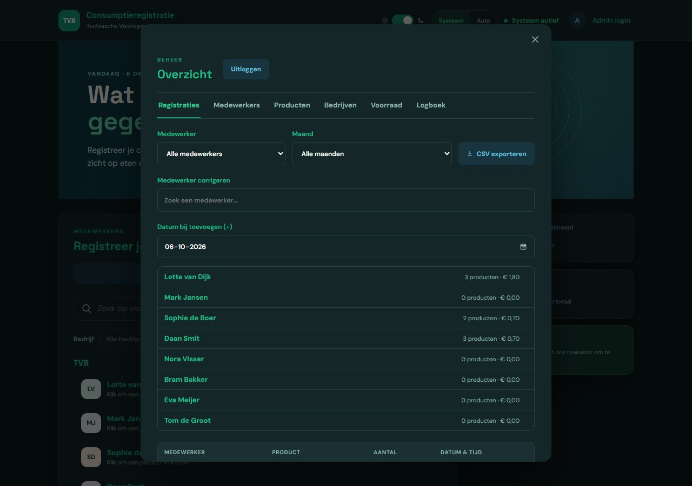

**Omschrijving.** Het tabblad `Registraties` (zoals W18) terwijl het apparaat op donker staat. `Systeem` is gekozen, dus de slider staat naar de maan. Het beheervenster heeft een donkere achtergrond. De kop `Overzicht`, het actieve tabblad, de labels van de velden en de namen van de medewerkers zijn lichtgroen. Het zoekveld `Zoek een medewerker...` en het datumveld (06-10-2026) zijn donker met lichte tekst. De twee keuzelijsten `Alle medewerkers` en `Alle maanden` zijn op deze screenshot licht: wit met donkere tekst (zie de beperking hieronder). `Uitloggen` en `CSV exporteren` zijn donkerblauw met lichtblauwe tekst. Onder het datumveld staan de totalen per medewerker (bijvoorbeeld Lotte van Dijk: 3 producten · € 1,80) en onderaan de kolomkoppen van de tabel. De pagina achter het venster is donker en gedimd.

**UI-principes:**
- *Consistentie:* de indeling is precies gelijk aan het lichte thema (W18). De kleuren wisselen. Op de screenshot geldt dat niet voor de twee keuzelijsten, die licht zijn gebleven.
- *Toegankelijkheid:* lichte tekst op een donkere achtergrond, met de lichtere tint van het huisgroen voor goed contrast.
- *Visuele hiërarchie:* het actieve tabblad en de namen vallen op door het groen. De details zijn grijs.

**Nielsen-heuristieken:**
- *H4:* knoppen, velden en tabbladen staan op dezelfde plek als in het lichte thema.
- *H7:* de beheerder kan het thema kiezen dat bij het apparaat of de omgeving past.
- *Beperking (open controle):* op deze screenshot zijn de keuzelijsten `Alle medewerkers` en `Alle maanden` licht, terwijl de andere velden donker zijn. In Edge zonder venster (headless) is de berekende stijl van deze keuzelijsten wel donker (achtergrond `--paper`), en een screenshot van alleen dat deel van het scherm toont ze ook donker. Of een gewoon browservenster de keuzelijsten in het donkere thema licht of donker toont, is nog niet vastgesteld. Dit staat als open punt in hoofdstuk 16.

#### W40 – Beheer op een telefoon

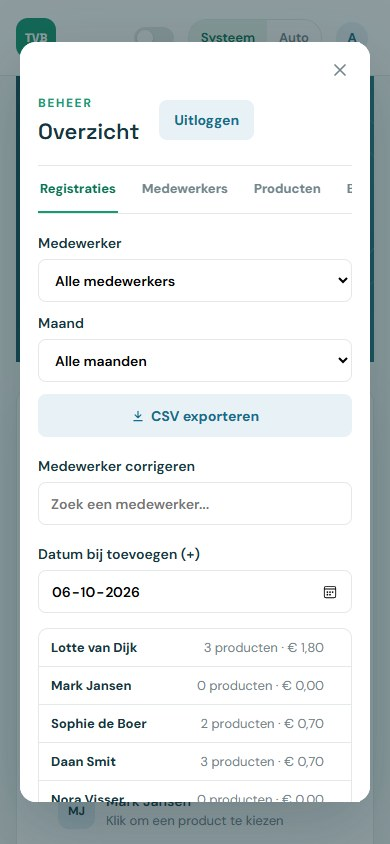

**Omschrijving.** Het tabblad `Registraties` op een telefoon van 390 pixels breed. Het beheervenster is bijna zo breed als het scherm. De rij met tabbladen past niet helemaal: `Registraties`, `Medewerkers` en `Producten` zijn te zien en het volgende tabblad wordt afgesneden. De rij is opzij te scrollen. De filters `Medewerker` en `Maand` staan onder elkaar over de volle breedte, met daaronder `CSV exporteren`, ook over de volle breedte. Alles past binnen het venster. Daaronder staan het zoekveld, het datumveld en de totalen per medewerker.

**UI-principes:**
- *Responsief ontwerp:* het venster, de filters, de exportknop en de lijsten passen zich aan de smalle breedte aan.
- *Toegankelijkheid:* knoppen en velden blijven groot genoeg om met een vinger te bedienen.
- *Consistentie:* dezelfde onderdelen en volgorde als op het grote scherm (W18).

**Nielsen-heuristieken:**
- *H4:* het beheer werkt op een telefoon op dezelfde manier als op een laptop.
- *H8:* alles staat onder elkaar, zonder extra onderdelen.
- *H6 (beperking):* de rij met tabbladen past niet in de breedte. Dat die rij opzij scrollt, is alleen te zien aan het afgesneden tabblad rechts. De beheerder moet zelf bedenken dat er rechts nog tabbladen (Bedrijven, Voorraad en Logboek) zijn. Het beheer is vooral bedoeld voor een laptop of tablet.

## 10. Use cases en procesbeschrijvingen

Dit hoofdstuk beschrijft wat de gebruikers met het systeem doen. Er zijn drie actoren:

- **Medewerker:** registreert op de tablet de eigen consumpties (eten en drinken).
- **Beheerder:** logt in en beheert registraties, medewerkers, producten, bedrijven, consumptiepunten, voorraad, logboek en export.
- **Systeem:** doet zelf iets zonder dat een gebruiker op een knop klikt (de dagwissel na middernacht en het overnemen van wijzigingen uit een ander tabblad).

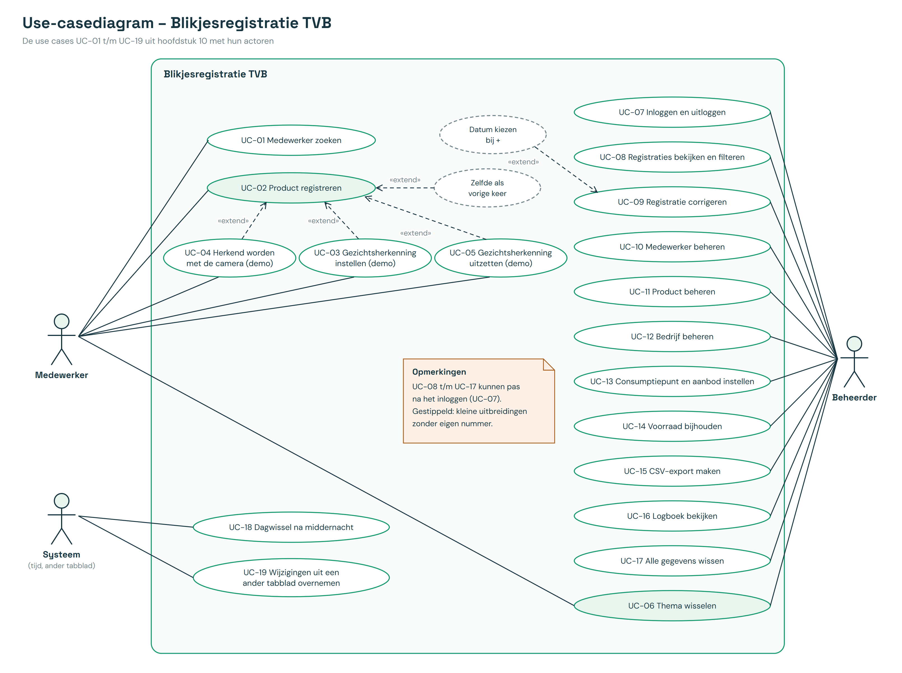

*Figuur: use-casediagram met de actoren Medewerker, Beheerder en Systeem en de use cases UC-01 tot en met UC-19 uit dit hoofdstuk. UC-03, UC-04 en UC-05 zijn getekend als «extend» van UC-02. UC-20 (sinds versie 3.6) staat nog niet in het diagram.*

UC-03, UC-04 en UC-05 (de demo gezichtsherkenning) zijn een uitbreiding («extend») van UC-02 Product registreren: ze zijn vrijwillig en alleen beschikbaar als de demo aan staat, en ze komen altijd uit bij het productvenster van UC-02. UC-03 en UC-05 starten vanuit het productvenster (de link `Gezichtsherkenning instellen (demo)` en `Uitzetten`). UC-04 opent na herkenning het productvenster (UC-02, pad A6). Zonder deze drie use cases werkt UC-02 precies hetzelfde. UC-20 Herkend worden met de pas is op dezelfde manier een uitbreiding van UC-02: na herkenning opent het productvenster (UC-02, pad A9). De pas koppelen hoort bij UC-10 Medewerker beheren.

| ID | Use case | Actor |
|---|---|---|
| UC-01 | Medewerker zoeken | Medewerker |
| UC-02 | Product registreren | Medewerker |
| UC-03 | Gezichtsherkenning instellen (demo) | Medewerker |
| UC-04 | Herkend worden met de camera (demo) | Medewerker |
| UC-05 | Gezichtsherkenning uitzetten (demo) | Medewerker |
| UC-06 | Thema wisselen | Medewerker en beheerder |
| UC-07 | Inloggen en uitloggen | Beheerder |
| UC-08 | Registraties bekijken en filteren | Beheerder |
| UC-09 | Registratie corrigeren | Beheerder |
| UC-10 | Medewerker beheren | Beheerder |
| UC-11 | Product beheren | Beheerder |
| UC-12 | Bedrijf beheren | Beheerder |
| UC-13 | Consumptiepunt en aanbod instellen | Beheerder |
| UC-14 | Voorraad bijhouden | Beheerder |
| UC-15 | CSV-export maken | Beheerder |
| UC-16 | Logboek bekijken | Beheerder |
| UC-17 | Alle gegevens wissen | Beheerder |
| UC-18 | Dagwissel na middernacht | Systeem |
| UC-19 | Wijzigingen uit een ander tabblad overnemen | Systeem |
| UC-20 | Herkend worden met de pas | Medewerker |

Iedere use case gebruikt hetzelfde sjabloon: ID, actor, doel, gerelateerde eisen (FR's uit hoofdstuk 4), preconditie, hoofdscenario, alternatieve en uitzonderingspaden, en postconditie. Bij het hoofdscenario staat tussen haakjes welke methode het werk doet, zodat de use case direct naar de code te volgen is. Meldingen staan letterlijk tussen aanhalingstekens.

Voor alle wijzigingen van de beheerder geldt dezelfde manier van opslaan: `RegistrationApp.persist(wijziging, logboekregel)` voert de wijziging uit, voegt de logboekregel toe en slaat beide in één keer op. Lukt opslaan niet, dan worden de wijziging en de logboekregel samen teruggedraaid en verschijnt "Opslaan mislukt. Probeer het opnieuw." (FR-61). Geeft het model aan dat er niets kon worden gewijzigd (de gegevens zijn intussen veranderd), dan verschijnt "Er is niets gewijzigd: de gegevens zijn intussen veranderd." Dit wordt hieronder niet bij iedere use case herhaald.

### UC-01 Medewerker zoeken

| Onderdeel | Beschrijving |
|---|---|
| **ID** | UC-01 |
| **Actor** | Medewerker |
| **Doel** | Snel de eigen naam vinden in de lijst. |
| **Gerelateerde FR's** | FR-01, FR-02, FR-31 |
| **Preconditie** | De beginpagina is geopend. Er is geen venster open. |

**Hoofdscenario:**

1. De medewerker ziet de lijst met alle actieve medewerkers, gegroepeerd per bedrijf (`RegistrationView.renderEmployees`).
2. De medewerker typt (een deel van) de voor- of achternaam in het zoekveld "Zoek op voor- of achternaam...".
3. Bij iedere letter toont het systeem alleen de medewerkers waarvan de naam de zoekterm bevat (hoofdletters tellen niet). Het aantal staat erboven ("… totaal").
4. Eventueel kiest de medewerker een bedrijf in het bedrijfsfilter. Typen in het filter maakt de keuzelijst korter. "Alle bedrijven" toont weer iedereen.
5. De medewerker vindt de eigen naam en gaat verder met UC-02.

**Alternatieve en uitzonderingspaden:**

- **A1 Sneltoets:** met `Ctrl K` (of `Cmd K` op een Mac) springt de focus naar het zoekveld. Staat er een venster open, dan doet de sneltoets niets.
- **A2 Geen resultaat:** de lijst is leeg en er staat "Geen medewerker gevonden" met "Probeer een andere zoekterm of kies een ander bedrijf." De knop `Zoekopdracht wissen` maakt het zoekveld en het bedrijfsfilter leeg en toont alle medewerkers weer.
- **A3 Onbekend bedrijf:** hoort een actieve medewerker bij geen (bestaand) bedrijf, dan staat in het filter ook de keuze "Onbekend bedrijf".

**Postconditie:** De lijst toont alleen de actieve medewerkers die bij de zoekterm en het bedrijfsfilter passen, gegroepeerd per bedrijf.

### UC-02 Product registreren

| Onderdeel | Beschrijving |
|---|---|
| **ID** | UC-02 |
| **Actor** | Medewerker |
| **Doel** | Vastleggen wat de medewerker heeft gepakt, zodat het via de loonadministratie wordt verrekend. |
| **Gerelateerde FR's** | FR-03, FR-04, FR-05, FR-07, FR-08, FR-29, FR-32, FR-37, FR-38, FR-47, FR-48, FR-49, FR-50, FR-62 |
| **Preconditie** | De medewerker is actief en staat in de lijst (UC-01). |

**Hoofdscenario:**

1. De medewerker klikt op de eigen medewerkerrij (of drukt erop op Enter of spatie).
2. Het productvenster opent (`RegistrationApp.openEmployeeProducts`). Bovenaan staat een begroeting die past bij het tijdstip: "Goedemorgen" (tot 12 uur), "Goedemiddag" (tot 18 uur) of "Goedenavond", met de voornaam, bijvoorbeeld "Goedemorgen Lotte."
3. Het venster toont alleen de producten die het eigen consumptiepunt aanbiedt. Er zijn geen persoonlijke aantallen of bedragen te zien.
4. De medewerker kiest producten met de `+`-knoppen. De knop toont het totaal, bijvoorbeeld `Registreren (3)`.
5. De medewerker klikt op `Registreren` (`registerSelectedProducts`).
6. Voor iedere gekozen eenheid maakt `RegistrationModel.addRegistration` een registratie met de prijs en het werkgevernummer van dat moment, het consumptiepunt en de huidige datum en tijd.
7. Biedt het punt het product aan, dan gaat de voorraad van dat product op het punt 1 omlaag.
8. Alles wordt in één keer opgeslagen. Een eigen registratie van een medewerker komt niet in het logboek. Het logboek is voor wijzigingen van de beheerder.
9. Het venster sluit, de lijst en de tegels worden vernieuwd en de focus gaat terug naar de rij van de medewerker.
10. Er verschijnt vier seconden lang een melding met de naam en de producten, bijvoorbeeld "Lotte van Dijk: 2× Blikje, 1× Ei geregistreerd".

**Alternatieve en uitzonderingspaden:**

- **A1 Welkom terug:** heeft de medewerker zelf al eens iets geregistreerd, dan eindigt de begroeting met ", welkom terug." (bijvoorbeeld "Goedemorgen Lotte, welkom terug."). Correcties van de beheerder tellen niet mee.
- **A2 Zelfde als vorige keer:** heeft de medewerker eerder zelf iets geregistreerd, dan staat er "Vorige keer koos je 1× Blikje en 1× Ei." met de knop `Zelfde als vorige keer`. Die knop zet de aantallen van de vorige keer klaar (alles wat binnen één minuut vóór de laatste eigen registratie is geregistreerd, alleen producten die het punt nu aanbiedt). Er is dan nog niets opgeslagen. De medewerker gaat verder bij stap 5.
- **A3 Vergissing herstellen:** met `−` gaat het gekozen aantal van een product 1 omlaag, nooit onder 0 (bij 0 is de knop uitgeschakeld). Dit verandert alleen de keuze die nog niet is opgeslagen. Een opgeslagen registratie kan een medewerker niet verwijderen.
- **A4 Niets gekozen:** klikt de medewerker op `Registreren` zonder product, dan wordt er niets opgeslagen en verschijnt "Kies eerst minimaal één product".
- **A5 Geen producten op het punt:** biedt het consumptiepunt niets aan (of heeft de medewerker geen punt), dan staat in het venster "Geen producten op jouw consumptiepunt." met "Neem contact op met de beheerder als dit niet klopt." De knop `Registreren` is dan niet zichtbaar.
- **A6 Geopend via herkenning:** is het venster geopend door UC-04, dan staat achter de begroeting "Je bent herkend met de camera." Verder is het scenario hetzelfde.
- **A7 Medewerker in een ander tabblad verwijderd of gedeactiveerd:** het productvenster (en een open cameravenster erboven) sluit en er verschijnt "Deze medewerker is in een ander venster verwijderd of gedeactiveerd. Het productvenster is gesloten." Er wordt niets geregistreerd.
- **A8 Aanbod in een ander tabblad gewijzigd:** een product dat het punt niet meer aanbiedt, verdwijnt uit het venster en uit de keuze, zodat het niet toch wordt geregistreerd (`removeUnavailableSelections`).
- **A9 Geopend via de pas:** is het venster geopend door UC-20, dan staat achter de begroeting "Je bent herkend met je pas." Verder is het scenario hetzelfde.
- **E1 Opslaan mislukt:** alle registraties van deze keer worden teruggedraaid en er verschijnt "Opslaan mislukt. Probeer het opnieuw." Het venster blijft open met de keuze.

**Postconditie:** Voor iedere gekozen eenheid bestaat één registratie met product, prijs, werkgevernummer, consumptiepunt, datum en tijd. De voorraad van het punt is bijgewerkt en de tegels op de beginpagina tonen de nieuwe totalen.

### UC-03 Gezichtsherkenning instellen (demo)

| Onderdeel | Beschrijving |
|---|---|
| **ID** | UC-03 |
| **Actor** | Medewerker |
| **Doel** | Vrijwillig het eigen gezicht instellen, zodat de medewerker zich daarna met de camera kan laten herkennen. |
| **Gerelateerde FR's** | FR-51 |
| **Preconditie** | De demo staat aan (`FACE_DEMO.enabled`), de browser heeft een camera-functie (alleen via `https://` of `http://localhost`) en het productvenster van de medewerker is open (UC-02). |

**Hoofdscenario:**

1. De medewerker klikt in het productvenster op `Gezichtsherkenning instellen (demo)`.
2. Het cameravenster opent met de titel "Gezichtsherkenning instellen voor …" en de status "Herkenningsmodel laden. De eerste keer kan dit even duren." De bibliotheek face-api wordt pas nu geladen, uit het project zelf.
3. De camera start ("Camera starten…", daarna "Camera staat aan.").
4. De medewerker zet het vinkje voor vrijwillige deelname. Pas als het vinkje staat én de camera aan staat, werkt de knop `Gezicht vastleggen`.
5. De medewerker klikt op `Gezicht vastleggen`. Het systeem probeert vijf keer een gezicht te lezen (het grootste gezicht in beeld telt).
6. Het gezicht wordt onthouden (`FaceRecognitionDemo.enroll`), het cameravenster sluit en de camera gaat uit.
7. Er verschijnt "Gezichtsherkenning staat aan voor …, alleen tijdens deze sessie."

**Alternatieve en uitzonderingspaden:**

- **E1 Model laadt niet:** de status wordt "De demo kon niet worden geladen. Herlaad de pagina en probeer het opnieuw."
- **E2 Geen cameratoegang:** de camera wordt (als die al aan stond) uitgezet en de status wordt "Geen toegang tot de camera. Geef toestemming in de browser, of kies je naam in de lijst."
- **E3 Geen gezicht gevonden:** de status wordt "Geen gezicht gevonden. Plaats je gezicht binnen het kader en probeer het opnieuw." Er is niets vastgelegd.
- **E4 Vinkje weggehaald tijdens het vastleggen:** er wordt niets onthouden en de status wordt "Er is niets vastgelegd, omdat het vinkje voor toestemming niet meer staat."
- **A1 Venster gesloten:** sluiten (kruisje, `Annuleren`, klik naast het venster of Escape) zet de camera direct uit. Een vastlegging die nog bezig was, wordt niet onthouden.
- **A2 Geen https:** zonder camera-functie (bijvoorbeeld via een gewoon netwerkadres) zijn de knoppen van de demo niet zichtbaar.

**Postconditie:** Van het gezicht is een reeks van 128 getallen in het geheugen van de pagina bewaard, alleen tot herladen of sluiten. In het productvenster staat "Gezichtsherkenning staat aan (demo)".

### UC-04 Herkend worden met de camera (demo)

| Onderdeel | Beschrijving |
|---|---|
| **ID** | UC-04 |
| **Actor** | Medewerker |
| **Doel** | Het eigen productvenster openen zonder de naam te zoeken. |
| **Gerelateerde FR's** | FR-51 |
| **Preconditie** | De demo is beschikbaar en minstens één actieve medewerker heeft in deze sessie een gezicht ingesteld (UC-03). |

**Hoofdscenario:**

1. De medewerker klikt op de beginpagina op `Herken mij met de camera (demo)`.
2. Het cameravenster "Herken mij" opent, het model laadt en de camera start (zoals UC-03, stap 2 en 3).
3. Het systeem zoekt steeds opnieuw naar een bekend gezicht ("Zoeken naar een bekend gezicht…"). Alleen gezichten van actieve medewerkers tellen.
4. Pas als twee keer achter elkaar dezelfde medewerker wordt gevonden, geldt die als herkend.
5. Het cameravenster sluit, de camera gaat uit en het productvenster van die medewerker opent met "Je bent herkend met de camera."

**Alternatieve en uitzonderingspaden:**

- **E1 Nog niemand ingesteld:** is er geen gezicht van een actieve medewerker ingesteld, dan opent de camera niet en verschijnt "Er is nog niemand ingesteld voor gezichtsherkenning. Kies je naam en zet het aan in het productvenster."
- **A1 Tussenstatus:** tijdens het zoeken toont het venster "Geen gezicht in beeld. Plaats je gezicht binnen het kader.", "Gezicht gevonden, maar niet herkend. Blijf rustig in het kader kijken." of "Bijna herkend. Blijf even rustig in het kader kijken."
- **E2 Niet herkend na de time-out:** na 20 seconden (`FACE_DEMO.scanTimeoutMs`) stopt het zoeken met "Niet herkend. Sluit dit venster en kies je naam in de lijst."
- **E3 Inactieve medewerker:** het gezicht van een gedeactiveerde medewerker wordt niet herkend. Het blijft wel bewaard, zodat het na opnieuw activeren weer werkt.
- **E4 Model laadt niet of geen cameratoegang:** zoals UC-03, E1 en E2.

**Postconditie:** Het productvenster van de herkende medewerker is open (UC-02, pad A6) en de camera is uit.

### UC-05 Gezichtsherkenning uitzetten (demo)

| Onderdeel | Beschrijving |
|---|---|
| **ID** | UC-05 |
| **Actor** | Medewerker |
| **Doel** | Het ingestelde gezicht direct laten vergeten. |
| **Gerelateerde FR's** | FR-51 |
| **Preconditie** | Het productvenster van de medewerker is open en er staat "Gezichtsherkenning staat aan (demo)". |

**Hoofdscenario:**

1. De medewerker klikt in het productvenster op `Uitzetten`.
2. Het systeem vergeet het gezicht (`FaceRecognitionDemo.forget`) en tekent het venster opnieuw.
3. Er verschijnt "Gezichtsherkenning staat uit voor deze medewerker."

**Alternatieve en uitzonderingspaden:**

- **A1 Vanzelf vergeten:** ook zonder deze knop is het gezicht weg na herladen of sluiten van de pagina, na het definitief verwijderen van de medewerker (UC-10) en na `Alle gegevens wissen` (UC-17).

**Postconditie:** Het gezicht van deze medewerker is uit het geheugen verwijderd.

### UC-06 Thema wisselen

| Onderdeel | Beschrijving |
|---|---|
| **ID** | UC-06 |
| **Actor** | Medewerker en beheerder (iedere gebruiker van de tablet) |
| **Doel** | Het lichte of donkere thema kiezen. |
| **Gerelateerde FR's** | FR-42, FR-43, FR-44, FR-45, FR-46 |
| **Preconditie** | De pagina is geopend. |

**Hoofdscenario:**

1. Bij het openen kiest een klein script in `index.html` meteen het juiste thema, zodat de pagina niet eerst wit oplicht. Standaard is de instelling "Systeem": het thema volgt het apparaat.
2. De gebruiker klikt op de slider in de bovenbalk.
3. `ThemeManager.toggle` schakelt naar het tegenovergestelde van wat zichtbaar is. Dat is een handmatige keuze. "Systeem" en "Auto" staan daarna uit.
4. De keuze wordt bewaard en geldt ook na herladen.

**Alternatieve en uitzonderingspaden:**

- **A1 Systeem:** de gebruiker klikt op `Systeem`. Het thema volgt weer het apparaat en past zich direct aan als het apparaat wisselt.
- **A2 Auto:** de gebruiker klikt op `Auto`. Het thema is licht tussen zonsopkomst en zonsondergang (tijden per maand in `DAYLIGHT_HOURS` in `config.js`) en anders donker. Iedere minuut wordt opnieuw gekeken.
- **E1 Opslag niet beschikbaar:** kan de instelling niet worden bewaard (bijvoorbeeld in een privévenster), dan werkt het thema alleen tot de pagina sluit.

**Postconditie:** Het gekozen thema is zichtbaar en de instelling staat per browser in `localStorage` (`tvb-theme`).

### UC-07 Inloggen en uitloggen

| Onderdeel | Beschrijving |
|---|---|
| **ID** | UC-07 |
| **Actor** | Beheerder |
| **Doel** | Toegang krijgen tot het beheer, en het beheer weer afsluiten. |
| **Gerelateerde FR's** | FR-09 |
| **Preconditie** | De beginpagina is geopend. |

**Hoofdscenario:**

1. De beheerder klikt op `Admin login`.
2. Het loginformulier opent. Het e-mailadres is al ingevuld (`admin@tvb.nl`). De focus staat op het e-mailveld.
3. De beheerder vult een wachtwoord in en klikt op `Inloggen`.
4. In de demo wordt ieder ingevuld e-mailadres en wachtwoord geaccepteerd (`RegistrationApp.login`). Het dashboard opent (de eerste keer op het tabblad `Registraties`), met alle gegevens bijgewerkt en het datumveld van de correctie op vandaag.
5. De beheerder klikt op `Uitloggen`. Het wachtwoordveld wordt leeggemaakt en het loginformulier verschijnt direct in hetzelfde venster.

**Alternatieve en uitzonderingspaden:**

- **E1 Lege velden:** is het e-mailadres of het wachtwoord leeg, dan opent het dashboard niet en verschijnt onder het formulier (`#loginError`) "Vul een e-mailadres en wachtwoord in."
- **A1 Venster sluiten:** sluiten met het kruisje, een klik naast het venster of Escape logt de beheerder ook uit (`closeAdmin`). Bij het volgende openen verschijnt het loginformulier.
- **A2 Herladen:** de login staat alleen in het geheugen van de pagina. Na herladen is de beheerder uitgelogd.

**Postconditie:** Na inloggen staat het dashboard open (`adminLoggedIn` is `true`). Na uitloggen of sluiten is de beheerder uitgelogd.

### UC-08 Registraties bekijken en filteren

| Onderdeel | Beschrijving |
|---|---|
| **ID** | UC-08 |
| **Actor** | Beheerder |
| **Doel** | Zien wie wat heeft geregistreerd, per medewerker en per maand. |
| **Gerelateerde FR's** | FR-06, FR-10, FR-11, FR-12 |
| **Preconditie** | De beheerder is ingelogd (UC-07) en het tabblad `Registraties` is open. |

**Hoofdscenario:**

1. De tabel toont alle registraties, de nieuwste bovenaan, met medewerker, product, aantal (`+1`) en datum en tijd (`RegistrationView.renderAdmin`).
2. De beheerder kiest bij `Medewerker` één medewerker en/of bij `Maand` één consumptiemaand. Bij iedere maand staat de loonmaand, bijvoorbeeld "september 2026 (loonmaand oktober 2026)".
3. De tabel toont direct alleen de registraties die bij beide filters passen.
4. In de lijst `Medewerker corrigeren` staat per medewerker het aantal registraties en het totaalbedrag, bijvoorbeeld "3 producten · € 1,80".

**Alternatieve en uitzonderingspaden:**

- **A1 Nog geen registraties:** de tabel toont "Nog geen registraties." met "Registraties verschijnen hier zodra medewerkers iets registreren."
- **A2 Niets voor deze filters:** de tabel toont "Geen registraties voor deze filters." met "Kies een andere medewerker of maand, of kies weer voor alle medewerkers en maanden."

**Postconditie:** De tabel toont de registraties die bij de filters passen. Er is niets gewijzigd.

### UC-09 Registratie corrigeren

| Onderdeel | Beschrijving |
|---|---|
| **ID** | UC-09 |
| **Actor** | Beheerder |
| **Doel** | Een vergeten registratie toevoegen of een verkeerde registratie verwijderen. |
| **Gerelateerde FR's** | FR-13, FR-14, FR-38, FR-54, FR-56, FR-61 |
| **Preconditie** | De beheerder is ingelogd en het tabblad `Registraties` is open. |

**Hoofdscenario (toevoegen met `+`):**

1. De beheerder zoekt de medewerker bij `Medewerker corrigeren` en klapt die open.
2. Eventueel kiest de beheerder bij `Datum bij toevoegen (+)` een eerdere datum (standaard vandaag).
3. De beheerder klikt bij een product op `+` (`RegistrationApp.addCorrection`).
4. `readCorrectionDate` leest de datum. Vandaag krijgt het huidige tijdstip, een eerdere dag 12:00 uur.
5. `addRegistration` voegt één registratie toe met `correction: true`, de prijs en het werkgevernummer van nu en de gekozen datum.
6. De voorraad van het consumptiepunt van de medewerker gaat alleen 1 omlaag als dat punt het product aanbiedt **en** het tijdstip van de registratie niet vóór het tijdstip van de laatste telling van dat product (`countedAt`) ligt. Het gaat om het tijdstip uit stap 4: vandaag het huidige tijdstip, een eerdere dag 12:00 uur. Een correctie op de dag van de telling telt dus als "vóór de telling" als de telling na 12:00 uur was.
7. De registratie en de logboekregel "Registratie toegevoegd" worden samen opgeslagen.
8. Er verschijnt "… toegevoegd voor medewerker" (bij een eerdere datum met "op 14 september 2026" erachter). De lijst, de tabel en de voorraad worden vernieuwd en de focus blijft op dezelfde `+`-knop.

**Hoofdscenario (verwijderen met `−`):**

1. De beheerder klikt bij een product op `−` (`removeCorrection`).
2. `lastRegistration` zoekt de **laatst ingevoerde** registratie van dat product bij die medewerker. Dat is de registratie die als laatste is opgeslagen (de volgorde van invoer), niet de registratie met de nieuwste datum. Is met `+` een registratie op een eerdere datum toegevoegd, dan is dat dus de registratie die met `−` verdwijnt.
3. `removeLastRegistration` verwijdert die registratie. Het product gaat terug naar de voorraad van het punt uit de registratie, maar alleen als de registratie na de laatste telling is gemaakt.
4. De verwijdering en de logboekregel "Registratie verwijderd" worden samen opgeslagen.
5. Er verschijnt "… registratie verwijderd" en het overzicht en de voorraad worden vernieuwd.

**Alternatieve en uitzonderingspaden:**

- **A1 `+` in een eerdere maand:** eerst verschijnt "Deze registratie komt in september 2026. Die loonmaand is mogelijk al verwerkt. Toch toevoegen?" (`confirmOldMonthAddition`). Bij `Annuleren` verandert er niets.
- **A2 `−` op een registratie uit een andere maand:** eerst verschijnt "Deze registratie is van september 2026. Die loonmaand is mogelijk al verwerkt. Toch verwijderen?" (`confirmOldMonthRemoval`). Bij `Annuleren` verandert er niets.
- **A3 Product niet aangeboden:** de correctielijst toont alle producten, ook producten die het punt van de medewerker niet (meer) aanbiedt. Voegt de beheerder zo'n product toe met `+`, dan krijgt de registratie geen consumptiepunt (`pointId` is `null`) en verandert de voorraad niet. (In UC-02 kan dit niet: het productvenster toont alleen aangeboden producten, en `removeUnavailableSelections` haalt een product dat intussen niet meer wordt aangeboden uit de keuze.)
- **E1 Ongeldige datum:** een datum in de toekomst, een niet-bestaande datum of een datum van vóór 2000 geeft bij het datumveld "Kies een geldige datum, niet later dan vandaag.". De focus gaat naar het veld en er wordt niets opgeslagen.
- **E2 Geen registratie om te verwijderen:** heeft de medewerker geen registratie van dat product, dan verschijnt "Dit product heeft geen registratie voor deze medewerker".
- **E3 Medewerker intussen verwijderd:** is de medewerker bij `+` in een ander tabblad verwijderd, dan verschijnt "Deze medewerker bestaat niet meer. Er is niets opgeslagen."

**Postconditie:** Er is precies één registratie bij of af voor de gekozen medewerker en het gekozen product, de voorraad is waar nodig aangepast en er staat een regel in het logboek.

### UC-10 Medewerker beheren

| Onderdeel | Beschrijving |
|---|---|
| **ID** | UC-10 |
| **Actor** | Beheerder |
| **Doel** | Medewerkers toevoegen, wijzigen, een pas koppelen, actief of inactief zetten en (als het mag) definitief verwijderen. |
| **Gerelateerde FR's** | FR-01, FR-15, FR-16, FR-23, FR-37, FR-41, FR-59, FR-61, FR-66 |
| **Preconditie** | De beheerder is ingelogd en het tabblad `Medewerkers` is open. |

**Hoofdscenario (toevoegen):**

1. De beheerder klikt op `Medewerker toevoegen`.
2. De beheerder vult voornaam, achternaam, looncode en personeelsnummer in, kiest een bedrijf en (als het bedrijf punten heeft) een consumptiepunt, en vult eventueel een afwijkend werkgevernummer in. Om een pas te koppelen, klikt de beheerder in het veld "Pasnummer" en houdt de pas tegen de lezer. De lezer typt het pasnummer in het veld. Leeg laten betekent: geen pas.
3. De beheerder klikt op `Opslaan` (of op `Opslaan + opnieuw`, zie A1).
4. Het systeem controleert de verplichte velden, de cijfervelden, het personeelsnummer, het pasnummer (`validateBadgeField`) en of bedrijf en punt nog bestaan (`saveEmployee`). Het pasnummer wordt eerst gelijk gemaakt (`BadgeReader.normalize`: spaties, `:` en `-` weg, hoofdletters).
5. `addEmployee` maakt de medewerker aan met een unieke id, status actief en een kleur voor de avatar.
6. De medewerker en de logboekregel "Medewerker toegevoegd" worden samen opgeslagen. Er verschijnt "Medewerker toegevoegd" en het formulier sluit.

**Hoofdscenario (wijzigen, (de)activeren en verwijderen):**

1. De beheerder zoekt de medewerker in `Medewerker zoeken, wijzigen of activeren`.
2. `Wijzigen` opent het formulier met de huidige gegevens ("Gegevens geladen om te wijzigen"). Na `Opslaan` verschijnt "Medewerker gewijzigd".
3. `Deactiveren` of `Activeren` zet de status om ("Medewerkerstatus gewijzigd"). Een inactieve medewerker verdwijnt uit de openbare lijst. De registraties blijven bestaan.
4. Alleen bij een **inactieve medewerker zonder registraties** staat de knop `Verwijderen`. Na de vraag "… definitief verwijderen? Dit kan niet ongedaan worden gemaakt." en `OK` verdwijnt de medewerker ("Inactieve medewerker definitief verwijderd"). Het model controleert deze regel zelf ook (`RegistrationModel.removeEmployee`), dus niet alleen de knop.
5. Een ingesteld gezicht (demo) van die medewerker wordt daarbij ook vergeten.

**Alternatieve en uitzonderingspaden:**

- **A1 Opslaan + opnieuw:** bij toevoegen slaat `Opslaan + opnieuw` (de groene hoofdknop) de medewerker op en houdt het formulier open voor de volgende medewerker, met hetzelfde bedrijf en consumptiepunt al gekozen. `Opslaan` is dan de tweede knop en sluit het formulier. Bij wijzigen is er alleen `Opslaan`.
- **E1 Leeg verplicht veld:** onder ieder leeg veld staat "Vul dit veld in." (bij een keuzelijst "Maak een keuze.") en het eerste lege veld krijgt de focus.
- **E2 Geen cijfers:** staat er in looncode, personeelsnummer of werkgevernummer iets anders dan cijfers, dan staat bij het veld "Gebruik alleen cijfers."
- **E3 Personeelsnummer bestaat al:** "Er is al een medewerker met dit personeelsnummer." Twee medewerkers met dezelfde naam mag wel.
- **E4 Consumptiepunt verplicht:** heeft het gekozen bedrijf consumptiepunten, dan is het punt verplicht ("Maak een keuze."). Heeft het bedrijf geen punten, dan staat er "Geen consumptiepunt bij dit bedrijf".
- **E5 Bedrijf of punt bestaat niet meer:** "Dit bedrijf bestaat niet meer. Kies opnieuw." of "Dit consumptiepunt bestaat niet meer of hoort niet bij dit bedrijf. Kies opnieuw.". De keuzelijsten worden opnieuw gevuld en er wordt niets opgeslagen.
- **E6 Medewerker met registraties verwijderen:** "Deze medewerker heeft registraties en kan niet definitief worden verwijderd. Deactiveren is voldoende."
- **E7 Actieve medewerker zonder registraties verwijderen** (bijvoorbeeld via een verouderde knop. Heeft de medewerker ook registraties, dan verschijnt de melding van E6): "Zet deze medewerker eerst op inactief. Alleen een inactieve medewerker kan definitief worden verwijderd."
- **E8 Medewerker bestaat niet meer:** "Deze medewerker bestaat niet meer. Er is niets opgeslagen."
- **A2 Pas koppelen of weghalen:** het pasnummer wordt gelijk gemaakt opgeslagen. Na opslaan staat in de lijst het label "Pas gekoppeld". Een leeg veld haalt de koppeling weg. Het logboek krijgt de gewone regel "Medewerker toegevoegd" of "Medewerker gewijzigd", zonder het pasnummer.
- **A3 Enter van de lezer:** de lezer stuurt na het pasnummer meestal een Enter. Enter in het veld "Pasnummer" wordt tegengehouden, zodat het formulier niet vanzelf wordt opgeslagen. In het beheer (een venster is open) herkent `BadgeReader` niemand: de tekens komen gewoon in het veld met de focus. Alleen de Enter of Tab waarmee de scan eindigt, wordt tegengehouden.
- **E9 Pas al gekoppeld:** hoort het pasnummer al bij een andere medewerker, dan staat bij het veld "Deze pas is al gekoppeld aan een andere medewerker." en wordt er niets opgeslagen.
- **E10 Ongeldig pasnummer:** bevat het pasnummer (na gelijk maken) andere tekens dan letters en cijfers, of is het korter dan 4 of langer dan 64 tekens, dan staat bij het veld "Gebruik alleen letters en cijfers (4 tot 64 tekens)." en wordt er niets opgeslagen.

**Postconditie:** De medewerker is opgeslagen, gewijzigd, (in)actief gezet of verwijderd, en er staat een regel in het logboek.

### UC-11 Product beheren

| Onderdeel | Beschrijving |
|---|---|
| **ID** | UC-11 |
| **Actor** | Beheerder |
| **Doel** | Productsoorten en prijzen toevoegen, wijzigen en verwijderen. |
| **Gerelateerde FR's** | FR-17, FR-22, FR-24, FR-25, FR-26, FR-36, FR-57, FR-59, FR-61 |
| **Preconditie** | De beheerder is ingelogd en het tabblad `Producten` is open. |

**Hoofdscenario:**

1. De beheerder klikt op `Product toevoegen`, vult naam en prijs in en klikt op `Opslaan` (of `Opslaan + opnieuw`).
2. Het systeem controleert de verplichte velden, de prijs en of de naam al bestaat (`saveProduct`).
3. `RegistrationModel.saveProduct` slaat het product op, met de prijs afgerond op hele centen. Een nieuw product staat bij ieder consumptiepunt uit.
4. Er verschijnt "Product toegevoegd — zet het aan bij de consumptiepunten die het aanbieden".
5. `Wijzigen` opent het formulier met naam en prijs. Na `Opslaan` verschijnt "Product gewijzigd". Een nieuwe prijs geldt alleen voor nieuwe registraties. Oude registraties houden hun eigen prijs.
6. `Verwijderen` bij een product dat nog nooit is geregistreerd, vraagt eerst "Product … verwijderen?". Na `OK` verdwijnt het product, ook uit de voorraadlijsten van alle punten ("Product verwijderd").

**Alternatieve en uitzonderingspaden:**

- **A1 Opslaan + opnieuw:** zoals bij UC-10, A1.
- **A2 Annuleren bij verwijderen:** er verandert niets.
- **E1 Ongeldige prijs:** "Vul een prijs van 0 tot en met 1000 euro in, met hooguit twee decimalen."
- **E2 Naam bestaat al:** "Er bestaat al een product met deze naam." (hoofdletters tellen niet).
- **E3 Product in gebruik:** "Dit product wordt al gebruikt en kan niet worden verwijderd". Er wordt dan niet om bevestiging gevraagd.
- **E4 Leeg verplicht veld of product bestaat niet meer:** zoals UC-10, E1 en E8 ("Dit product bestaat niet meer. Er is niets opgeslagen.").

**Postconditie:** Het product is opgeslagen, gewijzigd of verwijderd en er staat een regel in het logboek.

### UC-12 Bedrijf beheren

| Onderdeel | Beschrijving |
|---|---|
| **ID** | UC-12 |
| **Actor** | Beheerder |
| **Doel** | Bedrijven toevoegen, de naam en het werkgevernummer wijzigen en een leeg bedrijf verwijderen. |
| **Gerelateerde FR's** | FR-33, FR-41, FR-55, FR-57, FR-59, FR-61 |
| **Preconditie** | De beheerder is ingelogd en het tabblad `Bedrijven` is open. |

**Hoofdscenario:**

1. De beheerder klikt op `Bedrijf toevoegen` (of bij een bedrijf op `Wijzigen`).
2. De beheerder vult de bedrijfsnaam en eventueel het werkgevernummer in en klikt op `Opslaan` (het formulier heeft één opslagknop, naast `Annuleren`).
3. Het systeem controleert de naam, de cijfers en of naam en werkgevernummer al bij een ander bedrijf voorkomen (`saveCompany`).
4. Het bedrijf en de logboekregel worden samen opgeslagen ("Bedrijf toegevoegd" of "Bedrijf gewijzigd").
5. `Verwijderen` bij een bedrijf zonder medewerkers en zonder consumptiepunten vraagt eerst "… verwijderen?". Na `OK` verdwijnt het bedrijf ("Bedrijf verwijderd").

**Alternatieve en uitzonderingspaden:**

- **E1 Naam bestaat al:** "Er bestaat al een bedrijf met deze naam." (hoofdletters tellen niet).
- **E2 Werkgevernummer bestaat al:** "Er bestaat al een bedrijf met dit werkgevernummer." Een leeg werkgevernummer mag bij meerdere bedrijven. Het model controleert dit ook zelf.
- **E3 Geen cijfers:** "Gebruik alleen cijfers."
- **E4 Bedrijf met medewerkers of consumptiepunten verwijderen:** "Verwijder of verplaats eerst de medewerkers en consumptiepunten van dit bedrijf". Er wordt dan niet om bevestiging gevraagd.
- **E5 Bedrijf bestaat niet meer:** "Dit bedrijf bestaat niet meer. Er is niets opgeslagen."
- **A1 Werkgevernummer wijzigen na registraties:** oude registraties houden het nummer van het moment van registreren (FR-55).

**Postconditie:** Het bedrijf is opgeslagen, gewijzigd of verwijderd en er staat een regel in het logboek.

### UC-13 Consumptiepunt en aanbod instellen

| Onderdeel | Beschrijving |
|---|---|
| **ID** | UC-13 |
| **Actor** | Beheerder |
| **Doel** | Consumptiepunten aanmaken, wijzigen, verplaatsen en verwijderen, en per punt instellen welke producten er zijn. |
| **Gerelateerde FR's** | FR-34, FR-35, FR-36, FR-37, FR-57, FR-58, FR-59, FR-61 |
| **Preconditie** | De beheerder is ingelogd, het tabblad `Bedrijven` is open en het bedrijf bestaat. |

**Hoofdscenario:**

1. De beheerder klikt bij een bedrijf op `Consumptiepunt` (met een plusteken) of bij een bestaand punt op `Aanbod wijzigen`.
2. De beheerder vult de naam in, controleert het bedrijf en vinkt de producten aan die op dit punt worden aangeboden.
3. De beheerder klikt op `Opslaan`.
4. `savePoint` slaat naam, bedrijf en aanbod op. Voorraad en minimum van bestaande producten blijven behouden.
5. Er verschijnt "Consumptiepunt toegevoegd" of "Consumptiepunt gewijzigd". Medewerkers van dit punt zien voortaan alleen de aangevinkte producten.

**Alternatieve en uitzonderingspaden:**

- **A1 Verplaatsen naar een ander bedrijf (FR-58):** kiest de beheerder bij een bestaand punt een ander bedrijf, dan verhuizen alle medewerkers van dat punt mee (`moveEmployeesOfPoint`). Alleen hun bedrijf verandert. Naam en andere gegevens blijven precies zoals ze waren.
- **A2 Verwijderen:** `Verwijderen` bij een punt zonder medewerkers vraagt eerst "Consumptiepunt … verwijderen? De voorraad van dit punt verdwijnt." Na `OK` verdwijnen het punt en de voorraad ervan ("Consumptiepunt verwijderd"). Oude registraties blijven bestaan. Bij `Annuleren` verandert er niets.
- **E1 Punt met medewerkers verwijderen:** "Koppel eerst de medewerkers van dit consumptiepunt aan een ander punt".
- **E2 Naam bestaat al bij dit bedrijf:** "Dit bedrijf heeft al een consumptiepunt met deze naam." Dezelfde naam bij een ander bedrijf mag wel.
- **E3 Bedrijf bestaat niet meer:** "Dit bedrijf bestaat niet meer. Kies opnieuw."
- **E4 Punt bestaat niet meer:** "Dit consumptiepunt bestaat niet meer. Er is niets opgeslagen."

**Postconditie:** Het punt is opgeslagen met naam, bedrijf en aanbod (of verwijderd) en er staat een regel in het logboek.

### UC-14 Voorraad bijhouden

| Onderdeel | Beschrijving |
|---|---|
| **ID** | UC-14 |
| **Actor** | Beheerder |
| **Doel** | Weten wat er bijbesteld moet worden en de voorraad kloppend houden. |
| **Gerelateerde FR's** | FR-38, FR-39, FR-40, FR-61 |
| **Preconditie** | De beheerder is ingelogd en het tabblad `Voorraad` is open. Er is minstens één consumptiepunt met aanbod. |

**Hoofdscenario:**

1. Bovenaan staat de bijbestellijst "Bijbestellen (n)" met alle aangeboden producten met status `Op` of `Bijbestellen` (`stockAlerts`). Zijn er geen, dan staat er "Alles is op voorraad." Een klik op een punt in de lijst opent de voorraad van dat punt.
2. De beheerder kiest een consumptiepunt.
3. Na een levering vult de beheerder bij een product het geleverde aantal in en klikt op `Toevoegen`. `changeStock` telt het aantal bij de voorraad op ("Levering toegevoegd aan de voorraad").
4. Na het tellen past de beheerder de voorraad aan. `setStock` vervangt de voorraad en bewaart het tijdstip van de telling (`countedAt`) ("Voorraad bijgewerkt").
5. De beheerder past het minimum aan (`setMinimum`, "Minimum bijgewerkt").
6. Iedere levering, telling en minimumwijziging komt in het logboek, in dezelfde opslag als de wijziging zelf.

**Alternatieve en uitzonderingspaden:**

- **E1 Ongeldige voorraad of minimum:** voorraad en minimum moeten een heel getal van 0 tot en met 100.000 zijn. Anders verschijnt "Vul een geheel aantal in" (lege of geen hele voorraad), "Vul een geheel aantal van 0 of hoger in" (leeg of geen heel minimum, of een negatief getal) of "Vul een aantal van hooguit 100.000 in", en springt het veld terug naar de opgeslagen waarde.
- **E2 Ongeldige levering:** een levering moet een heel getal van 1 tot en met 100.000 zijn. Anders verschijnt "Vul een geleverd aantal van minimaal 1 in" of "Vul een geleverd aantal van hooguit 100.000 in". Er wordt niets geboekt. Het ingevulde aantal blijft staan, zodat de beheerder het kan verbeteren.
- **A1 Dubbele tik:** een tweede tik op dezelfde knop `Toevoegen` binnen 800 milliseconden na een geboekte levering wordt genegeerd.
- **A2 Geen punt of geen aanbod:** de tabel toont "Nog geen consumptiepunt." of "Dit consumptiepunt biedt nog geen producten aan.", met de knop `Naar Bedrijven`.
- **E3 Punt of product bestaat niet meer:** "Dit consumptiepunt of product bestaat niet meer. Er is niets opgeslagen."

**Postconditie:** Voorraad of minimum is bijgewerkt, de bijbestellijst klopt en er staat een regel in het logboek.

### UC-15 CSV-export maken

| Onderdeel | Beschrijving |
|---|---|
| **ID** | UC-15 |
| **Actor** | Beheerder |
| **Doel** | Een CSV-bestand maken dat de loonadministratie direct kan inlezen. |
| **Gerelateerde FR's** | FR-17, FR-18, FR-19, FR-20, FR-21, FR-28, FR-30, FR-41, FR-55 |
| **Preconditie** | De beheerder is ingelogd en het tabblad `Registraties` is open. Er zijn registraties. |

**Hoofdscenario:**

1. De beheerder kiest eventueel een medewerker en een consumptiemaand (zelfde filters als UC-08). Bij iedere maand staat de bijbehorende loonmaand.
2. De beheerder klikt op `CSV exporteren` (`RegistrationApp.exportCsv`).
3. `CsvExport.buildRows` neemt de registraties die bij de filters passen.
4. Per registratie bepaalt het systeem de loonmaand: de maand na de consumptie (`RegistrationModel.payrollPeriod`).
5. De registraties worden opgeteld per **medewerker × loonmaand × werkgevernummer**, met de prijs die bij iedere registratie is bewaard (oude registraties zonder prijs: de huidige prijs uit het productbeheer).
6. Het bestand wordt gedownload, zonder totaalregel. De opbouw staat in hoofdstuk 12.

**Alternatieve en uitzonderingspaden:**

- **A1 Werkgevernummer veranderd binnen een maand:** heeft een medewerker binnen één maand registraties met twee verschillende werkgevernummers (bijvoorbeeld door een overstap naar een ander bedrijf), dan krijgt die maand twee regels, één per nummer.
- **E1 Niets te exporteren:** passen er geen registraties bij de filters, dan wordt er geen bestand gemaakt en verschijnt "Geen registraties om te exporteren voor deze filters."
- **E2 Niet ingelogd:** `exportCsv` doet niets als er geen beheerder is ingelogd.

**Postconditie:** Het CSV-bestand is gedownload. De gegevens zijn niet veranderd.

### UC-16 Logboek bekijken

| Onderdeel | Beschrijving |
|---|---|
| **ID** | UC-16 |
| **Actor** | Beheerder |
| **Doel** | Nagaan welke administratieve wijzigingen er zijn gedaan. |
| **Gerelateerde FR's** | FR-27, FR-63 |
| **Preconditie** | De beheerder is ingelogd. |

**Hoofdscenario:**

1. De beheerder opent het tabblad `Logboek`.
2. Het systeem toont de 20 nieuwste regels, de nieuwste bovenaan, met actie, details en datum en tijd (`RegistrationView.renderAuditLog`).
3. Zijn er meer dan 20 regels, dan staat onder de tabel `Meer laden`. Iedere klik toont 20 regels meer (`loadMoreAudit`).
4. Na een nieuwe wijziging blijft het aantal zichtbare regels hetzelfde. Bij het opnieuw openen van het dashboard begint het weer bij 20.

**Alternatieve en uitzonderingspaden:**

- **A1 Leeg logboek:** "Nog geen administratieve wijzigingen." met "Wijzigingen aan registraties, medewerkers, producten, bedrijven en voorraad komen hier te staan."

**Postconditie:** Het logboek is getoond. Er is niets gewijzigd.

### UC-17 Alle gegevens wissen

| Onderdeel | Beschrijving |
|---|---|
| **ID** | UC-17 |
| **Actor** | Beheerder |
| **Doel** | Alle persoonsgegevens op de tablet verwijderen (recht op vergetelheid) en opnieuw beginnen met de demogegevens. |
| **Gerelateerde FR's** | FR-52, FR-64 |
| **Preconditie** | De beheerder is ingelogd en het tabblad `Logboek` is open. |

**Hoofdscenario:**

1. De beheerder klikt op `Alle gegevens wissen`.
2. Het systeem vraagt "Alle medewerkers, registraties, producten, voorraad, het logboek en de reservekopieën op deze tablet wissen?" en daarna "Weet je het zeker? Dit kan niet ongedaan worden gemaakt." (`RegistrationApp.wipeAllData`).
3. De beheerder klikt twee keer op `OK`.
4. `RegistrationModel.wipeAll` laat `DataStore.clearAll` de gegevens en alle reservekopieën uit `localStorage` wissen en start opnieuw met de demogegevens (8 medewerkers, 13 bedrijven, 8 producten en het punt Hoofdkantoor bij TVB, zie FR-64).
5. De demogegevens worden direct opgeslagen, zodat andere open tabbladen ze ook inladen. Die tabbladen wissen ook hun gegevens in het geheugen, loggen uit en vergeten de gezichten (UC-19, A2).
6. De ingestelde gezichten van de demo worden vergeten.
7. De beheerder wordt uitgelogd, het beheervenster sluit, alles wordt opnieuw getekend en er verschijnt "Alle gegevens zijn gewist. De demogegevens staan er weer."

**Alternatieve en uitzonderingspaden:**

- **A1 Annuleren:** bij `Annuleren` op een van de twee vragen gebeurt er niets.
- **E1 Opslaan na het wissen mislukt:** alles is wel gewist, maar de demogegevens staan nog niet in de opslag. Het systeem logt de beheerder toch uit en toont "De gegevens zijn gewist, maar de demogegevens konden niet worden opgeslagen. Herlaad de pagina."
- **E2 Niet ingelogd:** `wipeAllData` doet niets als er geen beheerder is ingelogd.

**Postconditie:** Alle gegevens, reservekopieën en ingestelde gezichten zijn gewist, de demogegevens staan klaar en zijn opgeslagen, en de beheerder is uitgelogd.

### UC-18 Dagwissel na middernacht

| Onderdeel | Beschrijving |
|---|---|
| **ID** | UC-18 |
| **Actor** | Systeem |
| **Doel** | Ook op een tablet die dag en nacht aan staat de juiste datum en totalen tonen. |
| **Gerelateerde FR's** | FR-53, FR-62 |
| **Preconditie** | De pagina staat open. |

**Hoofdscenario:**

1. Bij het starten zet `RegistrationApp.initialize` een timer die iedere minuut `refreshIfNewDay` aanroept.
2. `refreshIfNewDay` vergelijkt de huidige kalenderdag met de dag op het scherm.
3. Is het een nieuwe dag, dan tekent het systeem de datum ("Vandaag · …") en de tegels opnieuw en wordt vandaag de hoogste datum in het veld `Datum bij toevoegen (+)`.

**Alternatieve en uitzonderingspaden:**

- **A1 Zelfde dag:** er gebeurt niets.

**Postconditie:** De datum bovenaan, de tegels "Vandaag geregistreerd" en "Deze maand" en de hoogste datum van het correctieveld horen bij de nieuwe dag.

### UC-19 Wijzigingen uit een ander tabblad overnemen

| Onderdeel | Beschrijving |
|---|---|
| **ID** | UC-19 |
| **Actor** | Systeem |
| **Doel** | Voorkomen dat een tweede tabblad oude gegevens terugschrijft en zo wijzigingen van het eerste tabblad weggooit. |
| **Gerelateerde FR's** | FR-60 |
| **Preconditie** | De website staat in twee tabbladen van dezelfde browser open. |

**Hoofdscenario:**

1. Tabblad A slaat iets op. De browser stuurt tabblad B een `storage`-event.
2. Tabblad B laadt de gegevens opnieuw (`RegistrationModel.reload`) en tekent alles opnieuw (`RegistrationApp.handleStorageChange`).
3. Een open wijzigformulier van een gegeven dat in tabblad A is verwijderd, sluit met "Wat je aan het wijzigen was, is in een ander venster verwijderd. Het formulier is gesloten."
4. Een open wijzigformulier van een gegeven dat in tabblad A is gewijzigd, sluit met "Wat je aan het wijzigen was, is in een ander venster gewijzigd. Open het opnieuw om verder te gaan." Bij een consumptiepunt telt alleen een andere naam, een ander bedrijf of een ander aanbod, niet een andere voorraad.
5. Een open productvenster blijft open, tenzij de medewerker is verwijderd of gedeactiveerd (UC-02, A7).

**Alternatieve en uitzonderingspaden:**

- **A1 Beheerder typt in de voorraadtabel:** dan wordt alleen de bijbestellijst vernieuwd en blijft de tabel staan, zodat het half ingetypte getal niet verdwijnt.
- **A2 `Alle gegevens wissen` in tabblad A:** `DataStore.clearAll` in tabblad A verwijdert de gegevenssleutel. Tabblad B krijgt een `storage`-event met `newValue === null`. Tabblad B roept `handleStorageCleared({ keepStore: true })` aan: het maakt de gegevens in het geheugen leeg (`RegistrationModel.wipeAll({ clearStore: false })`), vergeet de ingestelde gezichten, sluit het cameravenster, het productvenster, alle formulieren en het beheervenster (de beheerder is uitgelogd) en toont "De gegevens zijn in een ander venster gewist." De opslag raakt tabblad B niet aan. Het laadt de nieuwe demogegevens die tabblad A direct opslaat (meteen als ze er al staan, anders bij het volgende `storage`-event).
- **A3 Opslag op een andere manier leeggemaakt:** wordt in tabblad A `localStorage.clear()` uitgevoerd (bijvoorbeeld in de ontwikkelaarstools), dan krijgt tabblad B een event zonder sleutel (`event.key === null`). Levert opnieuw laden niets op en was er geen probleem bij het laden, dan doet tabblad B hetzelfde als bij A2, maar wist het de (al lege) opslag zelf nog eens en begint het met de demogegevens in het geheugen. Die worden pas bij de volgende wijziging opgeslagen.
- **E1 Nieuwe gegevens (deels) beschadigd of niet te lezen:** tabblad B toont de waarschuwing uit hoofdstuk 14 (bijvoorbeeld "Een deel van de opgeslagen gegevens was beschadigd en is overgeslagen. Er staat een reservekopie in de browser."). Was de opslag niet te lezen, dan blijft alles in tabblad B staan en wordt er niets gewist (ook niet bij A3).

**Postconditie:** Beide tabbladen tonen dezelfde gegevens. Formulieren met verouderde gegevens zijn gesloten.

### UC-20 Herkend worden met de pas

| Onderdeel | Beschrijving |
|---|---|
| **ID** | UC-20 |
| **Actor** | Medewerker |
| **Doel** | Het eigen productvenster openen door de pas tegen de lezer te houden, zonder de naam te zoeken. |
| **Gerelateerde FR's** | FR-65 |
| **Preconditie** | Herkennen met de pas staat aan (`BADGE_READER.enabled` in `config.js`). Er is een USB-NFC-pasjeslezer aangesloten die zich als toetsenbord gedraagt. De beginpagina is open en er is geen venster open. De beheerder heeft de pas aan de medewerker gekoppeld (UC-10). |

**Hoofdscenario:**

1. De medewerker houdt de pas tegen de lezer.
2. De lezer typt razendsnel het pasnummer, gevolgd door Enter (of Tab).
3. De controller geeft iedere toets door aan `BadgeReader.handleKey` (`RegistrationApp.handleBadgeKey`, een `keydown`-listener in de capture-fase, zodat die vóór de andere toetsen-listeners komt). `BadgeReader` ziet een scan: minstens 6 tekens (`minLength`), elk binnen 40 milliseconden na het vorige teken (`maxKeyIntervalMs`), afgesloten met Enter of Tab. De Enter of Tab die de scan afsluit, wordt tegengehouden, zodat die geen andere actie start (bijvoorbeeld een medewerkerrij openen).
4. `BadgeReader.normalize` maakt het pasnummer gelijk (spaties, `:` en `-` weg, hoofdletters) en geeft het door aan de controller (`onScan`).
5. De controller (`RegistrationApp.recognizeBadge`) zoekt de medewerker met dat pasnummer (`RegistrationModel.findEmployeeByBadge`) en controleert of die actief is.
6. Het productvenster van die medewerker opent (`openEmployeeProducts` met `recognizedBy: "badge"`) met de begroeting en daarachter "Je bent herkend met je pas." De medewerker gaat verder met UC-02 vanaf stap 3.

**Alternatieve en uitzonderingspaden:**

- **A1 Lezer zonder Enter:** stuurt de lezer geen Enter of Tab, dan telt 120 milliseconden stilte na de laatste toets (`endDelayMs`) ook als einde van de scan. Verder hetzelfde als het hoofdscenario.
- **A2 Focus in het zoekveld:** de tekens van de lezer komen eerst in het zoekveld. Na de scan worden ze er weer uit gehaald: het zoekveld heeft dezelfde inhoud als ervoor (`rememberSearchBeforeScan` en `restoreSearchAfterScan`).
- **A3 Venster open:** staat er een venster open (bijvoorbeeld het productvenster, het cameravenster of het beheer), dan luistert `BadgeReader` niet en gebeurt er niets bijzonders. De tekens komen in het veld met de focus, of nergens. Zo kan de beheerder in het medewerkersformulier een pas koppelen (UC-10).
- **A4 Gewoon typen:** een mens typt veel trager dan 40 milliseconden per teken. Gewoon typen wordt daarom nooit als scan gezien. De buffer wordt dan leeggemaakt en het typen werkt zoals altijd.
- **A5 Functie uitgezet:** met `BADGE_READER.enabled = false` doet de pasjeslezer niets. Tekens van de lezer gedragen zich dan als gewone toetsaanslagen.
- **E1 Onbekende pas:** hoort het pasnummer bij geen enkele medewerker, dan opent er geen venster en verschijnt de melding "Deze pas is niet gekoppeld aan een medewerker. Kies je naam in de lijst of vraag de beheerder om de pas te koppelen."
- **E2 Inactieve medewerker:** hoort de pas bij een inactieve medewerker, dan verschijnt dezelfde melding als bij E1. Het systeem maakt bewust geen onderscheid, zodat er niets uitlekt over een andere medewerker.

**Postconditie:** Het productvenster van de herkende medewerker is open (UC-02, pad A9), of er is een melding verschenen en er is niets veranderd. Het pasnummer wordt nergens opgeslagen of gelogd bij het herkennen.

## 11. Interfaces

### CSV

De class `CsvExport` (`assets/js/csvExport.js`) maakt zelf een CSV-bestand, bedoeld voor de loonadministratie:

- kolommen in vaste volgorde: Jaar, Maand, Looncode, Personeelsnummer, Werkgevernummer, Naam, Totaal, Prijs.
- Jaar en Maand zijn de **loonmaand**: consumpties worden verwerkt in de daaropvolgende maand (september → oktober, december → januari van het volgende jaar).
- één regel per medewerker per loonmaand per werkgevernummer, zonder totaalregel (de loonadministratie leest iedere regel in als medewerker).
- puntkomma als scheidingsteken en komma als decimaalteken, zodat een Nederlandse Excel het bestand direct goed opent.
- UTF-8 met BOM, zodat letters zoals `é` goed worden getoond.
- waarden die met `=`, `+`, `-` of `@` beginnen, ook als daar eerst spaties, tabs of enters voor staan, krijgen een `'` ervoor, zodat Excel ze niet als formule uitvoert (CSV-injectie. OWASP Foundation, z.d.-a). Ook een waarde die met een tab, een carriage return (`\r`) of een regeleinde (`\n`) begint, krijgt altijd een `'`. Let op: daardoor verandert ook een gewone waarde die met `-` begint (bijvoorbeeld een naam als "-Jan") in het bestand. In de normale export komt dat zelden voor, omdat looncodes en nummers in het formulier alleen uit cijfers mogen bestaan en bedragen nooit negatief zijn.

De volledige opbouw van het bestand staat in hoofdstuk 12.

### Mogelijke API

| Methode | Endpoint | Doel |
|---|---|---|
| `GET` | `/api/employees` | Medewerkers ophalen |
| `POST` | `/api/employees` | Medewerker toevoegen |
| `PATCH` | `/api/employees/{id}` | Medewerker wijzigen of inactief maken |
| `POST` | `/api/registrations` | Registratie toevoegen |
| `GET` | `/api/registrations` | Registraties ophalen met filters |
| `POST` | `/api/admin/login` | Beheerder inloggen |
| `POST` | `/api/admin/corrections` | Correctie opslaan |
| `GET` | `/api/companies` | Bedrijven met consumptiepunten ophalen |
| `POST` | `/api/companies` | Bedrijf toevoegen |
| `POST` | `/api/points` | Consumptiepunt toevoegen |
| `PATCH` | `/api/points/{id}/products` | Aanbod, voorraad of minimum van een punt wijzigen |
| `POST` | `/api/points/{id}/deliveries` | Levering boeken |
| `GET` | `/api/stock-alerts` | Bijbestellijst ophalen |
| `GET` | `/api/export` | CSV-export maken |

Een koppeling met Active Directory of Microsoft Entra ID (Microsoft, z.d.) kan later worden onderzocht. Deze koppeling zit niet in de demo.

Voor de knop `Nu synchroniseren` uit de AFAS-koppeling (hieronder) komt er in productie nog één endpoint bij:

| Methode | Endpoint | Doel |
|---|---|---|
| `POST` | `/api/admin/afas-sync` | Medewerkers nu uit AFAS synchroniseren (alleen voor een ingelogde beheerder) |

### Koppeling met AFAS Profit (ontwerp)

Dit is een ontwerp voor de productieversie (FR-67). De demo heeft geen koppeling met AFAS. De werkwijze hieronder volgt de algemene werkwijze van AFAS Profit (AFAS Software, z.d.-b). De precieze connector, velden, omgevingen en rechten zijn **te bepalen met de AFAS-beheerder van TVB**.

**Doel.** De medewerkergegevens komen uit AFAS Profit, het pakket waarin TVB de medewerkers en de salarissen al bijhoudt. De beheerder hoeft medewerkers dan niet meer met de hand in te voeren. Daarmee verdwijnen tikfouten in de looncode en het personeelsnummer, en staat een nieuwe medewerker of iemand die uit dienst gaat vanzelf goed in de lijst.

**Werking: REST API met connectoren.** AFAS Profit biedt een REST API met connectoren:

- **GetConnector (ophalen).** De AFAS-beheerder maakt een eigen GetConnector, bijvoorbeeld `TVB_Blikjes_Medewerkers`, met alleen de velden die nodig zijn: personeelsnummer (de sleutel), voornaam, achternaam, werkgever of bedrijf, looncode, datum uit dienst en eventueel het pasnummer (alleen als TVB dat in AFAS of in het toegangssysteem bijhoudt).
- **Dataminimalisatie (AVG).** Velden als adres, geboortedatum en BSN komen niet in de connector. Wat niet wordt opgehaald, kan ook niet uitlekken.
- **UpdateConnector (later, optioneel).** Later kan de backend de consumpties met een UpdateConnector als variabele looncomponent in AFAS zetten. Tot die tijd blijft de bestaande CSV-export, die de loonadministratie in AFAS inleest (hoofdstuk 12).

**Authenticatie.** Volgens de algemene werkwijze van AFAS (zie help.afas.nl):

- De AFAS-beheerder maakt een **App connector** met daarin alleen de GetConnector hierboven, en maakt daarvoor een **token**. Dat token geeft alleen toegang tot de connectoren in die App connector.
- Het token gaat mee in de HTTP-header: `Authorization: AfasToken <token>`, waarbij `<token>` de Base64-versie is van de token-XML `<token><version>1</version><data>…</data></token>`.
- Het adres heeft de vorm `https://<deelnemernummer>.rest.afas.online/ProfitRestServices/connectors/<connector>?skip=0&take=…`. Met `skip` en `take` worden de medewerkers in porties opgehaald. AFAS raadt aan dit altijd te combineren met een vaste sortering (bijvoorbeeld op personeelsnummer), zodat er tijdens het ophalen niets verschuift.
- AFAS heeft aparte omgevingen voor testen en acceptatie, met een eigen adres en een eigen token. Welke omgevingen TVB heeft en hoe de adressen precies luiden, is te bepalen met de AFAS-beheerder van TVB.

**Nooit vanuit de browser.** Het token geeft toegang tot personeelsgegevens. Het mag daarom nooit in de JavaScript van de website, in `config.js` of in de repository staan. De koppeling kan pas worden gebouwd als er een backend is (hoofdstuk 6 en 7). Alleen de backend roept AFAS aan. Het token staat in een kluis voor geheimen (bijvoorbeeld Azure Key Vault, als TVB voor Azure kiest) of in een omgevingsvariabele op de server, nooit in Git.

**Synchronisatie stap voor stap:**

1. **Starten.** Een taak op de server draait iedere nacht. Daarnaast heeft de beheerder een knop `Nu synchroniseren` (`POST /api/admin/afas-sync`), bijvoorbeeld na het invoeren van een nieuwe medewerker in AFAS.
2. **Ophalen in porties.** De backend haalt de medewerkers op met `skip` en `take` (bijvoorbeeld telkens 100), gesorteerd op personeelsnummer, tot er een portie terugkomt die kleiner is dan `take`.
3. **Controleren.** Pas als alle porties binnen zijn, gaat de backend iets wijzigen. Ontbreekt een verwacht veld, of is de lijst leeg of veel korter dan de vorige keer (de grens is te bepalen), dan stopt de synchronisatie zonder iets te wijzigen.
4. **Koppelen.** Iedere medewerker uit AFAS wordt gezocht op personeelsnummer (`employees.personnel_number`).
5. **Nieuw wordt toevoegen.** Een personeelsnummer dat nog niet bestaat, wordt een nieuwe, actieve medewerker.
6. **Gewijzigd wordt bijwerken.** Zijn naam, bedrijf of looncode in AFAS anders, dan worden ze bijgewerkt. Oude registraties houden hun werkgevernummer en prijs (FR-17, FR-55).
7. **Uit dienst of niet meer aanwezig wordt inactief.** Een medewerker met een datum uit dienst die voorbij is, of die niet meer in AFAS staat, wordt inactief. Er wordt nooit een medewerker verwijderd, omdat de oude registraties nodig blijven voor de loonadministratie (FR-17). Komt iemand weer in dienst, dan wordt de medewerker weer actief.
8. **Vastleggen.** Alle wijzigingen van één synchronisatie worden in één databasetransactie opgeslagen, met regels in `audit_log` (zonder beheerder, met als details "Gesynchroniseerd uit AFAS"). Mislukt iets, dan wordt de hele synchronisatie teruggedraaid.
9. **Fouten.** Is AFAS niet bereikbaar, geeft AFAS een fout of is het token verlopen, dan blijven alle bestaande gegevens staan. De fout gaat naar het log van de server en de beheerder ziet in het beheer wanneer de laatste geslaagde synchronisatie was. Een lege of mislukte uitkomst mag nooit alle medewerkers inactief maken.

**Gegevenskoppeling.** De namen van de AFAS-velden hieronder zijn een **voorbeeld, te bepalen** met de AFAS-beheerder van TVB. Ze hangen af van hoe de GetConnector wordt ingericht.

| AFAS-veld (voorbeeld, te bepalen) | Kolom in `employees` (`DATABASE-SCHEMA.sql`) | Uitleg |
|---|---|---|
| `Personeelsnummer` | `personnel_number` | De sleutel om AFAS en de app te koppelen. Uniek. |
| `Voornaam` | `first_name` | Verplicht. |
| `Achternaam` | `last_name` | Verplicht. Hoe AFAS voorvoegsels zoals "van" opslaat (apart veld of in de achternaam), is te bepalen. De app zet het voorvoegsel bij de achternaam ("van Dijk"). |
| `Werkgever` | `company_id` (via `companies.employer_number`) | Het werkgevernummer uit AFAS wordt gezocht bij de bedrijven. Een onbekend werkgevernummer wordt niet gekoppeld en komt in het log van de synchronisatie. |
| `Looncode` | `payroll_code` | Welk AFAS-veld de looncode is die nu in de export staat, is te bepalen met de loonadministratie. |
| `DatumUitDienst` | `active` | Datum voorbij: `active = false`. Leeg of in de toekomst: `active = true`. De datum zelf wordt niet bewaard. |
| `Pasnummer` (optioneel) | `badge_id` (voorstel, zie hoofdstuk 8) | Alleen als TVB het pasnummer in AFAS of in het toegangssysteem bijhoudt. Wordt bij het opslaan gelijk gemaakt, net als in de demo. |
| (geen) | `employer_number` | Het afwijkende werkgevernummer per medewerker. Of AFAS dit levert, is te bepalen. Zolang dat niet zo is, blijft het leeg en geldt het nummer van het bedrijf. |
| (geen) | `point_id`, `color` | Het consumptiepunt en de kleur van de avatar blijven in de app. AFAS kent ze niet. |

**Wat verandert er in de app:**

- Medewerkers toevoegen en naam, bedrijf, looncode en personeelsnummer wijzigen gebeurt in AFAS. In het beheer kan de beheerder die gegevens alleen bekijken. De knop `Medewerker toevoegen` en de knoppen `Activeren` en `Deactiveren` vervallen, omdat de synchronisatie dat regelt (FR-15 en FR-23 gaan dan voor deze velden over naar AFAS).
- Een pas en een consumptiepunt koppelen blijft in de app (FR-37, FR-66), tenzij TVB het pasnummer in AFAS of in het toegangssysteem bijhoudt. Dan komt het pasnummer uit de synchronisatie en is het veld "Pasnummer" alleen te bekijken.
- Het bedrijf en het werkgevernummer komen uit AFAS.

**Terug naar de loonadministratie.** De consumpties gaan zoals nu met de CSV-export naar de loonadministratie, die het bestand in AFAS inleest (hoofdstuk 12). Later kan de backend ze met een UpdateConnector direct in AFAS zetten. Dat vraagt een tweede connector met schrijfrechten en een eigen afspraak met de loonadministratie.

**Testen.** De koppeling wordt eerst getest in de testomgeving van AFAS, met testmedewerkers en een eigen token, nooit met het token van de echte omgeving. De acceptatiecriteria zijn AC-87 (een nieuwe medewerker komt erbij), AC-88 (uit dienst wordt inactief en de registraties blijven) en AC-89 (AFAS niet bereikbaar: er gaat niets verloren en niemand wordt inactief). Zie hoofdstuk 15.

**Risico's:**

| Risico | Maatregel |
|---|---|
| Token lekt uit | Het token staat alleen op de server, in een kluis voor geheimen of een omgevingsvariabele, nooit in Git of in de browser. De App connector bevat alleen de ene GetConnector, dus het token kan niets wijzigen. Bij een vermoeden van een lek trekt de AFAS-beheerder het token in en maakt een nieuw token. |
| Grenzen aan het aantal verzoeken (rate limits) | Ophalen in porties, 's nachts buiten werktijd, en bij een fout pas na een wachttijd opnieuw proberen. Welke grenzen AFAS voor TVB hanteert, is te bepalen met de AFAS-beheerder van TVB. |
| Velden in AFAS veranderen | De GetConnector is van TVB zelf, dus een wijziging gebeurt niet onverwacht. De synchronisatie controleert of alle verwachte velden er zijn en stopt anders zonder iets te wijzigen (stap 3). Een wijziging in de connector wordt eerst in de testomgeving getest. |
| AVG | De verwerking komt in het verwerkingsregister van TVB. De gegevens worden alleen gebruikt voor het registreren en verrekenen van consumpties (doelbinding). Er worden alleen de velden hierboven opgehaald (dataminimalisatie). Voor inactieve medewerkers geldt dezelfde bewaartermijn als voor de registraties (hoofdstuk 8 en 13). |

**Wie is eigenaar.** De koppeling heeft drie eigenaren (zie [Stakeholders](#stakeholders) in hoofdstuk 1): de **AFAS-beheerder** (connector, token en velden), **IT / systeembeheer** (backend, opslag van het token, de nachtelijke taak en het log) en de **privacyfunctionaris** (verwerkingsregister, doelbinding en bewaartermijn).

## 12. Exportontwerp

### CSV-bestand

Het CSV-bestand gebruikt altijd deze acht kolommen, in deze volgorde (`CsvExport.COLUMNS`):

| Nr. | Kolom | Betekenis | Bron | Voorbeeld |
|---|---|---|---|---|
| 1 | Jaar | Jaar van de **loonmaand** | `RegistrationModel.payrollPeriod(createdAt)` | `2026` |
| 2 | Maand | Nummer van de **loonmaand** (1–12, zonder voorloopnul): de maand na de consumptie | `payrollPeriod(createdAt)` | `10` (consumptie in september) |
| 3 | Looncode | Looncode van de medewerker | huidige gegevens van de medewerker (`payrollCode`) | `4410` |
| 4 | Personeelsnummer | Personeelsnummer van de medewerker | huidige gegevens van de medewerker (`personnelNumber`) | `10023` |
| 5 | Werkgevernummer | Werkgevernummer van het moment van registreren | `registrationEmployerNumber`: het nummer in de registratie, anders het huidige nummer (afwijkend nummer van de medewerker, anders dat van het bedrijf) | `4711` |
| 6 | Naam | Volledige naam van de medewerker | huidige gegevens van de medewerker (`name`). Bestaat de medewerker niet meer: `Verwijderd` | `Lotte van Dijk` |
| 7 | Totaal | **Aantal** registraties (producten) in deze groep | aantal registraties | `3` |
| 8 | Prijs | **Totaalbedrag** in euro van deze groep, met komma en twee decimalen | som van `registrationPrice` per registratie (de bewaarde prijs, anders de huidige productprijs), afgerond op centen | `1,80` |

Let op de namen: **Totaal is het aantal** en **Prijs is het totaalbedrag**, niet de prijs per stuk. Deze namen zijn zo afgesproken met de loonadministratie en blijven daarom staan.

Looncode, personeelsnummer en naam worden niet per registratie bewaard. Daarvoor gelden de huidige gegevens van de medewerker. Het werkgevernummer en de prijs worden wel per registratie bewaard (FR-17, FR-55), zodat een oude loonmaand niet verandert als de medewerker naar een ander bedrijf gaat, het nummer van het bedrijf wijzigt of een prijs wordt aangepast.

**Groepering:** één regel per medewerker × loonmaand × werkgevernummer. Is het werkgevernummer van een medewerker binnen één maand veranderd, dan staan er voor die maand twee regels, één per werkgevernummer. De losse registraties staan in de tabel in het admin-dashboard.

**Opbouw van het bestand:**

| Onderdeel | Afspraak |
|---|---|
| Bestandsnaam | `blikjesregistratie-loonmaand-JJJJ-MM.csv` bij één gekozen maand, met de **loonmaand** in de naam (consumptiemaand september 2026 → `blikjesregistratie-loonmaand-2026-10.csv`). Bij "Alle maanden": `blikjesregistratie-alle-periodes.csv`. |
| Eerste regel | De kolomnamen: `Jaar;Maand;Looncode;Personeelsnummer;Werkgevernummer;Naam;Totaal;Prijs`. |
| Sortering | Op jaar, dan maand, dan naam (alfabetisch volgens de Nederlandse sortering). |
| Scheidingsteken | Puntkomma (`;`). |
| Decimaalteken | Komma, altijd twee decimalen (`0,65`). |
| Regeleinden | `\r\n` (Windows-regeleinden), ook na de kopregel. Na de laatste regel staat geen regeleinde. |
| Aanhalingstekens | Alleen een veld met `"`, `;`, `\r` of `\n` komt tussen dubbele aanhalingstekens. Een `"` in het veld wordt dan `""`. |
| Formules | Een veld dat (eventueel na spaties, tabs of enters) met `=`, `+`, `-` of `@` begint, of dat met een tab, `\r` of `\n` begint, krijgt een `'` ervoor (`CsvExport.escapeField`, zie hoofdstuk 13. OWASP Foundation, z.d.-a). |
| Tekenset | UTF-8 met BOM (het teken U+FEFF aan het begin), MIME-type `text/csv;charset=utf-8`. |
| Totaalregel | Geen (FR-21). |
| Geen resultaten | Er wordt geen bestand gemaakt. De beheerder krijgt de melding "Geen registraties om te exporteren voor deze filters." |

### Exportopties

De export gebruikt dezelfde filters als de registratietabel:

- alle medewerkers, of één medewerker.
- alle maanden, of één maand.

Het maandfilter kiest een **consumptiemaand** (de maand van de registratie), niet een loonmaand. In het filter staat daarom bij iedere maand de loonmaand erbij, bijvoorbeeld "september 2026 (loonmaand oktober 2026)". In het bestand zelf staan Jaar en Maand als loonmaand.

Week- en jaarfilters kunnen later worden toegevoegd.

## 13. Beveiliging

Dit hoofdstuk beschrijft eerlijk hoe het nu zit. De demo draait helemaal in de browser, zonder server. Een aantal dingen is in de demo al goed beveiligd, maar een echte beveiliging van gegevens en beheer kan pas met een backend. Daarom staat hieronder eerst wat al beveiligd is, daarna welke risico's er in de demo overblijven, en tot slot wat er vóór productie moet gebeuren.

### Authenticatie

De login in de demo is niet echt beveiligd. Elk ingevuld e-mailadres en wachtwoord wordt geaccepteerd. Of de beheerder is ingelogd, staat alleen in het geheugen van de pagina (`adminLoggedIn`). Na herladen is de beheerder uitgelogd. Sluiten van het beheervenster (kruisje, klik naast het venster of Escape) logt de beheerder ook uit. In productie moet een echte login met veilige wachtwoorden worden gebruikt.

### Autorisatie

De rechten per rol staan in hoofdstuk 3. In de demo zit die controle alleen in de browser. In productie moet de server deze rechten controleren. Controle in de browser alleen is niet genoeg.

### Wat in de demo al is beveiligd

| Maatregel | Wat het doet | Waar |
|---|---|---|
| HTML escapen | Alle tekst én alle waarden in HTML-attributen (zoals id's in `data-…`, `value="…"` en klassen) worden veilig gemaakt voordat ze in de pagina komen. Een naam of id met `"` of `<` kan zo geen eigen HTML of script op de pagina zetten. | `RegistrationView.escapeHtml` |
| Veilige selectors | Waarden uit id's die in een CSS-selector worden gebruikt (bijvoorbeeld om een statuslabel of knop terug te vinden), worden eerst veilig gemaakt met `CSS.escape`. | `cssAttributeValue` in `RegistrationView.js` |
| Controle bij het laden | Id's en verwijzingen moeten passen bij `^[A-Za-z0-9_-]{1,64}$`, de namen `__proto__`, `constructor` en `prototype` zijn als id niet toegestaan, prijzen moeten tussen 0 en 1000 liggen, kleuren hebben de vorm `#rrggbb` en teksten hebben een maximale lengte (namen 200 tekens, de volledige naam van een medewerker 401, codes 64 en logboekteksten 500). Komt een id twee keer voor in dezelfde lijst, dan blijft alleen de eerste regel staan. Een registratie met een tijdstip van meer dan één dag in de toekomst wordt overgeslagen, en een tijdstip van een telling (`countedAt`) in de toekomst wordt weggelaten (de voorraad telt dan als niet geteld). Ongeldige regels worden overgeslagen, met een reservekopie en een melding. Een ongeldige kleur wordt vervangen door een standaardkleur. Zo kunnen aangepaste gegevens in `localStorage` niet via een id of kleur in de pagina terechtkomen. | `DataStore.isSafeId`, `isSafeColor`, `isValidPrice`, `isText`, `withoutDuplicateIds`, `isValidRegistration` |
| Content-Security-Policy | Een `<meta>`-tag (MDN Web Docs, z.d.) laat de browser alleen bestanden van de eigen server laden (`default-src 'self'`). Scripts mogen alleen uit eigen bestanden komen, plus de twee kleine inline scripts in `index.html`, die via hun sha256-hash zijn toegestaan. `style-src` staat ook `'unsafe-inline'` toe, omdat de pagina `style`-attributen gebruikt (bijvoorbeeld de kleur van een avatar). Verder: `object-src 'none'`, `base-uri 'none'` en `form-action 'self'`. Een test controleert dat de hashes kloppen. | `index.html`, `tests/beveiliging-config.test.js` |
| Geen referrer | `<meta name="referrer" content="no-referrer">`: de browser stuurt bij links en verzoeken het adres van de pagina niet mee. | `index.html` |
| Geen externe bronnen | De lettertypes (DM Sans en Space Grotesk) staan in `assets/fonts/`, en face-api met de drie modellen staat in `assets/vendor/face-api/`. Er gaan dus geen verzoeken (en geen IP-adressen van medewerkers) naar Google of een CDN. | `assets/fonts/`, `assets/vendor/face-api/`, `config.js` |
| Controle van face-api | In `assets/vendor/face-api/README.md` staan de versie (1.7.15), de bron en een SHA-256-controlegetal van ieder bestand. Een test rekent de controlegetallen opnieuw uit, zodat een veranderd bestand opvalt. `.gitattributes` zorgt dat Git deze bestanden en de lettertypes niet aanpast (geen omzetting van regeleinden). | `assets/vendor/face-api/README.md`, `.gitattributes`, `tests/beveiliging-config.test.js` |
| Invoer begrensd | De naamvelden in de formulieren (product, voornaam, achternaam, bedrijf en consumptiepunt) accepteren hooguit 100 tekens (`maxlength`). Een prijs moet tussen 0 en 1000 euro liggen. Anders verschijnt een foutmelding bij het veld. Looncode, personeelsnummer en werkgevernummer mogen alleen cijfers bevatten. | `index.html`, `RegistrationApp.isValidPrice`, `RegistrationApp.isDigitsOnly` |
| Beheeracties alleen na inloggen | `exportCsv` en `wipeAllData` doen niets als er geen beheerder is ingelogd, ook als de methode op een andere manier wordt aangeroepen. | `RegistrationApp.exportCsv`, `RegistrationApp.wipeAllData` |
| CSV-formules | Velden die (eventueel na spaties, tabs of enters) met `=`, `+`, `-` of `@` beginnen, en velden die met een tab, `\r` of `\n` beginnen, krijgen een `'` ervoor, zodat Excel ze niet als formule uitvoert (CSV-injectie, zie hoofdstuk 11 en 12). | `CsvExport.escapeField` |
| Alle gegevens wissen | De beheerder kan alle gegevens, de reservekopieën en de ingestelde gezichten op de tablet wissen, na twee bevestigingen (recht op vergetelheid, AVG). | `RegistrationApp.wipeAllData`, `DataStore.clearAll` |
| Uitloggen bij sluiten | Sluiten van het beheervenster logt de beheerder uit, zodat de volgende persoon op een gedeelde tablet niet zonder wachtwoord in het beheer komt. | `RegistrationApp.closeAdmin` |
| Gezichtsdata alleen in het geheugen | Een gezicht wordt alleen vastgelegd na een vinkje voor toestemming, en alleen als rij van 128 getallen in het geheugen bewaard. Niet in `localStorage` en niet op een server. | `FaceRecognitionDemo` |
| Pasnummer niet zichtbaar of gelogd | Het pasnummer staat niet in de medewerkerslijst (alleen het label "Pas gekoppeld"), niet in het logboek en niet in de CSV-export. Een onbekende pas en een pas van een inactieve medewerker geven dezelfde melding, zodat niets uitlekt over een andere medewerker. Een opgeslagen pasnummer wordt bij het laden gecontroleerd (alleen `A-Z` en `0-9`, hooguit 64 tekens). | `RegistrationView.renderAdminEmployees`, `DataStore.isSafeBadgeId` |
| Veilige CI | De GitHub Actions-workflow heeft alleen leesrechten (`permissions: contents: read`), bewaart het token niet (`persist-credentials: false`) en gebruikt actions die op een commit-SHA zijn vastgezet in plaats van op een tag. | `.github/workflows/ci.yml` |

### Risico's die in de demo blijven

| Risico | Uitleg |
|---|---|
| Demo-login | Ieder ingevuld wachtwoord werkt. Iedereen die de tablet heeft, kan in het beheer. |
| Gegevens leesbaar en aan te passen | Alle gegevens (namen, looncodes, personeelsnummers en wat iemand heeft geregistreerd) staan als gewone tekst in `localStorage` van de tablet. Iedereen met toegang tot het apparaat en de ontwikkelaarstools van de browser kan ze lezen en wijzigen. De controle bij het laden voorkomt dat dit de pagina kapotmaakt of code laat uitvoeren, en vangt sinds deze versie ook dubbele id's, registraties ver in de toekomst en tellingen in de toekomst af. Ze voorkomt niet dat iemand bijvoorbeeld aantallen of prijzen verandert binnen de toegestane grenzen. |
| Code via de console | Met de ontwikkelaarstools kan iemand de code van de pagina zelf uitvoeren of aanpassen, en zo ook zonder login beheeracties doen. Controle in de browser is daarom nooit een echte beveiliging. |
| Logboek bewaart namen (AVG) | Logboekregels bevatten namen als tekst, bijvoorbeeld "Blikje voor Lotte van Dijk" bij "Registratie toegevoegd", of de naam bij "Medewerker definitief verwijderd". Die regels blijven staan, ook nadat een medewerker definitief is verwijderd. Alleen `Alle gegevens wissen` haalt ze weg. Een verzoek om verwijdering van één medewerker kan in de demo dus niet volledig worden uitgevoerd zonder alles te wissen. In productie hoort het auditlog te verwijzen naar een id en moeten namen na de bewaartermijn worden geanonimiseerd. |
| Logboek legt niet vast wie iets deed | Een logboekregel bevat actie, details en tijdstip, maar niet welke beheerder de wijziging deed: de demo heeft geen echte gebruikers. Het logboek is daarom geen bewijs van wie wat heeft gedaan. |
| Opslag kan vollopen | `localStorage` heeft per website een grens van ongeveer 5 MB (de precieze grens verschilt per browser). Er is geen archivering: registraties en logboekregels blijven groeien. Is de opslag vol, dan lukt opslaan niet meer. Iedere wijziging wordt dan teruggedraaid met de melding "Opslaan mislukt. Probeer het opnieuw." Een registratie neemt ongeveer 243 tekens in, dus er passen naar schatting zo'n 20.000 registraties in (berekening bij NFR-17). De demo waarschuwt niet vooraf en is niet geschikt voor jarenlang gebruik. |
| Geen echte herkenning van een levend gezicht | De demo gezichtsherkenning heeft geen controle of er een echt, levend gezicht voor de camera staat (geen liveness-check). Een foto kan dus mogelijk werken. Hoe vaak de demo de verkeerde persoon herkent, is nog niet gemeten. Dat gebeurt met het [testplan herkenningsnauwkeurigheid](#testplan-herkenningsnauwkeurigheid-demo) in hoofdstuk 15 (AC-83). |
| CSP-melding `wasm-eval` | Bij het laden van de demo gezichtsherkenning toont de console één CSP-melding over `wasm-eval`. Die komt doordat de bibliotheek (TensorFlow.js in face-api) test of WebAssembly werkt. De melding is onschadelijk. De demo werkt gewoon. De CSP is hiervoor bewust niet versoepeld. |
| Pas is te kopiëren | Een pasnummer is niet geheim en kan worden gekopieerd. Wie een pas van een collega kopieert of het nummer kent, kan op diens naam registreren. Zie [Beveiliging van herkennen met de pas](#beveiliging-van-herkennen-met-de-pas) hieronder. |
| Inbedden in een frame (clickjacking) | Tegen het inbedden van de pagina in een frame van een andere website helpen alleen `frame-ancestors` of `X-Frame-Options`. Die werken niet via een `<meta>`-tag en moeten als HTTP-header door de webserver worden meegestuurd. Met Live Server is dat niet geregeld. |

### Verplicht vóór productie

| Onderwerp | Wat moet er gebeuren |
|---|---|
| Inloggen | Authenticatie en autorisatie op de server. Wachtwoorden alleen als hash met Argon2id (of bcrypt) met een eigen salt (OWASP Foundation, z.d.-b). Beperk het aantal inlogpogingen (rate limiting) en blokkeer een account tijdelijk na te veel mislukte pogingen (`failed_login_count`, `locked_until`). Tweestapsverificatie (MFA) voor beheerders (`mfa_enabled`). |
| Verbinding en headers | Alleen HTTPS, met HSTS (MDN Web Docs, z.d.). De webserver stuurt beveiligingsheaders mee: de Content-Security-Policy met `frame-ancestors 'none'` (of `X-Frame-Options: DENY`), en een `Permissions-Policy` die de camera alleen voor de eigen website toestaat. |
| Logboek | Een auditlog op de server waarin staat welke beheerder wat heeft gedaan en wanneer, met een verwijzing naar de medewerker in plaats van de naam als tekst. |
| Database | Databaserollen met zo weinig rechten als nodig, een logboek waarin de applicatie alleen mag toevoegen (append-only) en uitsluitend geparametriseerde queries. Voorbeelden staan in [`DATABASE-SCHEMA.sql`](./DATABASE-SCHEMA.sql). |
| AVG | Een verwerkingsregister en een DPIA (gegevensbeschermingseffectbeoordeling), een vastgestelde bewaartermijn met verwijderen of anonimiseren daarna, en een werkwijze voor het recht op inzage en het recht op verwijdering. Personeelsnummers en looncodes versleuteld opslaan. |
| Back-ups en archivering | Back-ups van de database, met een geteste manier om ze terug te zetten. Oude registraties na de bewaartermijn archiveren of verwijderen. |
| Koppeling met AFAS | Het AFAS-token alleen op de server, in een kluis voor geheimen of een omgevingsvariabele, nooit in de browser of in Git. Een App connector met alleen de benodigde GetConnector en alleen de nodige velden (geen adres, geboortedatum of BSN). De verwerking opnemen in het verwerkingsregister. Zie [Koppeling met AFAS Profit (ontwerp)](#koppeling-met-afas-profit-ontwerp). |
| CI en afhankelijkheden | De actions vastgezet op een commit-SHA houden en Dependabot (of een vergelijkbare dienst) aanzetten, zodat updates van actions en bibliotheken zichtbaar worden. |

### Privacy en de demo gezichtsherkenning

Een gezichtsscan is een biometrisch gegeven en valt onder de bijzondere persoonsgegevens van de AVG (artikel 9. Europese Unie, 2016). In Nederland mag biometrie alleen worden gebruikt als dat noodzakelijk is voor authenticatie of beveiliging (UAVG artikel 29. Overheid.nl, 2018). Voor het registreren van consumpties is dat niet noodzakelijk: kiezen op naam werkt ook. Toestemming van een medewerker is in een werkrelatie bovendien zelden "vrij gegeven". Gezichtsherkenning is daarom **niet** geschikt voor de echte toepassing.

Om het idee te kunnen laten zien, is het gebouwd als demo (`assets/js/FaceRecognitionDemo.js`) met deze voorwaarden:

- **Uit te schakelen:** met `FACE_DEMO.enabled = false` in `config.js` verdwijnen alle knoppen.
- **Vrijwillig en per medewerker:** een medewerker zet het zelf aan in het eigen productvenster en moet een vinkje zetten voor vrijwillige deelname.
- **Alles op het apparaat:** de herkenning draait in de browser (bibliotheek face-api). De bibliotheek en de modellen staan in het project zelf (`assets/vendor/face-api/`), dus ook bij het laden gaat er geen verzoek naar een andere server. Er gaan geen beelden naar een server.
- **Niets bewaard:** er worden geen foto's gemaakt. Van een gezicht wordt alleen een reeks van 128 getallen onthouden, en alleen in het geheugen. Na herladen of sluiten van de pagina is alles weg. Uitzetten kan ook direct.
- **Camera alleen als het venster open is:** sluiten zet de camera meteen uit. Lukt het starten van het camerabeeld niet nadat de camera al aan stond, dan wordt de camera ook uitgezet. Wordt de medewerker van een open productvenster in een ander tabblad verwijderd of gedeactiveerd, dan sluiten het productvenster en het cameravenster erboven.
- **Wissen:** `Alle gegevens wissen` vergeet ook alle ingestelde gezichten, en het definitief verwijderen van een medewerker vergeet het gezicht van die medewerker.
- **Extra zekerheid tegen vergissingen:** het grootste gezicht in beeld telt (de persoon voor de camera), en iemand geldt pas als herkend na twee keer achter elkaar dezelfde uitkomst.

Voordat de demo bij TVB met echte medewerkers wordt gebruikt, moet dit worden besproken met de begeleider en de privacyfunctionaris. Voor de echte toepassing is een QR-code of medewerkerspas het advies (zie hoofdstuk 16).

### Beveiliging van herkennen met de pas

Herkennen met de pas (FR-65) is **gemak, geen bewijs van identiteit**. Daar zijn drie redenen voor:

- **Een pasnummer is niet geheim.** De lezer leest alleen het vaste nummer (UID) van de chip. Dat nummer wordt niet versleuteld of gecontroleerd en kan met goedkope apparatuur worden uitgelezen en op een andere pas of chip worden gezet.
- **De lezer is een toetsenbord.** De website ziet alleen toetsaanslagen. Wie een USB-toetsenbord aansluit of een programma gebruikt dat snel toetsen "typt", kan een pasnummer invoeren alsof het een pas is. De website kan een echte lezer niet onderscheiden van iemand die heel snel typt.
- **Geen pincode of tweede controle.** Wie de pas van een collega heeft, kan op diens naam registreren.

Voor het registreren van drankjes en eten is dit een **aanvaardbaar risico**. Het gaat om kleine bedragen, iedere registratie staat met datum en tijd in het beheer en de beheerder kan een fout corrigeren (FR-13, FR-14). Herkennen met de pas mag daarom niet worden gebruikt voor iets waarbij de identiteit echt moet vaststaan, zoals toegang tot een ruimte of het openen van een slot (zie het idee "Slim slot" in hoofdstuk 16). Daarvoor is een pas met cryptografische controle nodig.

Verder geldt:

- **Persoonsgegeven.** Een pasnummer dat aan een medewerker is gekoppeld, is een persoonsgegeven, maar geen biometrisch gegeven. Het valt dus niet onder artikel 9 van de AVG, zoals een gezicht. Het pasnummer komt niet in de CSV-export en niet in het logboek, en `Alle gegevens wissen` wist het mee (het staat bij de medewerker).
- **Geen onderscheid tussen onbekend en inactief.** Bij een onbekende pas en bij een pas van een inactieve medewerker verschijnt dezelfde melding. Zo kan niemand met een pas uitproberen of die bij een (oud-)medewerker hoort.
- **Productie.** In productie hoort het pasnummer bij het personeelsnummer in AFAS of in het toegangssysteem van TVB (zie [Koppeling met AFAS Profit (ontwerp)](#koppeling-met-afas-profit-ontwerp)). Dan is er één bron voor het pasnummer en hoeft de beheerder het niet zelf te koppelen. Zoeken op pasnummer gebeurt dan op de server.

## 14. Foutafhandeling

Meldingen staan letterlijk zoals de gebruiker ze ziet. Een melding onderaan het scherm ("toast") verdwijnt vanzelf. Een melding bij een veld blijft staan tot het veld wordt aangepast.

### Opslag en gegevens

| Situatie | Wat doet het systeem? |
|---|---|
| Onleesbare opgeslagen gegevens | De oorspronkelijke gegevens worden bewaard als reservekopie, de demo start met voorbeelddata en de gebruiker krijgt de melding "De opgeslagen gegevens waren onleesbaar. De demo is opnieuw gestart. Er staat een reservekopie in de browser." |
| Losse beschadigde regels (bijvoorbeeld een registratie met een kapotte datum of van meer dan een dag in de toekomst, een id met verboden tekens, een tweede regel met dezelfde id of een prijs buiten 0 tot en met 1000) | Alleen die regels worden overgeslagen. De rest blijft. Er komt een reservekopie en de melding "Een deel van de opgeslagen gegevens was beschadigd en is overgeslagen. Er staat een reservekopie in de browser." Een medewerker met een ongeldige kleur blijft bewaard en krijgt een standaardkleur. Een telling (`countedAt`) in de toekomst wordt weggelaten. |
| Reservekopieën | Er zijn hooguit twee reservekopieën: `tvb-blikjesregistratie-backup` (de eerste, wordt nooit overschreven) en `tvb-blikjesregistratie-backup-laatste` (de nieuwste, wordt steeds vervangen). Zo loopt de opslag niet vol door reservekopieën. |
| Opslag niet beschikbaar | Kan de browser `localStorage` niet lezen, dan start de demo met voorbeelddata en verschijnt "De opslag van de browser kon niet worden gelezen. De demo start met voorbeeldgegevens. Wijzigingen worden mogelijk niet bewaard." |
| Opslaan lukt niet (bijvoorbeeld omdat de opslag vol is) | De wijziging én de bijbehorende logboekregel worden samen teruggedraaid en de gebruiker krijgt de melding "Opslaan mislukt. Probeer het opnieuw." |
| Wijziging blijkt niet meer mogelijk (de gegevens zijn intussen veranderd) | Er wordt niets opgeslagen en ook geen logboekregel gemaakt. De gebruiker krijgt de melding "Er is niets gewijzigd: de gegevens zijn intussen veranderd." |
| Knop of formulier van iets dat intussen niet meer bestaat | Er wordt niets opgeslagen of opnieuw aangemaakt. De gebruiker krijgt de melding "… bestaat niet meer. Er is niets opgeslagen.", bijvoorbeeld "Dit product bestaat niet meer. Er is niets opgeslagen." Een open wijzigformulier gaat dan dicht. |
| De website staat in twee tabbladen open | Slaat het ene tabblad iets op, dan laadt het andere tabblad de nieuwe gegevens in (`storage`-event), zodat het geen oude gegevens terugschrijft. Een open wijzigformulier van iets dat in het andere tabblad is verwijderd, sluit met "Wat je aan het wijzigen was, is in een ander venster verwijderd. Het formulier is gesloten.". Is het gewijzigd, dan sluit het met "Wat je aan het wijzigen was, is in een ander venster gewijzigd. Open het opnieuw om verder te gaan." Is de medewerker van een open productvenster verwijderd of gedeactiveerd, dan sluiten het productvenster en het cameravenster met "Deze medewerker is in een ander venster verwijderd of gedeactiveerd. Het productvenster is gesloten." Typt de beheerder op dat moment in de voorraadtabel, dan blijft die tabel staan, zodat het half ingetypte getal niet verdwijnt. Zijn de nieuwe gegevens (deels) beschadigd, dan krijgt de gebruiker de waarschuwing hierboven. |
| Alle gegevens zijn in een ander tabblad gewist met `Alle gegevens wissen` | Dit tabblad maakt zijn gegevens in het geheugen leeg, vergeet de ingestelde gezichten, sluit het cameravenster, het productvenster, open formulieren en het beheervenster (de beheerder is uitgelogd) en toont "De gegevens zijn in een ander venster gewist." De opslag laat dit tabblad met rust: het laadt de nieuwe demogegevens die het andere tabblad opslaat. |
| De opslag is in een ander tabblad leeggemaakt op een andere manier (bijvoorbeeld `localStorage.clear()` in de ontwikkelaarstools) | Dezelfde reactie en dezelfde melding, maar dit tabblad begint zelf met de demogegevens. Die worden pas bij de volgende wijziging opgeslagen. Dit gebeurt niet als de opslag niet te lezen of beschadigd was (bijvoorbeeld geblokkeerd door de browser). Dan verschijnt de waarschuwing hierboven en blijft alles staan. |
| `Alle gegevens wissen`: wissen gelukt, maar opslaan van de demogegevens mislukt | Alles is gewist en de beheerder is uitgelogd, maar de demogegevens staan nog niet in de opslag. Melding: "De gegevens zijn gewist, maar de demogegevens konden niet worden opgeslagen. Herlaad de pagina." |
| `Alle gegevens wissen`: `Annuleren` op een van de twee vragen | Er verandert niets. |

### Registreren door de medewerker

| Situatie | Wat doet het systeem? |
|---|---|
| Medewerker niet gevonden | De lijst toont "Geen medewerker gevonden" met "Probeer een andere zoekterm of kies een ander bedrijf." en de knop `Zoekopdracht wissen`. |
| `Registreren` met 0 producten | Er wordt niets opgeslagen. Melding "Kies eerst minimaal één product". |
| Geen producten op het consumptiepunt | Het productvenster toont "Geen producten op jouw consumptiepunt." met "Neem contact op met de beheerder als dit niet klopt.". De knop `Registreren` is niet zichtbaar. |
| `−` in het productvenster bij 0 | De knop is uitgeschakeld. Het aantal gaat niet onder 0. |
| Pagina staat na middernacht nog open | Een timer kijkt iedere minuut of het een nieuwe dag is (`refreshIfNewDay`). Dan worden de datum en de totalen van vandaag en deze maand opnieuw getekend. |
| Pagina geopend als los bestand (`file://`) | De pagina toont de waarschuwing "Deze pagina werkt niet als los bestand. Open de map in VS Code en start hem met Live Server (of een andere lokale webserver)." |

### Inloggen en rechten

| Situatie | Wat doet het systeem? |
|---|---|
| Inloggen met een leeg e-mailadres of wachtwoord | Het dashboard opent niet. Onder het formulier verschijnt "Vul een e-mailadres en wachtwoord in." |
| Onbevoegde actie (demo) | Export en `Alle gegevens wissen` doen niets zonder ingelogde beheerder, ook als de methode op een andere manier wordt aangeroepen. Andere beheeracties zijn alleen te bereiken via het dashboard achter de demo-login. Via de ontwikkelaarstools blijft alles mogelijk (zie hoofdstuk 13). |
| Onbevoegde actie (productie) | De server controleert bij iedere beheeractie de rol, weigert de actie en legt de poging vast in het auditlog. Dit is nog niet gebouwd. |

### Formulieren van de beheerder

| Situatie | Wat doet het systeem? |
|---|---|
| Leeg verplicht veld | Onder ieder leeg veld staat "Vul dit veld in." (bij een keuzelijst "Maak een keuze."). Het eerste lege veld krijgt de focus en er wordt niets opgeslagen. |
| Looncode, personeelsnummer of werkgevernummer met andere tekens dan cijfers | Bij het veld staat "Gebruik alleen cijfers." |
| Consumptiepunt niet gekozen terwijl het bedrijf punten heeft | Het veld is dan verplicht: "Maak een keuze." |
| Personeelsnummer bestaat al | "Er is al een medewerker met dit personeelsnummer." |
| Dubbele productnaam | "Er bestaat al een product met deze naam." (hoofdletters tellen niet) |
| Dubbele bedrijfsnaam | "Er bestaat al een bedrijf met deze naam." (hoofdletters tellen niet) |
| Dubbel werkgevernummer van een bedrijf | "Er bestaat al een bedrijf met dit werkgevernummer." Een leeg nummer mag bij meerdere bedrijven. |
| Dubbele naam van een consumptiepunt bij hetzelfde bedrijf | "Dit bedrijf heeft al een consumptiepunt met deze naam." Bij een ander bedrijf mag dezelfde naam wel. |
| Ongeldige prijs (meer dan 1000 euro, negatief of meer dan twee decimalen) | Er verschijnt een foutmelding bij het veld ("Vul een prijs van 0 tot en met 1000 euro in, met hooguit twee decimalen.") en er wordt niets opgeslagen. |
| Medewerker of consumptiepunt met een bedrijf of punt dat niet (meer) bestaat of niet bij elkaar hoort | Er wordt niets opgeslagen. Bij het veld staat "Dit bedrijf bestaat niet meer. Kies opnieuw." of "Dit consumptiepunt bestaat niet meer of hoort niet bij dit bedrijf. Kies opnieuw." en de keuzelijst wordt opnieuw gevuld. |

### Verwijderen

| Situatie | Wat doet het systeem? |
|---|---|
| Inactieve medewerker zonder registraties verwijderen | Eerst de vraag "… definitief verwijderen? Dit kan niet ongedaan worden gemaakt." Alleen na `OK` wordt de medewerker verwijderd en het ingestelde gezicht vergeten. |
| Medewerker met registraties verwijderen | Geweigerd: "Deze medewerker heeft registraties en kan niet definitief worden verwijderd. Deactiveren is voldoende." |
| Actieve medewerker zonder registraties verwijderen (bijvoorbeeld via een verouderde knop) | Geweigerd: "Zet deze medewerker eerst op inactief. Alleen een inactieve medewerker kan definitief worden verwijderd." Het model weigert dit ook zelf. |
| Product verwijderen | Eerst de vraag "Product … verwijderen?". Bij `Annuleren` verandert er niets. |
| Product verwijderen dat al is geregistreerd | Geweigerd zonder vraag: "Dit product wordt al gebruikt en kan niet worden verwijderd". |
| Bedrijf verwijderen | Eerst de vraag "… verwijderen?". Bij `Annuleren` verandert er niets. |
| Bedrijf met medewerkers of consumptiepunten verwijderen | Geweigerd zonder vraag: "Verwijder of verplaats eerst de medewerkers en consumptiepunten van dit bedrijf". |
| Consumptiepunt verwijderen | Eerst de vraag "Consumptiepunt … verwijderen? De voorraad van dit punt verdwijnt." Bij `Annuleren` verandert er niets. |
| Consumptiepunt met medewerkers verwijderen | Geweigerd zonder vraag: "Koppel eerst de medewerkers van dit consumptiepunt aan een ander punt". |

### Correcties

| Situatie | Wat doet het systeem? |
|---|---|
| Correctie `−` op een registratie uit een andere maand | Eerst de vraag "Deze registratie is van … Die loonmaand is mogelijk al verwerkt. Toch verwijderen?". Bij `Annuleren` verandert er niets. |
| Correctie `−`: welke registratie verdwijnt | Altijd de laatst ingevoerde registratie van dat product bij die medewerker (volgorde van invoer, niet de datum). Is eerder met `+` een registratie op een eerdere datum toegevoegd, dan verdwijnt die, ook als er een registratie met een latere datum is. |
| Correctie `+` met een datum in een eerdere maand | Eerst de vraag "Deze registratie komt in … Die loonmaand is mogelijk al verwerkt. Toch toevoegen?". Bij `Annuleren` verandert er niets. |
| Correctie `+` met een datum in de toekomst, een niet-bestaande datum of van vóór 2000 | Foutmelding bij het datumveld ("Kies een geldige datum, niet later dan vandaag."), de focus gaat naar het veld en er wordt niets opgeslagen. |
| Correctie `+`: voorraad | De voorraad gaat alleen 1 omlaag als het punt van de medewerker het product aanbiedt en het tijdstip van de registratie niet vóór het tijdstip van de laatste telling (`countedAt`) ligt. Dat tijdstip is vandaag het huidige tijdstip en op een eerdere dag 12:00 uur. Een correctie op de dag van een telling na 12:00 uur verandert de voorraad dus niet. Biedt het punt het product niet aan, dan krijgt de registratie geen consumptiepunt en verandert de voorraad ook niet. |
| Correctie `−`: voorraad | Het product gaat alleen terug naar het punt uit de registratie als het tijdstip van de registratie niet vóór het tijdstip van de laatste telling ligt. Anders blijft de telling staan. |
| Correctie `+` voor een medewerker die intussen is verwijderd | Er wordt niets opgeslagen. Melding "Deze medewerker bestaat niet meer. Er is niets opgeslagen." |
| Geen registratie om te verwijderen | De gebruiker krijgt de foutmelding "Dit product heeft geen registratie voor deze medewerker". |

### Voorraad

| Situatie | Wat doet het systeem? |
|---|---|
| Ongeldige voorraad of minimum (leeg, geen heel getal, negatief of meer dan 100.000) | Een foutmelding ("Vul een geheel aantal in", "Vul een geheel aantal van 0 of hoger in" of "Vul een aantal van hooguit 100.000 in") en het veld springt terug naar de opgeslagen waarde. Er wordt niets opgeslagen. |
| Ongeldige levering (leeg, geen heel getal, 0 of minder, of meer dan 100.000) | Een foutmelding ("Vul een geleverd aantal van minimaal 1 in" of "Vul een geleverd aantal van hooguit 100.000 in"). Er wordt niets geboekt. Het veld springt **niet** terug, zodat de beheerder het aantal kan verbeteren. |
| Dubbele tik op `Toevoegen` bij een levering | Een tweede tik binnen 800 milliseconden wordt genegeerd. |
| Consumptiepunt zonder aanbod, of nog geen consumptiepunt | De voorraadtabel toont een lege toestand met uitleg en de knop `Naar Bedrijven`. |

### Export

| Situatie | Wat doet het systeem? |
|---|---|
| Geen registraties voor de filters | De export wordt niet gestart. Melding "Geen registraties om te exporteren voor deze filters." |

### Demo gezichtsherkenning

| Situatie | Wat doet het systeem? |
|---|---|
| Website geopend via een netwerkadres (zonder https) | De website werkt. Alleen de demo gezichtsherkenning is dan niet beschikbaar (de knoppen zijn verborgen), omdat de camera https of localhost vraagt. |
| `Herken mij` terwijl nog niemand (actief) is ingesteld | De camera opent niet. Melding "Er is nog niemand ingesteld voor gezichtsherkenning. Kies je naam en zet het aan in het productvenster." |
| Model laadt niet | Status in het cameravenster: "De demo kon niet worden geladen. Herlaad de pagina en probeer het opnieuw." |
| Geen cameratoegang of het camerabeeld start niet | De camera wordt uitgezet (als die al aan stond) en de status wordt "Geen toegang tot de camera. Geef toestemming in de browser, of kies je naam in de lijst." |
| Niet herkend na de time-out (20 seconden) | Status: "Niet herkend. Sluit dit venster en kies je naam in de lijst." |
| Geen gezicht gevonden bij instellen | Status: "Geen gezicht gevonden. Plaats je gezicht binnen het kader en probeer het opnieuw." Er is niets vastgelegd. |
| Toestemmingsvinkje weggehaald tijdens het vastleggen | Er wordt niets onthouden. Status: "Er is niets vastgelegd, omdat het vinkje voor toestemming niet meer staat." |
| Gezicht van een inactieve medewerker voor de camera | Wordt niet herkend (alleen actieve medewerkers tellen). Is alleen een inactieve medewerker ingesteld, dan opent de camera niet (zie hierboven). |
| Venster gesloten terwijl het model laadt of de camera start | Het downloaden van de bibliotheek en de modellen gaat op de achtergrond door (dat kan niet worden afgebroken. Daarna staan ze klaar voor een volgende keer), maar de rest van het openen stopt: de camera wordt niet meer gestart, er wordt niet gezocht naar een gezicht en er verschijnt geen status of foutmelding meer. Kwam de toestemming voor de camera pas na het sluiten, dan wordt de camera direct weer uitgezet (`startCamera` controleert het sessienummer). Stond de camera al aan, dan zet het sluiten (`closeFaceModal`) hem uit. |

### Pasjeslezer en pas koppelen

| Situatie | Wat doet het systeem? |
|---|---|
| Pas gescand die bij geen enkele medewerker hoort | Er opent geen venster. Foutmelding (toast, 5 seconden): "Deze pas is niet gekoppeld aan een medewerker. Kies je naam in de lijst of vraag de beheerder om de pas te koppelen." |
| Pas gescand van een inactieve medewerker | Dezelfde melding als bij een onbekende pas. Er wordt bewust geen onderscheid gemaakt, zodat niets uitlekt over een andere medewerker. |
| Pas gescand terwijl er een venster open is | `BadgeReader` herkent niemand. De tekens komen in het veld met de focus (of nergens) en er opent geen ander venster. De Enter of Tab waarmee de scan eindigt, wordt tegengehouden, zodat die geen knop indrukt. |
| Pas gescand terwijl de focus in het zoekveld staat | De tekens van de lezer worden na de scan uit het zoekveld gehaald. Het zoekveld heeft dezelfde inhoud als ervoor. |
| Lezer stuurt geen Enter of Tab | Na 120 milliseconden stilte (`endDelayMs`) telt de scan als afgerond. |
| Iemand typt gewoon met de hand | Geen scan: de tekens komen te langzaam na elkaar (meer dan `maxKeyIntervalMs`). De buffer wordt leeggemaakt en het typen werkt zoals altijd. |
| Pasnummer bij het koppelen hoort al bij een andere medewerker | Bij het veld "Pasnummer" staat "Deze pas is al gekoppeld aan een andere medewerker." Er wordt niets opgeslagen. |
| Pasnummer met andere tekens dan letters en cijfers, of korter dan 4 of langer dan 64 tekens (na gelijk maken) | Bij het veld staat "Gebruik alleen letters en cijfers (4 tot 64 tekens)." Er wordt niets opgeslagen. |
| Enter van de lezer in het veld "Pasnummer" | Wordt tegengehouden. Het formulier wordt niet verstuurd. |
| Ongeldig of dubbel pasnummer in de opgeslagen gegevens | Het pasnummer wordt bij het laden leeggemaakt (bij een dubbel nummer alleen bij de latere medewerkers). De medewerker blijft bewaard (hoofdstuk 8). |

### Synchronisatie met AFAS (productie, ontwerp)

Dit is nog niet gebouwd. Zie [Koppeling met AFAS Profit (ontwerp)](#koppeling-met-afas-profit-ontwerp).

| Situatie | Wat doet het systeem? |
|---|---|
| AFAS niet bereikbaar, fout van AFAS of verlopen token | Er verandert niets aan de medewerkers. De fout gaat naar het log van de server en de beheerder ziet de tijd van de laatste geslaagde synchronisatie. |
| AFAS geeft een lege lijst, of een lijst die veel korter is dan de vorige keer | De synchronisatie stopt zonder iets te wijzigen. Er wordt niemand inactief gezet. |
| Een verwacht veld ontbreekt in het antwoord van AFAS | De synchronisatie stopt zonder iets te wijzigen en meldt welk veld ontbreekt. |
| Opslaan in de database mislukt halverwege | De hele synchronisatie wordt teruggedraaid (één transactie). |

## 15. Acceptatiecriteria en testscenario's

### Teststrategie

Het systeem wordt op drie niveaus getest:

| Niveau | Wat | Hoe | Wanneer |
|---|---|---|---|
| Unit tests | De regels van model, opslag, export, controller en view, ook de foutpaden en meldingen | Node.js test runner (`node:test`) met een nep-opslag en een nep-DOM uit `tests/helpers.js`. De strenge nep-view (`createStrictView`) geeft `null` terug voor een onbekende selector, zodat een verkeerde selector opvalt. Er is geen browser nodig. | Lokaal met `npm test`, en automatisch via GitHub Actions bij iedere push en pull request naar `main` en `development` |
| Acceptatietests | De acceptatiecriteria (AC's) hieronder | Handmatig in Microsoft Edge, met de stappen en verwachte resultaten uit de tabel hieronder. De uitkomst wordt vastgelegd in het [testverslag](#testverslag-acceptatietests). | Vóór een oplevering aan de begeleider |
| Browsercontroles | Of de schermen er in een echte browser goed uitzien | Een visuele controle, geen test met een vaste uitkomst. De screenshots in hoofdstuk 9 zijn gemaakt met Microsoft Edge zonder venster (headless), met hulpscripts die niet in de repository staan. Ze zijn daarom niet precies te herhalen. Wie een scherm opnieuw wil controleren, opent het in een gewoon browservenster. | Tijdens de ontwikkeling, bij een wijziging van de schermen |

**Testomgeving:**

- Node.js 20 (`"engines": { "node": ">=20" }` in `package.json`. CI gebruikt `node-version: 20`).
- Tijdzone: de CI-workflow draait op `ubuntu-latest` en stelt geen tijdzone in, dus de tests draaien daar in UTC. Lokaal draaien ze in de tijdzone van de laptop (Europe/Amsterdam). Omdat registraties met lokale datums werken (dag, maand, loonmaand, middernacht), moeten de tests in beide tijdzones slagen.
- Browser voor de acceptatietests: een recente versie van Microsoft Edge.

**Instapcriteria (wanneer beginnen de acceptatietests):** alle unit tests zijn groen, lokaal en in GitHub Actions.

**Uitstapcriteria (wanneer is een versie klaar):** alle unit tests zijn groen en alle acceptatiecriteria die horen bij een Must-eis (zie de prioriteiten in hoofdstuk 4) zijn geslaagd. Een AC die faalt, wordt opgelost of als bekende beperking in hoofdstuk 16 gezet.

Niet-functionele eisen hebben geen MoSCoW-prioriteit. Voor een AC die alleen bij een NFR hoort (bijvoorbeeld AC-31 voor NFR-04 of AC-81 voor NFR-01) geldt daarom: het AC telt mee voor het uitstapcriterium als de NFR in hoofdstuk 5 in de kolom Demo op "Geldt" (of "Getest in Edge") staat. Een AC voor een NFR die in de demo niet geldt (zoals NFR-13 of NFR-14), hoeft voor de demo niet te slagen. Faalt een AC van een geldende NFR, dan wordt het opgelost of als bekende beperking in hoofdstuk 16 gezet, net als bij een Must-eis.

**Wat niet (automatisch) wordt getest:**

- Er zijn geen end-to-end-tests in een echte browser in de CI. De browsercontroles en acceptatietests gebeuren met de hand.
- Chrome, Firefox, Safari en de iPad zijn niet getest. Alleen Edge (en de unit tests in Node.js). Voor Chrome en Firefox wordt werking verwacht (NFR-03), maar dat is niet aangetoond.
- De demo gezichtsherkenning is alleen deels getest: de regels (afstand tussen gezichten, grootste gezicht, twee keer bevestigen, toestemming, camera uitzetten) met nep-gegevens. Het echte herkennen met een camera alleen met de hand, en hoe vaak de verkeerde persoon wordt herkend is nog niet gemeten (zie het testplan hieronder en AC-83).
- Herkennen met de pas is alleen getest met nagebootste toetsaanslagen en een nep-klok (`tests/pas.test.js`). Een test met een echte pasjeslezer moet nog gebeuren (zie het [testplan pasjeslezer](#testplan-pasjeslezer-handmatig)).
- De koppeling met AFAS (FR-67, AC-87 t/m AC-89) is alleen ontworpen en kan pas worden getest als er een backend is.

### Testplan herkenningsnauwkeurigheid (demo)

De unit tests controleren de regels van de demo gezichtsherkenning met nep-gegevens, maar niet hoe vaak de demo met een echte camera de juiste persoon herkent. Dit testplan meet dat. Het model van face-api haalt volgens de makers ongeveer 99,4% nauwkeurigheid op de LFW-benchmark (paren van duidelijke foto's), maar dat getal zegt weinig over een tablet bij een consumptiepunt: daar zijn het licht, de camerahoek en het aantal ingestelde medewerkers anders, en de demo gebruikt de kleine, snelle modellen.

**Wat wordt gemeten:**

| Maat | Betekenis | Berekening |
|---|---|---|
| Verwisseling (FAR) | Iemand wordt herkend als een **andere** medewerker. Dit is de ernstigste fout: de registratie komt op de verkeerde naam. | aantal pogingen met een verkeerde naam ÷ alle pogingen |
| Onbekende herkend | Iemand die **niet** is ingesteld, wordt toch als een medewerker herkend. | aantal keer herkend ÷ pogingen van niet-ingestelde deelnemers |
| Niet herkend (FRR) | Een ingestelde medewerker wordt binnen 20 seconden (`scanTimeoutMs` in `config.js`) niet herkend en krijgt "Niet herkend". Dit is lastig, maar niet gevaarlijk: de medewerker kiest de naam in de lijst. | aantal keer niet herkend ÷ pogingen van ingestelde deelnemers |

**Voorwaarden vóór de test:**

- De test is besproken met de stagebegeleider en de privacyfunctionaris van TVB (een gezicht is een biometrisch gegeven, zie hoofdstuk 13).
- Iedere deelnemer doet vrijwillig mee en geeft vooraf schriftelijk toestemming. Weigeren heeft geen gevolgen.
- Er worden geen foto's of video's gemaakt. De demo bewaart een gezicht alleen als 128 getallen in het geheugen. Na herladen of sluiten is alles weg. Daarom gebeurt de hele test in één sessie, zonder de pagina te herladen.
- In het testverslag staan geen namen, alleen codes (D01, D02, …). De lijst die codes aan namen koppelt, wordt na de test vernietigd.
- De test gebruikt de demogegevens met fictieve medewerkers. Iedere deelnemer krijgt één fictieve medewerker toegewezen.

**Deelnemers:**

- **Groep A (ingesteld):** minimaal 10 deelnemers. Bij iedere deelnemer wordt het gezicht ingesteld bij een eigen fictieve medewerker. Liefst zitten er mensen tussen die op elkaar lijken (bijvoorbeeld familie of dezelfde leeftijd, haarkleur en bril), omdat de kans op verwisseling daar het grootst is.
- **Groep B (niet ingesteld):** minimaal 5 deelnemers van wie geen gezicht is ingesteld.

**Uitvoering:**

1. Zet de tablet op de plek waar hij bij het consumptiepunt zou staan, met het normale licht.
2. Stel bij alle deelnemers van groep A het gezicht in (gezichtsherkenning instellen in het eigen productvenster, met het vinkje voor toestemming).
3. Iedere deelnemer van groep A doet 10 keer "Herken mij met de camera": 5 keer gewoon recht voor de camera, en 5 keer met een verschil (bril op of af, schuin van opzij, meer of minder licht, pet of capuchon).
4. Iedere deelnemer van groep B doet 5 keer "Herken mij met de camera".
5. Doe met toestemming van één deelnemer uit groep A ook 3 pogingen met een foto van die deelnemer op een telefoon, om te kijken of een foto werkt (de demo heeft geen controle op een levend gezicht).
6. Noteer bij iedere poging: code van de deelnemer, groep, variant (gewoon, bril, schuin, licht, foto) en uitkomst: **juist**, **verkeerde naam** (welke code), **niet herkend** of **onbekende herkend**.
7. Zet na afloop "Gezichtsherkenning uitzetten" bij iedereen en herlaad de pagina, zodat er niets meer in het geheugen staat.

Met 10 deelnemers in groep A zijn dat 100 pogingen, en met 5 in groep B 25 pogingen.

**Hoe de uitkomst te lezen:** een kleine test geeft geen precies percentage. Komt er bij 100 pogingen geen enkele verwisseling voor, dan is de werkelijke kans op een verwisseling met 95% zekerheid kleiner dan ongeveer 3% (de vuistregel "3 gedeeld door het aantal pogingen"). Voor een kleinere foutmarge zijn meer pogingen nodig, bijvoorbeeld 300 voor ongeveer 1%.

**Streefwaarden** (voorstel. Vóór de test af te spreken met de begeleider):

| Maat | Streefwaarde in deze test |
|---|---|
| Verwisseling | 0 keer in alle pogingen van groep A |
| Onbekende herkend | 0 keer in alle pogingen van groep B |
| Niet herkend | hooguit 10% van de pogingen van groep A |

**Wat er met de uitkomst gebeurt:**

- De uitkomsten komen in het testverslag hieronder (AC-83) en de gemeten percentages in hoofdstuk 13, bij het risico "Geen echte herkenning van een levend gezicht".
- Komt er een verwisseling of een herkende onbekende voor, dan wordt de grens `matchThreshold` in `config.js` strenger gemaakt (bijvoorbeeld van 0,5 naar 0,45) en wordt de test herhaald. Een strengere grens geeft wel vaker "Niet herkend".
- Werkt de foto, dan bevestigt dat het risico uit hoofdstuk 13. Voor echt gebruik is dan in ieder geval een controle op een levend gezicht nodig. Het advies voor de echte toepassing blijft een QR-code of medewerkerspas (hoofdstuk 16).

### Testplan pasjeslezer (handmatig)

De unit tests bootsen de lezer na met snelle toetsaanslagen en een nep-klok. Of een echte lezer zich zo gedraagt, is nog niet getest: de lezer moet nog worden aangeschaft. Dit testplan wordt uitgevoerd zodra de lezer er is. De uitkomsten komen in het testverslag bij AC-84, AC-85 en AC-86.

**Voorbereiding:** een USB-NFC-lezer die zich als toetsenbord gedraagt, minstens twee passen, de website in Edge op de tablet of laptop, en de demogegevens.

| Nr. | Stap | Verwacht resultaat |
|---|---|---|
| P1 | Lezer kennen. Open Kladblok, klik erin en houd een pas tegen de lezer. | Het pasnummer verschijnt. Noteer of het hexadecimaal is (bijvoorbeeld `04A1B2C3`) of decimaal (bijvoorbeeld `0012345678`), hoeveel tekens het heeft en of de lezer er een Enter, een Tab of niets achter zet. |
| P2 | Pas koppelen. Open in het beheer `Wijzigen` bij Lotte van Dijk, klik in "Pasnummer" en houd pas 1 tegen de lezer. Klik op `Opslaan`. | Het pasnummer staat in het veld. De Enter van de lezer heeft het formulier niet verstuurd. Na `Opslaan` staat "Pas gekoppeld" bij Lotte. Het logboek bevat "Medewerker gewijzigd" zonder het pasnummer (AC-85). |
| P3 | Scannen. Sluit het beheer en houd op de beginpagina pas 1 tegen de lezer. | Het productvenster van Lotte opent met "Je bent herkend met je pas." (AC-84) |
| P4 | Zoekveld. Typ "Lo" in het zoekveld, laat de focus daar staan en scan pas 1. | Het productvenster van Lotte opent en in het zoekveld staat daarna nog steeds "Lo". |
| P5 | Onbekende pas. Scan pas 2 (niet gekoppeld). | Geen venster. De melding "Deze pas is niet gekoppeld aan een medewerker. …" verschijnt (AC-86). |
| P6 | Inactieve medewerker. Zet Lotte op inactief en scan pas 1. | Dezelfde melding als bij P5. Zet Lotte daarna weer op actief. |
| P7 | Venster open. Open het productvenster van een andere medewerker en scan pas 1. | Er opent geen ander venster en er wordt niets geregistreerd. De Enter van de lezer drukt de knop met de focus (bijvoorbeeld `+` of `Registreren`) niet in. |
| P8 | Lezer zonder Enter. Zet de lezer (als dat kan, volgens de handleiding) op "geen Enter" en herhaal P3. | Het productvenster van Lotte opent na een korte pauze (`endDelayMs`, 120 milliseconden). Kan de lezer dit niet, noteer dat dan. |
| P9 | Hexadecimaal of decimaal. Zet de lezer (als dat kan) op de andere notatie en scan pas 1. | Er verschijnt de melding van P5, omdat het nummer nu anders is. Koppel de pas daarom altijd met dezelfde lezer en dezelfde instelling als op het consumptiepunt. Noteer welke instelling de lezer standaard heeft. |
| P10 | Typen met de hand. Typ in het zoekveld rustig een naam. | Het zoeken werkt zoals altijd. Er verschijnt geen melding over een pas. |

Werkt een stap niet zoals verwacht, dan wordt `minLength`, `maxKeyIntervalMs` of `endDelayMs` in `config.js` aangepast en wordt het plan opnieuw uitgevoerd. De gebruikte lezer en de instellingen komen in het testverslag.

### Acceptatiecriteria

De kolom "FR/NFR" noemt alleen de eisen uit hoofdstuk 4 (FR) of 5 (NFR) die met het AC echt worden getoetst. Een NFR staat er met het eigen nummer (bijvoorbeeld NFR-01), nooit als FR. Iedere FR heeft minstens één AC.

| Nr. | FR/NFR | Test | Verwacht resultaat |
|---|---|---|---|
| AC-01 | FR-02 | Medewerker zoeken | Alleen passende medewerkers worden getoond. |
| AC-02 | FR-02 | Onbekende naam zoeken | De melding "Geen medewerker gevonden" verschijnt. |
| AC-03 | FR-03, FR-05 | Product registreren | De registratie wordt opgeslagen en er verschijnt een bevestiging. |
| AC-04 | FR-05 | Pagina opnieuw laden | De registratie bestaat nog. |
| AC-05 | FR-07, FR-08 | Datum en tijd controleren | Datum en tijd zijn opgeslagen. |
| AC-06 | FR-04, FR-29 | Medewerker bekijken | Een medewerker ziet geen persoonlijke aantallen en kan geen opgeslagen registratie verwijderen. De `−`-knop in het productvenster verlaagt alleen de keuze die nog niet is opgeslagen. |
| AC-07 | FR-25, FR-26 | Cateringproduct registreren | Melk, beleg of brood wordt met de juiste prijs opgeslagen. |
| AC-08 | NFR-07, NFR-16 | Beschadigde opslag openen (in de ontwikkelaarstools de tekst onder `tvb-blikjesregistratie` onleesbaar maken en de pagina herladen) | De demo start opnieuw met voorbeelddata, er verschijnt "De opgeslagen gegevens waren onleesbaar. De demo is opnieuw gestart. Er staat een reservekopie in de browser." en de oude tekst staat als reservekopie onder `tvb-blikjesregistratie-backup` (of onder `tvb-blikjesregistratie-backup-laatste` als er al een eerste kopie was). |
| AC-09 | FR-61, NFR-06 | Opslagfout testen | De wijziging wordt teruggedraaid en er verschijnt een melding. |
| AC-10 | FR-09 | Admin-login gebruiken | Het admin-dashboard wordt geopend. |
| AC-11 | FR-13 | Admin `+` gebruiken | De gekozen medewerker krijgt één registratie. |
| AC-12 | FR-14 | Admin `−` gebruiken | De laatst ingevoerde registratie van dat product wordt verwijderd (de volgorde van invoer, niet de datum). Alleen de gekozen medewerker verandert. |
| AC-13 | FR-11, FR-12 | Filter gebruiken | Alleen de gekozen gegevens worden getoond. |
| AC-14 | FR-15 | Medewerker toevoegen | De nieuwe medewerker verschijnt in de lijst. |
| AC-15 | FR-23 | Medewerker wijzigen | De gewijzigde medewerkergegevens worden bewaard. |
| AC-16 | FR-01, NFR-12 | Medewerker inactief maken | De medewerker verdwijnt uit de openbare lijst, maar de historie blijft bestaan. |
| AC-17 | FR-16 | Medewerker verwijderen | Een inactieve medewerker zonder registraties verdwijnt na bevestiging. Bij een medewerker met registraties wordt verwijderen geweigerd met een melding. |
| AC-18 | FR-18 | CSV-export maken | Er wordt een CSV-bestand gedownload. |
| AC-19 | FR-19 | Export openen in Excel | Medewerker, aantal, loonmaand en prijs staan in de juiste kolommen. |
| AC-20 | FR-28 | Exportkolommen controleren | De acht afgesproken kolommen staan in de juiste volgorde. |
| AC-21 | FR-30 | Export van september | Jaar en Maand in de export zijn de loonmaand oktober. |
| AC-22 | FR-35, FR-37 | Product uitzetten bij een consumptiepunt | Medewerkers van dat punt zien het product niet meer. |
| AC-23 | FR-36 | Nieuw product toevoegen | Het product staat bij alle consumptiepunten uit. |
| AC-24 | FR-38 | Product registreren bij een consumptiepunt | De voorraad van het punt van de medewerker wordt 1 lager. |
| AC-25 | FR-38 | Registratie corrigeren met `−` | De voorraad stijgt weer met 1, tenzij de voorraad van dat product na de registratie is geteld. Dan blijft de telling staan. |
| AC-26 | FR-40 | Voorraad op of onder het minimum | Het product verschijnt in de bijbestellijst. |
| AC-27 | FR-39, FR-27 | Levering boeken | De voorraad stijgt met het geleverde aantal en de actie staat in het logboek. |
| AC-28 | FR-57 | Bedrijf met medewerkers of consumptiepunten verwijderen | Dit wordt geweigerd met de melding "Verwijder of verplaats eerst de medewerkers en consumptiepunten van dit bedrijf". |
| AC-29 | FR-09, NFR-14 | Beheervenster sluiten (kruisje, klik naast het venster of Escape) | Het venster sluit en de beheerder is uitgelogd: bij het opnieuw openen verschijnt het loginformulier. |
| AC-30 | FR-09 | Uitloggen met de knop `Uitloggen` | Het loginformulier verschijnt direct in hetzelfde venster. |
| AC-31 | NFR-04 | Mobiel scherm testen | De website blijft goed bruikbaar. |
| AC-32 | FR-43 | Apparaat op donker, instelling "Systeem" | De website opent direct in het donkere thema, zonder eerst wit op te lichten. |
| AC-33 | FR-44, FR-46 | Slider aanklikken | Het thema wisselt tussen licht en donker. "Systeem" en "Auto" staan uit. Na herladen blijft de keuze bewaard. |
| AC-34 | FR-45 | "Auto" kiezen | Overdag is het thema licht, na zonsondergang donker. |
| AC-35 | FR-42 | Donker thema bekijken | Alle schermen (ook het beheerscherm en de meldingen) zijn donker en goed leesbaar. De tekst is groen. |
| AC-36 | FR-47 | Productvenster: `+`, `+`, `−` op één product | Het aantal is 1 en de knop toont `Registreren (1)`. `−` bij 0 doet niets. |
| AC-37 | FR-48 | Registreren op de tablet | De melding noemt de naam en de producten en is onderaan in het midden goed leesbaar. |
| AC-38 | FR-59, NFR-05 | Formulier leeg opslaan | Onder ieder leeg verplicht veld staat een foutmelding en het eerste veld krijgt de focus. |
| AC-39 | FR-02 | Zoeken zonder resultaat, dan "Zoekopdracht wissen" | Alle medewerkers zijn weer zichtbaar. |
| AC-40 | FR-35, FR-39 | Voorraad van een punt zonder aanbod | Een lege toestand legt uit wat te doen, met een knop naar Bedrijven. |
| AC-41 | FR-49, FR-50 | Productvenster openen na een eerdere eigen registratie | De medewerker wordt begroet ("Goedemorgen Lotte, welkom terug.") en ziet de keuze van de vorige keer. Na alleen een correctie van de beheerder staat er geen "welkom terug". |
| AC-42 | FR-50 | "Zelfde als vorige keer" | De aantallen van de vorige keer staan klaar. Er is nog niets geregistreerd tot `Registreren`. |
| AC-43 | FR-51 | Demo: gezicht instellen | Zonder vinkje kan het gezicht niet worden vastgelegd. Na vastleggen staat "Gezichtsherkenning staat aan (demo)" en is de camera uit. |
| AC-44 | FR-51 | Demo: herkend worden | Na "Herken mij" opent het productvenster van de juiste medewerker met "Je bent herkend met de camera." Na herladen is niemand meer ingesteld. |
| AC-45 | FR-52 | `Alle gegevens wissen`, twee keer OK | Alle gegevens en reservekopieën zijn gewist, de beheerder is uitgelogd en de demogegevens staan er weer. Bij `Annuleren` op een van de twee vragen verandert er niets. |
| AC-46 | FR-54 | Correctie `−` op een registratie uit een vorige maand | Eerst verschijnt "Deze registratie is van … Die loonmaand is mogelijk al verwerkt. Toch verwijderen?". Alleen na OK wordt de registratie verwijderd. In de huidige maand komt er geen vraag. |
| AC-47 | FR-53, NFR-09 | Pagina na middernacht nog open | Binnen een minuut tonen de datum en de tegels "Vandaag geregistreerd" en "Deze maand" de nieuwe dag. |
| AC-48 | FR-39 | Voorraad tellen met een negatief aantal of meer dan 100.000 | Er verschijnt een foutmelding en het veld springt terug naar de opgeslagen waarde. 0 en 100.000 zijn toegestaan. |
| AC-49 | NFR-05 | Venster sluiten | De focus staat weer op de knop of medewerkerrij waarmee het venster werd geopend. |
| AC-50 | NFR-11 | Pagina laden met de ontwikkelaarstools open (tabblad Netwerk) | Alle bestanden komen van de eigen server. Er zijn geen verzoeken naar Google Fonts of een CDN. |
| AC-51 | FR-55 | Werkgevernummer van een bedrijf wijzigen na registraties, daarna de oude maand exporteren | De export toont voor die maand nog het oude werkgevernummer. |
| AC-52 | FR-56 | Correctie `+` met als datum 14 september (vandaag is in oktober) | Eerst verschijnt "Deze registratie komt in september 2026. Die loonmaand is mogelijk al verwerkt. Toch toevoegen?". Na OK staat de registratie op 14 september om 12:00 en in het logboek "… op 14 september 2026". Bij `Annuleren` verandert er niets. |
| AC-53 | FR-56 | Correctie `+` met een datum in de toekomst | Er verschijnt een foutmelding bij het datumveld en er wordt niets opgeslagen. |
| AC-54 | FR-06 | Beheerder klapt bij `Medewerker corrigeren` een medewerker met 2× Blikje en 1× Ei open | Bij de naam staat "3 producten · € 1,80". |
| AC-55 | FR-10 | Tabblad `Registraties` openen met "Alle medewerkers" en "Alle maanden" | De tabel toont alle registraties van alle medewerkers, de nieuwste bovenaan, met medewerker, product, aantal en datum en tijd. |
| AC-56 | FR-17 | Blikje registreren, daarna de prijs van Blikje wijzigen van 0,65 naar 0,70 en de maand exporteren | De oude registratie telt in de export en bij `Medewerker corrigeren` nog voor € 0,65. Een nieuwe registratie telt voor € 0,70. |
| AC-57 | FR-21 | Export van een maand met twee medewerkers openen | Het bestand bevat de kopregel en per medewerker één regel. Er is geen totaalregel. |
| AC-58 | FR-22 | Na de eerste start het tabblad `Producten` openen | Blikje staat er met de prijs € 0,65. |
| AC-59 | FR-24 | Een product toevoegen (naam en prijs), daarna de prijs wijzigen | Het product staat met de nieuwe prijs in de productlijst. Het logboek bevat "Product toegevoegd" en "Product gewijzigd". |
| AC-60 | FR-27 | Een medewerker wijzigen en daarna het tabblad `Logboek` openen | Bovenaan staat "Medewerker gewijzigd" met de naam en de datum en tijd. Een registratie door een medewerker zelf komt niet in het logboek. |
| AC-61 | FR-31 | Op de beginpagina een bedrijf kiezen in het bedrijfsfilter | Alleen de actieve medewerkers van dat bedrijf zijn zichtbaar, onder de naam van het bedrijf. Met "Alle bedrijven" staan alle medewerkers er weer, gegroepeerd per bedrijf. |
| AC-62 | FR-33 | Na de eerste start het tabblad `Bedrijven` openen, een bedrijf toevoegen en een bedrijf hernoemen | Er staan eerst 13 bedrijven. Daarna staat het nieuwe bedrijf erbij en heeft het andere bedrijf de nieuwe naam. |
| AC-63 | FR-34 | Bij een bedrijf een consumptiepunt toevoegen, de naam wijzigen en het punt (zonder medewerkers) verwijderen | Het punt verschijnt, krijgt de nieuwe naam en verdwijnt na de vraag "Consumptiepunt … verwijderen? De voorraad van dit punt verdwijnt." en `OK`. |
| AC-64 | FR-41 | Een medewerker een afwijkend werkgevernummer geven, iets laten registreren en exporteren | De regel van die medewerker heeft het afwijkende nummer. Een collega zonder afwijkend nummer heeft het nummer van het bedrijf. |
| AC-65 | FR-57 | Een consumptiepunt met medewerkers verwijderen, en een bedrijf met alleen een consumptiepunt (zonder medewerkers) verwijderen | Beide worden geweigerd: "Koppel eerst de medewerkers van dit consumptiepunt aan een ander punt" en "Verwijder of verplaats eerst de medewerkers en consumptiepunten van dit bedrijf". |
| AC-66 | FR-58 | Bij een consumptiepunt met twee medewerkers een ander bedrijf kiezen en opslaan | Het punt staat bij het nieuwe bedrijf en beide medewerkers staan op de beginpagina onder het nieuwe bedrijf. Hun namen en nummers zijn niet veranderd. |
| AC-67 | FR-59 | Een tweede product "blikje" toevoegen, en een medewerker opslaan met looncode "12a" | Bij het product staat "Er bestaat al een product met deze naam.". Bij de looncode staat "Gebruik alleen cijfers.". Er wordt niets opgeslagen. |
| AC-68 | FR-60, NFR-08 | De website in twee tabbladen openen. In tabblad A iets registreren. In tabblad B het wijzigformulier van een product openen en dat product in tabblad A verwijderen | Tabblad B toont direct de nieuwe totalen. Het formulier in tabblad B sluit met "Wat je aan het wijzigen was, is in een ander venster verwijderd. Het formulier is gesloten." |
| AC-69 | FR-61 | Opslaan laten mislukken (bijvoorbeeld een volle opslag) en een medewerker wijzigen | Melding "Opslaan mislukt. Probeer het opnieuw.". Na herladen is de medewerker niet gewijzigd en staat er geen logboekregel "Medewerker gewijzigd". |
| AC-70 | FR-62 | Op de beginpagina 2 producten registreren | De tegels "Vandaag geregistreerd" en "Deze maand" gaan allebei 2 omhoog. |
| AC-71 | FR-63 | Het logboek openen als er meer dan 20 regels zijn, daarna op `Meer laden` klikken | Eerst staan er 20 regels, de nieuwste bovenaan, met `Meer laden` eronder. Na de klik staan er 20 regels meer. |
| AC-72 | FR-64 | De website openen met een lege opslag (of na `Alle gegevens wissen`) | Er staan 8 medewerkers, 13 bedrijven en 8 producten klaar. Het punt Hoofdkantoor bij TVB biedt alle producten aan met voorraad 24 en minimum 6. |
| AC-73 | FR-30 | Een registratie in december 2026 exporteren (maandfilter december 2026) | De regel heeft Jaar 2027 en Maand 1. Het bestand heet `blikjesregistratie-loonmaand-2027-01.csv`. |
| AC-74 | FR-20, FR-55 | Een medewerker registreert in een maand, gaat in dezelfde maand naar een bedrijf met een ander werkgevernummer en registreert opnieuw. Daarna die maand exporteren | Voor die medewerker staan er twee regels in dezelfde loonmaand, één per werkgevernummer. |
| AC-75 | FR-16 | Een actieve medewerker zonder registraties proberen te verwijderen | Er is geen knop `Verwijderen` bij een actieve medewerker. Via een verouderde knop of een directe aanroep wordt verwijderen geweigerd met "Zet deze medewerker eerst op inactief. Alleen een inactieve medewerker kan definitief worden verwijderd." |
| AC-76 | FR-57 | Een product dat nog nooit is geregistreerd verwijderen | Eerst verschijnt "Product … verwijderen?". Alleen na `OK` verdwijnt het product. Bij `Annuleren` verandert er niets. |
| AC-77 | FR-59 | Een bedrijf opslaan met een werkgevernummer dat een ander bedrijf al heeft | Bij het veld staat "Er bestaat al een bedrijf met dit werkgevernummer." en er wordt niets opgeslagen. |
| AC-78 | FR-14 | Bij een medewerker met een Blikje van vandaag met `+` een Blikje op een eerdere datum toevoegen, daarna `−` bij Blikje | De registratie op de eerdere datum (de laatst ingevoerde) verdwijnt. De registratie van vandaag blijft staan. |
| AC-79 | NFR-10 | Een medewerker met de voornaam `=SOM(1;1)` iets laten registreren en de maand exporteren | In het bestand begint de naam met een `'` (`'=SOM(1;1) …`), dus Excel voert de naam niet uit als formule. |
| AC-80 | FR-32 | Op de medewerkerkaart van Lotte van Dijk tikken | Het productvenster van Lotte opent met de producten van het eigen consumptiepunt (zie W07). |
| AC-81 | NFR-01 | Een nieuwe gebruiker die de website niet kent, krijgt zonder uitleg de opdracht "registreer één Blikje voor Lotte van Dijk". De beginpagina staat open en de naam staat op het scherm. Een tweede persoon meet met een stopwatch de tijd vanaf de eerste tik tot de melding verschijnt, en telt het aantal tikken. Herhaal met minstens drie gebruikers. | Iedere gebruiker registreert het product in hooguit 5 seconden en met hooguit 3 tikken (naam, `+`, `Registreren`). |
| AC-82 | FR-60 | De website in twee tabbladen openen en in tabblad B als beheerder inloggen. In tabblad A als beheerder `Alle gegevens wissen` kiezen en twee keer OK geven | In tabblad B sluit het beheervenster (de beheerder is uitgelogd) en verschijnt "De gegevens zijn in een ander venster gewist.". Daarna tonen beide tabbladen dezelfde demogegevens (8 medewerkers, geen registraties). |
| AC-83 | FR-51 | Het [testplan herkenningsnauwkeurigheid](#testplan-herkenningsnauwkeurigheid-demo) uitvoeren met minimaal 10 ingestelde en 5 niet-ingestelde deelnemers (samen minimaal 125 pogingen) | Geen enkele verwisseling en geen enkele herkende onbekende. Een ingestelde deelnemer wordt in minstens 90% van de pogingen binnen 20 seconden herkend. De gemeten percentages staan in het testverslag. |
| AC-84 | FR-65 | De pas van Lotte van Dijk koppelen (UC-10), het beheer sluiten en op de beginpagina, zonder open venster, de pas tegen de lezer houden. Daarna hetzelfde met de focus in het zoekveld waarin "Lo" staat | Het productvenster van Lotte opent met de begroeting en "Je bent herkend met je pas." Er is nog niets geregistreerd. In het tweede geval staat er na de scan nog steeds "Lo" in het zoekveld. |
| AC-85 | FR-66 | In het formulier van Lotte in het veld "Pasnummer" een pas scannen (of `04:a1:b2:c3` typen) en opslaan. Daarna hetzelfde pasnummer bij Mark Jansen opslaan, en bij Mark het pasnummer `AB*1` proberen | De Enter van de lezer verstuurt het formulier niet. Bij Lotte is het pasnummer opgeslagen als `04A1B2C3` en staat "Pas gekoppeld" in de lijst. Het logboek bevat "Medewerker gewijzigd" zonder het pasnummer. Bij Mark staat eerst "Deze pas is al gekoppeld aan een andere medewerker." en daarna "Gebruik alleen letters en cijfers (4 tot 64 tekens)." Bij Mark wordt niets opgeslagen. |
| AC-86 | FR-65 | Een pas scannen die niet is gekoppeld. Daarna Lotte van Dijk (met gekoppelde pas) op inactief zetten en de pas van Lotte scannen | Beide keren opent er geen venster en verschijnt dezelfde melding "Deze pas is niet gekoppeld aan een medewerker. Kies je naam in de lijst of vraag de beheerder om de pas te koppelen." |
| AC-87 | FR-67 | Productie, in de testomgeving van AFAS: een nieuwe medewerker aanmaken in AFAS en op `Nu synchroniseren` klikken | De medewerker staat actief in de app, met het personeelsnummer, de naam, het bedrijf en de looncode uit AFAS. Het logboek bevat een regel van de synchronisatie. |
| AC-88 | FR-67, FR-17 | Productie, in de testomgeving van AFAS: bij een medewerker met registraties een datum uit dienst in het verleden zetten en synchroniseren | De medewerker is inactief en niet verwijderd. Alle registraties bestaan nog en staan nog in de CSV-export van die maand. |
| AC-89 | FR-67 | Productie, in de testomgeving van AFAS: synchroniseren met een verkeerd token of zonder verbinding met AFAS, en daarna met een GetConnector die een lege lijst geeft | Beide keren is geen enkele medewerker gewijzigd of inactief gezet en is er niets verloren. De fout staat in het log van de server en de beheerder ziet de tijd van de laatste geslaagde synchronisatie. |

### Testverslag acceptatietests

Hieronder wordt per acceptatiecriterium vastgelegd of het is geslaagd, wanneer en door wie. De acceptatietests zijn voor deze versie (3.6) nog niet uitgevoerd. AC-84 t/m AC-86 vragen een echte pasjeslezer (zie het [testplan pasjeslezer](#testplan-pasjeslezer-handmatig)). AC-87 t/m AC-89 horen bij de productieversie en kunnen pas worden uitgevoerd als de koppeling met AFAS is gebouwd. Ze tellen voor de demo niet mee voor het uitstapcriterium. Daarom staat overal "nog uit te voeren". Er zijn hier bewust geen uitkomsten ingevuld die niet echt zijn gemeten.

Zo wordt het verslag ingevuld:

- **Resultaat:** "geslaagd" als het verwachte resultaat uit de tabel hierboven precies optreedt. Anders "niet geslaagd", en wat er afweek komt bij de bekende beperkingen in hoofdstuk 16 (of wordt opgelost).
- **Datum:** de dag waarop het AC is uitgevoerd.
- **Door:** de naam van wie het AC heeft uitgevoerd.
- Wordt een AC na een wijziging opnieuw uitgevoerd, dan wordt de regel bijgewerkt. Een versie is pas klaar als aan de uitstapcriteria in de teststrategie is voldaan.

| AC | FR/NFR | Resultaat | Datum | Door |
|---|---|---|---|---|
| **AC-01** | FR-02 | nog uit te voeren | – | – |
| **AC-02** | FR-02 | nog uit te voeren | – | – |
| **AC-03** | FR-03, FR-05 | nog uit te voeren | – | – |
| **AC-04** | FR-05 | nog uit te voeren | – | – |
| **AC-05** | FR-07, FR-08 | nog uit te voeren | – | – |
| **AC-06** | FR-04, FR-29 | nog uit te voeren | – | – |
| **AC-07** | FR-25, FR-26 | nog uit te voeren | – | – |
| **AC-08** | NFR-07, NFR-16 | nog uit te voeren | – | – |
| **AC-09** | FR-61, NFR-06 | nog uit te voeren | – | – |
| **AC-10** | FR-09 | nog uit te voeren | – | – |
| **AC-11** | FR-13 | nog uit te voeren | – | – |
| **AC-12** | FR-14 | nog uit te voeren | – | – |
| **AC-13** | FR-11, FR-12 | nog uit te voeren | – | – |
| **AC-14** | FR-15 | nog uit te voeren | – | – |
| **AC-15** | FR-23 | nog uit te voeren | – | – |
| **AC-16** | FR-01, NFR-12 | nog uit te voeren | – | – |
| **AC-17** | FR-16 | nog uit te voeren | – | – |
| **AC-18** | FR-18 | nog uit te voeren | – | – |
| **AC-19** | FR-19 | nog uit te voeren | – | – |
| **AC-20** | FR-28 | nog uit te voeren | – | – |
| **AC-21** | FR-30 | nog uit te voeren | – | – |
| **AC-22** | FR-35, FR-37 | nog uit te voeren | – | – |
| **AC-23** | FR-36 | nog uit te voeren | – | – |
| **AC-24** | FR-38 | nog uit te voeren | – | – |
| **AC-25** | FR-38 | nog uit te voeren | – | – |
| **AC-26** | FR-40 | nog uit te voeren | – | – |
| **AC-27** | FR-39, FR-27 | nog uit te voeren | – | – |
| **AC-28** | FR-57 | nog uit te voeren | – | – |
| **AC-29** | FR-09, NFR-14 | nog uit te voeren | – | – |
| **AC-30** | FR-09 | nog uit te voeren | – | – |
| **AC-31** | NFR-04 | nog uit te voeren | – | – |
| **AC-32** | FR-43 | nog uit te voeren | – | – |
| **AC-33** | FR-44, FR-46 | nog uit te voeren | – | – |
| **AC-34** | FR-45 | nog uit te voeren | – | – |
| **AC-35** | FR-42 | nog uit te voeren | – | – |
| **AC-36** | FR-47 | nog uit te voeren | – | – |
| **AC-37** | FR-48 | nog uit te voeren | – | – |
| **AC-38** | FR-59, NFR-05 | nog uit te voeren | – | – |
| **AC-39** | FR-02 | nog uit te voeren | – | – |
| **AC-40** | FR-35, FR-39 | nog uit te voeren | – | – |
| **AC-41** | FR-49, FR-50 | nog uit te voeren | – | – |
| **AC-42** | FR-50 | nog uit te voeren | – | – |
| **AC-43** | FR-51 | nog uit te voeren | – | – |
| **AC-44** | FR-51 | nog uit te voeren | – | – |
| **AC-45** | FR-52 | nog uit te voeren | – | – |
| **AC-46** | FR-54 | nog uit te voeren | – | – |
| **AC-47** | FR-53, NFR-09 | nog uit te voeren | – | – |
| **AC-48** | FR-39 | nog uit te voeren | – | – |
| **AC-49** | NFR-05 | nog uit te voeren | – | – |
| **AC-50** | NFR-11 | nog uit te voeren | – | – |
| **AC-51** | FR-55 | nog uit te voeren | – | – |
| **AC-52** | FR-56 | nog uit te voeren | – | – |
| **AC-53** | FR-56 | nog uit te voeren | – | – |
| **AC-54** | FR-06 | nog uit te voeren | – | – |
| **AC-55** | FR-10 | nog uit te voeren | – | – |
| **AC-56** | FR-17 | nog uit te voeren | – | – |
| **AC-57** | FR-21 | nog uit te voeren | – | – |
| **AC-58** | FR-22 | nog uit te voeren | – | – |
| **AC-59** | FR-24 | nog uit te voeren | – | – |
| **AC-60** | FR-27 | nog uit te voeren | – | – |
| **AC-61** | FR-31 | nog uit te voeren | – | – |
| **AC-62** | FR-33 | nog uit te voeren | – | – |
| **AC-63** | FR-34 | nog uit te voeren | – | – |
| **AC-64** | FR-41 | nog uit te voeren | – | – |
| **AC-65** | FR-57 | nog uit te voeren | – | – |
| **AC-66** | FR-58 | nog uit te voeren | – | – |
| **AC-67** | FR-59 | nog uit te voeren | – | – |
| **AC-68** | FR-60, NFR-08 | nog uit te voeren | – | – |
| **AC-69** | FR-61 | nog uit te voeren | – | – |
| **AC-70** | FR-62 | nog uit te voeren | – | – |
| **AC-71** | FR-63 | nog uit te voeren | – | – |
| **AC-72** | FR-64 | nog uit te voeren | – | – |
| **AC-73** | FR-30 | nog uit te voeren | – | – |
| **AC-74** | FR-20, FR-55 | nog uit te voeren | – | – |
| **AC-75** | FR-16 | nog uit te voeren | – | – |
| **AC-76** | FR-57 | nog uit te voeren | – | – |
| **AC-77** | FR-59 | nog uit te voeren | – | – |
| **AC-78** | FR-14 | nog uit te voeren | – | – |
| **AC-79** | NFR-10 | nog uit te voeren | – | – |
| **AC-80** | FR-32 | nog uit te voeren | – | – |
| **AC-81** | NFR-01 | nog uit te voeren | – | – |
| **AC-82** | FR-60 | nog uit te voeren | – | – |
| **AC-83** | FR-51 | nog uit te voeren | – | – |
| **AC-84** | FR-65 | nog uit te voeren | – | – |
| **AC-85** | FR-66 | nog uit te voeren | – | – |
| **AC-86** | FR-65 | nog uit te voeren | – | – |
| **AC-87** | FR-67 | nog uit te voeren | – | – |
| **AC-88** | FR-67, FR-17 | nog uit te voeren | – | – |
| **AC-89** | FR-67 | nog uit te voeren | – | – |

### Unit tests

Daarnaast worden de regels automatisch getest met unit tests, uitgevoerd met `npm test` en via GitHub Actions. De bestanden staan in de volgorde waarin `npm test` ze uitvoert (`package.json`). Het aantal tests is het aantal `test(…)`-aanroepen in het bestand.

| Bestand | Aantal tests | Wat wordt getest |
|---|---|---|
| `tests/basis.test.js` | 54 | Basisregels: registraties, medewerkers, producten, bedrijven, consumptiepunten, voorraad en export |
| `tests/datastore.test.js` | 22 | Opslag: controle van opgeslagen gegevens, omzetten van oude gegevens en mislukte opslag |
| `tests/model.test.js` | 38 | Randgevallen in het model: terugdraaien, verhuisde medewerkers, negatieve voorraad en de bijbestellijst |
| `tests/csv-export.test.js` | 21 | CSV-export: loonmaand, filters, sortering, afronding en veilige CSV-velden |
| `tests/view-app.test.js` | 19 | HTML-escaping, opslaan en terugdraaien, registreren van gekozen producten en logboekteksten |
| `tests/theme.test.js` | 13 | Thema: welke instelling bij welk thema hoort, dag en nacht bij "Auto", onthouden van de keuze |
| `tests/welcome-face.test.js` | 19 | Welkom en "Zelfde als vorige keer" (welke keuze, alleen aangeboden producten, nog niet registreren), begroeting per tijdstip en de demo gezichtsherkenning (afstand tussen gezichten, herkennen, grootste gezicht, twee keer bevestigen, uitzetten, camera uitzetten) |
| `tests/controller.test.js` | 40 | De controller: formulieren (producten, bedrijven, consumptiepunten, medewerkers) met hun foutmeldingen, verwijderen, correcties, leveringen en voorraad tellen, inloggen en uitloggen, het logboek, de toetsen Escape, Tab en Ctrl K, en de demo gezichtsherkenning |
| `tests/regressie.test.js` | 50 | Regressietests: voor iedere opgeloste bug uit de eerste drie codecontroles een test die faalt als de bug terugkomt |
| `tests/controle4-model.test.js` | 14 | Regressietests van de vierde codecontrole voor model, opslag en export: id's zonder https, prijs per registratie, lege productlijst, beschadigde bedrijvenlijst, verwijderen van medewerkers met registraties |
| `tests/controle4-ui.test.js` | 22 | Regressietests van de vierde codecontrole voor controller en view: bijwerken van lijsten en voorraad, bedrijfsfilter, sluiten via de achtergrond, focus in de correctielijst, toestemming bij de camera, uitloggen bij sluiten, dubbel personeelsnummer |
| `tests/opslag-model-export.test.js` | 30 | Opslag, model en export: hooguit twee reservekopieën, wissen van gegevens en reservekopieën (`clearAll`, `wipeAll`), strengere controle bij het laden (veilige id's en verwijzingen, kleuren, prijzen van 0 tot en met 1000, product zonder prijs, verboden id's zoals `__proto__`, te lange teksten), `maxlength` op de naamvelden, opslag die niet te lezen is, omzetten van oude product-id's, de voorraadtelling met `countedAt`, `lastRegistration`, `moveEmployeesOfPoint` en CSV-velden met spaties of enters vóór een formule |
| `tests/controller-robuustheid.test.js` | 40 | Robuustheid van controller en view: bijwerken na middernacht, bevestiging bij een correctie in een oude maand, wijziging en logboekregel in één keer opslaan, grenzen bij voorraad en levering, dubbele tik op `Toevoegen`, verouderde formulieren en knoppen na een wijziging in een ander tabblad, de camera bij een fout, focus terug na sluiten, het filter "Onbekend bedrijf", veilige HTML en selectors, `Alle gegevens wissen`, en exporteren en wissen alleen voor een ingelogde beheerder |
| `tests/beveiliging-config.test.js` | 10 | Beveiliging van de configuratie: geen externe bronnen in `index.html`, `config.js` en `styles.css`, geen referrer, een kloppende Content-Security-Policy met de juiste script-hashes, lokale lettertypes en face-api, een CI-workflow met alleen leesrechten en de SHA-256-controlegetallen van face-api |
| `tests/gegevens-en-tabbladen.test.js` | 26 | Bewaren van gegevens en samenwerken met andere tabbladen: de prijsgrens van 1000 euro, voorraad van een verdwenen consumptiepunt, de focus na `Registreren`, "niets gewijzigd" bij opslaan, verouderde keuzes en formulieren na een wijziging in een ander tabblad, een opslag die in een ander tabblad is leeggemaakt, en `Alle gegevens wissen` in een ander tabblad (het tabblad wist ook, logt uit en laat de opslag met rust. Met twee echte `DataStore`s zonder heen-en-weer van events). Gebruikt de strenge nep-view, zodat een verkeerde selector opvalt |
| `tests/werkgever-en-correctiedatum.test.js` | 19 | Het werkgevernummer per registratie (bewaren, oude maand houdt het oude nummer, twee exportregels bij een ander nummer in één maand, oude registraties, controle bij het laden) en de datum bij een correctie `+` (vandaag, eerdere dag, vorige maand met bevestiging, Annuleren, ongeldige datums, voorraad bij een datum vóór de telling, het datumveld na inloggen en na middernacht) |
| `tests/to-controle.test.js` | 43 | Regressietests voor de wijzigingen uit de TO-controle (versie 3.4). Ze controleren de teksten "1 medewerker" en "2 medewerkers" bij bedrijven en consumptiepunten, en "1 product" en "2 producten" in de correctielijst. Ze controleren de bevestiging bij het verwijderen van een product (ook `Annuleren`, en geen vraag bij een gebruikt product) en de melding "bestaat niet meer" bij een correctie `+` voor een verwijderde medewerker. Verder: alleen een inactieve medewerker zonder registraties verwijderen (model en controller) en een uniek werkgevernummer per bedrijf (model en formulier). Bij het laden: dubbele id's, registraties meer dan 24 uur in de toekomst en een telling in de toekomst. In de export: CSV-velden die met een tab, `\r` of `\n` beginnen. In het model: `lastRegistration` als laatst ingevoerde registratie en de voorraad bij een registratie vóór de telling. In het SQL-schema: `counted_at`, geen rol `manager` en geen mengsel van LF- en CRLF-regeleinden. In de schermen: de opslagknoppen (bij wijzigen is `Opslaan` primair) en de filters op een smal scherm. Tot slot de eisen die nog geen test hadden: alleen actieve medewerkers in de publieke lijst (FR-01), zoeken op voor- en achternaam, ook op een deel en zonder op hoofdletters te letten (FR-02), de `−` die alleen de keuze verlaagt en geen registratie verwijdert (FR-04), alle registraties nieuwste eerst voor de beheerder (FR-10), geen bedragen of persoonlijke aantallen in de publieke lijst (FR-29), een klik op de medewerkerkaart die het productvenster opent (FR-32) en de knop `Registreren (n)` met het totaal aantal gekozen producten (FR-47) |
| `tests/pas.test.js` | 31 | Herkennen met de pas (FR-65, FR-66), met nagebootste toetsaanslagen en een nep-klok. `BadgeReader`: een snelle scan met Enter of Tab (die wordt tegengehouden), een scan zonder Enter na `endDelayMs` stilte, menselijk typen en een te korte code zijn geen scan, sneltoetsen en een uitgezette lezer, en `normalize`. De controller: een bekende pas opent het productvenster met "Je bent herkend met je pas.", een onbekende pas en de pas van een inactieve medewerker geven dezelfde melding, geen herkenning als er een venster open is (de Enter van de scan wordt dan wel tegengehouden, een Enter van een mens niet), en het zoekveld heeft na een scan dezelfde inhoud. Pas koppelen: gelijk gemaakt opgeslagen, niet in het logboek, een pas van een andere medewerker en ongeldige tekens of lengte worden geweigerd, leeg laten of weghalen, en het label "Pas gekoppeld". `DataStore`: oude gegevens zonder `badgeId`, een ongeldig of dubbel pasnummer wordt leeggemaakt. Verder: de demogegevens hebben geen pasnummer en het pasnummer staat niet in de CSV-export |
| **Totaal** | **511** | |

`tests/helpers.js` bevat de gedeelde hulpfuncties, zoals nep-opslag, een testmodel, een nep-view met nep-elementen en een strenge nep-view (`createStrictView`) die `null` teruggeeft voor onbekende selectors, zodat ook de controller zonder browser te testen is.

## 16. Onderhoud en toekomst

Bij nieuwe code moet de verdeling hetzelfde blijven:

- opslag in `DataStore` (`DataStore.js`).
- regels in `RegistrationModel` (`RegistrationModel.js`).
- HTML-weergave in `RegistrationView` (`RegistrationView.js`).
- acties in `RegistrationApp` (`RegistrationApp.js`).
- export in `CsvExport` (`csvExport.js`).
- het lichte en donkere thema in `ThemeManager` (`ThemeManager.js`), los van de gegevens.
- de demo gezichtsherkenning in `FaceRecognitionDemo` (`FaceRecognitionDemo.js`).
- het herkennen met de pas in `BadgeReader` (`BadgeReader.js`).
- iconen als SVG in `icons.js`.
- unieke id's met `createId()` in `ids.js`.
- het aanmaken en koppelen van de objecten in `main.js`.
- vaste waarden in `config.js`.
- vormgeving in `assets/css/styles.css`.
- vaste paginaopbouw in `index.html`.
- unit tests in `tests/` (gedeelde hulpfuncties in `tests/helpers.js`. Een nieuw testbestand ook toevoegen aan het script `test` in `package.json`).
- lettertypes in `assets/fonts/` en bibliotheken van anderen in `assets/vendor/`, nooit via een externe server.

Wie een inline script in `index.html` wijzigt, moet ook de sha256-hash in de Content-Security-Policy aanpassen. `tests/beveiliging-config.test.js` faalt anders.

De belangrijkste volgende stap is een backend met een gedeelde database, echte login, autorisatie, auditlog en back-ups.

### Werkwijze bij een wijziging van het datamodel

Komt er een nieuw veld bij (bijvoorbeeld een EAN-code per product), dan moeten deze stappen samen worden gedaan, zodat code, opslag en documentatie hetzelfde blijven zeggen:

1. **Model:** voeg het veld toe in `RegistrationModel` (aanmaken, wijzigen en eventueel in `createSeedState` voor de demogegevens).
2. **Migratie:** zorg dat `DataStore.migrate` oude opgeslagen gegevens zonder dit veld omzet (een standaardwaarde invullen), zodat een tablet met oude gegevens blijft werken.
3. **Validator:** voeg het veld toe aan de controle bij het laden in `DataStore` (`validators`), met type en maximale lengte, zodat aangepaste gegevens worden afgevangen.
4. **Formulier en weergave:** voeg het veld toe in `index.html` (met `maxlength`), in `RegistrationApp` (lezen en controleren) en in `RegistrationView` (tonen, altijd via `escapeHtml`).
5. **Test:** schrijf een test voor het nieuwe veld, voor de migratie van oude gegevens en voor een ongeldige waarde.
6. **Productieschema:** voeg de kolom toe in `docs/DATABASE-SCHEMA.sql`, met dezelfde regels (NOT NULL, lengte, UNIQUE).
7. **TO:** werk hoofdstuk 8 (databaseontwerp) bij, en waar nodig de eisen, de export (hoofdstuk 12) en de acceptatiecriteria.

### Installatie en deployment

**Ontwikkelen en testen:**

1. Installeer Node.js 20 of nieuwer (`package.json` vraagt `node >= 20`). Er zijn geen andere pakketten nodig. `npm install` hoeft niet.
2. Draai de tests met `npm test`.
3. Start de website met een lokale webserver, bijvoorbeeld de VS Code-extensie Live Server. Er is geen buildstap. Als los bestand (`file://`) werkt de pagina niet, omdat de browser dan JavaScript-modules blokkeert.
4. De camera van de demo gezichtsherkenning werkt alleen via `https://` of `http://localhost`.

**Op een webserver zetten (hosting):** de website bestaat alleen uit vaste bestanden (`index.html`, `assets/`), dus iedere webserver die bestanden kan uitleveren is genoeg. Stel op de webserver deze HTTP-headers in, omdat ze niet via een `<meta>`-tag werken (zie hoofdstuk 13):

- `Content-Security-Policy` met dezelfde regels als de `<meta>`-tag, aangevuld met `frame-ancestors 'none'` (tegen inbedden in een frame).
- `Strict-Transport-Security` (HSTS. MDN Web Docs, z.d.), zodat de browser alleen nog via HTTPS verbindt.
- `Permissions-Policy` die de camera alleen voor de eigen website toestaat (bijvoorbeeld `camera=(self)`).

Zolang er geen backend is, blijven de gegevens per browser in `localStorage`. Een hosting maakt de gegevens dus niet gedeeld.

### Versiebeheer

- De code staat in Git op GitHub. `main` is de stabiele versie. Op `development` wordt gewerkt.
- De CI-workflow (`.github/workflows/ci.yml`) draait de tests bij iedere push en pull request naar `main` en `development`, en kan ook met de hand worden gestart.
- Wijzigingen gaan van `development` naar `main` via een pull request (bij GitLab heet dat een merge request). De CI draait ook op de pull request, zodat vóór het samenvoegen te zien is of alle tests slagen.
- Er is ook een branch `testing`. Daarop draait de CI niet automatisch. Die branch loopt ver achter: de laatste commit is van 10 september 2026 (d36ca18, "Restructure docs and asset paths") en `development` heeft 35 commits die niet in `testing` staan. Wie `testing` weer wil gebruiken, moet hem eerst bijwerken vanaf `development`. Anders kan hij beter worden verwijderd.
- De map `archief/` bevat de oude versie van de app in één bestand (`archief/app.js`) en de bijbehorende tests (`archief/app.test.js`), van vóór het opsplitsen in classes en modules. Beide bestanden zijn helemaal uitgecommentarieerd, worden niet geladen en draaien niet mee in `npm test`. Ze zijn alleen bewaard als naslag.
- `tests/to-controle.test.js` en de map `docs/diagrams/` (de diagrammen in dit document) zijn samen met versie 3.4 van dit TO vastgelegd in commit 259176e. Sindsdien draait de CI ook de tests van `to-controle`.
- Het versienummer van het project staat in `package.json` (nu `1.0.0`).
- Er is geen apart changelog-bestand. De versiegeschiedenis staat in dit TO (zie [Versiegeschiedenis](#versiegeschiedenis) aan het begin van het document) en in de commitberichten in Git.

### Bekende beperkingen en open punten

| Beperking | Uitleg | Voorstel |
|---|---|---|
| `RegistrationApp` is een grote klasse | `RegistrationApp.js` is 2271 regels lang en bevat alle acties: registreren, correcties, formulieren, voorraad, tabbladen, de demo gezichtsherkenning en het herkennen met de pas. Dat maakt het lastiger om een onderdeel snel te vinden en te testen. | Opsplitsen in kleinere controllers met een eigen taak, bijvoorbeeld een `RegistrationController`, `AdminFormsController`, `StockController` en `FaceDemoController`, die `persist` en de meldingen delen. |
| Logboek bewaart namen en geen actor | Logboekregels bevatten namen als tekst en blijven na het verwijderen van een medewerker staan. Wie de wijziging deed, staat er niet in (zie hoofdstuk 13). | In productie een auditlog op de server met beheerder-id en medewerker-id, en anonimiseren na de bewaartermijn. |
| Geen grens aan de opslag | Registraties en logboekregels blijven groeien tot `localStorage` vol is (naar schatting na zo'n 20.000 registraties, zie NFR-17). Dan lukt opslaan niet meer. | Een backend met database. Tot die tijd oude jaren exporteren en de tablet wissen. |
| Geen browser- of end-to-end-tests in CI | De unit tests draaien zonder browser. Schermen en echte klikken worden met de hand getest. | End-to-end-tests toevoegen (bijvoorbeeld met Playwright. Microsoft, z.d.) en die in GitHub Actions draaien. |
| Correctie `−` werkt op de volgorde van invoer | `−` verwijdert de laatst ingevoerde registratie, niet die met de nieuwste datum. Na een `+` met een eerdere datum kan dat verrassen. | In productie per registratie een knop "verwijderen" in de registratietabel, zodat de beheerder precies kiest welke registratie weg moet. |
| Keuzelijsten in het donkere thema (open controle) | Op screenshot W39 zijn de keuzelijsten `Alle medewerkers` en `Alle maanden` licht, terwijl de andere velden donker zijn. In Edge zonder venster is de berekende stijl wel donker (`--paper`) en een gedeeltelijke screenshot toont ze donker. Of een gewoon browservenster ze licht of donker toont, is niet vastgesteld. | In een gewoon venster van Edge (en daarna Chrome en Firefox) het beheer in het donkere thema openen en de keuzelijsten bekijken. W39 zo nodig opnieuw maken. |
| Alleen in Edge getest | De website is getest in Edge (en de regels in Node.js). In Chrome en Firefox wordt werking verwacht, maar dat is niet getest (NFR-03). Of alles in Safari en op een iPad werkt (bijvoorbeeld de camera en de datumkiezer), is niet gecontroleerd. | De acceptatietests ook in Chrome en Firefox uitvoeren, en vóór gebruik op een iPad ook daar. |
| Alleen lezers die zich als toetsenbord gedragen | De pasjeslezer werkt alleen met een USB-lezer die het pasnummer als toetsaanslagen typt ("keyboard wedge"). Web NFC (`NDEFReader`) wordt bewust niet gebruikt, omdat dat alleen in Chrome op Android werkt (MDN Web Docs, z.d.). Een lezer die een eigen driver of programma nodig heeft, werkt niet. | Bij de aanschaf een lezer kiezen die als toetsenbord werkt (in de productbeschrijving vaak "keyboard emulation" of "HID keyboard"). |
| Pasjeslezer niet getest met echte hardware | Het herkennen met de pas is alleen getest met nagebootste toetsaanslagen. Of de standaardwaarden (`minLength` 6, `maxKeyIntervalMs` 40, `endDelayMs` 120) passen bij de lezer die TVB koopt, is nog niet gecontroleerd. | Het [testplan pasjeslezer](#testplan-pasjeslezer-handmatig) uitvoeren zodra de lezer er is, en de waarden in `config.js` zo nodig aanpassen. |
| Hetzelfde pasnummer kan er per lezer anders uitzien | Lezers geven het nummer hexadecimaal of decimaal, en soms in een andere bytevolgorde. Dezelfde pas geeft dan op een andere lezer een ander nummer en wordt niet herkend. | Overal dezelfde soort lezer met dezelfde instelling gebruiken, en de pas koppelen met de lezer van het consumptiepunt. |

### Toekomstige uitbreidingen

Deze ideeën maken de registratie sneller en moderner. Ze zijn nog niet gebouwd, omdat ze een backend, hardware of een getraind model nodig hebben.

| Idee | Wat het doet | Wat ervoor nodig is | Afweging |
|---|---|---|---|
| **Identificeren met QR-code of medewerkerspas** | De medewerker houdt een persoonlijke QR-code (op de pas of telefoon) voor de camera, of de eigen pas tegen een lezer, en is direct herkend. | **De pas zit sinds versie 3.6 in de demo** (FR-65, FR-66, UC-20): een USB-NFC-lezer die zich als toetsenbord gedraagt, zonder bibliotheek of driver. Nog niet gebouwd is de QR-code: een QR-code per medewerker, de camera en de barcode-functie van de browser (Chrome/Edge). In productie hoort het pasnummer bij het personeelsnummer in AFAS of het toegangssysteem. | Zelfde gemak als gezichtsherkenning, maar zonder biometrie. **Advies voor de echte toepassing.** Herkennen met de pas is gemak, geen bewijs van identiteit (hoofdstuk 13). |
| **Koppeling met AFAS** | Medewerkers en hun gegevens (looncode, personeelsnummer, werkgevernummer) komen automatisch uit AFAS, en de CSV-export kan later direct naar AFAS. | Een backend die de AFAS Profit-connectoren (AFAS Software, z.d.-a) aanroept met een token. Dat token mag nooit in de browser staan. Het ontwerp staat in [Koppeling met AFAS Profit (ontwerp)](#koppeling-met-afas-profit-ontwerp) (FR-67). | Voorkomt dubbel invoeren en tikfouten. Afstemmen met de AFAS-beheerder, de IT-afdeling en de privacyfunctionaris van TVB. |
| **Product scannen met de camera** | De medewerker houdt het product voor de camera. De barcode (EAN) wordt gelezen en het product toegevoegd. | Per product de EAN-code in productbeheer. De barcode-functie van de browser. | Betrouwbaarder dan "AI die het product herkent", omdat ieder product al een barcode heeft. |
| **Spraakbesturing** | "Wat wil je vandaag hebben?" — "Een blikje en een ei." De producten worden automatisch gekozen. | De spraakherkenning van de browser (Web Speech API. MDN Web Docs, z.d.). | Werkt alleen in Chrome/Edge en stuurt de spraak naar een server van Google of Microsoft. Niet offline. |
| **Slim slot op deur of koelkast** | Na identificatie gaat het slot automatisch open, zodat alleen geregistreerde medewerkers producten pakken. | Een elektronisch slot met een koppeling (bijv. via een kleine computer of een slim relais) en een backend die het slot aanstuurt. | Hardware en installatie nodig. Beveiliging van de koppeling is belangrijk. |
| **AI-camera in de koelkast** | Een camera ziet welk product wordt gepakt en registreert dat automatisch, inclusief voorraad. | Vaste camera's, een herkenningsmodel dat is getraind op de producten, en een server om het model te draaien. | Veel werk en foutgevoelig (handen, verpakkingen). De barcode-oplossing is een eenvoudiger alternatief. |

## 17. Bronnen

In de tekst staat bij een bron tussen haakjes de organisatie of auteur en het jaar, bijvoorbeeld (Nielsen, 1994). Heeft een webpagina geen vast jaar, dan staat er "z.d." (zonder datum) en in de tabel de datum waarop de pagina is geraadpleegd. Zijn er meer bronnen van dezelfde organisatie zonder jaar, dan staat er een letter achter (OWASP Foundation, z.d.-a en z.d.-b, en AFAS Software, z.d.-a en z.d.-b), of blijkt uit de zin welke pagina bedoeld is (bij MDN Web Docs het genoemde onderwerp, zoals `localStorage` of HSTS).

| Bron | Organisatie of auteur | Jaar | Gebruikt in | Adres |
|---|---|---|---|---|
| Algemene verordening gegevensbescherming (AVG), Verordening (EU) 2016/679, artikel 9 (bijzondere persoonsgegevens) | Europese Unie (EUR-Lex) | 2016 | Hoofdstuk 4 en 13 | https://eur-lex.europa.eu/eli/reg/2016/679/oj |
| Uitvoeringswet Algemene verordening gegevensbescherming (UAVG), artikel 29 (biometrische gegevens) | Overheid.nl (wetten.overheid.nl) | 2018 | Hoofdstuk 13 | https://wetten.overheid.nl/BWBR0040940/ |
| Bewaarplicht van de administratie (7 jaar) | Belastingdienst | z.d., geraadpleegd op 6 oktober 2026 | Hoofdstuk 5 en 8 | https://www.belastingdienst.nl/ (hoofdpagina. Zoek op "bewaarplicht") |
| 10 Usability Heuristics for User Interface Design | Nielsen, J. (Nielsen Norman Group) | 1994 | Hoofdstuk 9 | https://www.nngroup.com/articles/ten-usability-heuristics/ |
| CSV Injection | OWASP Foundation (z.d.-a) | z.d., geraadpleegd op 6 oktober 2026 | Hoofdstuk 5, 11 en 12 | https://owasp.org/www-community/attacks/CSV_Injection |
| Password Storage Cheat Sheet (Argon2id, bcrypt) | OWASP Foundation (z.d.-b) | z.d., geraadpleegd op 6 oktober 2026 | Hoofdstuk 8 en 13 | https://cheatsheetseries.owasp.org/cheatsheets/Password_Storage_Cheat_Sheet.html |
| Content-Security-Policy | MDN Web Docs (Mozilla) | z.d., geraadpleegd op 6 oktober 2026 | Hoofdstuk 13 | https://developer.mozilla.org/en-US/docs/Web/HTTP/Headers/Content-Security-Policy |
| Strict-Transport-Security (HSTS) | MDN Web Docs (Mozilla) | z.d., geraadpleegd op 6 oktober 2026 | Hoofdstuk 13 en 16 | https://developer.mozilla.org/en-US/docs/Web/HTTP/Headers/Strict-Transport-Security |
| Window: localStorage property | MDN Web Docs (Mozilla) | z.d., geraadpleegd op 6 oktober 2026 | Hoofdstuk 8 | https://developer.mozilla.org/en-US/docs/Web/API/Window/localStorage |
| Window: storage event | MDN Web Docs (Mozilla) | z.d., geraadpleegd op 6 oktober 2026 | Hoofdstuk 6 | https://developer.mozilla.org/en-US/docs/Web/API/Window/storage_event |
| Web Speech API | MDN Web Docs (Mozilla) | z.d., geraadpleegd op 6 oktober 2026 | Hoofdstuk 16 | https://developer.mozilla.org/en-US/docs/Web/API/Web_Speech_API |
| Microsoft Entra ID (documentatie) | Microsoft | z.d., geraadpleegd op 6 oktober 2026 | Hoofdstuk 11 | https://learn.microsoft.com/ (hoofdpagina van de documentatie) |
| AFAS Profit | AFAS Software (z.d.-a) | z.d., geraadpleegd op 6 oktober 2026 | Hoofdstuk 16 | https://www.afas.nl/ (hoofdpagina) |
| Connector aanroepen via Profit Rest Service (header `Authorization: AfasToken`, token-XML, Base64) en REST API voor ontwikkelaars (skip en take met sortering) | AFAS Software (z.d.-b), AFAS Help Center | z.d., geraadpleegd op 9 oktober 2026 | Hoofdstuk 11 | https://help.afas.nl/help/NL/SE/App_Cnr_Rest_Call.htm en https://help.afas.nl/help/NL/SE/App_Cnr_Rest_Api.htm |
| Web NFC API | MDN Web Docs (Mozilla) | z.d., geraadpleegd op 9 oktober 2026 | Hoofdstuk 6 en 16 | https://developer.mozilla.org/en-US/docs/Web/API/Web_NFC_API |
| Playwright | Microsoft (Playwright-project) | z.d., geraadpleegd op 6 oktober 2026 | Hoofdstuk 16 | https://playwright.dev/ |
| @vladmandic/face-api, versie 1.7.15 | Mandic, V. (npm) | z.d., geraadpleegd op 6 oktober 2026 | Hoofdstuk 7 | https://www.npmjs.com/package/@vladmandic/face-api |
| SIL Open Font License 1.1 | SIL International | 2007 | Hoofdstuk 7 | https://openfontlicense.org/ |
| DM Sans | Google Fonts | z.d., geraadpleegd op 6 oktober 2026 | Hoofdstuk 7 | https://fonts.google.com/specimen/DM+Sans |
| Space Grotesk | Google Fonts | z.d., geraadpleegd op 6 oktober 2026 | Hoofdstuk 7 | https://fonts.google.com/specimen/Space+Grotesk |
| Test runner (`node:test`) | Node.js (OpenJS Foundation) | z.d., geraadpleegd op 6 oktober 2026 | Hoofdstuk 7 | https://nodejs.org/api/test.html |

## Bijlage A: Traceerbaarheidsmatrix

Deze matrix laat per functionele eis (hoofdstuk 4) zien in welke use case (hoofdstuk 10) de eis voorkomt, met welk acceptatiecriterium (hoofdstuk 15) ze handmatig wordt getoetst en in welke testbestanden (map `tests/`) een unit test de eis controleert. Een streepje betekent: geen.

| FR | Prioriteit | Use case(s) | Acceptatiecriteria | Unit tests |
|---|---|---|---|---|
| FR-01 | Must | UC-01, UC-10 | AC-16 | `to-controle.test.js` |
| FR-02 | Must | UC-01 | AC-01, AC-02, AC-39 | `to-controle.test.js` |
| FR-03 | Must | UC-02 | AC-03 | `view-app.test.js` |
| FR-04 | Must | UC-02 | AC-06 | `to-controle.test.js` |
| FR-05 | Must | UC-02 | AC-03, AC-04 | `basis.test.js`, `view-app.test.js` |
| FR-07 | Must | UC-02 | AC-05 | `basis.test.js` |
| FR-08 | Must | UC-02 | AC-05 | `basis.test.js` |
| FR-29 | Must | UC-02 | AC-06 | `to-controle.test.js` |
| FR-31 | Should | UC-01 | AC-61 | `controller.test.js`, `regressie.test.js`, `controle4-ui.test.js`, `controller-robuustheid.test.js` |
| FR-32 | Must | UC-02 | AC-80 | `to-controle.test.js` |
| FR-47 | Must | UC-02 | AC-36 | `view-app.test.js`, `to-controle.test.js` |
| FR-48 | Should | UC-02 | AC-37 | `view-app.test.js`, `controller.test.js` |
| FR-50 | Could | UC-02 | AC-41, AC-42 | `model.test.js`, `welcome-face.test.js`, `regressie.test.js` |
| FR-62 | Could | UC-02, UC-18 | AC-70 | `basis.test.js`, `model.test.js` |
| FR-06 | Should | UC-08 | AC-54 | `basis.test.js`, `model.test.js`, `controle4-model.test.js` |
| FR-09 | Must | UC-07 | AC-10, AC-29, AC-30 | `controller.test.js`, `regressie.test.js`, `controle4-ui.test.js`, `controller-robuustheid.test.js` |
| FR-10 | Must | UC-08 | AC-55 | `to-controle.test.js` |
| FR-11 | Should | UC-08 | AC-13 | `csv-export.test.js` |
| FR-12 | Must | UC-08 | AC-13 | `basis.test.js`, `csv-export.test.js`, `view-app.test.js` |
| FR-15 | Must | UC-10 | AC-14 | `basis.test.js`, `model.test.js`, `controller.test.js`, `gegevens-en-tabbladen.test.js` |
| FR-16 | Must | UC-10 | AC-17, AC-75 | `basis.test.js`, `model.test.js`, `controller.test.js`, `controle4-model.test.js`, `controle4-ui.test.js`, `to-controle.test.js` |
| FR-23 | Must | UC-10 | AC-15 | `basis.test.js`, `controller.test.js` |
| FR-41 | Must | UC-10, UC-12, UC-15 | AC-64 | `basis.test.js`, `model.test.js`, `werkgever-en-correctiedatum.test.js` |
| FR-67 | Could | – | AC-87, AC-88, AC-89 | – |
| FR-22 | Should | UC-11 | AC-58 | `basis.test.js` |
| FR-24 | Must | UC-11 | AC-59 | `basis.test.js`, `model.test.js`, `controller.test.js` |
| FR-25 | Should | UC-11 | AC-07 | `basis.test.js` |
| FR-26 | Should | UC-11 | AC-07 | `basis.test.js` |
| FR-36 | Should | UC-11, UC-13 | AC-23 | `basis.test.js`, `controller.test.js` |
| FR-33 | Must | UC-12 | AC-62 | `basis.test.js`, `model.test.js`, `controller.test.js`, `to-controle.test.js` |
| FR-34 | Should | UC-13 | AC-63 | `model.test.js`, `controller.test.js` |
| FR-35 | Should | UC-13 | AC-22, AC-40 | `basis.test.js` |
| FR-37 | Must | UC-02, UC-10, UC-13 | AC-22 | `basis.test.js`, `model.test.js`, `controller.test.js`, `regressie.test.js`, `controle4-ui.test.js`, `gegevens-en-tabbladen.test.js` |
| FR-57 | Must | UC-11, UC-12, UC-13 | AC-28, AC-65, AC-76 | `basis.test.js`, `model.test.js`, `controller.test.js`, `to-controle.test.js` |
| FR-58 | Could | UC-13 | AC-66 | `controller.test.js`, `opslag-model-export.test.js`, `controller-robuustheid.test.js` |
| FR-38 | Should | UC-02, UC-09, UC-14 | AC-24, AC-25 | `basis.test.js`, `model.test.js`, `view-app.test.js`, `controller.test.js`, `regressie.test.js`, `opslag-model-export.test.js`, `werkgever-en-correctiedatum.test.js`, `to-controle.test.js` |
| FR-39 | Should | UC-14 | AC-27, AC-40, AC-48 | `basis.test.js`, `model.test.js`, `controller.test.js`, `controller-robuustheid.test.js` |
| FR-40 | Should | UC-14 | AC-26 | `basis.test.js`, `model.test.js` |
| FR-18 | Must | UC-15 | AC-18 | `basis.test.js`, `csv-export.test.js`, `regressie.test.js` |
| FR-19 | Must | UC-15 | AC-19 | `basis.test.js`, `csv-export.test.js` |
| FR-20 | Must | UC-15 | AC-74 | `basis.test.js`, `csv-export.test.js`, `werkgever-en-correctiedatum.test.js` |
| FR-21 | Must | UC-15 | AC-57 | `csv-export.test.js` |
| FR-28 | Must | UC-15 | AC-20 | `csv-export.test.js` |
| FR-30 | Must | UC-15 | AC-21, AC-73 | `basis.test.js`, `csv-export.test.js` |
| FR-55 | Must | UC-12, UC-15 | AC-51, AC-74 | `werkgever-en-correctiedatum.test.js` |
| FR-13 | Must | UC-09 | AC-11 | `view-app.test.js`, `controle4-ui.test.js`, `werkgever-en-correctiedatum.test.js`, `to-controle.test.js` |
| FR-14 | Must | UC-09 | AC-12, AC-78 | `basis.test.js`, `model.test.js`, `controller.test.js`, `opslag-model-export.test.js`, `to-controle.test.js` |
| FR-17 | Must | UC-11, UC-15 | AC-56, AC-88 | `model.test.js`, `csv-export.test.js`, `controle4-model.test.js`, `werkgever-en-correctiedatum.test.js` |
| FR-27 | Must | UC-16 | AC-27, AC-60 | `basis.test.js`, `view-app.test.js`, `controller.test.js`, `controller-robuustheid.test.js` |
| FR-54 | Must | UC-09 | AC-46 | `controller-robuustheid.test.js` |
| FR-56 | Must | UC-09 | AC-52, AC-53 | `werkgever-en-correctiedatum.test.js` |
| FR-63 | Could | UC-16 | AC-71 | `controller.test.js`, `regressie.test.js` |
| FR-42 | Could | UC-06 | AC-35 | `theme.test.js` |
| FR-43 | Could | UC-06 | AC-32 | `theme.test.js` |
| FR-44 | Could | UC-06 | AC-33 | `theme.test.js` |
| FR-45 | Could | UC-06 | AC-34 | `theme.test.js` |
| FR-46 | Could | UC-06 | AC-33 | `theme.test.js`, `regressie.test.js` |
| FR-49 | Could | UC-02 | AC-41 | `welcome-face.test.js`, `regressie.test.js` |
| FR-51 | Won't (productie). Alleen als demo | UC-03, UC-04, UC-05 | AC-43, AC-44, AC-83 | `welcome-face.test.js`, `controller.test.js`, `regressie.test.js`, `controle4-ui.test.js`, `controller-robuustheid.test.js` |
| FR-65 | Should | UC-20 | AC-84, AC-86 | `pas.test.js` |
| FR-66 | Should | UC-10 | AC-85 | `pas.test.js` |
| FR-52 | Must | UC-17 | AC-45 | `opslag-model-export.test.js`, `controller-robuustheid.test.js`, `gegevens-en-tabbladen.test.js` |
| FR-53 | Should | UC-18 | AC-47 | `controller-robuustheid.test.js` |
| FR-59 | Must | UC-10, UC-11, UC-12, UC-13 | AC-38, AC-67, AC-77 | `controller.test.js`, `regressie.test.js`, `controle4-ui.test.js`, `opslag-model-export.test.js`, `gegevens-en-tabbladen.test.js`, `to-controle.test.js` |
| FR-60 | Should | UC-19 | AC-68, AC-82 | `regressie.test.js`, `controle4-ui.test.js`, `controller-robuustheid.test.js`, `gegevens-en-tabbladen.test.js` |
| FR-61 | Must | UC-09, UC-10, UC-11, UC-12, UC-13, UC-14 | AC-09, AC-69 | `view-app.test.js`, `controller.test.js`, `regressie.test.js`, `controller-robuustheid.test.js` |
| FR-64 | Should | UC-17 | AC-72 | `basis.test.js`, `opslag-model-export.test.js`, `controller-robuustheid.test.js` |

- FR's zonder acceptatiecriterium: geen.
- FR's zonder use case: FR-67.
- FR's zonder unit test: FR-67.

FR-67 (de koppeling met AFAS) is alleen ontworpen voor productie en zit niet in de demo. Daarom is er geen use case van de demo en geen unit test voor. De acceptatiecriteria AC-87 t/m AC-89 worden getest in de testomgeving van AFAS zodra er een backend is.
